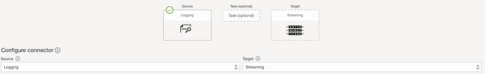
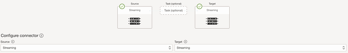
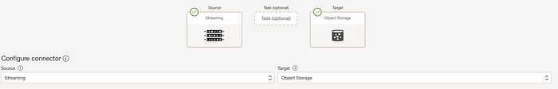
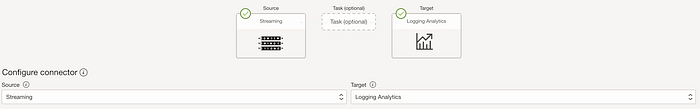
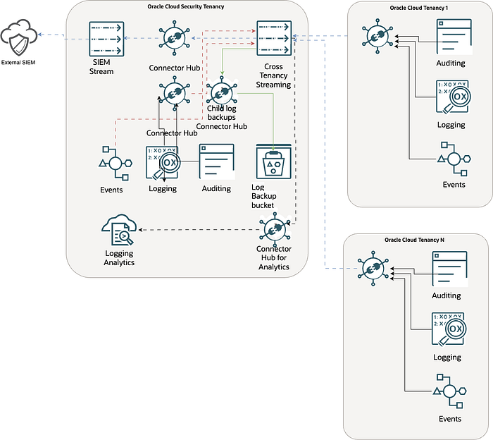

# OCI Cross-tenancy log management

In this document we will see how to optimize the workflow for cross-tenancy log collection.

The solutions I proposed to be used are shown below, and it’s very important to use the OCI resources with Cross Tenancy capabilities, and have the proper policies in place:

Cross-Tenancy Policies

Your organization might want to share Streaming resources with another organization that has its own tenancy. It could be another business unit in your company, a customer of your company, a company that provides services to your company, and so on. In cases like these, you need cross-tenancy policies in addition to the required user and service policies described previously.

Endorse, Admit, and Define statements

To access and share resources, the administrators of both tenancies need to create special policy statements that explicitly state the resources that can be accessed and shared. These special statements use the words Define, Endorse, and Admit.

Here’s an overview of the special verbs used in cross-tenancy statements:

Endorse: States the general set of abilities that a group in your own tenancy can perform in other tenancies. The Endorse statement always belongs in the tenancy with the group of users crossing the boundaries into the other tenancy to work with that tenancy’s resources. In the examples, we refer to this tenancy as the source.

Admit: States the kind of ability in your own tenancy that you want to grant a group from the other tenancy. The Admit statement belongs in the tenancy who is granting “admittance” to the tenancy. The Admit statement identifies the group of users that requires resource access from the source tenancy and identified with a corresponding Endorse statement. In the examples, we refer to this tenancy as the destination.

Define: Assigns an alias to a tenancy OCID for Endorse and Admit policy statements. A Define statement is also required in the destination tenancy to assign an alias to the source IAM group OCID for Admit statements.

Define statements must be included in the same policy entity as the endorse or the admit statement.

The Endorse and Admit statements work together, but they reside in separate policies, one in each tenancy. Without a corresponding statement that specifies access, a particular Endorse or Admit statement grants no access. Agreement is required from both tenancies.

Streaming with Cross Tenancy stream that will be created in the Main Security tenancy(I will call it Hub Tenancy):

Accessing Streaming Resources Across Tenancies

Learn about writing policy to allow your tenancy access to other tenancies.

docs.oracle.com

[Connector Hub](https://docs.oracle.com/en-us/iaas/Content/connector-hub/overview.htm) that will move the logs between different OCI services:

1- Logging to Cross tenancy exposed Stream

2- Cross tenancy Stream from Hub Tenancy to a SIEM Stream used to push the logs to an external SIEM.

3- Backup Connector that will copy the stream from Cross tenancy Stream to an OCI Backup Bucket (Archive) for long therm storage

4- Analytics Connector that will copy the logs from Cross Tenancy Stream to Logging Analytics.

When a Source and a target is properly configured, you will see a green Check mark on the service.

A high-level overview of the flow can be seen here:

This is just an example of how you can move the logs between different tenancies to a central one, and you can extend the capabilities based on your needs.
