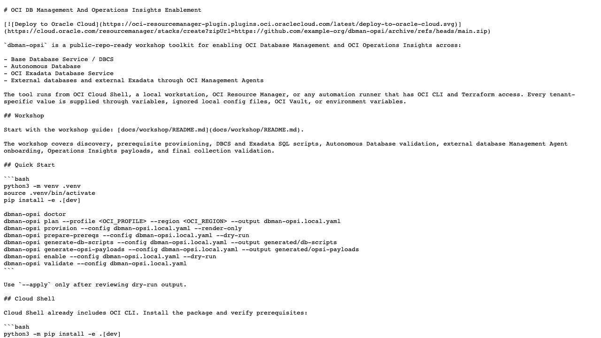
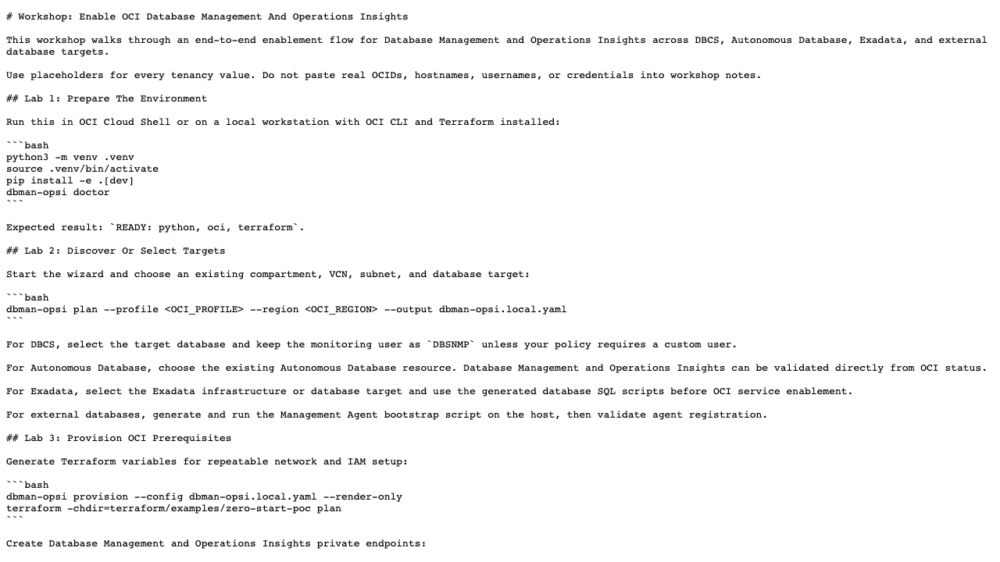

# OCI DB Management And Operations Insights Enablement

[](https://cloud.oracle.com/resourcemanager/stacks/create?zipUrl=https://github.com/example-org/dbman-opsi/archive/refs/heads/main.zip)

`dbman-opsi` is a public-repo-ready workshop toolkit for enabling three OCI
observability/security pillars — **Database Management (DBM)**, **Operations
Insights (OPSI)**, and **Data Safe** — across:

- Base Database Service / DBCS
- Autonomous Database
- OCI Exadata Database Service
- External databases and external Exadata through OCI Management Agents

Each target opts into the pillars it wants via `services` (`dbm`, `opsi`,
`datasafe`; default `dbm`+`opsi`). The tool runs from OCI Cloud Shell, a local
workstation, OCI Resource Manager, or any automation runner that has OCI CLI and
Terraform access. Every tenant-specific value is supplied through variables,
ignored local config files, OCI Vault, or environment variables.

## Architecture

See [docs/architecture.md](docs/architecture.md) for the system view, module map,
command lifecycle, the three-pillar detection model, the read-live/redaction
boundary, and the OPSI validation verdict model (with Mermaid diagrams).

## Workshop

Start with the workshop guide: [docs/workshop/README.md](docs/workshop/README.md).

The workshop covers discovery, prerequisite provisioning, DBCS and Exadata SQL scripts, Autonomous Database validation, external database Management Agent onboarding, Operations Insights payloads, and final collection validation.

## Screenshots

These screenshots are captured from local public documentation and sanitized OCI
Console views only. They do not show a tenant selector, account name, OCIDs, IP
addresses, credentials, SQL IDs, or live SQL detail.





The CAP runbook includes the full end-state gallery for Database Management,
Data Safe, Ops Insights capacity dashboards, SQL Insights, DB Performance, and
the Ops Insights multi-region Data Object Explorer flow:
[docs/RUNBOOK-e2e-cap.md](docs/RUNBOOK-e2e-cap.md#phase-5--oci-console-screenshots).

## Quick Start

```bash
python3 -m venv .venv
source .venv/bin/activate
python -m pip install -e '.[dev]'

cp .env.local.example .env.local
chmod 600 .env.local
# edit .env.local locally; do not commit it

dbman-opsi doctor
dbman-opsi discover --profile <OCI_PROFILE> --region <OCI_REGION> --compartment <OCID>  # 3-pillar inventory
dbman-opsi plan --profile <OCI_PROFILE> --region <OCI_REGION> --output dbman-opsi.local.yaml
dbman-opsi init-region --config dbman-opsi.local.yaml --region us-chicago-1 --target-kind dbcs
dbman-opsi provision --config dbman-opsi.local.yaml --render-only
dbman-opsi prepare-prereqs --config dbman-opsi.local.yaml --dry-run
dbman-opsi generate-db-scripts --config dbman-opsi.local.yaml --output generated/db-scripts
dbman-opsi generate-opsi-payloads --config dbman-opsi.local.yaml --output generated/opsi-payloads
dbman-opsi db-exec --config dbman-opsi.local.yaml            # generate DB scripts + show hybrid run plan
dbman-opsi preflight --config dbman-opsi.local.yaml
dbman-opsi configure --config dbman-opsi.local.yaml          # plan: detect + gate, no changes (DBM+OPSI)
dbman-opsi enable --config dbman-opsi.local.yaml --dry-run
dbman-opsi data-safe --config dbman-opsi.local.yaml          # register Data Safe targets (datasafe pillar)
dbman-opsi cross-region --config dbman-opsi.local.yaml --regions <HOME_REGION>,<SECOND_REGION>
dbman-opsi validate --config dbman-opsi.local.yaml
```

Quote `'.[dev]'` in zsh and other shells that expand square brackets. After
activating `.venv`, use `python -m pip` so pip installs into the active virtual
environment; the interpreter path is `.venv/bin/python` before activation.

`plan` is the guided discovery path. It automatically uses the tenancy OCID from
the selected OCI profile when available, lists active compartments, searches the selected
compartment first, then searches other accessible compartments for reusable
resources. It lets you select existing VCNs, subnets, Vault keys, Vault secrets,
Database Management private endpoints, Ops Insights private endpoints, Data Safe
private endpoints, and database targets. If VCNs already exist, the network
prompt defaults to reusing one instead of creating a PoC network. The wizard also
discovers IAM policies, reports whether the DBM/OPSI service-principal
statements are present, and reuses a discovered policy group name for generated
policy documents. For DBCS and Exadata, select the actual database/CDB target,
not the parent DB system OCID; the wizard tracks the DB system separately when
Data Safe needs it and can add PDB targets in the PDB discovery step. If
discovery cannot read a resource type, the wizard falls back to manual OCID
entry.

`configure` is the orchestrated path: it detects whether each database exists and is
already enabled, branches by location (OCI-native direct vs external Management Agent),
runs the full prerequisite gate (IAM policies, Service Gateway + route, private
endpoints, Vault secret, DB monitoring user), then either enables (`--apply`) or emits a
DB-side handoff packet (`--db-side-only`) for a DBA to run the database steps separately.

Container and pluggable databases are handled distinctly. A target's `database_role`
(`CDB`, `PDB`, or `NON_CDB`) selects the correct OCI verb — CDB/non-CDB use
`db database enable-database-management`; PDBs use
`db pluggable-database enable-pluggable-database-management`. PDB targets carry a
`parent_cdb_id`; `configure` enables the container database first and blocks a PDB
until its parent CDB has Database Management enabled.

Use `--apply` only after reviewing dry-run output.

## Cloud Shell

Cloud Shell already includes OCI CLI. Install the package and verify prerequisites:

```bash
python3 -m pip install -e '.[dev]'
dbman-opsi doctor
```

Then run the workshop with `--profile DEFAULT` and your selected region.

## Resource Manager

The Deploy to Oracle Cloud button launches the Terraform stack under `terraform/examples/zero-start-poc`. Resource Manager provisions OCI-side prerequisites such as IAM, workshop networking, and service private endpoints. Database credentials and database-side scripts are handled by the CLI workflow so secrets are not placed in Terraform variables.

For your public fork, update the button URL to your repository archive URL.

## Commands

- `doctor`: check Python, OCI CLI, and Terraform availability. Pass `--profile`/`--region` to also confirm the OCI session is authenticated (not just installed).
- `discover`: read-only inventory of reusable resources (subnets, vaults, databases, endpoints, agents, bastions). Reports the **three-pillar status per database** — `dbm_status`, `opsi_status`, `data_safe_status`, plus `enabled_services`/`missing_services` — so you can see at a glance what is on. `--json` for automation (OCIDs redacted in JSON), `--subtree` to scan a compartment tree.
- `plan`: discover tenancy/profile context, active compartments, IAM policies, networks, databases, Vaults, Vault secrets, private endpoints, and agents across accessible compartments, then write a config. Prompts per target for which pillars to enable (`dbm`/`opsi`/`datasafe`) and credentials. For DBCS/Exadata it selects database/CDB resources, keeps the parent DB system separately for Data Safe, and can discover pluggable databases (PDBs) as linked child targets.
- `init-region`: create a region-specific provisioning config for a second-region PoC. Defaults to `us-chicago-1` and a provisioned DBCS target; pass `--target-kind autonomous` for Autonomous Database, or `--vcn-id` + `--subnet-id` to reuse an existing regional network instead of creating a test VCN.
- `provision`: render Terraform variables and optionally run Terraform.
- `import-tf-outputs`: read `terraform output` and merge the created OCIDs (subnet, VCN, Database Management private endpoint, provisioned database IDs) back into the config so `enable`/`configure` pick them up without manual copy.
- `prepare-prereqs`: create service-side private endpoints and optional Vault secrets from an environment variable.
- `generate-db-scripts`: create database-side SQL scripts for DBCS, Exadata, and external database targets.
- `generate-agent-scripts`: create Management Agent bootstrap scripts for external targets.
- `generate-opsi-payloads`: create Operations Insights JSON payload templates.
- `cross-region`: configure and summarize the Ops Insights multi-region POC selection. It writes `monitoring_regions` when `--regions` is supplied, groups OPSI targets by their configured region, and prints the Console checklist for Data Object Explorer plus the Configuration and Capacity dashboards.
- `preflight`: read-only check of every prerequisite (IAM, Service Gateway, route, private endpoints, Vault secret, monitoring user, Management Agent). Supports `--json` and `--db-check-file` (spooled `04-validate-monitoring-user.sql` output) to verify the DB monitoring user instead of leaving it manual.
- `configure`: orchestrated detect → branch-by-location → gate → act flow. `--apply` enables DBM/OPSI and then sets the advanced-diagnostics/administration preferred credentials via a Vault named credential; `--skip-credentials` opts out. `--db-side-only` emits DBA handoff packets, `--force` overrides blockers, `--json` supports automation. Add `--with-data-safe` to also register Data Safe targets for `datasafe`-opted targets in the same `--apply` pass (all three pillars in one command; `--data-safe-user`/`--data-safe-password-env` supply credentials).
- `enable`: run OCI Database Management and Operations Insights enablement. Idempotent and self-healing — re-runs tolerate an already-enabled DBM (409) and **reconcile** the connection (so a corrected service name or rotated credential takes effect), skip already-ACTIVE OPSI insights, and (in `--apply`) set the advanced-diagnostics preferred credentials. Use `--skip-credentials` to opt out of the last step.
- `set-credentials`: set the DBM advanced-diagnostics preferred credentials (`PC_READ`/`PC_WRITE`) via a Vault-backed named credential, so on-demand tasks (Performance Hub, AWR, ADDM, SQL Tuning) work. Idempotent; retries the flaky `dbmgmt` control plane and reports blocked targets with remediation.
- `data-safe`: register databases as **Data Safe** target databases for targets that opt into the `datasafe` pillar. Creates a Data Safe private endpoint in the DB subnet if needed, prompts for the service-account credentials (DBSNMP default; `--password-env` for non-interactive), registers the target, and persists the target OCID back into the config. Dry-run by default; `--apply` performs live registration.
- `db-exec`: regenerate the DB-side SQL scripts and show the **hybrid run plan** — auto-run via Bastion in non-production tenancies, generate-and-handoff in production (`emdemo`). `--force` treats the run as non-production. `--apply` (with `--bastion-id`/`--target-ip`/`--ssh-key`, and `--answers-file` for accept-prompt answers) auto-runs the scripts on the DB node through a Bastion port-forward session.
- `validate`: check service state and collection readiness. Reports the real OPSI Database Insight lifecycle (`ACTIVE`/`FAILED`/`NOT_FOUND`/`UNKNOWN`) per target rather than a generic message — using a reliable GET-by-OCID and a verdict model that never emits a false `NOT_FOUND` from the flaky list.
- `journal`: inspect a run's command ledger. Every invocation records one **redacted** JSON line per OCI/Terraform command to `runs/<run_id>.jsonl`; `dbman-opsi journal [RUN_ID] [--last] [--json]` reads it back as a summary (command count, total duration, failing commands). `--last` resolves the newest run.

## Observability, resilience & safety

- **Redacted run-journal** at the single command choke point (`runner.run`) — auditable history of every OCI/Terraform call, with OCIDs/secrets stripped (read it back with `journal`). A global `--verbose` surfaces per-call timing.
- **Typed errors + retry/backoff** — failures are classified (`OciAuthError`/`OciNotFound`/`OciThrottled`/`OciTransient`); throttles always retry, transient errors retry for reads, auth/not-found never retry. Bounded exponential backoff.
- **Boundary validation** — config is validated at load **and** after merging Terraform outputs; malformed kinds/services/OCIDs are rejected before any OCI call (`ConfigError`).
- **Cross-region OPSI showcase** — set top-level `monitoring_regions` and optional per-target `region` for resources outside the home region. `validate` reads each target in its own region, while `cross-region` shows the exact region selector set to use in Ops Insights Data Object Explorer and the supported dashboards.
- **Secrets never committed** — OCIDs/IPs/namespaces are redacted at the display boundary, secret-bearing files are gitignored, and a `scripts/pre-push` hook + CI (gitleaks + bandit + `pip-audit`) gate every change.

## End-to-end enablement, Terraform & troubleshooting

- **Reproducible runbook:** [docs/RUNBOOK-e2e-cap.md](docs/RUNBOOK-e2e-cap.md) walks the full
  Phase 0→5 flow (confirm infra → doctor/preflight → DB-side proof → generate →
  enable + validate → Console showcase), with every defect found and fixed
  running it live — including Data Safe enablement on an existing DB and a
  freshly-provisioned DBCS.
- **Troubleshooting KB:** [KB.md](KB.md) maps live-tenancy failure signatures to
  root cause + fix (OPSI insight 80% failure, DBM idempotency, DBSNMP lock loop,
  DBM stale-service reconcile, validate blindness, the OCID-redaction-in-data-path
  bug, Data Safe `NEEDS_ATTENTION`/DBSNMP rotation, and the zero-start Terraform
  apply-time failures). On any error, the CLI also prints a *Solution* + *Manual
  step* from the same remediation map.
- **Eval-first regression suite:** [tests/evals/README.md](tests/evals/README.md)
  organizes capability and regression evals by defect signature so each fixed
  defect (e.g. the OPSI list flap, the `validate --dry-run` stub) stays fixed.
- **Declarative / ORM path:** [terraform/modules/dbm-opsi-enablement](terraform/modules/dbm-opsi-enablement)
  is a feature-toggled, `for_each`-driven module (DBM features management, named
  credential, OPSI insight, plus a CLI step for preferred credentials). Pure
  Terraform for teams that prefer Resource Manager over the CLI. `terraform
  validate` passes; apply-test in a scratch tenancy before production.

## Security

Generated local configs contain OCID references needed for automation, but they are ignored by Git. Plaintext database credentials must never be written to config, Terraform variables, screenshots, or documentation. Use OCI Vault and environment variables.

For local paid provisioning, define secrets and sensitive Terraform inputs in
`.env.local` from [.env.local.example](.env.local.example). The CLI loads this
file automatically when present and does not override variables already exported
by CI or Cloud Shell. Users are responsible for maintaining and securing their
own `.env.local` file (`chmod 600` recommended); it is gitignored and must never
be copied into public app code, docs, screenshots, or Terraform variable files.

See [docs/security.md](docs/security.md) before publishing screenshots or pushing a public repository.
Install the pre-push audit by chaining `scripts/pre-push` from the existing hook setup or by using pre-commit; do not point `core.hooksPath` at `scripts`, because that can disable ECC-managed hooks.
