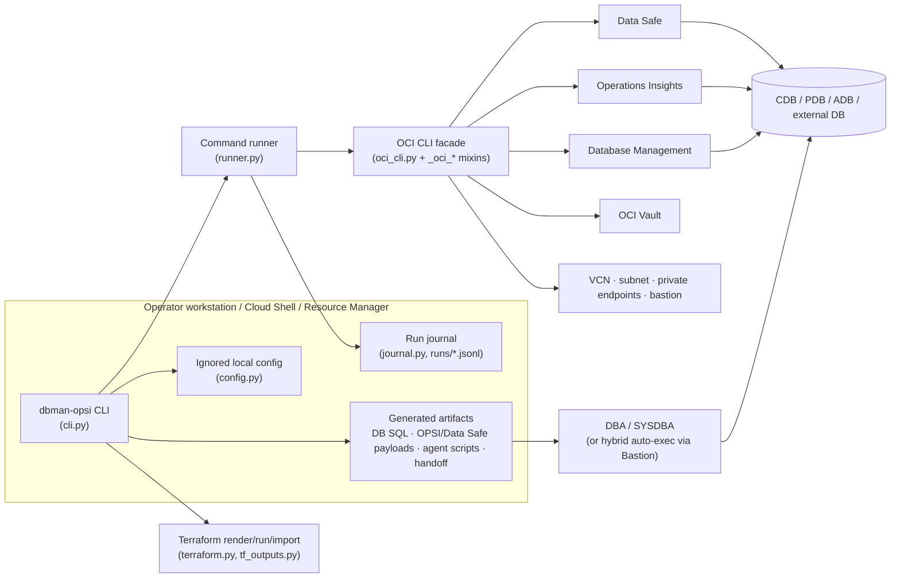
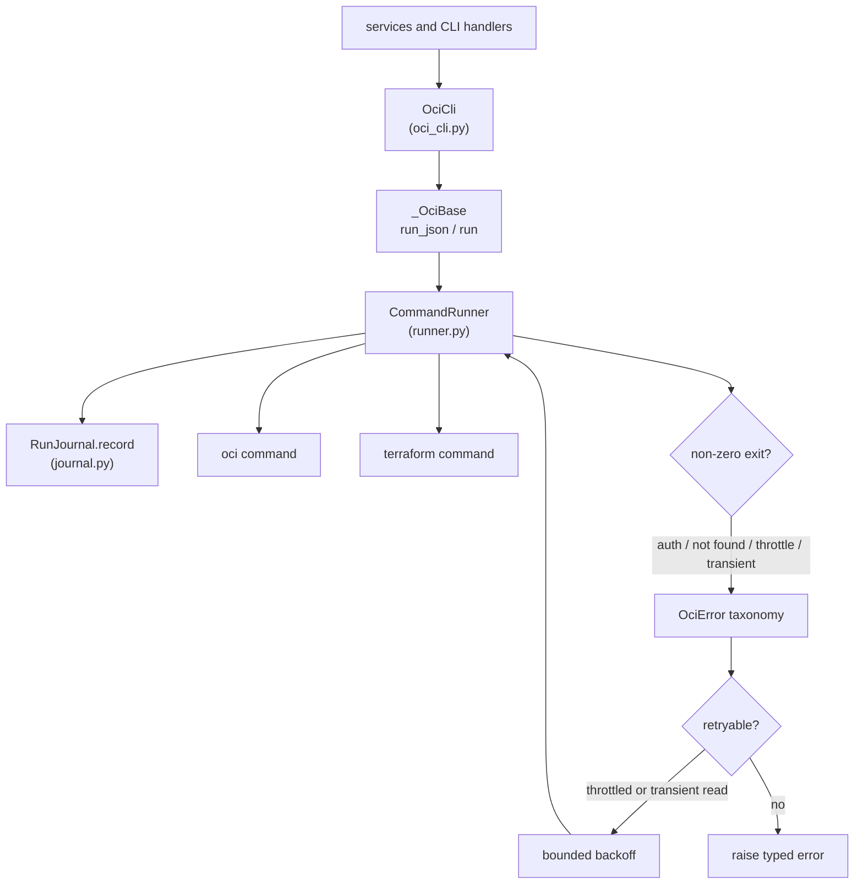
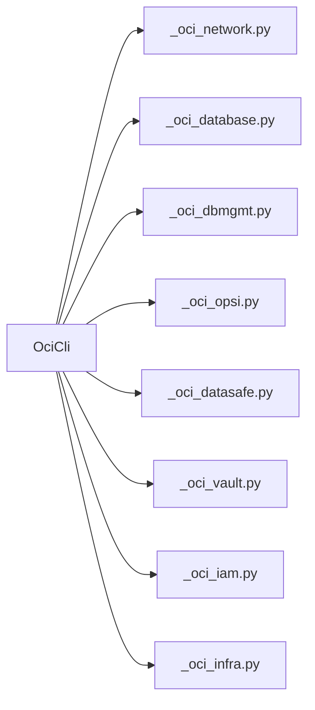
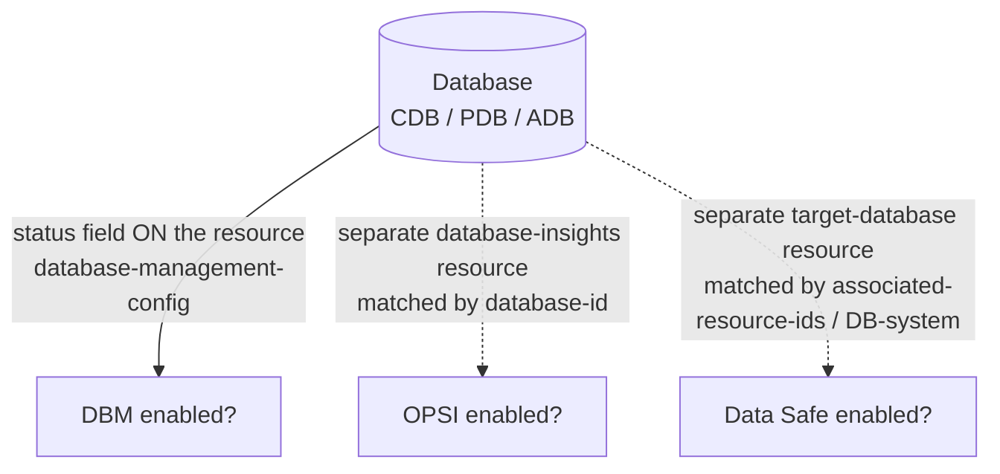
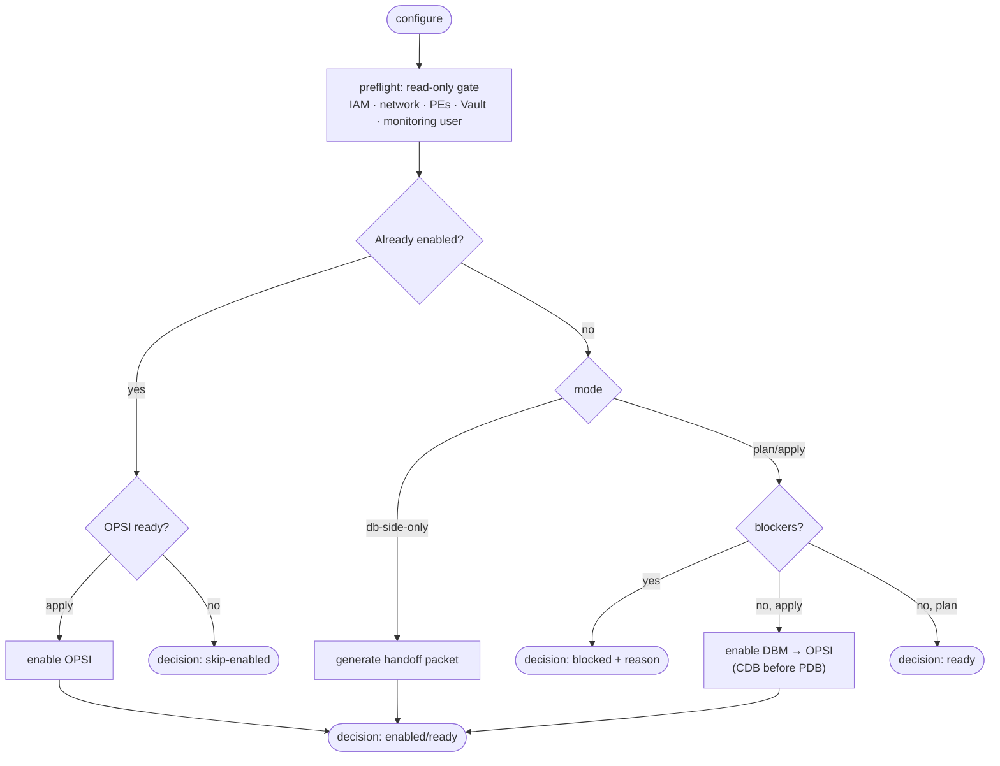
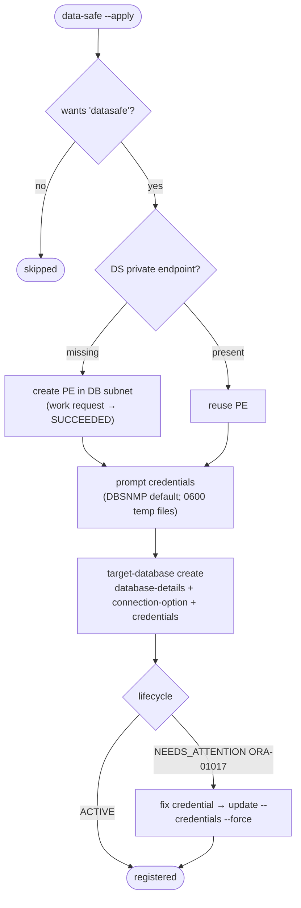
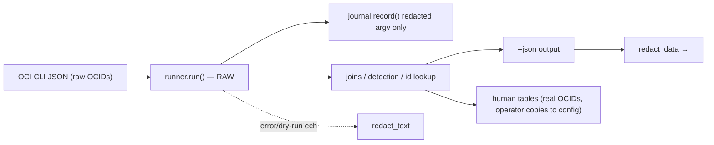
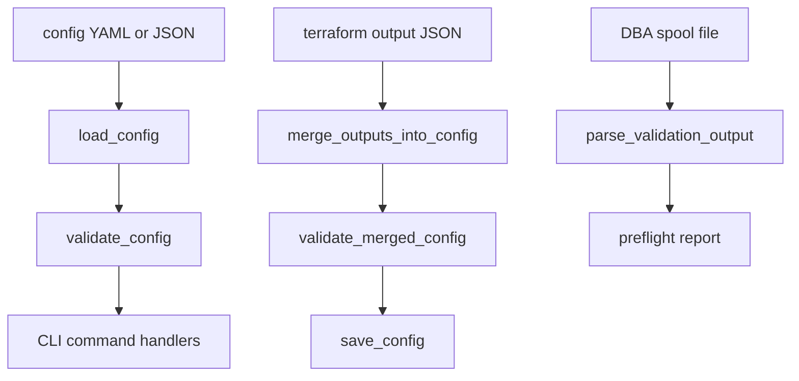
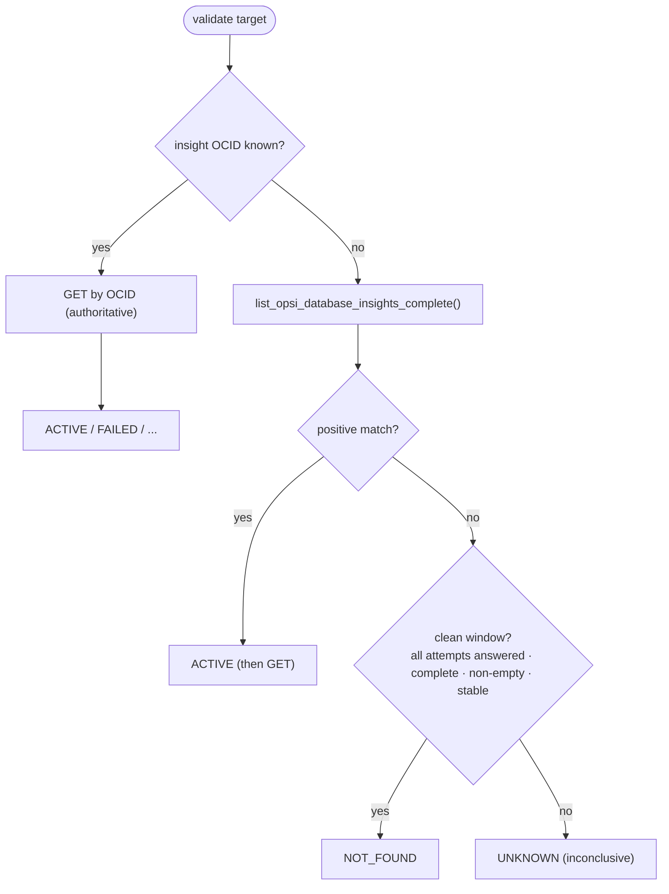

# Architecture

`dbman-opsi` enables three OCI observability/security pillars for Oracle
databases — **Database Management (DBM)**, **Operations Insights (OPSI)**, and
**Data Safe** — across Base Database / DBCS, Autonomous Database, Exadata, and
external databases. It is a thin, testable orchestration layer over the OCI CLI
and Terraform: discover what exists, gate on prerequisites, then enable (live) or
hand off DB-side steps to a DBA.

This document maps the system, its control/data boundaries, and the verdict and
redaction models that make it safe to run against production tenancies.

## System view



## Module map

| Layer | Modules | Responsibility |
| --- | --- | --- |
| UX / entry | `cli.py`, `wizard.py`, `reporting.py`, `doctor.py` | Commands, interactive planning, human/JSON output, environment checks, run-journal inspection |
| Config | `config.py`, `redact.py` | Immutable `EnablementConfig`/`Target`, YAML/JSON round-trip, boundary validation, display redaction |
| Discover / gate | `discovery.py`, `preflight.py`, `checks.py`, `prerequisites.py`, `db_check.py`, `status.py`, `conn.py`, `oci_util.py` | Read-only inventory, three-pillar detection, connection-string parsing, best-effort lookups, prerequisite and DB-spool gating |
| Act | `orchestrator.py`, `enablement.py`, `datasafe.py`, `iam.py`, `credentials.py`, `db_exec.py` | Detect→branch→gate→enable/handoff; DBM/OPSI/Data Safe enablement; hybrid DB-side execution |
| Generate | `db_scripts.py`, `opsi_payloads.py`, `agent_scripts.py`, `handoff.py` | DB-side SQL, OPSI/Data Safe payloads, agent bootstrap, DBA handoff packets |
| Execute | `runner.py`, `journal.py`, `oci_cli.py`, `_oci_base.py`, `_oci_network.py`, `_oci_database.py`, `_oci_dbmgmt.py`, `_oci_opsi.py`, `_oci_datasafe.py`, `_oci_vault.py`, `_oci_iam.py`, `_oci_infra.py`, `terraform.py`, `tf_outputs.py` | Subprocess choke point, redacted run journal, OCI CLI facade composed from per-domain mixins, Terraform render/run/import |
| Validate | `validation.py`, `remediation.py` | Post-enable verdicts and remediation hints |

## OCI CLI facade and runner choke point

`OciCli` is a flat client assembled from small per-domain mixins. Shared behavior
(`run_json`, `run`, response unwrapping, profile tenancy lookup) lives in
`_oci_base.py`; domain modules hold only their OCI command surface. Every OCI and
Terraform subprocess crosses `CommandRunner`, which is also where command timing,
redacted journaling, `OciError` classification, and retry/backoff are applied.



The mixin split is organizational only; callers still use one `OciCli` object:



## The three pillars

The pillars are detected three different ways — a key design point that drives the
discovery layer:



- **DBM** status lives *on* the database resource.
- **OPSI** is a separate `database-insights` resource joined back by `database-id`.
- **Data Safe** is a separate `target-database` resource joined by
  `associated-resource-ids` (the LIST summary's `database-details` is null). A
  Base DB target registered with a PDB service name associates at the **DB-system**
  grain, so Data Safe is attributed at the CDB/DB-system level.

`discovery.py` pre-fetches the OPSI and Data Safe collections **once per
compartment** and fans them in by OCID (avoids an N+1 lookup per database).

## Command lifecycle (`configure`)



CDB/PDB ordering: PDB targets carry `parent_cdb_id`; the orchestrator enables the
container database first and clears the PDB's `target.parent_cdb` blocker in-run.

## Data Safe enablement flow



## Hybrid DB-side execution

```mermaid
flowchart LR
  Plan([db-exec / configure]) --> Gate{profile in PROD_PROFILES?}
  Gate -->|no (cap/test)| Auto["auto-run via Bastion<br/>01→02→03→05→06→04"]
  Gate -->|yes (emdemo/prod)| HO["generate-and-handoff<br/>HANDOFF.md for the DBA"]
```

DB-side SQL is never auto-executed in production. The tenancy gate lives in the
executor (`db_exec.py`), keeping SQL generation pure.

## Control-plane vs data-plane / read-live vs write-gated

- **Reads are always live.** `validate`, `preflight`, `configure` reads, and
  `discover` build their OCI CLI with `CommandRunner(dry_run=False)` — a dry-run
  runner stubs every read to `{}`, which would look identical to a missing
  resource. Writes respect `--apply`/`dry_run`.
- **Boundary validation is explicit.** Config loading calls `validate_config()`;
  Terraform output import calls `merge_outputs_into_config()` and then
  `validate_merged_config()` before writing; `preflight --db-check-file` parses
  the DBA-spooled `04-validate-monitoring-user.sql` output through `db_check.py`.
- **Redaction is a display concern, applied at the boundary** — never in the data
  path. `runner.run()` returns **raw** stdout so OCID-keyed joins work;
  redaction happens in `--json` output (`redact_data`) and `config.sanitized()`.
  Human `discover` output intentionally prints real OCIDs so operators can copy
  them into config (their own tenancy). Error messages and the dry-run echo stay
  redacted.





## Validation verdict model (OPSI)

The aggregated `database-insights list` control plane flaps (0/2/7 items
call-to-call), so absence can never be concluded from a single list:



A positive match is authoritative; `NOT_FOUND` is emitted only from a complete,
non-empty, stable window; everything else is `UNKNOWN`.

## Testing

- `pytest` enforces ≥80% coverage (`pyproject.toml`).
- Eval-first regression suite under `tests/evals/` — see
  [tests/evals/README.md](../tests/evals/README.md) — organizes capability and
  regression evals by defect signature (e.g. the OPSI flap, the `validate
  --dry-run` stub bug) so each fixed defect stays fixed.

## Live runbook & knowledge base

- End-to-end live flow with every defect found and fixed:
  [RUNBOOK-e2e-cap.md](RUNBOOK-e2e-cap.md).
- Failure-signature → root-cause → fix: [../KB.md](../KB.md).
