# Workshop: Enable OCI Database Management And Operations Insights

This workshop walks through an end-to-end enablement flow for Database Management and Operations Insights across DBCS, Autonomous Database, Exadata, and external database targets.

Use placeholders for every tenancy value. Do not paste real OCIDs, hostnames, usernames, or credentials into workshop notes.

## Lab 1: Prepare The Environment

Run this in OCI Cloud Shell or on a local workstation with OCI CLI and Terraform installed:

```bash
python3 -m venv .venv
source .venv/bin/activate
python -m pip install -e '.[dev]'
dbman-opsi doctor
```

Quote `'.[dev]'` when using zsh; otherwise zsh treats `[dev]` as a filename
pattern and fails before pip runs. After `source .venv/bin/activate`, `python`
points at the virtual environment.

Expected result: `READY: python, oci, terraform`.

## Lab 2: Discover Or Select Targets

Start the wizard and choose an existing compartment, VCN, subnet, Vault resources,
private endpoints, and database target from the discovered lists:

```bash
dbman-opsi plan --profile <OCI_PROFILE> --region <OCI_REGION> --output dbman-opsi.local.yaml
```

For each target the wizard asks **which pillars to enable** — `dbm` (Database
Management), `opsi` (Operations Insights), and/or `datasafe` (Data Safe). The
default is `dbm`+`opsi`; add `datasafe` to also register the database as a Data
Safe target (Lab 6). PDB targets inherit their parent CDB's pillar selection.
The wizard searches the selected compartment first, then other accessible
compartments, because workshop resources are often split across database,
network, observability, and security compartments.
If the OCI profile contains a tenancy OCID, the wizard uses it automatically and
does not ask for it. If existing VCNs are discovered, press Enter at
`Create a PoC VCN/subnet?` to reuse one. The wizard also reads IAM policies and reports whether the
Database Management (`dpd`) and Operations Insights service-principal statements
are already present.

For DBCS, select the actual target database/CDB resource from the discovered
database list. Do not paste the parent DB system OCID as the database/resource
OCID; the wizard records the parent DB system separately when Data Safe needs it
and can add PDBs in the PDB discovery step. Keep the monitoring user as `DBSNMP`
unless your policy requires a custom user.

For Autonomous Database, choose the existing Autonomous Database resource. Database Management and Operations Insights can be validated directly from OCI status.

For Exadata, select the Exadata infrastructure or database target and use the generated database SQL scripts before OCI service enablement.

For external databases, generate and run the Management Agent bootstrap script on the host, then validate agent registration.

## Lab 3: Provision OCI Prerequisites

Generate Terraform variables for repeatable network and IAM setup:

```bash
dbman-opsi provision --config dbman-opsi.local.yaml --render-only
terraform -chdir=terraform/examples/zero-start-poc plan
```

Create Database Management and Operations Insights private endpoints:

```bash
dbman-opsi prepare-prereqs --config dbman-opsi.local.yaml --dry-run
dbman-opsi prepare-prereqs --config dbman-opsi.local.yaml --apply
```

If the database monitoring credential must be stored in Vault, export it only in the current shell:

```bash
export DBMAN_OPSI_DB_PASSWORD='<prompted-value>'
dbman-opsi prepare-prereqs --config dbman-opsi.local.yaml --password-env DBMAN_OPSI_DB_PASSWORD --apply
unset DBMAN_OPSI_DB_PASSWORD
```

## Lab 3b: Verify Prerequisites (Read-Only Gate)

Before any change, confirm every prerequisite is in place. `preflight` only reads:

```bash
dbman-opsi preflight --config dbman-opsi.local.yaml
```

It reports PASS/FAIL/WARN/MANUAL for each of:

- IAM service-principal policies (`database-management`, `operations-insights`, `dpd`)
- Network: subnet state, **Service Gateway + route rule to OCI Services**, listener ports
- Database Management and Operations Insights private endpoints (ACTIVE, right subnet)
- Vault secret holding the monitoring password
- Monitoring database user and grants (verified DB-side — marked MANUAL)
- External targets: Management Agent registered with `dbmgmt` and `opsi` plugins

A `FAIL` includes the exact remediation. Use `--json` to feed an automation runner.

## Lab 4: Run Database-Side Setup

Generate database SQL scripts:

```bash
dbman-opsi generate-db-scripts --config dbman-opsi.local.yaml --output generated/db-scripts
```

Run the scripts on DBCS or Exadata with SQLcl or SQL*Plus as an administrative
user, in this order (validate runs last so it confirms the grants):

```sql
@01-create-monitoring-user.sql
@02-grant-basic-monitoring.sql
@03-grant-advanced-diagnostics.sql   -- optional: Performance Hub + SQL Tuning Set privileges
@05-enable-performance-hub.sql       -- optional: AWR autoflush so PDB ADDM Spotlight / AWR Explorer collect data
@04-validate-monitoring-user.sql
@06-enable-data-safe.sql             -- only when the target opts into the 'datasafe' pillar
```

`03` and `05` exercise the Diagnostics/Tuning Pack — review licensing first. `05`
is required for PDB-level ADDM Spotlight / AWR Explorer to show data (run it for
the CDB and each PDB). `06` is generated only when the target includes `datasafe`.

Instead of running these by hand, `db-exec` shows the **hybrid plan** and (in
non-production tenancies) can drive them via Bastion:

```bash
dbman-opsi db-exec --config dbman-opsi.local.yaml   # generate scripts + show auto-run vs handoff plan
```

## Lab 5: Enable And Validate Collection

Generate Operations Insights payloads and fill any placeholders:

```bash
dbman-opsi generate-opsi-payloads --config dbman-opsi.local.yaml --output generated/opsi-payloads
```

Enable services. The orchestrated path runs the prerequisite gate first, skips
targets that are already enabled, and only enables when everything passes:

```bash
dbman-opsi configure --config dbman-opsi.local.yaml              # plan: gate only
dbman-opsi configure --config dbman-opsi.local.yaml --apply      # enable DBM + OPSI when ready
```

To enable **all three pillars in one pass**, add `--with-data-safe` (Data Safe is
registered for targets that opted into `datasafe`, after DBM/OPSI):

```bash
export DBMAN_OPSI_DBSNMP_PASSWORD='<prompted-value>'
dbman-opsi configure --config dbman-opsi.local.yaml --apply \
  --with-data-safe --data-safe-password-env DBMAN_OPSI_DBSNMP_PASSWORD
unset DBMAN_OPSI_DBSNMP_PASSWORD
```

If a DBA must run the database steps separately, generate handoff packets instead
of enabling directly:

```bash
dbman-opsi configure --config dbman-opsi.local.yaml --db-side-only --output generated/handoff
```

Each packet (`generated/handoff/<target>/HANDOFF.md`) contains the ordered SQL
scripts plus the exact OCI enable command to run once the database side is done.

The lower-level `enable` verb is still available for a single direct step:

```bash
dbman-opsi enable --config dbman-opsi.local.yaml --dry-run
dbman-opsi enable --config dbman-opsi.local.yaml --apply
```

Validate:

```bash
dbman-opsi validate --config dbman-opsi.local.yaml
```

The validation output shows, per target, Database Management enabled and the real
Operations Insights Database Insight lifecycle — `ACTIVE (ENABLED)` when
collecting, or `FAILED`/`NOT_FOUND`/`UNKNOWN`. `validate` reads the insight by
OCID (reliable) and never reports a false `NOT_FOUND` from the flaky list, so a
clean run is trustworthy.

## Lab 6: Enable Data Safe (security pillar)

For targets that opted into `datasafe`, register them as Data Safe target
databases. First run the Data Safe DB-side script (`06-enable-data-safe.sql`) to
create/grant the Data Safe service account (DBSNMP for the POC, or a dedicated
account), then register:

```bash
dbman-opsi data-safe --config dbman-opsi.local.yaml                       # dry-run
export DBMAN_OPSI_DBSNMP_PASSWORD='<prompted-value>'
dbman-opsi data-safe --config dbman-opsi.local.yaml --user DBSNMP \
  --password-env DBMAN_OPSI_DBSNMP_PASSWORD --apply                        # live registration
unset DBMAN_OPSI_DBSNMP_PASSWORD
```

This creates a Data Safe private endpoint in the DB subnet (if one is not already
referenced), registers the `target-database`, and persists its OCID back into the
config. Confirm the target reaches `ACTIVE`:

```bash
dbman-opsi discover --profile <OCI_PROFILE> --region <OCI_REGION> --compartment <OCID> --json
# the target DB should now show data_safe_status = ENABLED
```

If a target shows `NEEDS_ATTENTION` with `ORA-01017`, the network path is fine but
the service-account password is wrong — fix the DB-side password (a CDB common
user like DBSNMP must be changed with `CONTAINER=ALL`) and re-run with `--apply`.
For Data Masking / Data Discovery, also run the per-target privilege script from
the OCI Console (Data Safe > Target databases > Register > Download Privilege
Script).

## What success looks like (OCI Console)

These redacted captures (region/account band and compartment chip blurred) show the
end state after the labs — two Base Database systems (`DBMOPSI`/`PDB1` and a
freshly-provisioned `dbmanops`/`dbmanops_pdb1`) with all three pillars on.

**Database Management — Managed Databases** (Lab 5). Both container DBs and their
PDBs show **Enabled / Full** under ADVANCED management:

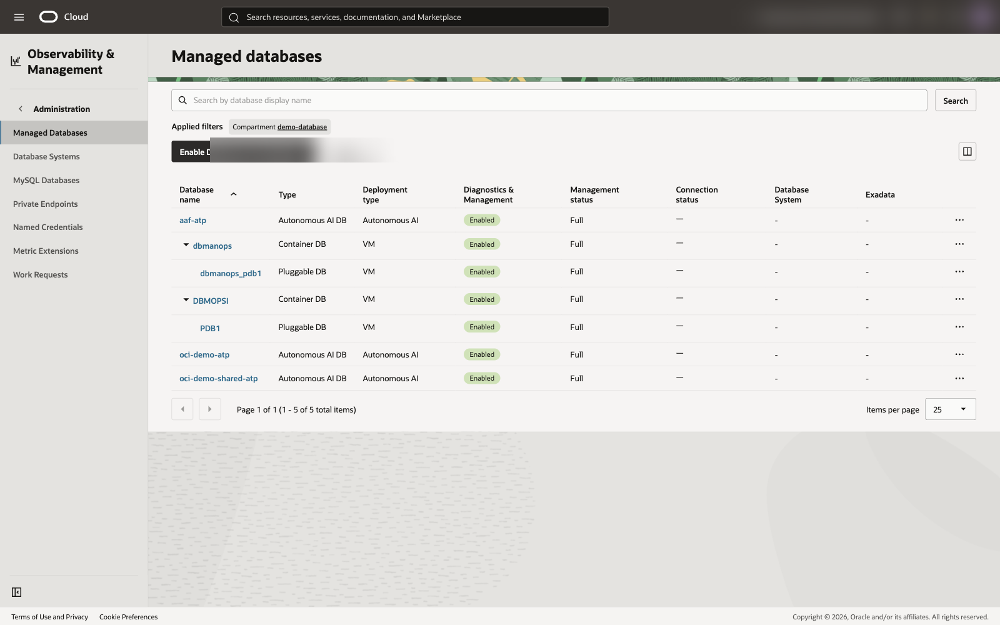

**Diagnostics & Management — fleet summary** (Lab 5). All managed databases with
live CPU / storage / Average-Active-Sessions metrics:

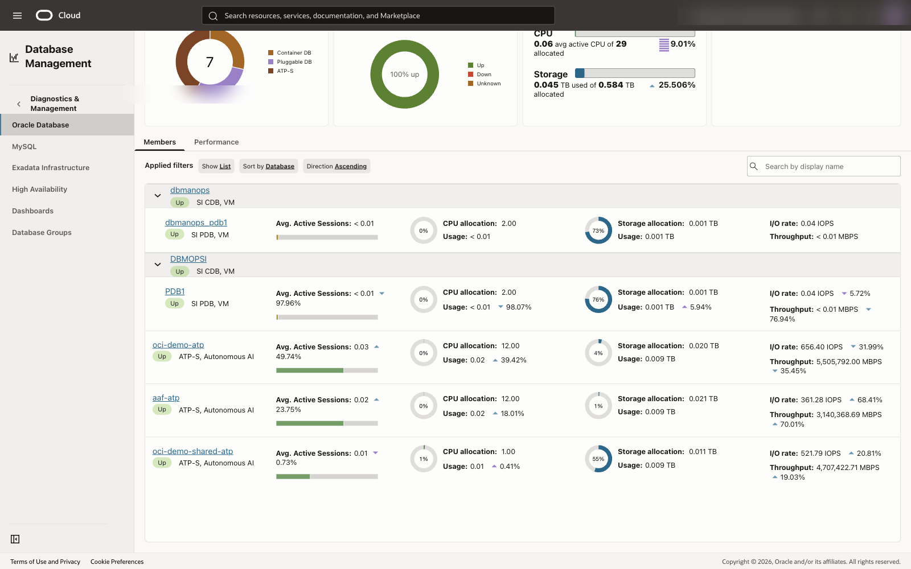

**Database summary — Pluggable Databases tab** (Lab 5). `PDB1` **Up** with live
Performance Hub metrics; the *Performance Hub / ADDM Spotlight / AWR Explorer*
actions are available (no privilege prompt, thanks to scripts `03`/`05`):

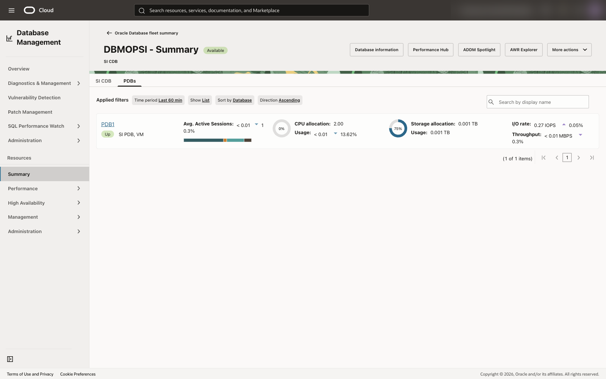

**Operations Insights — Performance Hub** (Lab 5). Activity Summary / Average
Active Sessions with ASH Analytics (SQL-detail tables blurred — they contain live
SQL, service names, and users):

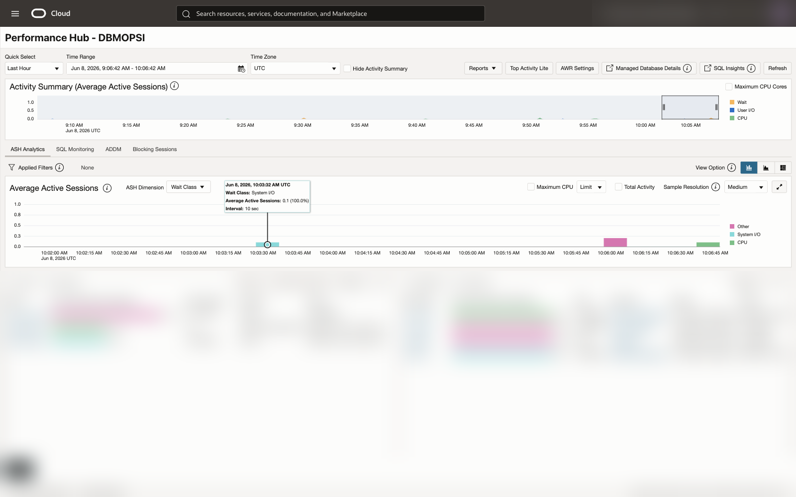

**Data Safe — Target databases** (Lab 6). The registered targets are **Active**
(`dbman-opsi-dbcs-PDB1`, `dbman-opsi-dbcs2-cdb`, `dbman-opsi-dbcs2-PDB1`):

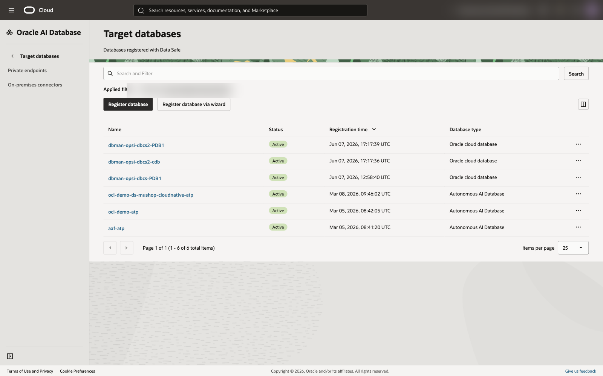

**Data Safe — Security Assessment** (Lab 6). With the targets registered, Data Safe
assesses their posture — Risk level, Risks by category, and Top-5 security controls
(Auditing / Encryption / Password discipline / Patch compliance):

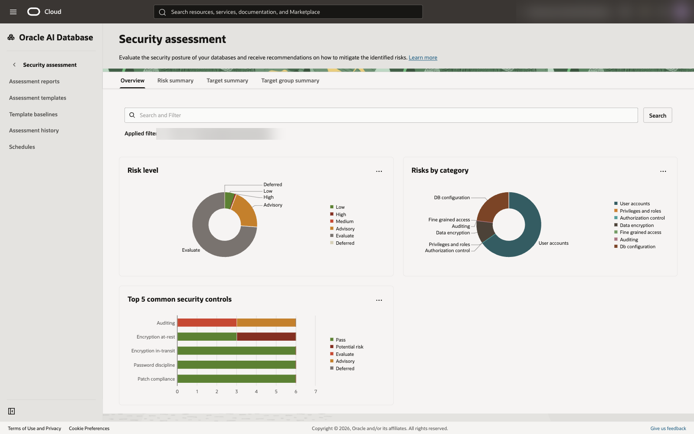

**Ops Insights — Database Capacity Planning** (Lab 7). Capacity cards, forecast
views, and aggregate treemaps show cross-fleet CPU, storage, memory, and I/O
planning data:

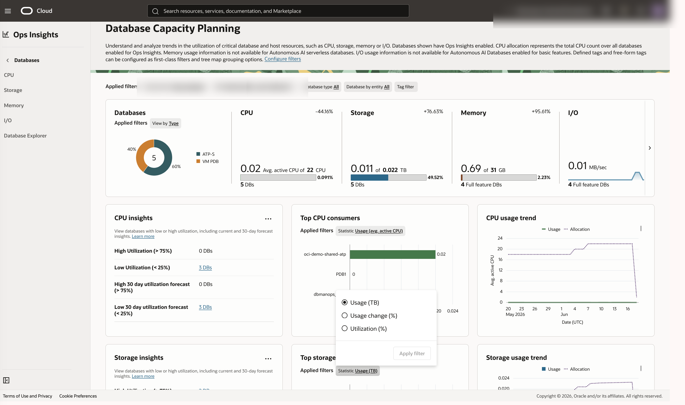

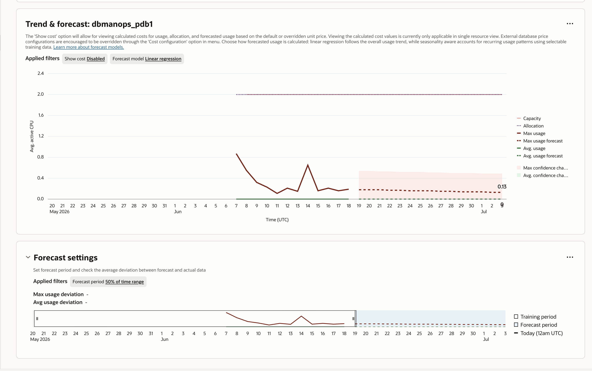

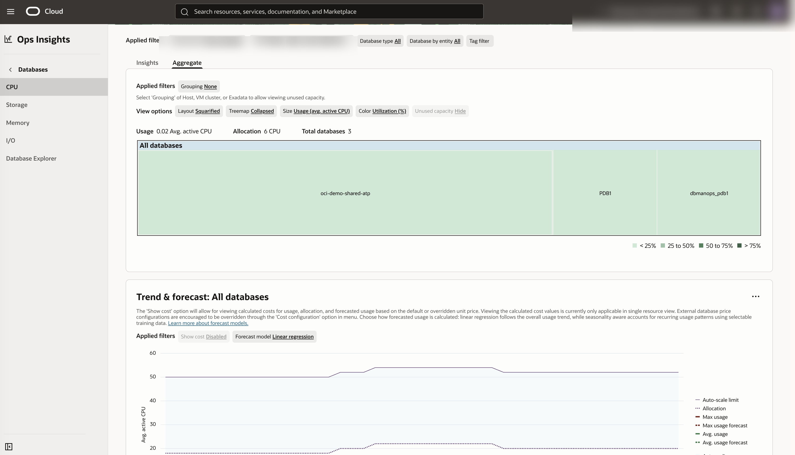

**Ops Insights — SQL and performance diagnostics** (Lab 7). SQL Insights and DB
Performance show fleet/database drilldowns with live SQL identifiers and resource
names redacted:

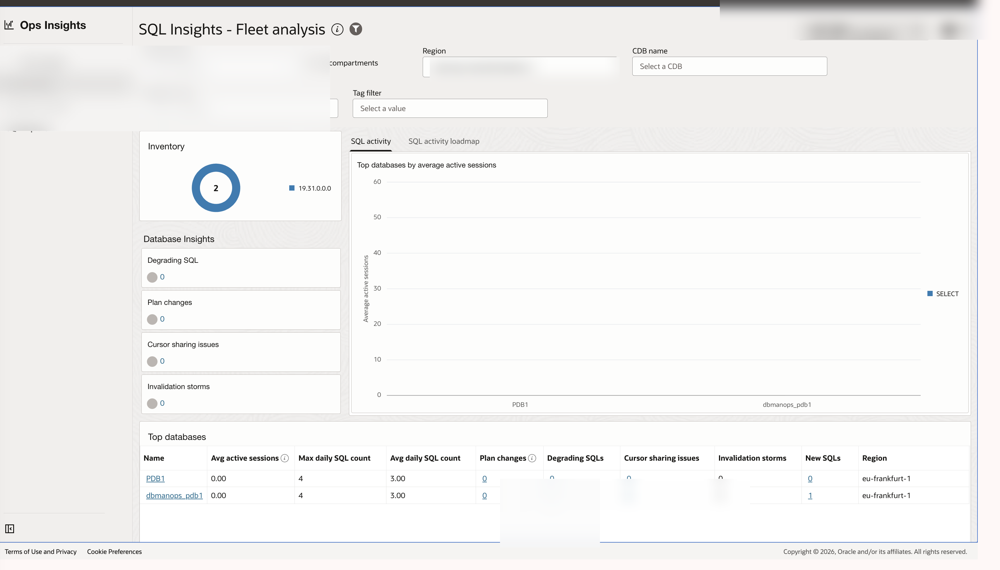

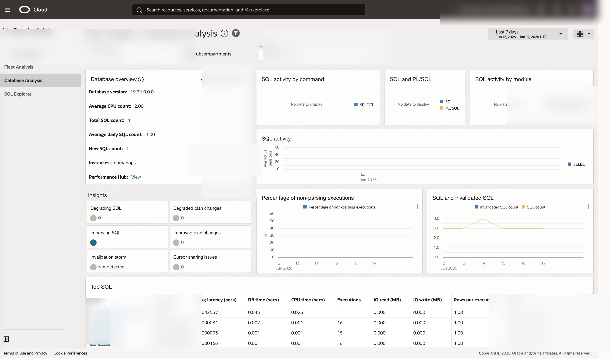

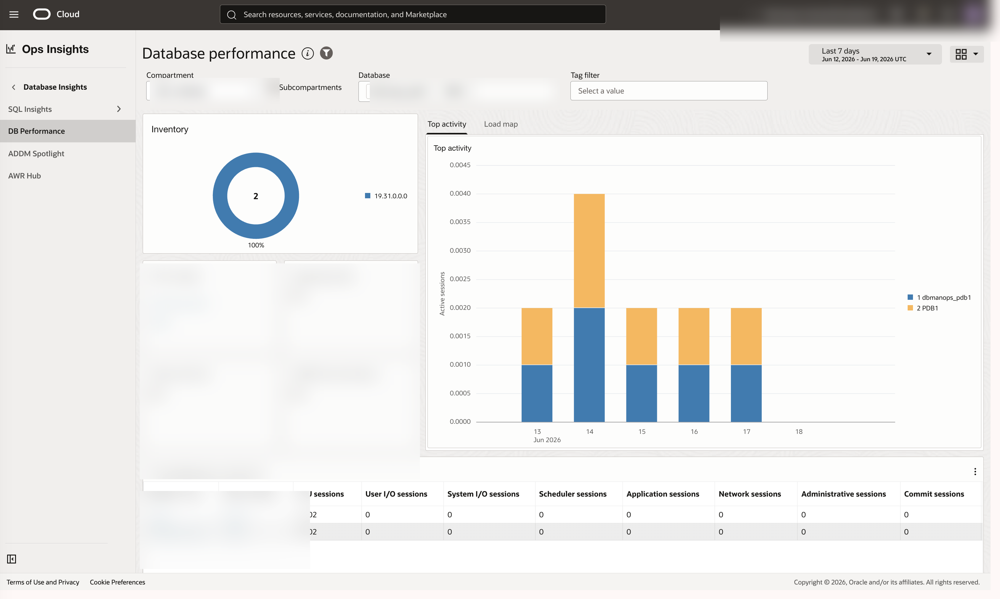

**Ops Insights — Multi-region Data Object Explorer** (Lab 7). The Explorer region
selector includes both Frankfurt and Chicago and returns region-aware rows from
one query:

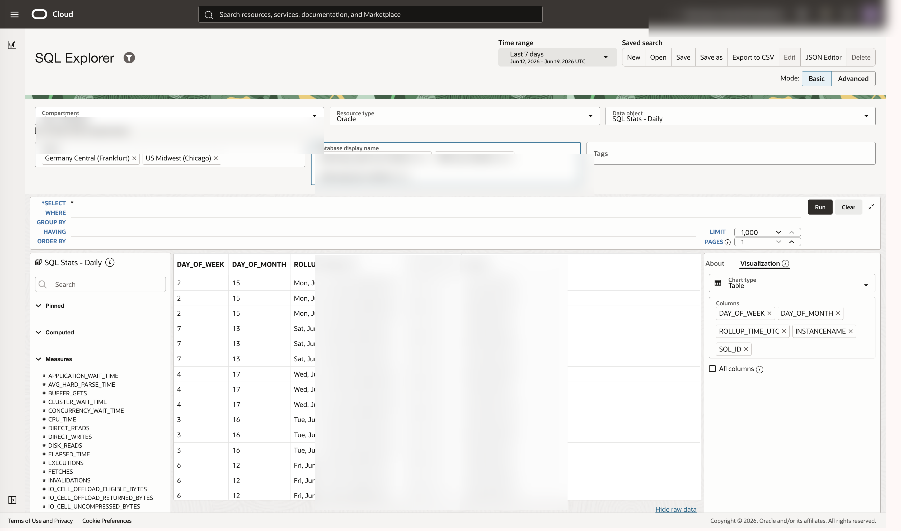

**Ops Insights — fleet administration** (Lab 7). The administration table shows
enabled feature sets and which rows need remediation, with resource names and
compartment values redacted:

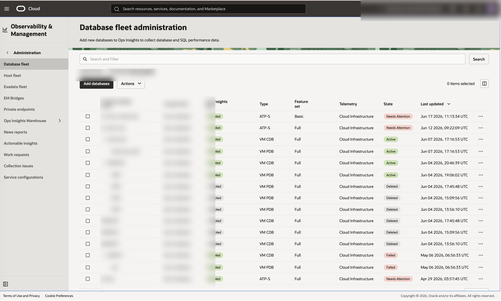

`discover --json` corroborates the Console: each enabled DB reports
`dbm_status: ENABLED`, `opsi_status: ENABLED`, and `data_safe_status: ENABLED`.

## Resource Manager Path

Use the Deploy to Oracle Cloud button in the repository README to launch the Terraform stack in any tenant. Resource Manager provisions only OCI-side prerequisites. Database credentials and database-side SQL execution remain explicit workshop steps.
