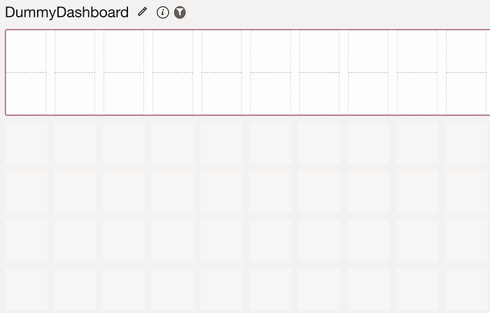
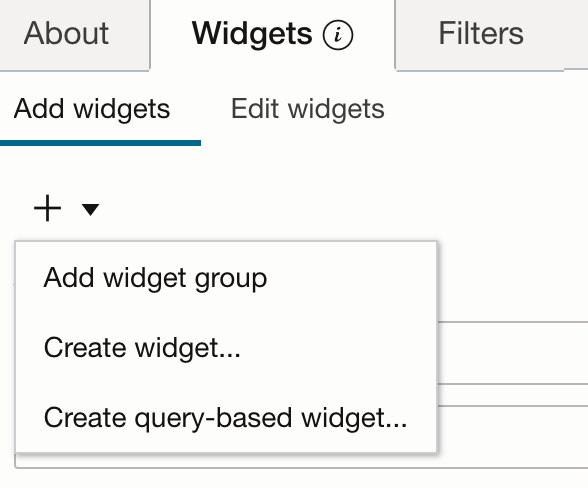
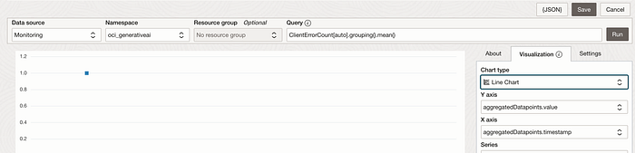

# OCI Management Dashboard Automation

Dashboard is very important in Observability to visualize and monitor the performance of the system and application.

[OCI Management Dashboard](https://docs.oracle.com/en-us/iaas/management-dashboard/doc/management-dashboard.html) is available so end user can create customised dashboards according to their needs. Out of the box dashboards provided as well for standard use-cases.

The below image is an empty dashboard .There are widgets available out of the box created by oracle and user can create their own widget as well. Once the widget is created you can drag and drop into the dashboard.



You can create a widget either by using Create widget or Create query-based widget



I would suggest using Create query-based widget through which more customisation is possible.

For example the below image show how you can create a widget for monitoring metric ClientErrorCount as part of oci_generativeai namespace. The Query can be edited as needed and visualization chart type can be chosen from the available options .



This is the way saved search will be created via UI.

But if we want to create multiple saved search for all the metrics in a namespace we need to repeat the steps multiple times. We will see how this can be automated using python SDK. You can run the code with the below command

python3 ./<filename>.py <dashboardname> <compartment_ocid> <namespace> <dimension>
Example : python3 ./managementdashboard.py Computedashboard ocid1.compartment…. oci_computeagent resourceDisplayName

```text
import oci
import argparse

parser = argparse.ArgumentParser(description="Create empty dashboard and saved search for all metrics in the namespace provided so it can be added to Dashboard")
group = parser.add_mutually_exclusive_group()
group.add_argument("-v", "--verbose", action="store_true")
parser.add_argument("dashboard", type=str, help="Name of the dashboard")
parser.add_argument("compartment_id", type=str, help="the compartment ocid where saved search will be created")
parser.add_argument("namespace", type=str, help="namespace for which saved search will be created for Mean statistic with the metrics available")
parser.add_argument("dimension", type=str, help="dimension on which color-by is applied for the saved search.Use metrics explorer to know the dimensions available for the namespace")
args = parser.parse_args()

config = oci.config.from_file('~/.oci/config')
compartment_id = args.compartment_id
dashboard_name = args.dashboard
provider_id = "log-analytics"
provider_name = "Logging Analytics"
provider_version = "3.0.0"
metadata_version = "2.0"
dashboard_type = "NORMAL"  # SET and NORMAL is allowed
dashboard_is_favorite = False

dashboard_ui_config = {"isFilteringEnabled": False,
                       "isRefreshEnabled": True,
                       "isTimeRangeEnabled": True
                       }

WIDGET_TEMPLATE = "visualizations/chartWidgetTemplate.html"
WIDGET_VM = "visualizations/chartWidget"
namespace = args.namespace

ss_parameter_config = [
    {
        "defaultFilterIds": [
            "OOBSS-management-dashboard-time-selector-filter"
        ],
        "displayName": "Time",
        "editUi": {
            "filterTile": {
                "filterId": "OOBSS-management-dashboard-time-selector-filter"
            },
            "inputType": "savedSearch"
        },
        "name": "time",
        "required": True
    },
    {
        "defaultFilterIds": [
            "OOBSS-management-dashboard-compartment-filter"
        ],
        "displayName": "Compartment",
        "editUi": {
            "inputType": "compartmentSelect"
        },
        "name": "compartmentId",
        "required": True
    },
    {
        "defaultFilterIds": [
            "OOBSS-management-dashboard-region-filter"
        ],
        "displayName": "Region",
        "editUi": {
            "filterTile": {
                "filterId": "OOBSS-management-dashboard-region-filter"
            },
            "inputType": "savedSearch"
        },
        "name": "regionName",
        "required": False
    }
]

dashboard_parameters_config = [{
    "displayName": "Compartment",
    "localStorageKey": "compartmentId",
    "name": "compartmentId",
    "parametersMap": {
        "isActiveCompartment": "true",
        "isStoreInLocalStorage": False
    },
    "savedSearchId": "OOBSS-management-dashboard-compartment-filter",
    "state": "DEFAULT"
    },
    {
        "savedSearchId": "OOBSS-management-dashboard-region-filter",
        "width": 2,
        "state": "DEFAULT",
        "parametersMap": { "isStoreInLocalStorage": True },
        "name": "regionFilter",
        "localStorageKey": "regionFilter"
    },
    {
        "displayName": "$(bundle.globalSavedSearch.TIME)",
        "name": "time",
        "src": "$(context.time)"
    }]

features_config = {
    "crossService": {
        "shared": True
    },
    "dependencies": []
}

monitoring_client = oci.monitoring.MonitoringClient(config)
management_dashboard_client = oci.management_dashboard.DashxApisClient(config)

# To listing saved search
def list_ss(name=None):
    list_management_saved_searches_response = management_dashboard_client.list_management_saved_searches(
        compartment_id=compartment_id,
        display_name=name)
    if len(list_management_saved_searches_response.data.items) > 0:
        ss_id = list_management_saved_searches_response.data.items[0].id
        return ss_id
    else:
        return list_management_saved_searches_response.data.items

# Create ui_config json
def get_json_ui_config(namespace=None, metric_name=None,widget=None):
    jet_config = {
        "type": widget,
        "timeAxisType": "enabled",
        "xAxis": {
            "viewportMin": "$(params.time.start)",
            "viewportMax": "$(params.time.end)"
        },
        "dataCursor": "on",
        "legend": {"rendered": True, "position": "top"},
        "stack": "on",
        "yAxis": {"title": f"{metric_name}"}
    }

    chart_info = {
        "jetConfig": jet_config,
        "value": "aggregatedDatapoints.value",
        "group": "aggregatedDatapoints.timestamp",
        "colorBy": f"dimensions.{args.dimension}",
        "series": f"dimensions.{args.dimension}"
    }

    viz_type_config = {
        "vizType": "chart",
        "chartInfo": chart_info,
        "defaultDataSource": f"{namespace}/{metric_name}"
    }
    return viz_type_config

def get_json_data_config(namespace=None, metric_name=None):
    parameters = {
        "compartmentId": "$(params.compartmentId)",
        "endTime": "$(params.time.end)",
        "mql": f"{metric_name}[auto].mean()",
        "namespace": namespace,
        "regionName": "$(params.regionName)",
        "startTime": "$(params.time.start)",
        "maxDataPoints": "useInterval"
    }
    data_config = [{
        "name": f"{namespace}/{metric_name}",
        "parameters": parameters,
        "type": "monitoringDataSource"
    }]
    return data_config

# create saved search for dashboard
def create_ss(name=None, description=None, data_config=None, metric_ui_config=None):
    management_dashboard_client.create_management_saved_search(
        create_management_saved_search_details=oci.management_dashboard.models.CreateManagementSavedSearchDetails(
            display_name=name,
            provider_id=provider_id,
            provider_version=provider_version,
            provider_name=provider_name,
            compartment_id=compartment_id,
            is_oob_saved_search=False,
            description=description,
            nls={},
            type="WIDGET_SHOW_IN_DASHBOARD",
            ui_config=metric_ui_config,
            data_config=data_config,
            screen_image="to-do",
            metadata_version=metadata_version,
            widget_template=WIDGET_TEMPLATE,
            widget_vm=WIDGET_VM,
            parameters_config=ss_parameter_config,
            features_config=features_config
        ))

def update_ss(name=None, description=None, data_config=None, metric_ui_config=None, **kwargs):
    management_dashboard_client.update_management_saved_search(
        management_saved_search_id=list_ss(name=name),
        update_management_saved_search_details=oci.management_dashboard.models.UpdateManagementSavedSearchDetails(
            display_name=name,
            provider_id=provider_id,
            provider_version=provider_version,
            provider_name=provider_name,
            compartment_id=compartment_id,
            is_oob_saved_search=False,
            description=description,
            nls={},
            type=kwargs.get("type", "WIDGET_SHOW_IN_DASHBOARD"),
            ui_config=metric_ui_config,
            data_config=data_config,
            screen_image="to-do",
            metadata_version=metadata_version,
            widget_template=WIDGET_TEMPLATE,
            widget_vm=WIDGET_VM,
            parameters_config=ss_parameter_config,
            features_config=features_config,
            drilldown_config=[]))

def list_metrics(namespace=None):
    list_metrics_response = monitoring_client.list_metrics(
        compartment_id=compartment_id,
        list_metrics_details=oci.monitoring.models.ListMetricsDetails(
            namespace=namespace))
    metrics = []
    for key in list_metrics_response.data:
        if key.name not in metrics:
            metrics.append(key.name)
    return metrics

for metric_name in list_metrics(namespace=namespace):
    ss_data_config = get_json_data_config(namespace=namespace,metric_name=metric_name)
    ss_ui_config = get_json_ui_config(namespace=namespace, metric_name=metric_name,widget="line")
    if len(list_ss(name=f"{metric_name}")) == 0:
        create_ss(name=f"{metric_name}", description=f"{metric_name} Mean",
                  data_config=ss_data_config, metric_ui_config=ss_ui_config)
    else:
        update_ss(name=f"{metric_name}", description=f"{metric_name} Mean",
                  data_config=ss_data_config, metric_ui_config=ss_ui_config)

def list_dashboards(name=None):
    list_management_dashboards_response = management_dashboard_client.list_management_dashboards(
        compartment_id=compartment_id,
        display_name=name)
    return list_management_dashboards_response.data.items

# create dashboard
dashboard_list = list_dashboards(name=dashboard_name)
if len(dashboard_list) == 0:
    create_management_dashboard_response = management_dashboard_client.create_management_dashboard(
        create_management_dashboard_details=oci.management_dashboard.models.CreateManagementDashboardDetails(
            provider_id=provider_id,
            provider_name=provider_name,
            provider_version=provider_version,
            tiles=[],
            display_name=dashboard_name,
            description=dashboard_name,
            compartment_id=compartment_id,
            is_oob_dashboard=False,
            is_show_in_home=False,
            metadata_version=metadata_version,
            is_show_description=True,
            screen_image="todo: provide value[mandatory]",
            nls={},
            ui_config=dashboard_ui_config,
            data_config=[],
            type=dashboard_type,
            is_favorite=dashboard_is_favorite,
            parameters_config=dashboard_parameters_config,
            drilldown_config=[]))
```

Once the dashboard and saved search is created we can simply drag and drop the required widgets. You can also update the saved search if any changes needed later.

The above automation though is a starting point in saving time it’s not a perfect solution for all requirements. The idea is to show how easy it can be automated using python SDK and you can make small changes as per the requirements instead of writing from scratch.
