# How to enable OCI Observability on Golden Gate Cloud

Oracle Cloud Infrastructure GoldenGate is a fully managed, native cloud service that moves data in real-time, at scale. OCI GoldenGate processes data as it moves from one or more data management systems to target databases.

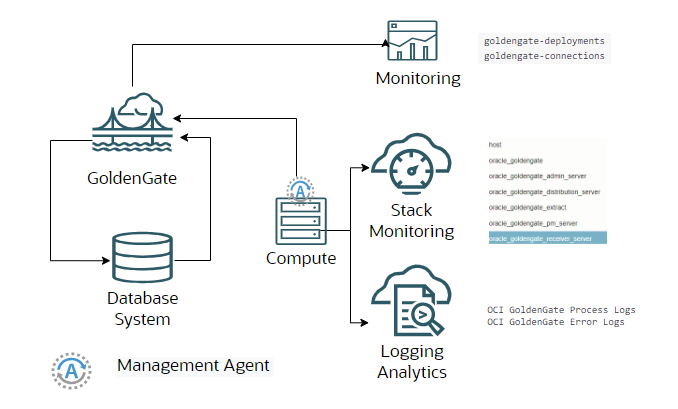

### Enable Logging Analytics

OCI services produces logs that are collecting into Logging Service. Logs will be tranfered into logging Analytics to provide advanced funcionalities

1. Enable Logging for OCI Golden Gate. Go on Observability and Management — > Logging →Logs →Enable Service Log

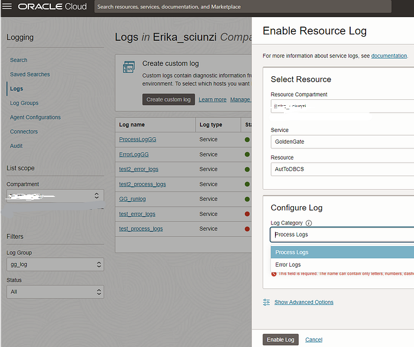


2. Tranfer the GG logs to Logging analytics. Go on Observability and Management → Logging → Logs → Connectors → Create connector


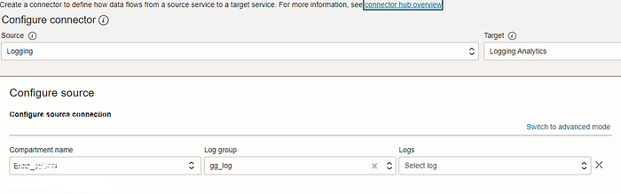


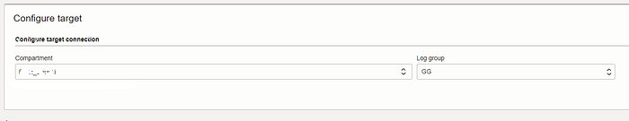

3. Wait 5 minutes and then go on Observability and Management → Logging Analytics → Explorer


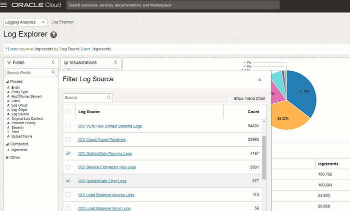

4. Select OCI GoldenGate Process and Error.


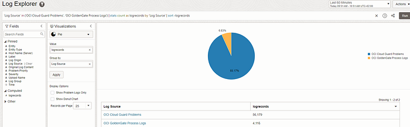

Now you can use all Logging Analytics capabilities.

### Enable Stack Monitoring

Enabling Stack Monitoring you will get Golden Gate Out of the Box dashbaord and[ extra metrics](https://docs.oracle.com/en-us/iaas/stack-monitoring/doc/metric-reference.html).

1. Install Management Agent on a OCI VM. Please refer to [this ](https://blogs.oracle.com/observability/post/oci-logginganalytics-compute-instance)Blog

2. Download Golden Gate certificate and save it on a location accessible by the Management Agent

Go on Golden Gate -> Deployments -> Launch console


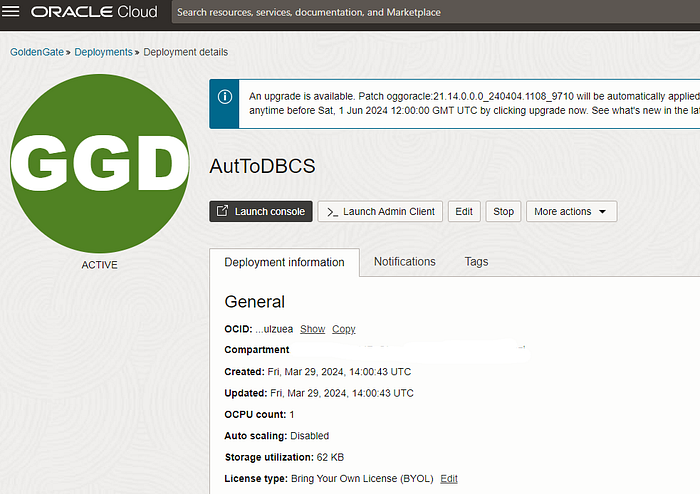

Download the certificate. Go on Connection is Secure →Certificate is valid → Details → Select the certificate →Export

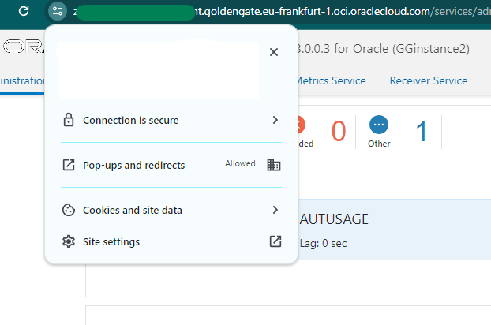

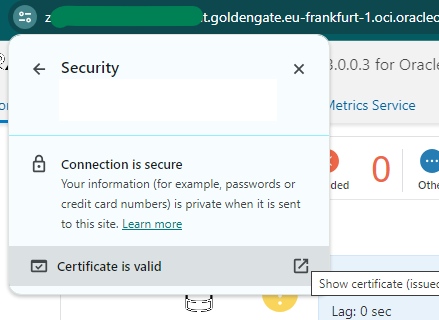

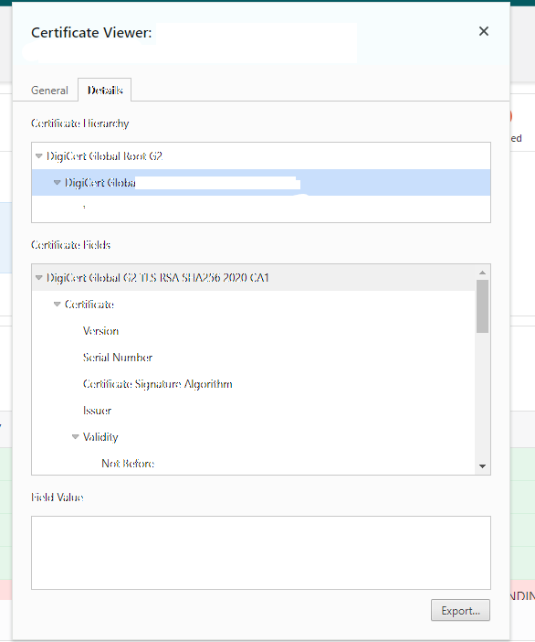

3. Copy the certificate on the Compute VM /tmp folder. Rename it as DigiCertGGConsole.crt and create the eystore on the Compute VM. Keystore location needs to be accesible by the agent

```text
sudo -u mgmt_agent sh
cd --
mv /tmp/DigiCert\ Global\ G2\ TLS\ RSA\ SHA256\ 2020\ CA1.crt DigiCertGGConsole.crt
keytool -import -file DigiCertGGConsole.crt -alias DigicertCA -keystore mgmt_agent_keystore
```

4. Discovery Golden Gate service. Go on Observability →Stack Monitoring →Resource Discovery →Discovery New resource

```text
Hostname = deployment console URL
Management Agent = Agent Name discovered in Observability -> Management Agent Console
TrustStore = /usr/share/mgmt_agent/mgmt_agent_keystore
```

Press enter or click to view image in full size

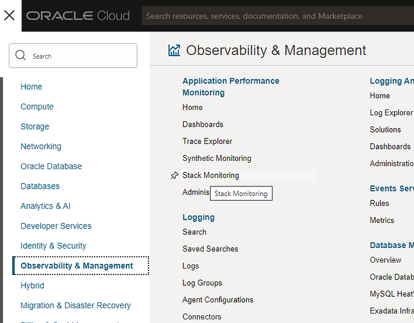

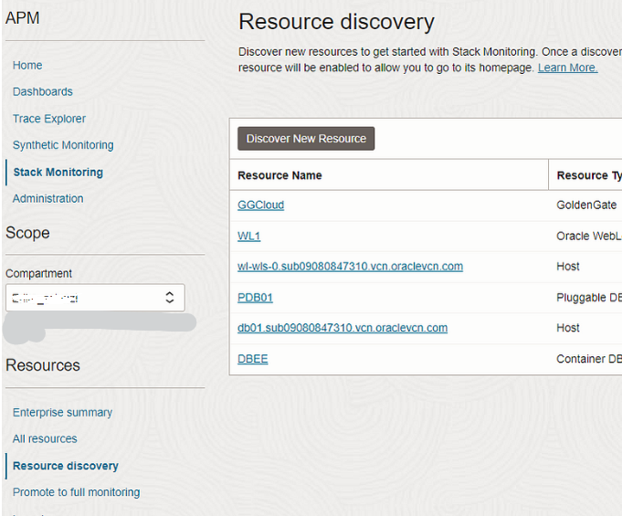

Press enter or click to view image in full size

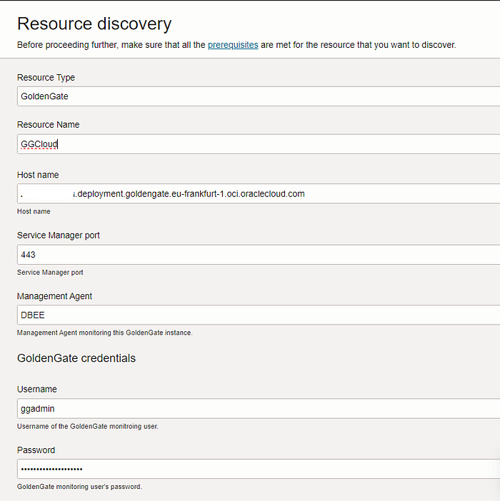

Press enter or click to view image in full size

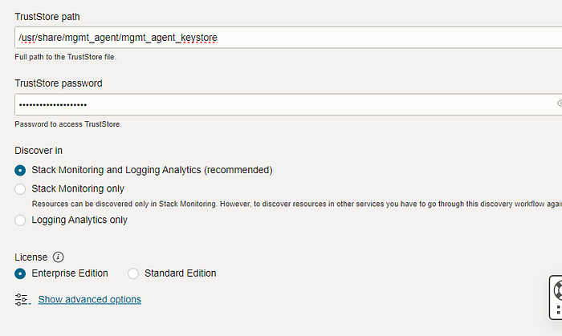

5. After the discovery process completed you can see Golden Gate in Stack Monitor console


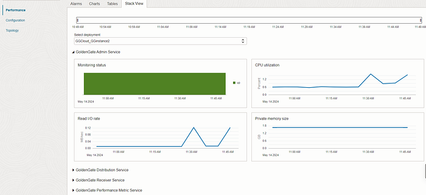


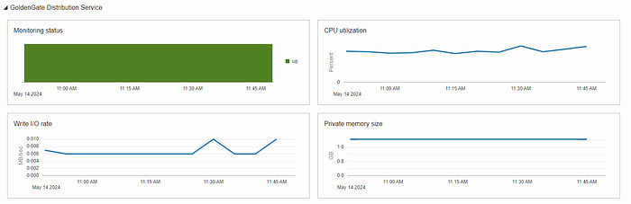


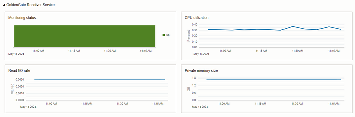


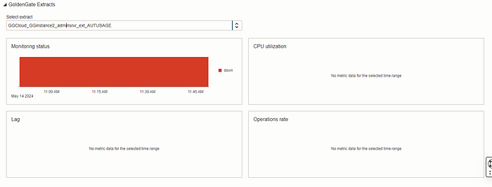

Now you can use full Observability capability on your Golden Gate service.
