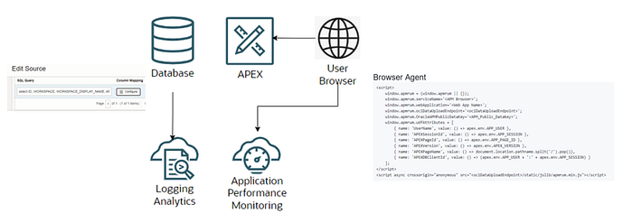
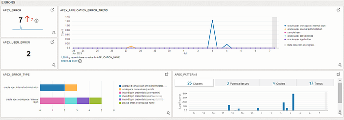
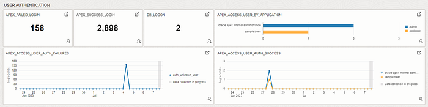
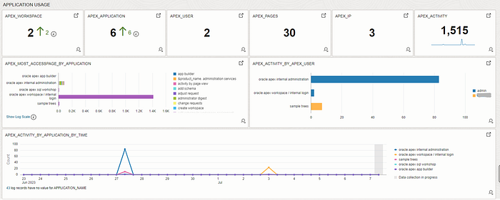
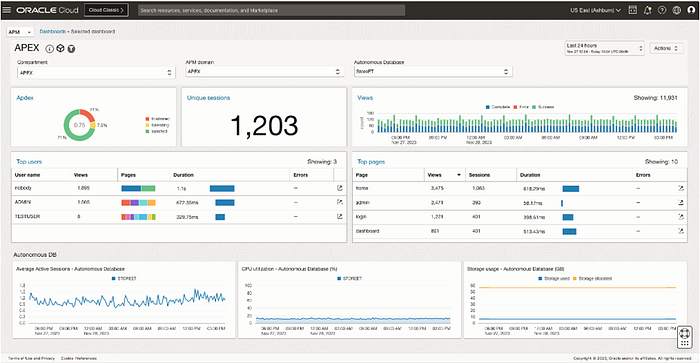

# How to enable OCI Observability on Oracle APEX

Oracle APEX is an enterprise low-code application platform that enables developers to build scalable, secure web and mobile apps. It can run on-premises as well as Oracle Cloud Infrastructure (OCI).

While the Oracle APEX framework provides administrator and [monitoring](https://docs.oracle.com/database/apex-18.1/AEADM/monitoring-activity-within-a-workspace.htm) dashboards, they require APEX specific skills and access.

Press enter or click to view image in full size

Utilizing OCI Observability and Management services you can obtain, a single point of display and control for all the services, without having to be an APEX expert or administrator.

One basic method is sourcing monitoring data from the Oracle APEX repository and then publishing it to an OCI Dashboard.

To activate FULL Observability capabilities for APEX you can use two services:

- OCI Logging Analytics. [Here](https://github.com/oracle-quickstart/oci-o11y-solutions/tree/main/knowlege-content/oracle-database/APEX/apm) you can find the documentation.

- OCI Application Performance Monitor. [Here](https://github.com/oracle-quickstart/oci-o11y-solutions/tree/main/knowlege-content/oracle-database/APEX/apm) how to enable it.

Enabling these advanced OCI O&M services yields such Applied Observability insights as Error, User Authentication, Application Usage Dashboard and Real User Experience.

### Error, User Authentication, and Application Usage Dashboard

Figure 1 APEX Error Dashboard

The errors dashboard group provides a view of application errors and the impact on the end user.

Figure 2 APEX User Audit Dashboard

The User Audit widget group shows the application user and the database login. In this case, it provides the success and the failure logon trend. Note, define an alert when the failure exceeds a threshold limit.

Figure 3 APEX Application Usage Dashboard

The application usage Dashboard provides an overview of the application workload in terms of workspace, application, pages and users.

A dashboard is made of several widget. Each widget allows to drill down till the raw data source. You can se the APEX sources to build new widgets [https://docs.oracle.com/en-us/iaas/Content/Dashboards/Tasks/widgetmanagement.htm](https://docs.oracle.com/en-us/iaas/Content/Dashboards/Tasks/widgetmanagement.htm)

### Real User Monitor

Real user monitoring (RUM) records all user interaction with a [website](https://en.wikipedia.org/wiki/Website) or client interacting with a server or cloud-based application. Monitoring actual user interaction with a website or an application is important to operators to determine if users are being served quickly and without errors and, if not, which part of a business process is failing. Real user monitoring data is used to determine the actual service-level quality delivered to end-users and to detect errors or slowdowns on websites.

Fig. 4 APEX Real User Experience Dashboard

Observability is the next monitor level which allows you to get a full insight from your asset and improve the business quality of service. OCI offers integrated and native monitor for all the services. To know more about access our [knowledge repository](https://github.com/oracle-quickstart/oci-o11y-solutions/tree/main/knowledge-content/oracle-database/APEX)!

Resources:

[OCI Observability](https://www.oracle.com/uk/manageability/)

[Getting Started with OCI Logging Analytics](https://docs.oracle.com/en-us/iaas/logging-analytics/doc/quick-start.html)

[Getting Started with OCI APM](https://docs.oracle.com/en-us/iaas/application-performance-monitoring/doc/get-started-application-performance-monitoring.html)
