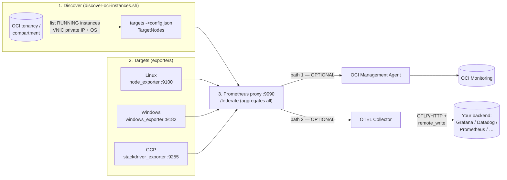
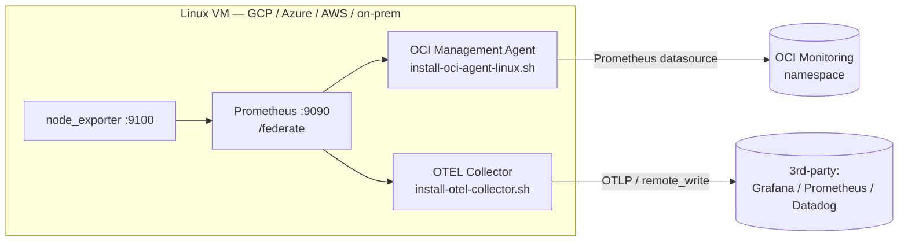
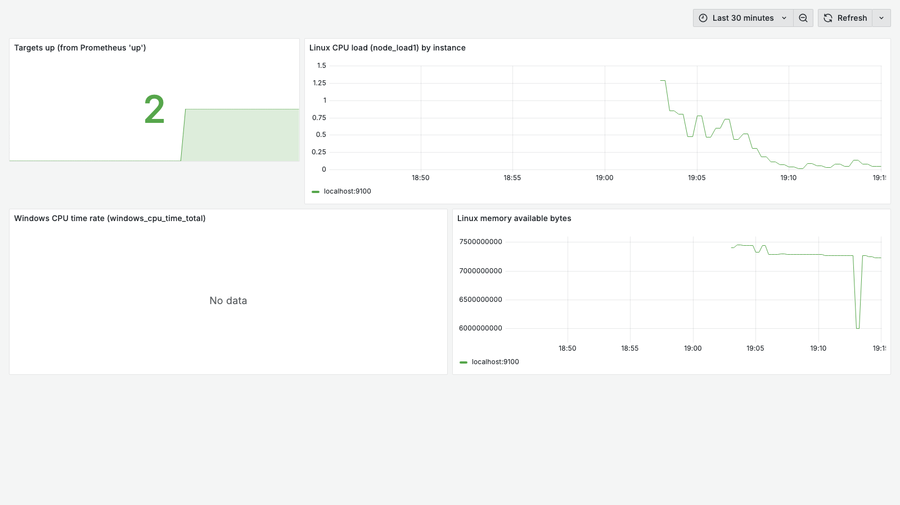
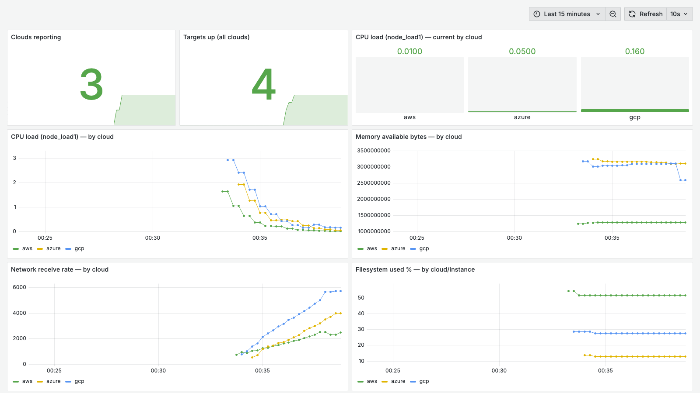
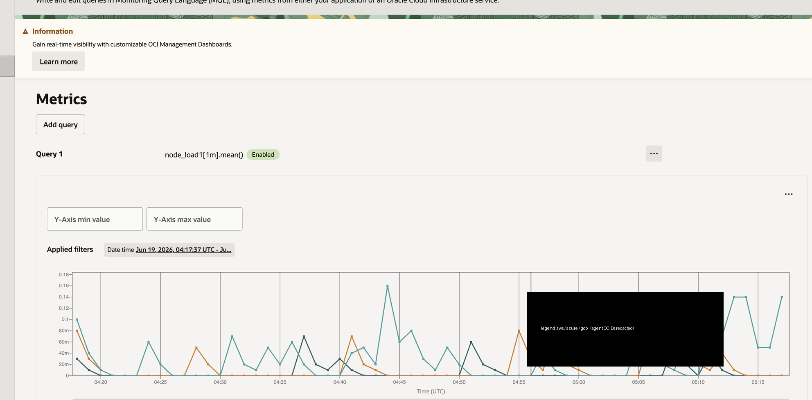
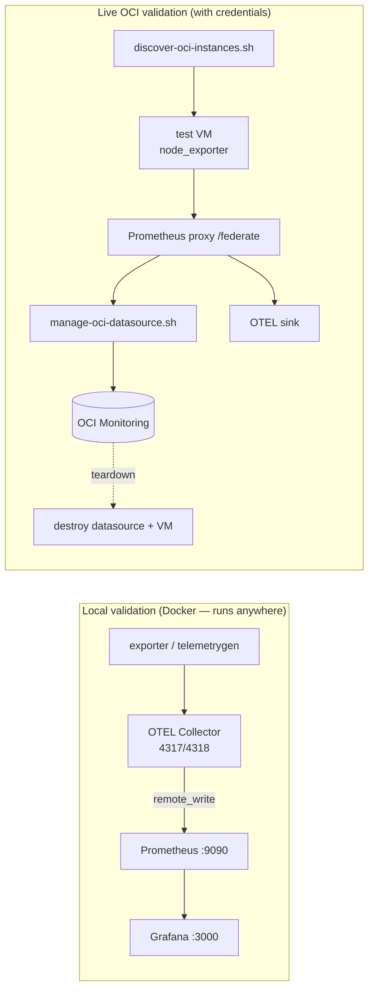
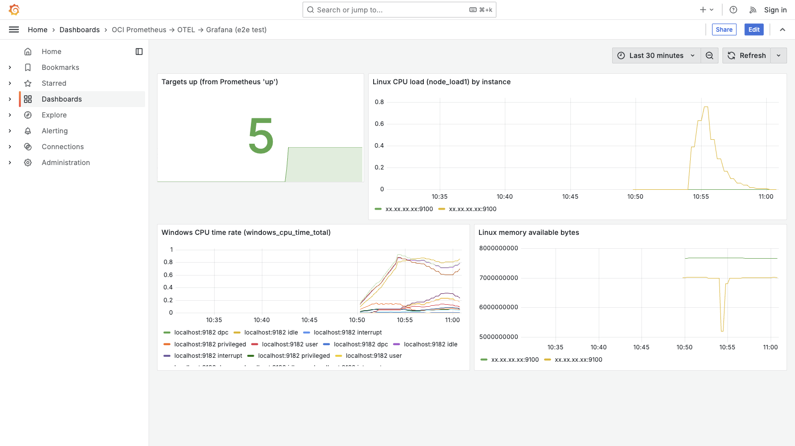
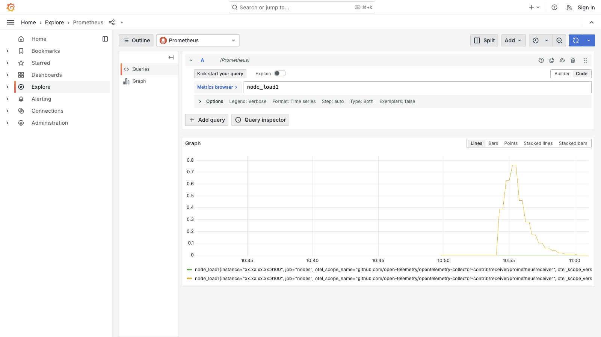

# OCI Prometheus → OTEL Monitoring

[](https://github.com/adibirzu/oci-prometheus-otel-monitoring/actions/workflows/lint.yml)
[](LICENSE)

Discover your OCI compute instances, install Prometheus exporters on Windows &
Linux, aggregate them on a Prometheus proxy, and ship the metrics **either** to
**OCI Monitoring** (via the OCI Management Agent) **or** to **any backend you
like** in **OpenTelemetry** form (OTLP/HTTP or Prometheus `remote_write`) —
Grafana, Datadog, Grafana Cloud, your own collector. Both paths are optional and
can run together.

> You don't have to use OCI Monitoring. Set `OciMonitoringEnabled: false` and the
> proxy becomes a pure OpenTelemetry exporter to your tool of choice.

## Workflow



A single Prometheus aggregation on the proxy feeds two independent export paths.
Editable diagram: [`docs/architecture.drawio`](docs/architecture.drawio) ·
rendered: [`docs/architecture.svg`](docs/architecture.svg).

## Quick start — OTEL only (no OCI Monitoring)

The fastest path if your destination is **not** OCI Monitoring.

**1. Stand up a destination** (or point at your own). A ready-to-run
OTEL → Prometheus → Grafana sink is included:

```bash
cd otel-destination && docker compose up -d
# Grafana :3000 (set GF_SECURITY_ADMIN_PASSWORD), Prometheus :9090, OTEL :4317/4318
```

**2. Linux proxy/target** — federate Prometheus to your destination via OTEL:

```bash
sudo ./install-node-exporter.sh                       # on each Linux target
sudo ./install-otel-collector.sh \
  --prometheus-url http://localhost:9090 \
  --otlp-endpoint  http://<DEST_HOST>:4318 \
  --remote-write   http://<DEST_HOST>:9090/api/v1/write --insecure
```

**Windows proxy** — in `config.json` set `"OciMonitoringEnabled": false`,
`"OtelEnabled": true`, and your endpoints (see [`config.example.json`](config.example.json)),
then run `.\Install-OCI-Prometheus.ps1` as Administrator and choose **Proxy**.

**3. Verify** the OTEL path: a series like `node_load1` in the destination carries
the label `otel_scope_name="…/prometheusreceiver"`, proving it traversed the
OpenTelemetry Collector.

## Quick start — push to OCI Monitoring

```bash
# 1. Discover your instances and write proxy targets (run where the OCI CLI is configured)
./discover-oci-instances.sh --compartment-id <COMPARTMENT_OCID> --profile <P> --output config
# 2. Install exporters on the targets (node_exporter on Linux, windows_exporter on Windows)
# 3. On the Windows proxy: run Install-OCI-Prometheus.ps1, choose Proxy, OciMonitoringEnabled=y
# 4. Create the OCI Monitoring data source on the agent (federate endpoint):
./manage-oci-datasource.sh create --agent-id <AGENT_OCID> --compartment-id <COMPARTMENT_OCID> \
    --name proxy_prometheus --namespace prometheus_proxy --profile <P>
```

Details below.

## Discover your tenancy (`discover-oci-instances.sh`)

Stop hand-authoring target IPs. This enumerates **RUNNING** instances, resolves
each primary VNIC **private IP** and **OS family** (from the image), and assigns
the right exporter port (Linux `:9100`, Windows `:9182`).

```bash
# Human-readable table
./discover-oci-instances.sh --compartment-id <OCID> --profile <P>

# Prometheus file_sd_config -> discovered-targets.json
./discover-oci-instances.sh --compartment-id <OCID> --profile <P> --output targets

# Merge straight into config.json TargetNodes (non-destructive union)
./discover-oci-instances.sh --compartment-id <OCID> --profile <P> --output config

# Walk the whole tenancy subtree
./discover-oci-instances.sh --tenancy-scan --profile <P> --output config
```

Required read-only IAM (per scanned compartment):

```
ALLOW group <G> to inspect instances             in compartment <C>
ALLOW group <G> to read    instance-images       in compartment <C>   # OS detection
ALLOW group <G> to read    virtual-network-family in compartment <C>  # VNIC private IP
ALLOW group <G> to inspect compartments          in tenancy           # only for --tenancy-scan
```

> `discovered-targets.json` contains private IPs and is git-ignored.

## Cross-cloud: monitor GCP / Azure / AWS / on-prem Linux instances

The OCI Management Agent runs on **any** Linux host, so a VM in GCP, Azure, AWS, or
on-prem can push to **OCI Monitoring** — and the same metrics can fan out to a
**3rd-party** Grafana/Prometheus at the same time. `install-oci-agent-linux.sh`
installs the agent on Linux (it installs OpenJDK 8 and sets `JAVA_HOME` for you —
KB-24 — and waits out first-boot apt locks — KB-27).



```bash
# On the GCP/Linux VM: collect OS metrics + aggregate
sudo ./install-node-exporter.sh
#   run a Prometheus that scrapes localhost:9100 and serves /federate (e.g. :9099)

# Path 1 — push to OCI Monitoring (fetch agent zip + build input.rsp on an OCI-CLI host first)
sudo ./install-oci-agent-linux.sh --agent-zip oracle.mgmt_agent.zip --rsp input.rsp
#   then add the /federate data source from an OCI-CLI host:
./manage-oci-datasource.sh create --agent-id <AGENT_OCID> --compartment-id <C> \
    --name gcp_prometheus --namespace prometheus_gcp --url 'http://localhost:9099/federate?...' --profile <P>

# Path 2 — export to your 3rd-party backend (same metrics, in parallel)
sudo ./install-otel-collector.sh --prometheus-url http://localhost:9099 \
    --otlp-endpoint http://<dest>:4318 --remote-write http://<dest>:9090/api/v1/write --insecure
```

Required OCI IAM (one time): a `managementagent` dynamic group + a policy granting
it `USE METRICS` in the compartment (see "Management Agent prerequisites"). The agent
registers over outbound 443 to `*.oraclecloud.com`, which most clouds allow by default.

Validated end-to-end on real VMs in **GCP** (`europe-west1`), **Azure**
(`westeurope`), and **AWS** (`eu-central-1`) → each pushed `node_*` to its own
**OCI Monitoring** namespace (`prometheus_gcp` / `prometheus_azure` /
`prometheus_aws`, confirmed via `summarize-metrics-data`) **and** to a **Grafana**
sink in parallel. Where SSH to the VM was blocked, the setup was driven over the
cloud control plane (`az vm run-command`, `aws ssm send-command`) — see KB-28. See
KB-24/25/26/27 for the issues found and fixed.

**GCP VM metrics in the 3rd-party Grafana (via the OTEL path):**



### Unified multicloud collection (GCP + Azure + AWS together)

Tag each VM's Prometheus with an `external_labels: { cloud: <name> }` and point all
agents at **one** OCI Monitoring namespace (and all OTEL collectors at **one**
Grafana) — now a single pane shows every cloud, split by the `cloud` label.

A live run with **all three clouds at once** (one VM each in GCP/Azure/AWS, one
shared central Grafana) produced this dashboard — **Clouds reporting: 3**, with
`aws`/`azure`/`gcp` series across CPU, memory, network, and filesystem:



The same metrics land in **one OCI Monitoring namespace** `prometheus_multicloud`,
queryable per cloud. Two ways to see it in the OCI Console (region = where your
agents publish):

- **Management Agents** (Observability & Management → Management Agents) — lists one
  Management Agent **per source cloud** (the GCP/Azure/AWS VMs), all `ACTIVE`. The
  clearest proof that every cloud reports into one OCI tenancy.
- **Metrics Explorer** (Monitoring → Metrics Explorer → **Add query**) — pick your
  compartment + namespace **`prometheus_multicloud`**, then this MQL:

  ```
  node_load1[1m].mean()
  ```

  OCI MQL has no PromQL-style `by (cloud)` — it auto-splits into **one line per
  `cloud` dimension**, so this already plots **aws / azure / gcp** as 3 lines. Leave
  *Aggregate metric streams* **off**. Filter one cloud with `node_load1[1m]{cloud = "aws"}.mean()`.

  

  *`node_load1[1m].mean()` over `prometheus_multicloud` — three lines, one per cloud
  (aws/azure/gcp), all reporting into a single OCI Monitoring namespace. (Agent OCIDs redacted.)*

Gotchas worth knowing: the namespace dropdown is alphabetical (custom namespaces
sort **after** all `oci_*` — search `prometheus`), it only lists namespaces with
data **inside the selected time window** (set a recent range), and metrics land in
the **specific compartment** set on the data source. Data is retained ~93 days.
Dashboard JSON: [`otel-destination/dashboards/multicloud.json`](otel-destination/dashboards/multicloud.json).

### Discover instances across clouds

[`discover-cloud-instances.sh`](discover-cloud-instances.sh) is the multicloud
companion to `discover-oci-instances.sh` — it enumerates running instances in
**AWS, Azure, GCP, or OCI** (or `all`) and emits cloud-labelled Prometheus targets:

```bash
./discover-cloud-instances.sh --cloud aws   --region eu-central-1
./discover-cloud-instances.sh --cloud azure --resource-group my-rg
./discover-cloud-instances.sh --cloud gcp   --project my-project
./discover-cloud-instances.sh --cloud all   --region R --resource-group RG --project P --output targets
```

## Install matrix

| Role | OS | Script | Installs |
|------|----|--------|----------|
| Target | Windows 8.1 / Server 2012R2 → 11 / 2025 | `Install-OCI-Prometheus.ps1` (Target) | `windows_exporter` |
| Target | Linux (systemd) | `install-node-exporter.sh` | `node_exporter` |
| Target | Linux (GCP metrics) | `install-gcp-exporter.sh <project> <key.json> [prefixes]` | `stackdriver_exporter` |
| Proxy | Windows | `Install-OCI-Prometheus.ps1` (Proxy) | Prometheus + optional OCI agent / GCP / OTEL |
| Proxy | Linux (OTEL) | `install-otel-collector.sh` | OpenTelemetry Collector |
| Proxy | Linux → OCI Monitoring | `install-oci-agent-linux.sh` | OCI Management Agent (any Linux host, incl. other clouds) |

`Install-OCI-Prometheus.ps1` is interactive and saves answers to `config.json`
(git-ignored) for unattended re-runs. The Proxy mode toggles are independent:
`OciMonitoringEnabled`, `OtelEnabled`, `GcpEnabled`.

## OCI Monitoring configuration

The OCI Management Agent forwards metrics by scraping a Prometheus endpoint and
publishing to OCI Monitoring.

> **Important:** point the data source at the Prometheus **`/federate`** endpoint,
> **not** `/metrics`. `http://localhost:9090/metrics` only exposes Prometheus' own
> internal telemetry — the scraped `windows_exporter`/`node_exporter`/GCP series
> live in the TSDB and are only exported via `/federate`. (See KB-12.)

### Manage data sources — check / idempotent create / destroy

Use [`manage-oci-datasource.sh`](manage-oci-datasource.sh) from any host with the
OCI CLI (the Windows proxy has none). `create` checks existing sources and skips
duplicates; `destroy` removes them.

```bash
./manage-oci-datasource.sh list    --agent-id <AGENT_OCID> --profile <P>
./manage-oci-datasource.sh create  --agent-id <AGENT_OCID> --compartment-id <COMPARTMENT_OCID> \
                                    --name proxy_prometheus --namespace prometheus_proxy --profile <P>
./manage-oci-datasource.sh destroy --agent-id <AGENT_OCID> [--name proxy_prometheus] --profile <P>
```

### Management Agent prerequisites (one time, per compartment)

```bash
oci iam dynamic-group create --name mgmt-agent-dg \
  --matching-rule "ALL {resource.type='managementagent', resource.compartment.id='<COMPARTMENT_OCID>'}" \
  --description "Management agents"
oci iam policy create -c <COMPARTMENT_OCID> --name mgmt-agent-policy --statements '[
  "ALLOW dynamic-group mgmt-agent-dg to MANAGE management-agents in compartment id <COMPARTMENT_OCID>",
  "ALLOW dynamic-group mgmt-agent-dg to USE METRICS in compartment id <COMPARTMENT_OCID>"]'
oci management-agent install-key create -c <COMPARTMENT_OCID> --display-name proxy-key
oci management-agent install-key get-install-key-content \
  --management-agent-install-key-id <INSTALL_KEY_OCID> --file input.rsp
# Set CredentialWalletPassword in input.rsp: >=16 chars, upper+lower+digit+special (KB-09).
```

The Windows Management Agent zip is **not** an anonymous download (KB-10):

```bash
oci os object get --namespace <agent_image_ns> --bucket-name agent_images \
  --name Windows-x86_64/latest/oracle.mgmt_agent.zip --file oracle.mgmt_agent.zip
# (namespace/object from: oci management-agent agent-image list -c <COMPARTMENT_OCID>)
```

For a Linux Management Agent proxy, see the
[oracle-devrel management-agent bootstrap](https://github.com/oracle-devrel/technology-engineering/tree/mng_agent/observability-and-management/management-agent).

## OpenTelemetry export — configuration

```jsonc
// config.json (proxy)
"OciMonitoringEnabled": false,                                   // pure OTEL path
"OtelEnabled": true,
"OtelOtlpEndpoint": "http://<your-otel-collector>:4318",
"OtelPromRemoteWriteEndpoint": "http://<your-prometheus>:9090/api/v1/write"
```

- **Windows proxy:** `Install-OCI-Prometheus.ps1` installs the OTEL Collector when `OtelEnabled` is set.
- **Linux:** `sudo ./install-otel-collector.sh --prometheus-url http://localhost:9090 --otlp-endpoint http://collector:4318 --remote-write http://prom:9090/api/v1/write`
- **Test sink:** [`otel-destination/`](otel-destination/) (OTEL → Prometheus → Grafana).

## Test architecture



See [`PROJECT_REVIEW.md`](PROJECT_REVIEW.md) for the full end-to-end report and
the validated topology (Windows Server 2022 proxy + Ubuntu/Oracle-Linux targets +
the Dockerized OTEL→Prometheus→Grafana sink).

**Grafana — metrics delivered via the OTEL path** (IPs masked):



**Grafana Explore — `node_load1` carries `otel_scope_name=…/prometheusreceiver`, proving it traversed the OTEL Collector:**



## Prerequisites

- **Windows:** Server 2012 R2+, Windows 8.1/10/11 (script auto-selects a compatible exporter build).
- **Linux:** any modern `systemd` distro (Ubuntu, RHEL, OEL, CentOS).
- **OCI CLI:** configured profile for discovery and data-source management.
- **GCP (optional):** service account with `roles/monitoring.viewer` + JSON key.
- **Network/ports:** 9182 (Win), 9100 (Lin), 9255 (GCP), 9090 (Prometheus). Open
  host firewalls **and** VCN security lists/NSGs (KB-15).

## Troubleshooting

Hit an error? Search [`docs/KNOWLEDGE_BASE.md`](docs/KNOWLEDGE_BASE.md) — 23
entries (Symptom → Root cause → Resolution → File) covering MSI 1618, the
`unknown collector cs` crash, NSSM 503s, `JAVA_HOME`, `/federate` vs `/metrics`,
firewall scrape timeouts, OTEL verification, discovery IAM, and more.

## Contributing & security

- [CONTRIBUTING.md](CONTRIBUTING.md) — local checks, commit style, scope.
- [SECURITY.md](SECURITY.md) — reporting, and what never to put in issues/logs.
- Licensed under [UPL-1.0](LICENSE).
