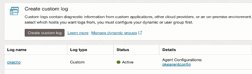
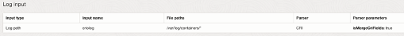

# OKE log collection using OCI Logging

Recently OCI logging had added support for CRIO logs. With this we can collect container logs in OKE > 1.20.

Steps are easy:

1. Make sure custom logs monitoring plugin is running under Oracle Cloud Agent tab in compute.


2. Create a dynamic group for OKE compute instance only if other compute instances are there in the same compartment using tags like below.

```text
tag.Mandatory_Tags.Owner.value=’oke’ instance.compartment.id='<compartment_ocid>'
```

3.Create custom logs and agent configuration using the dynamic group created earlier and choose CRI parser.





It will take some time for the agent config to load. If you want to see the logs quicker run the below command in the compute node

```text
systemctl restart unified-monitoring-agent_config_downloader
```

Congratulations! You have now OKE logs in OCI Logging.
