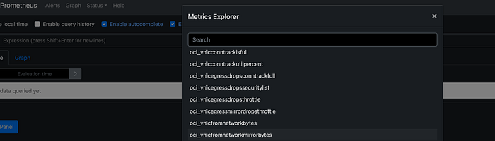
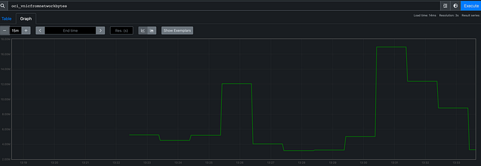

# Oracle Cloud Prometheus Exporter

If you want to pull OCI metrics into Prometheus there are no exporters available in the community so far and we might need to write our own exporters.

We will see how to write a basic OCI exporter in python using [SummarizeMetricsData](https://docs.oracle.com/en-us/iaas/api/#/en/monitoring/20180401/MetricData/SummarizeMetricsData) API.

```text
from builtins import object, len
import time
import sys
from prometheus_client import start_http_server
from prometheus_client.core import GaugeMetricFamily, REGISTRY

import oci
from datetime import datetime, timezone, timedelta

compartment_id = sys.argv[1]
config = oci.config.from_file("")
monitoring_client = oci.monitoring.MonitoringClient(config)

# Instance principal
# signer = oci.auth.signers.InstancePrincipalsSecurityTokenSigner()
# monitoring_client = oci.monitoring.MonitoringClient(config={}, signer=signer)

COMPUTE_METRICS = [
    "CpuUtilization",
    "DiskBytesRead",
    "DiskBytesWritten",
    "DiskIopsRead",
    "DiskIopsWritten",
    "LoadAverage",
    "MemoryAllocationStalls",
    "MemoryUtilization",
    "NetworksBytesIn",
    "NetworksBytesOut"
]

VCN_METRICS1 = [
    "VnicConntrackIsFull",
    "VnicConntrackUtilPercent",
    "VnicEgressDropsConntrackFull",
    "VnicEgressDropsSecurityList",
    "VnicEgressDropsThrottle",
    "VnicEgressMirrorDropsThrottle",
    "VnicFromNetworkBytes",
    "VnicFromNetworkMirrorBytes",
    "VnicFromNetworkMirrorPackets",
    "VnicFromNetworkPackets"
]
VCN_METRICS2 = [
    "VnicIngressDropsConntrackFull",
    "VnicIngressDropsSecurityList",
    "VnicIngressDropsThrottle",
    "VnicIngressMirrorDropsConntrackFull",
    "VnicIngressMirrorDropsSecurityList",
    "VnicIngressMirrorDropsThrottle",
    "VnicToNetworkBytes",
    "VnicToNetworkMirrorBytes",
    "VnicToNetworkMirrorPackets",
    "VnicToNetworkPackets",
]
OBJECTSTORAGE_METRICS = [
    "AllRequests",
    "ClientErrors",
    "FirstByteLatency",
    "HeadRequests",
    "ListRequests",
    "ObjectCount",
    "PutRequests",
    "StoredBytes",
    "TotalRequestLatency",
    "UncommittedParts"
]

#fucntion to retrieve mean statistic for specific namespace and metric
def metric_summary(now, one_min_before, metric_name,namespace,compartment_ocid):
    summarize_metrics_data_response = monitoring_client.summarize_metrics_data(
        compartment_id=compartment_ocid,
        summarize_metrics_data_details=oci.monitoring.models.SummarizeMetricsDataDetails(
            namespace=namespace,
            query=f"{metric_name}[1m].mean()",
            start_time=one_min_before,
            end_time=now))
    return summarize_metrics_data_response.data

def get_metrics():
    now = (datetime.now(timezone.utc).isoformat().replace("+00:00", "Z"))
    ONE_MIN_BEFORE = (datetime.utcnow() - timedelta(minutes=1)).isoformat() + 'Z'

    for name in COMPUTE_METRICS:
        summary = metric_summary(now,ONE_MIN_BEFORE,name,"oci_computeagent",compartment_id)
        if len(summary) > 0:
            yield summary
        else:
            break

    time.sleep(1)
    for name in VCN_METRICS1:
        summary = metric_summary(now,ONE_MIN_BEFORE,name,"oci_vcn",compartment_id)
        if len(summary) > 0:
            yield summary
        else:
            break

    time.sleep(1)
    for name in VCN_METRICS2:
        summary = metric_summary(now,ONE_MIN_BEFORE,name,"oci_vcn",compartment_id)
        if len(summary) > 0:
            yield summary
        else:
            break

    time.sleep(1)
    for name in OBJECTSTORAGE_METRICS:
        summary = metric_summary(now,ONE_MIN_BEFORE,name,"oci_objectstorage",compartment_id)
        if len(summary) > 0:
            yield summary
        else:
            break

class OCIExporter(object):
    def __init__(self):
        pass

    def collect(self):
        metric_data = list(get_metrics())
        for metrics in metric_data:
            for metric in metrics:
                name = f'oci_{metric.name.lower()}'
                dimensions = metric.dimensions
                if dimensions.get('resourceDisplayName') is not None:
                    labels = ['resource_name']
                    resource_id = dimensions.get('resourceDisplayName')
                else:
                    labels = ['resource_id']
                    resource_id = dimensions.get('resourceId')

                metadata = metric.metadata
                description = metadata.get('displayName')
                value = metric.aggregated_datapoints[0].value

                g = GaugeMetricFamily(name=name, documentation=description, labels=labels)
                g.add_metric(labels=[resource_id], value=value)
                yield g

if __name__ == "__main__":
    start_http_server(8070)
    REGISTRY.register(OCIExporter())
    while True:
        time.sleep(1)
```

NOTE : This is an example to show how you can write a custom exporter to fetch OCI metrics in prometheus format and not to use in production.

To run python3 <pythonfilename> <compartmentid> .The above code will launch a http server listening on port 8070 where the OCI metrics will be available in prometheus format. If you are running it locally and hit localhost:8070 you will get the metrics for the namespace mentioned if its available . Below is an example showing few VCN metrics

```text
# HELP oci_vnicfromnetworkbytes Bytes from Network
#TYPE oci_vnicfromnetworkbytes gauge

oci_vnicfromnetworkbytes{resource_id=”ocid1.vnic.oc……”} 3.807...

# HELP oci_vnicfromnetworkmirrorpackets Mirrored Packets from Network

# TYPE oci_vnicfromnetworkmirrorpackets gauge

oci_vnicfromnetworkmirrorpackets{resource_id=”ocid1.vnic.oc……”} 0.0

# HELP oci_vnicfromnetworkpackets Packets from Network

# TYPE oci_vnicfromnetworkpackets gauge

oci_vnicfromnetworkpackets{resource_id=”ocid1.vnic.oc…..”} 5351.0
```

I have hardcoded the compute,VCN and object storage metrics .These metrics are derived from the listmetrics API and hardcoded to avoid another API call.

The example code fetches all the mentioned metrics from one compartment passed as an argument to the script.You can pass different compartment id in the code if VCN and compute metrics are in different compartment.

If you are running locally for testing purpose you can use the config file and to run from a OCI instance use instance principal auth which is commented in the code

There is a pause added using time.sleep(1) to avoid API limit errors.

The prometheus Gaugemetric is used as the metric value will go up and down.

You can point the endpoint where the metrics is available in your prometheus yaml configuration and set scrape_interval to 60seconds.I am running a local prometheus using docker

```text
global:
  scrape_interval:     30s 
  evaluation_interval: 30s 

scrape_configs:
  - job_name: 'oci'
    metrics_path: '/metrics'
    scrape_interval: 60s
    static_configs:
      - targets: ['host.docker.internal:8070']
```

Press enter or click to view image in full size



Press enter or click to view image in full size



Prometheus OCI VCN metrics

If the use-case is to view OCI metrics in grafana then you can use the [grafana plugin](https://github.com/oracle/oci-grafana-metrics) no need of exporters.
