# How to create a Postman Collection for OCI Audit Logs

To do this, you need to first prepare your Postman to make calls against OCI. You can follow this link to configure it.

How to use OCI API’s with Postman

On my previous post I have showcased how to use Identity Domains API’s in Postman.

learnoci.cloud

After you have prepared the environment for the OCI API calls, you need to Export and import the Logging Search API Collection.

Search response list is being retrieved. | Oracle Cloud Infrastructure REST APIs | Postman API…

Edit description

www.postman.com

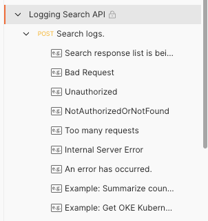

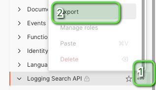

Next you duplicate the Collection and you rename it Audit API:

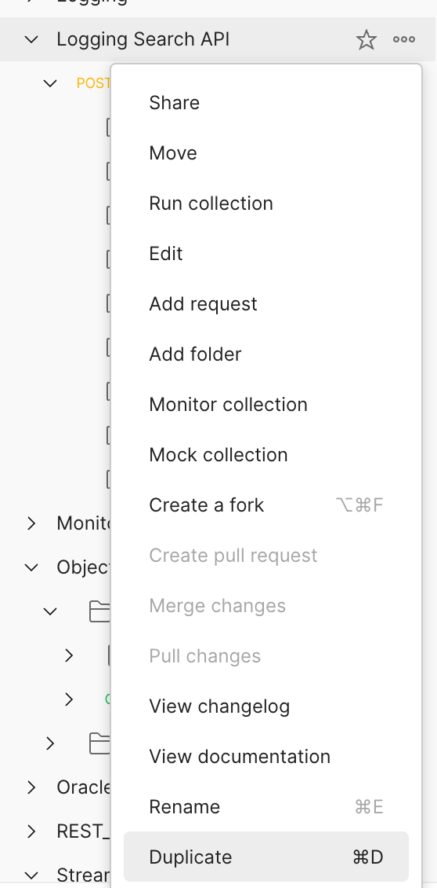

You leave the variables as the ones from Logging Search, and you go to OCI Logging → Audit:

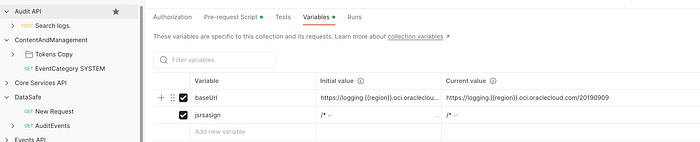

In your browser open Developer Tools(Menu →More Tools →Developer Tools):

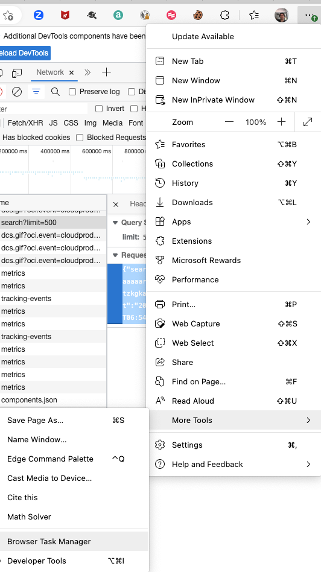

Clear the data, and do a search in OCI Audit:

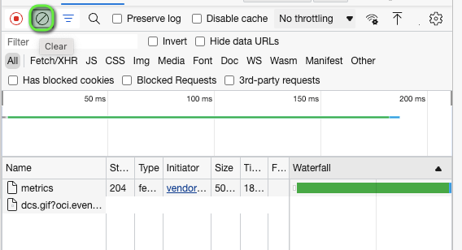

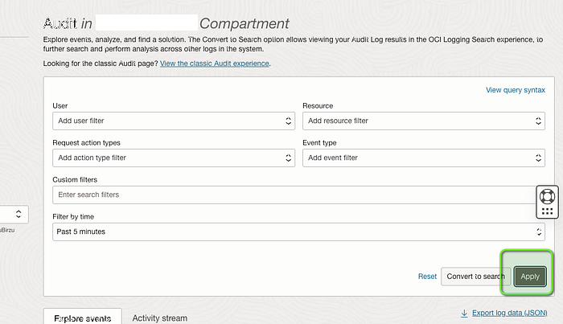

In the right, you will see the Search Payload:

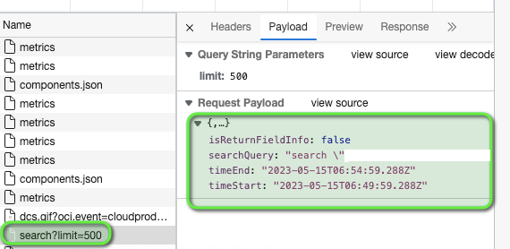

Right click on the Payload and copy the value:

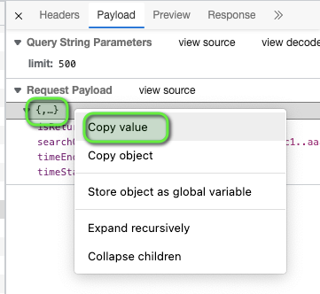

Paste it in the Body of Search logs POST Request in Postman and press Send(Change the TimeStart and TimeEnd values based on your requirement):

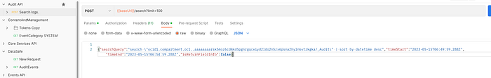

Congratulation! You have created your own OCI audit API call.

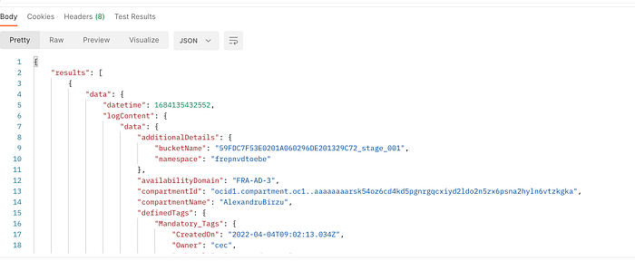
