# Send OCI Logs to Azure Sentinel using Oracle Functions

Introduction

This guide walks you through sending Oracle Cloud Infrastructure (OCI) service logs to Azure Sentinel using Azure’s HTTP Data Collector API and Oracle Functions.

The solution uses the OCI Service Connector Hub to route logs from OCI resources to a custom Oracle Function. This Function processes the logs and forwards them to Azure Sentinel for centralized monitoring and analysis.

[Service Log Reference](https://docs.oracle.com/en-us/iaas/Content/Logging/Reference/service_log_reference.htm) lists all the OCI logs that can be collected and sent to Sentinel via this method.

Solution Overview

1. OCI Audit Logs as the source

2. OCI Service Connector Hub as the intermediary

3. OCI Functions for processing and forwarding logs

4. Azure Sentinel as the destination

Press enter or click to view image in full size


We use OCI Audit logs as an example here as these are enabled by default in any OCI tenancy. These are OCI native logs in JSON format.

The Service Connector Hub (SCH) acts as the intermediary that collects the Audit logs (source) and routes them to the Functions (target).

Oracle Functions allow us to use coding mechanism to process these logs. In this case, we are using Python script to accept the logs from the SCH and process them to be forwarded to the Azure endpoint.

Azure Sentinel Data Collector API allows us to send log data to Azure Sentinel from any client that can call a REST API.

Note: The Azure Monitor HTTP Data Collector API has been deprecated and will 
not be functional as of 9/14/2026. 
It's been replaced by the Logs ingestion API. More [here](https://learn.microsoft.com/en-us/previous-versions/azure/azure-monitor/logs/data-collector-api?tabs=powershell).

Advantage of using this method:

1. Resilient - this mechanism uses standard features and methods and is unlikely to be affected by updates of the platform or underlying mechanism unless there is a major change.

2. Minimalist - no agents or additional configurations required or either OCI or Sentinel side.

3. Maintainable — Easily adaptable to changes in OCI or Sentinel configurations.

Possible risks:

1. If the log format changes then the Functions code might need to be tweaked. The log format is JSON format which is unlikely to change in near future.

2. Azure Sentinel HTTP Data Collector API used here has been deprecated but will continue to work until 9/14/2026 after which the API endpoint will have to be replaced by the newer Log Ingestion API — [doc](https://learn.microsoft.com/en-us/azure/azure-monitor/logs/data-collector-api?tabs=powershell)

3. This method works for any logs (custom logs, application logs etc.) but the same Functions code wont be applicable as the log type being used here is JSON. Users can use the code in general but need to modify it for the type of logs being sent.

Step 1: Prepare logs

OCI Audit Logs are enabled by default, so no additional setup is required. However, for other log types — such as VCN Flow Logs or Load Balancer Logs - you’ll need to enable them manually before integration. You can follow [this guide](https://docs.oracle.com/en-us/iaas/Content/data-integration/using/logging.htm) for detailed steps.

To view the Audit Logs, from the main OCI hamburger menu on top left, go to Observability and Management -> Logging -> Audit

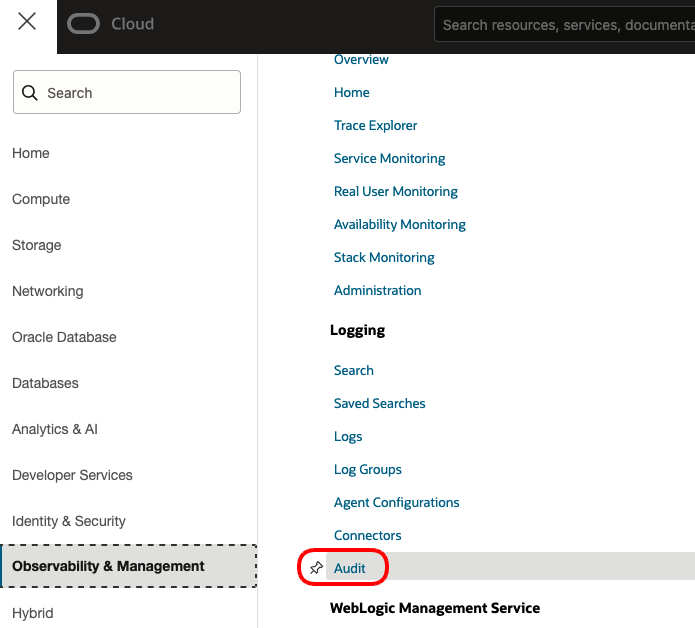

Press enter or click to view image in full size

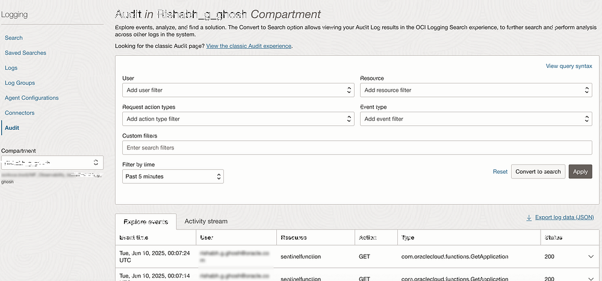

Step 2: Collect Sentinel Workspace Details

For the sake of this integration, we need the workspace ID and the primary key.

Login to your Azure portal and get these details as shown —

Press enter or click to view image in full size

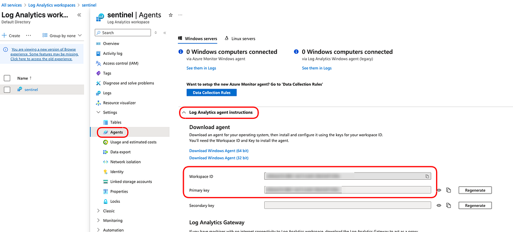

Step 3: Create Function in OCI

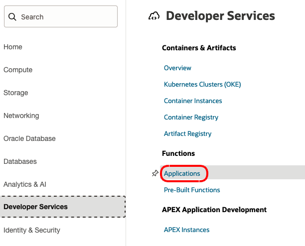

Click on Create application

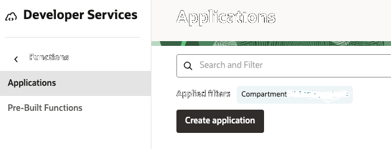

Press enter or click to view image in full size

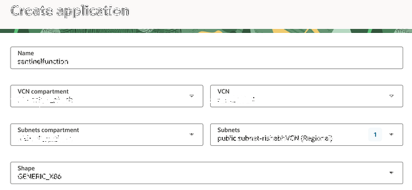

Note: The values shown are for demonstration purposes only. Be sure to replace them with your own configuration values based on your setup.

Click on Create after this.

Press enter or click to view image in full size

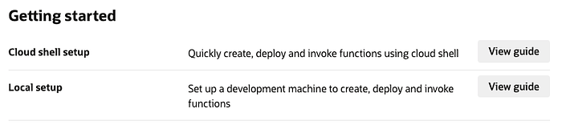

On the Details page, you’ll find guides for getting started with OCI Functions. Choose the setup that best fits your use case:

1. Cloud Shell Setup: Ideal for quick testing. Cloud Shell is a browser-based terminal accessible from the OCI Console. It’s easy to use but note that storage is automatically deleted after 6 months of inactivity. For short-term or demo use, it’s convenient.

2. Local Setup: Better suited for development, this runs on your own persistent compute instance, ensuring your configuration and files are retained long-term.

In this guide, we will use Cloud Shell for demonstration purposes.

Click View Guide and follow the steps provided for your configuration.

Important: From the Actions menu in Cloud Shell, switch the architecture to x86_64. This matches the default shape used when creating the Function (see Step 4 above).

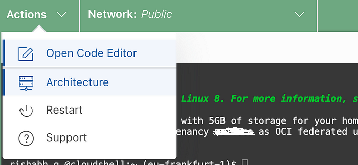

The following example is for illustration only — do not copy these values directly, as they will differ based on your setup. Use the ones from your Cloud Shell setup guide only.

Note: The registry name must be in lowercase. Using uppercase characters will result in an error during the build process.

```text
fn list context
fn use context eu-frankfurt-1
fn update context oracle.compartment-id ocid1.compartment.oc1..aaaaaXXXXXXXXXXXX
fn update context registry fra.ocir.io/frxfXXXXXXXzb/sentinelfunction
docker login -u 'frxXXXXXXzb/oracleidentitycloudservice/email@####' fra.ocir.io
##Enter the OCI Auth token as password
fn list apps
fn init --runtime python sentinelfunction
cd sentinelfunction/
ls
vi func.py  ##shared below
vi requirements.txt. ##shared below
fn -v deploy --app sentinelfunction
```

The Python code provided below is a working example intended solely for demonstration purposes. It is not production-ready. Please review and customize it based on your specific requirements. Use at your own discretion.

1. Replace func.py with this code

```text
import io
import os
import json
import requests
import datetime
import hashlib
import hmac
import base64
import logging

from fdk import response

# Fetch secure configuration from environment variables
_customer_id = os.getenv("AZURE_CUSTOMER_ID")
_shared_key = os.getenv("AZURE_SHARED_KEY")
_log_type = os.getenv("AZURE_LOG_TYPE", "OCI_Logging")

def build_signature(customer_id: str, shared_key: str, date: str, content_length: int,
                    method: str, content_type: str, resource: str) -> str:
    x_headers = f'x-ms-date:{date}'
    string_to_hash = f"{method}\n{content_length}\n{content_type}\n{x_headers}\n{resource}"
    bytes_to_hash = bytes(string_to_hash, encoding='utf-8')
    decoded_key = base64.b64decode(shared_key)
    encoded_hash = base64.b64encode(hmac.new(decoded_key, bytes_to_hash,
                                              digestmod=hashlib.sha256).digest()).decode()
    return f"SharedKey {customer_id}:{encoded_hash}"

def post_data(customer_id: str, shared_key: str, body: str, log_type: str, logger: logging.Logger):
    method = 'POST'
    content_type = 'application/json'
    resource = '/api/logs'
    rfc1123date = datetime.datetime.utcnow().strftime('%a, %d %b %Y %H:%M:%S GMT')
    content_length = len(body)

    signature = build_signature(customer_id, shared_key, rfc1123date, content_length,
                                method, content_type, resource)
    uri = f'https://{customer_id}.ods.opinsights.azure.com{resource}?api-version=2016-04-01'

    headers = {
        'Content-Type': content_type,
        'Authorization': signature,
        'Log-Type': log_type,
        'x-ms-date': rfc1123date
    }

    response_ = requests.post(uri, data=body, headers=headers)

    if 200 <= response_.status_code <= 299:
        logger.info('Upload accepted by Azure Sentinel.')
    else:
        logger.error(f"Upload failed. HTTP {response_.status_code}: {response_.text}")

# Entrypoint function
def handler(ctx, data: io.BytesIO = None):
    logger = logging.getLogger()
    try:
        if not _customer_id or not _shared_key:
            raise ValueError("Missing AZURE_CUSTOMER_ID or AZURE_SHARED_KEY environment variable.")

        log_body = data.getvalue().decode("utf-8")
        post_data(_customer_id, _shared_key, log_body, _log_type, logger)
        return response.Response(
            ctx,
            response_data=json.dumps({"status": "Success"}),
            headers={"Content-Type": "application/json"}
        )
    except Exception as err:
        logger.exception(f"Error in main process: {str(err)}")
        return response.Response(
            ctx,
            response_data=json.dumps({"status": "Failed", "error": str(err)}),
            headers={"Content-Type": "application/json"}
        )
```

Add requests to the requirements.txt file

```text
fdk>=0.1.93
requests
oci
```

Now, return to the Functions application in the OCI Console and navigate to the Configuration section. Click Manage Configuration to view or update your function’s environment variables.

Press enter or click to view image in full size

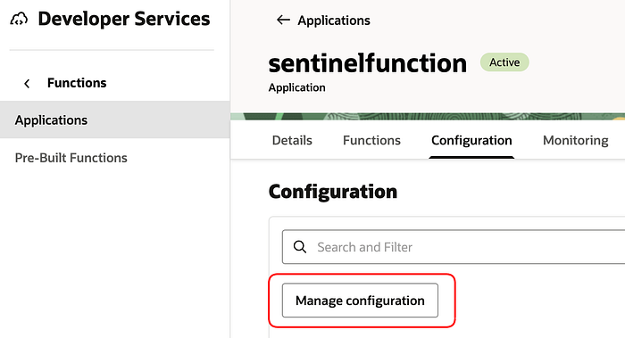

Click Add Configuration, then enter the values for workspace id and primary key variables used in the code.

Press enter or click to view image in full size

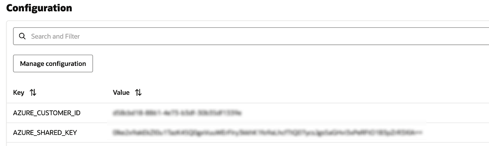

Deploy the function once all the changes have been made.

```text
fn -v deploy --app sentinelfunction
```

After running the fn deploy command, wait for the deployment process to complete. This takes 2–5 minutes.

Step 4: Create a Service Connector

Next, we will create a Service Connector to route logs from the Logging service (source) to the Oracle Function (target).

To begin, navigate to:

Main Menu ->Observability & Management ->Logging ->Connectors

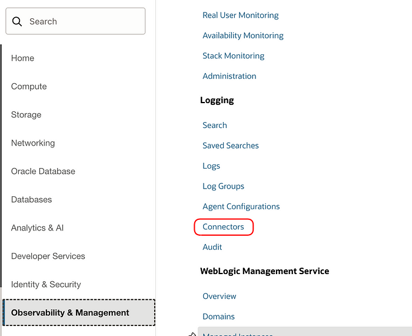

Click on Create Connector and enter details as shown below.

Press enter or click to view image in full size

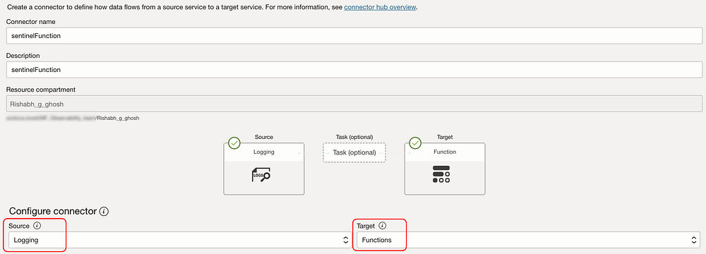

Select the logs you want to forward. You can include multiple log sources by clicking + Another Log, and choose logs from any compartment as needed.

The Filter Task lets you define criteria to include or exclude specific logs. For this demonstration, we’ll skip it, as filtering is typically used for more specific use cases.

Press enter or click to view image in full size

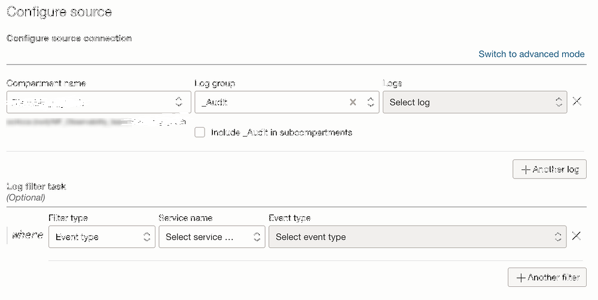

Next, configure the target by selecting the Oracle Function you deployed earlier.

Enabling the logs can help troubleshoot any deployment issues and also confirm whether logs are being successfully forwarded to the function.

Finally, click Create.

Press enter or click to view image in full size

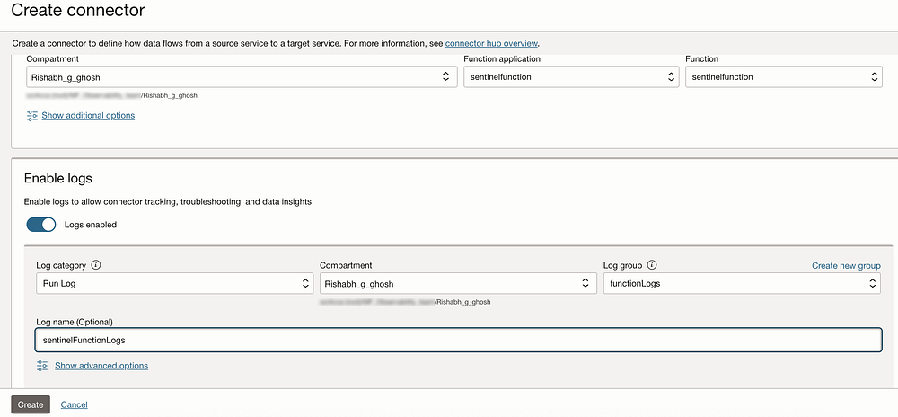

With this step, the logs are ready to be shipped from Logging service to the OCI Functions code via the Connector, and from there, to Azure Sentinel.

Step 5: Verify Logs in Azure Sentinel

Go to your Azure Sentinel Log workspace and search as follows to see the OCI logs. Note that the table created is OCI_Logging_CL as defined in the Functions code.

Press enter or click to view image in full size

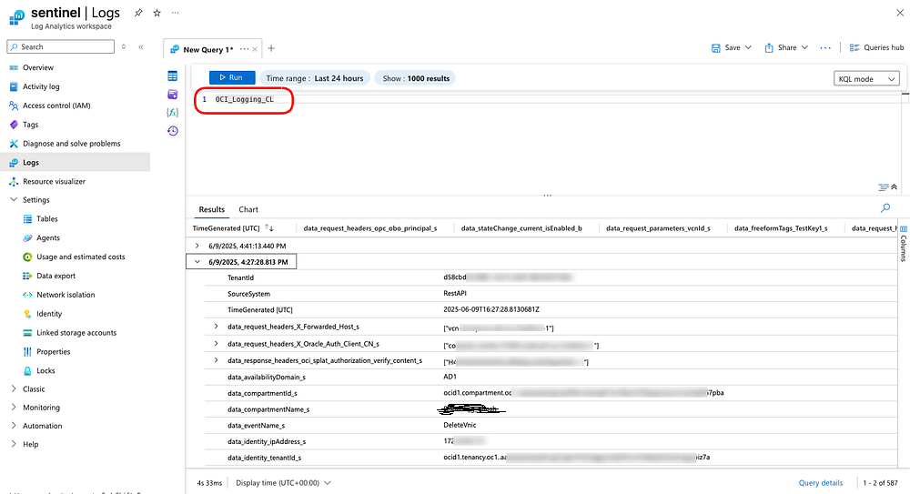

Note

1. If you don't see the logs in Step 5, then
- look at the Connector metrics and Logs and confirm that there are no Errors on Target, meaning that Connector is sending logs successfully to Functions.
- then look at the Functions metrics and logs to ensure that the there are no Functions errors.
If there are errors, troubleshoot them as per the error messages.

2. If you don’t want to hard code the workspace ID and the primary keys, it is possible to use OCI Vaults service. Although this will require slight changes to the code.
