# Stream OCI Logs to Splunk

Earlier I have created a blog post related to Streaming the logs to Splunk v8, and I will create another entry with the latest version of Splunk, as the console has some changes and my previous blog might not be accurate anymore. This tutorial is for Splunk managed on-prem or cloud, not Splunk Cloud.

After the installation of Splunk, next step is to install the Streaming App in Splunk. Click on Apps and Manage Apps:

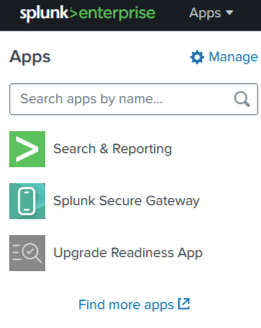

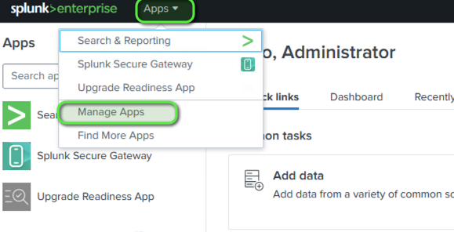

You will be redirected to the Apps page. In here click Browse more apps and search for OCI(In the older version, you had to manually install this app:

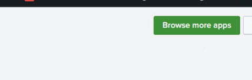

Press enter or click to view image in full size

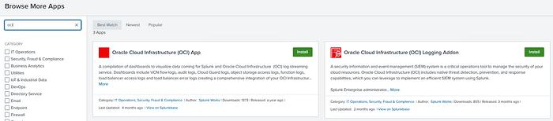

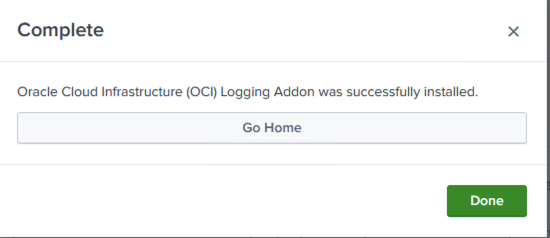

You can also install the OCI App:

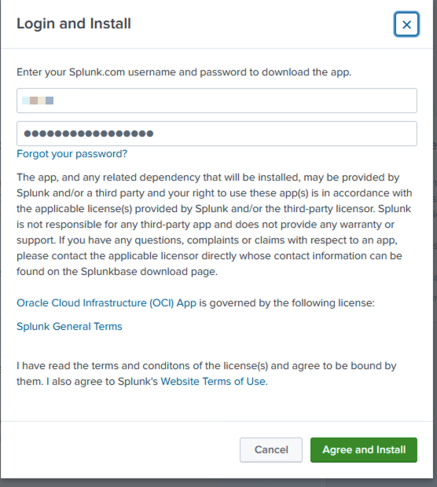

Next step is to configure the Ingestion App by going to Settings → Data Inputs:

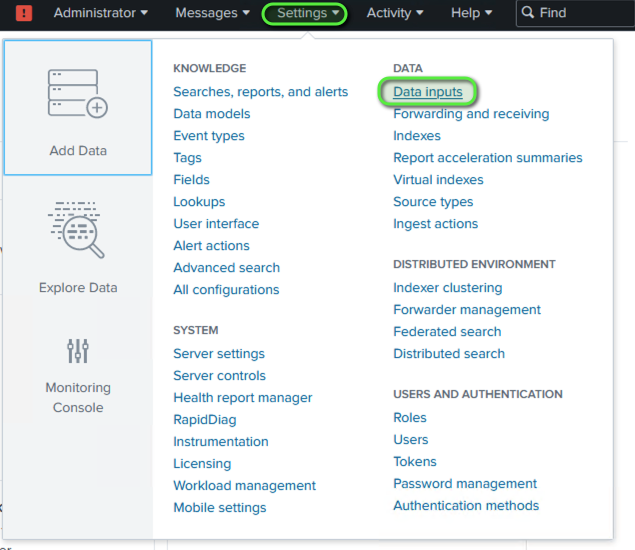

Click on OCI Logging and New:


Press enter or click to view image in full size

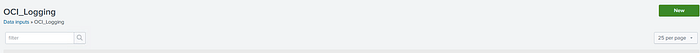

Now, you need to add the data to connect to OCI:

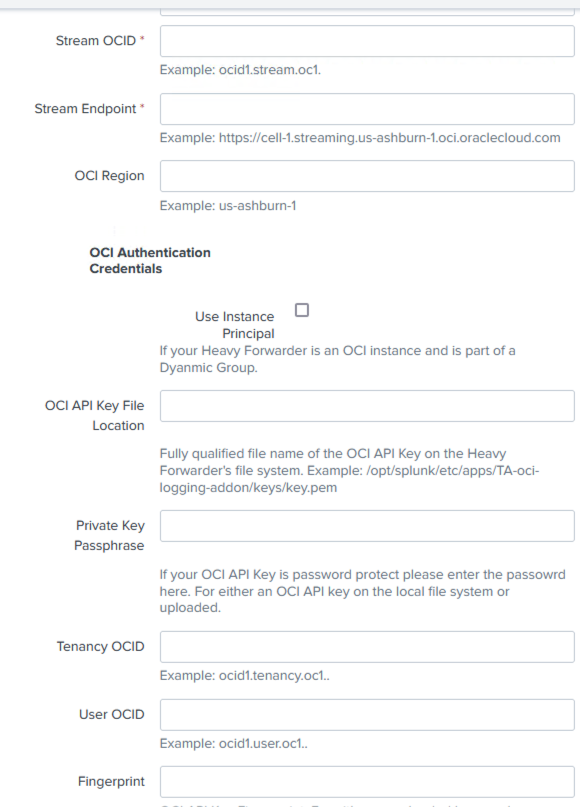

Create a text file and collect this data from OCI:

```text
StreamOCID: ex: ocid1.stream.oci1.eu-frankfurt-1.xxx
Stream Endpoint: ex: https://cell-1.streaming.xxxxx.oci.oraclecloud.com
OCI Region: ex: eu-frankfurt-1
OCI API Key File Location : /opt/splunk/key.pem
User OCID: ocid1.user.oc1..xxxxxxxxxxxxxxxx
Tenancy OCID: ocid1.tenancy.oc1..xxxxxxxx
Fingerprint: xxxx
```

Get Stream Data

1- Create a new stream for sending Logs to Splunk:

Press enter or click to view image in full size

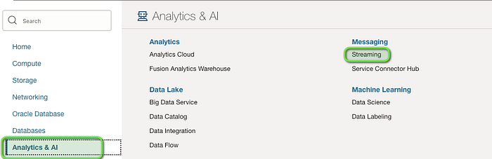

Press enter or click to view image in full size

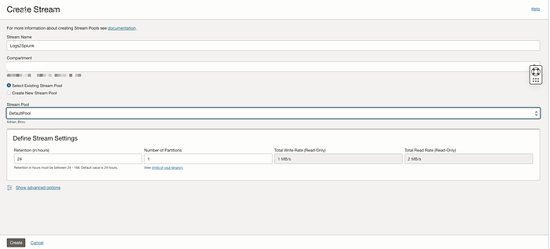

2- Click on the Stream and get the Stream OCID and Endpoint:

Press enter or click to view image in full size

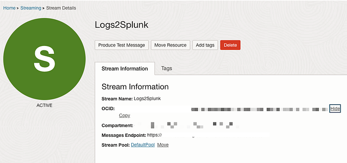

OCI Authentication Credentials

If you are not using Identity Domains:

Go to OCI → Security → Identity → Users

Create a new dedicated user (ex: SplunkUser) and click on the user.

Click on Resources and generate an API Key:

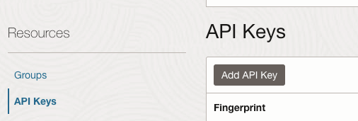

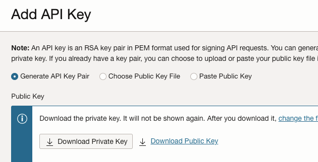

Collect the rest of the data from Configuration File:

Press enter or click to view image in full size

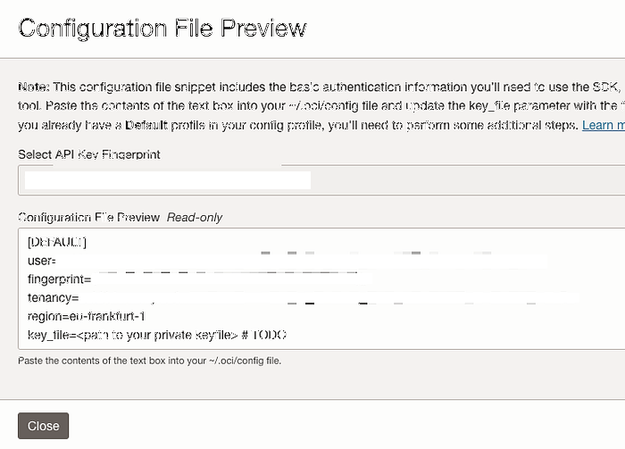

If you missed something, you can collect the data from the Capabilities menu when you click on the user:

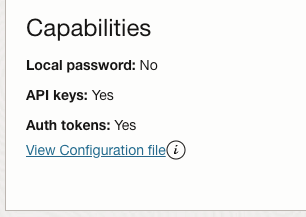

Upload the Private PEM key to splunk ( I am putting it in the Splunk Folder so I will not have any permission issues)

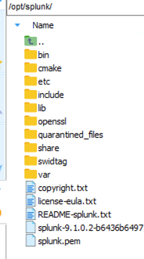

Make sure that the group where the splunk dedicated use is has this policy created:

```text
Allow group SplunkGroup to use stream-pull in compartment YourCompartment
```

Press Next. Now we need to send the logs to the stream.

Configure Logging Service for VCN Flow logs, or other logs in OCI. You can follow the guides from here:

[OCI Logging — Complete Hands-on Series — My Tech Retreat](https://mytechretreat.com/oci-logging-complete-hands-on-series/)

Go to Service Connector , press Create Service Connector and send the logs to Streaming Service:

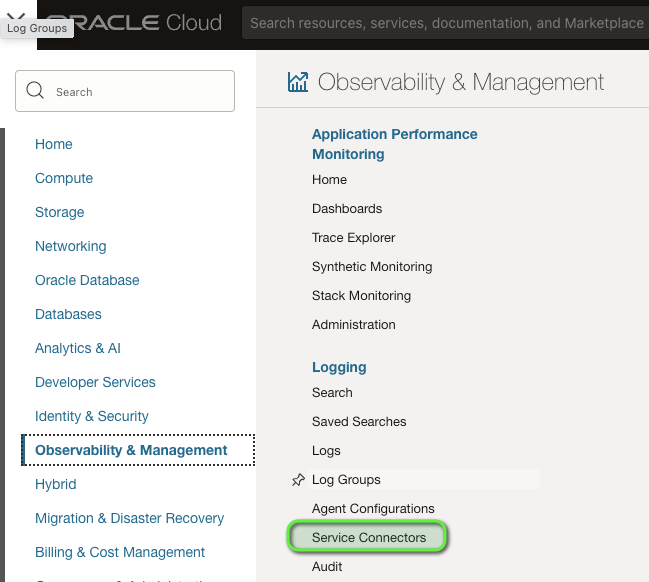

Give connector a name, and select the Source Logging and Target Streaming:

Press enter or click to view image in full size

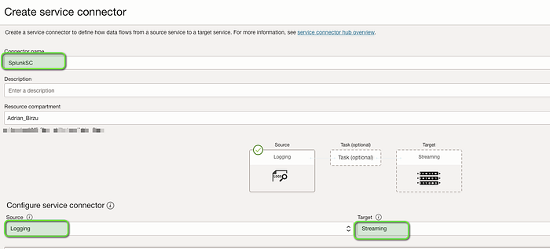

Configure the logs that you want to send:

Press enter or click to view image in full size

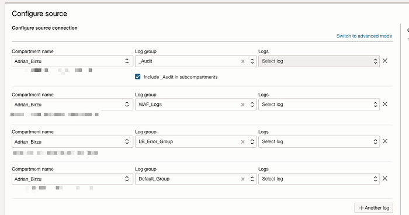

Select the target Stream, create the policy using the wizzard and press Create. You can also enable SCH logs for troubleshooting.

Press enter or click to view image in full size

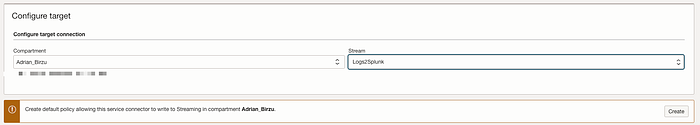

Go to Splunk and wait for the logs to flow. With basic configuration, the Index used is main.

Press enter or click to view image in full size

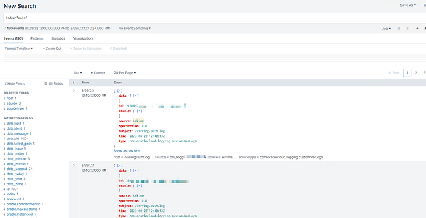

Congratulations! You have send your OCI logs to Splunk.

Now, if you want to use the OCI App for visualization, you need to create a new index oci_index and map the OCI Logging App to use it.

Edit the App, click more Settings and select oci_index.

Press enter or click to view image in full size

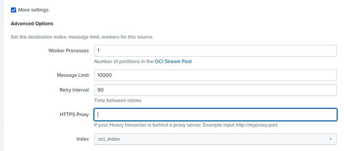

After this change, the OCI App will start to show data with the prebuild Dashboards:

Press enter or click to view image in full size

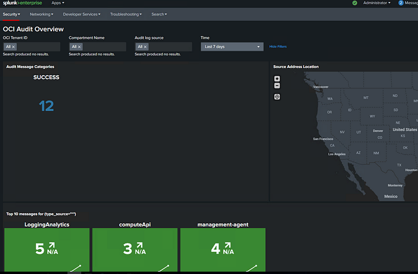
