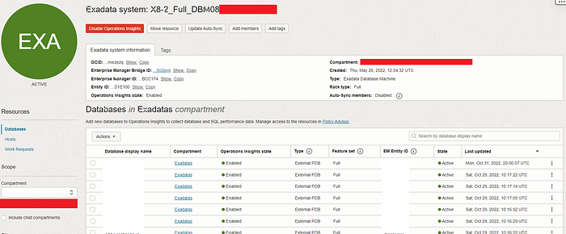

# Tag Exadata and Its Members in OCI Ops Insights with API

Oracle Cloud Infrastructure’s Ops Insight (OPSI) provides a historical archive and analytics enhanced by machine learning to monitor up to 25 months of resource usage and SQL performance trends for Exadata (read more [here](https://docs.oracle.com/en-us/iaas/operations-insights/doc/analyze-exadata-resources.html)).

An Exadata system in Ops Insights can have many databases and hosts that are part of a whole. Tags are a good way to manage OCI resources across your tenancy including those in Ops Insights (read more [here](https://docs.oracle.com/en-us/iaas/Content/Tagging/home.htm)). To help with this, I’ve written scripts using the OCI Python SDK and APIs to easily tag the Exadata system and all its members in Ops Insights.



Read more to see how to tag Exadata systems and members in OCI Ops Insights

There are two different scripts: One for updating tags for an Exadata discovered with an EM bridge (read more [here](https://docs.oracle.com/en-us/iaas/operations-insights/doc/get-started-operations-insights.html)), and one for updating tags for an Exadata CS discovered with a private endpoint (read more [here](https://docs.oracle.com/en-us/iaas/operations-insights/doc/get-started-operations-insights.html)).

Updating tags for an EM Managed Exadata System and Members in OPSI

Below is the code based on the OCI Python SDK. It can be executed as-is from the OCI Cloud Shell (read more [here](https://docs.oracle.com/en-us/iaas/Content/API/Concepts/cloudshellquickstart_python.htm)) or locally with an OCI CLI configuration file (read more [here](https://docs.oracle.com/en-us/iaas/Content/API/Concepts/sdkconfig.htm)):

```text
import oci
import json

# Specify variable values
# NOTE: Remember that defined_tags overwrites existing resource tags
# It should be a complete list of what tags should be there at the end
compartment_id="ocid1.compartment.oc1..XXX"
exadata_insight_id="ocid1.opsiexadatainsight.oc1.XXX"
defined_tags={
    'Tag Namespace': {
        'Tag Key A': 'Tag Value',
        'Tag Key B': 'Tag Value'
    }
}

# Displays set values and requires explicit approval before continuing
approval = input(f"""
All members of {exadata_insight_id} will be updated with the following tags:\n
defined_tags={defined_tags}\n
Do you wish to proceed (yes/no)?: """
)

if approval.lower() == "yes":
    # Initialize service client with default config file
    config = oci.config.from_file()
    opsi_client = oci.opsi.OperationsInsightsClient(config)

    # Updating tags on Exadata system in OPSI
    print(f'\nUpdating Exadata system with ID {exadata_insight_id}')
    update_exadata_insight_response = opsi_client.update_exadata_insight(
        exadata_insight_id=exadata_insight_id,
        update_exadata_insight_details=oci.opsi.models.UpdateEmManagedExternalExadataInsightDetails(
            entity_source="EM_MANAGED_EXTERNAL_EXADATA",
            #freeform_tags={'EXAMPLE_KEY_jTnoW': 'EXAMPLE_VALUE_Iyfqty8HBcYA1JNce7JG'},
            defined_tags=defined_tags,
            is_auto_sync_enabled=True),
        #if_match="EXAMPLE-ifMatch-Value",
        #opc_request_id="YPV7UDSDR4FNPXK6PLYZ<unique_ID>"
        )

    # Collecting database member IDs of Exadata system in OPSI
    list_database_insights_response = opsi_client.list_database_insights(
        compartment_id=compartment_id,
        #enterprise_manager_bridge_id="ocid1.test.oc1..<unique_ID>EXAMPLE-enterpriseManagerBridgeId-Value",
        #id=["EXAMPLE--Value"],
        #status=["DISABLED"],
        #lifecycle_state=["ACTIVE"],
        #database_type=["ATP-S"],
        #database_id=["EXAMPLE--Value"],
        #fields=["databaseType"],
        limit=2000,
        #page="EXAMPLE-page-Value",
        sort_order="ASC",
        sort_by="databaseType",
        exadata_insight_id=exadata_insight_id,
        compartment_id_in_subtree=True,
        #opsi_private_endpoint_id="ocid1.test.oc1..<unique_ID>EXAMPLE-opsiPrivateEndpointId-Value",
        #opc_request_id="IV0KH3F1R7WU1LVHACWT<unique_ID>"
        )
    database_insights_dict = json.loads(str(list_database_insights_response.data))["items"]

    # Updating database member tags in OPSI
    print("\nUpdating database members:")
    for db in database_insights_dict:
        print(f'Updating {db["database_display_name"]} with DB Insights ID {db["id"]}')
        update_database_insight_response = opsi_client.update_database_insight(
            database_insight_id=db["id"],
            update_database_insight_details=oci.opsi.models.UpdateEmManagedExternalDatabaseInsightDetails(
                entity_source="EM_MANAGED_EXTERNAL_DATABASE",
                #freeform_tags={'EXAMPLE_KEY_jTnoW': 'EXAMPLE_VALUE_Iyfqty8HBcYA1JNce7JG'},
                defined_tags=defined_tags,
                #if_match="EXAMPLE-ifMatch-Value",
                #opc_request_id="K8PG3IDYIA682CFC2VK6<unique_ID>"
                )
            )

    # Collecting host member IDs of Exadata system in OPSI
    list_host_insights_response = opsi_client.list_host_insights(
        compartment_id=compartment_id,
        #id=["EXAMPLE--Value"],
        #status=["ENABLED"],
        #lifecycle_state=["ACTIVE"],
        #host_type=["EXAMPLE--Value"],
        #platform_type=["LINUX"],
        limit=2000,
        #page="EXAMPLE-page-Value",
        sort_order="ASC",
        sort_by="hostType",
        #enterprise_manager_bridge_id="ocid1.test.oc1..<unique_ID>EXAMPLE-enterpriseManagerBridgeId-Value",
        exadata_insight_id=exadata_insight_id,
        compartment_id_in_subtree=True,
        #opc_request_id="SVAEYTJGPMKDXRB5NEC9<unique_ID>"
        )
    host_insights_dict = json.loads(str(list_host_insights_response.data))["items"]

    # Updating host member tags in OPSI (Choose code block for EM or PE managed hosts in OPSI)
    print("\nUpdating host members:")

    # Updating EM-managed host member tags in OPSI
    for host in host_insights_dict:
        print(f'Updating {host["host_display_name"]} with Host Insights ID {host["id"]}')
        update_host_insight_response = opsi_client.update_host_insight(
            host_insight_id=host["id"],
            update_host_insight_details=oci.opsi.models.UpdateEmManagedExternalHostInsightDetails(
                entity_source="EM_MANAGED_EXTERNAL_HOST",
                #freeform_tags={'EXAMPLE_KEY_jTnoW': 'EXAMPLE_VALUE_Iyfqty8HBcYA1JNce7JG'},
                defined_tags=defined_tags,
                #if_match="EXAMPLE-ifMatch-Value",
                #opc_request_id="RPGDXZROMQV2B3HHLGGQ<unique_ID>"
                )
            )

    # This message means the script has finished updating tags for Exadata system and members
    print(f"\nTag update complete for {exadata_insight_id}")

else:
    # This message means the script did not change anything because of incorrect input for approval variable
    print("\nTag update aborted due to lack of approval")
```

The code does the following:

1. Sets values for the compartment and Exadata Insights OCIDs as well as the desired tags as compartment_id, exadata_insight_id, and defined_tags. These variables are required for the script to work

2. The code will print the set Exadata Insights OCID as well as the set tag keys and values. Then it will ask if it should go ahead with tagging the Exadata system and all its members as printed. Only the input “yes” will execute the tag update

3. The code will collect database and host member IDs associated with the Exadata Insights OCID in OPSI. Then it will loop through collected members’ IDs to set the tags as specified in defined_tags

NOTE: As written, the code will overwrite any existing tags on the OPSI resources. Make sure defined_tags contains ALL desired tags — both those currently existing and those currently missing

Updating tags for a PE Managed Exadata System and Members in OPSI

Below is the code based on the OCI Python SDK as well as code performing HTTP requests with API authentication to update PE-managed host members in OPSI. This script can also be executed from the OCI Cloud Shell (read more [here](https://docs.oracle.com/en-us/iaas/Content/API/Concepts/cloudshellquickstart_python.htm)) or locally, but requires an OCI CLI configuration file in both cases to update the host members (read more [here](https://docs.oracle.com/en-us/iaas/Content/API/Concepts/sdkconfig.htm)):

```text
import oci
import json
import requests

# Specify variable values
# NOTE: Remember that defined_tags overwrites existing resource tags
# It should be a complete list of what tags should be there at the end
region="eu-frankfurt-1"
compartment_id="ocid1.compartment.oc1..XXX"
exadata_insight_id="ocid1.opsiexadatainsight.oc1.XXX"
defined_tags={
    'Tag Namespace': {
        'Tag Key A': 'Tag Value',
        'Tag Key B': 'Tag Value'
    }
}

# Displays set values and requires explicit approval before continuing
approval = input(f"""
All members of {exadata_insight_id} in {region} will be updated with the following tags:\n
defined_tags={defined_tags}\n
Do you wish to proceed (yes/no)?: """
)

if approval.lower() == "yes":
    # Initialize service client with default config file
    # NOTE: It is required to specify a file path for a config file - also in the OCI Cloud Shell
    # This is because host updates for PE-managed Exadatas currently use HTTP requests with API authentication rather than the Python SDK
    config = oci.config.from_file("~/.oci/config")
    opsi_client = oci.opsi.OperationsInsightsClient(config)

    # Updating tags on Exadata system in OPSI
    print(f'\nUpdating Exadata system with ID {exadata_insight_id}')
    update_exadata_insight_response = opsi_client.update_exadata_insight(
        exadata_insight_id=exadata_insight_id,
        update_exadata_insight_details=oci.opsi.models.UpdatePeComanagedExadataInsightDetails(
            entity_source="PE_COMANAGED_EXADATA",
            #freeform_tags={'EXAMPLE_KEY_jTnoW': 'EXAMPLE_VALUE_Iyfqty8HBcYA1JNce7JG'},
            defined_tags=defined_tags,
            is_auto_sync_enabled=True),
            #if_match="EXAMPLE-ifMatch-Value",
            #opc_request_id="YPV7UDSDR4FNPXK6PLYZ<unique_ID>"
        )

    # Collecting database member IDs of Exadata system in OPSI
    list_database_insights_response = opsi_client.list_database_insights(
        compartment_id=compartment_id,
        #enterprise_manager_bridge_id="ocid1.test.oc1..<unique_ID>EXAMPLE-enterpriseManagerBridgeId-Value",
        #id=["EXAMPLE--Value"],
        #status=["DISABLED"],
        #lifecycle_state=["ACTIVE"],
        #database_type=["ATP-S"],
        #database_id=["EXAMPLE--Value"],
        #fields=["databaseType"],
        limit=2000,
        #page="EXAMPLE-page-Value",
        sort_order="ASC",
        sort_by="databaseType",
        exadata_insight_id=exadata_insight_id,
        compartment_id_in_subtree=True,
        #opsi_private_endpoint_id="ocid1.test.oc1..<unique_ID>EXAMPLE-opsiPrivateEndpointId-Value",
        #opc_request_id="IV0KH3F1R7WU1LVHACWT<unique_ID>"
        )
    database_insights_dict = json.loads(str(list_database_insights_response.data))["items"]

    # Updating database member tags in OPSI
    print("\nUpdating database members:")
    for db in database_insights_dict:
        print(f'Updating {db["database_display_name"]} with DB Insights ID {db["id"]}')
        update_database_insight_response = opsi_client.update_database_insight(
            database_insight_id=db["id"],
            update_database_insight_details=oci.opsi.models.UpdatePeComanagedDatabaseInsightDetails(
                entity_source="PE_COMANAGED_DATABASE",
                #freeform_tags={'EXAMPLE_KEY_jTnoW': 'EXAMPLE_VALUE_Iyfqty8HBcYA1JNce7JG'},
                defined_tags=defined_tags,
                #if_match="EXAMPLE-ifMatch-Value",
                #opc_request_id="K8PG3IDYIA682CFC2VK6<unique_ID>"
                )
            )

    # Collecting host member IDs of Exadata system in OPSI
    list_host_insights_response = opsi_client.list_host_insights(
        compartment_id=compartment_id,
        #id=["EXAMPLE--Value"],
        #status=["ENABLED"],
        #lifecycle_state=["ACTIVE"],
        #host_type=["EXAMPLE--Value"],
        #platform_type=["LINUX"],
        limit=2000,
        #page="EXAMPLE-page-Value",
        sort_order="ASC",
        sort_by="hostType",
        #enterprise_manager_bridge_id="ocid1.test.oc1..<unique_ID>EXAMPLE-enterpriseManagerBridgeId-Value",
        exadata_insight_id=exadata_insight_id,
        compartment_id_in_subtree=True,
        #opc_request_id="SVAEYTJGPMKDXRB5NEC9<unique_ID>"
        )
    host_insights_dict = json.loads(str(list_host_insights_response.data))["items"]

    # Updating host member tags in OPSI (Choose code block for EM or PE managed hosts in OPSI)
    print("\nUpdating host members:")

    # Updating PE-managed host member tags in OPSI
    base_url = f"https://operationsinsights.{region}.oci.oraclecloud.com/20200630/hostInsights"
    headers = {"Content-Type": "application/json"}
    data = {"entitySource": "PE_COMANAGED_HOST", "definedTags": defined_tags}
    auth = oci.signer.Signer(
        tenancy=config['tenancy'],
        user=config['user'],
        fingerprint=config['fingerprint'],
        private_key_file_location=config['key_file'],
        #pass_phrase=config['pass_phrase']
    )
    
    for host in host_insights_dict:
        print(f'Updating {host["host_display_name"]} with Host Insights ID {host["id"]}')
        host_url = f"{base_url}/{host['id']}"
        update = requests.put(host_url, headers=headers, json=data, auth=auth)

    # This message means the script has finished updating tags for Exadata system and members
    print(f"\nTag update complete for {exadata_insight_id}")

else:
    # This message means the script did not change anything because of incorrect input for approval variable
    print("\nTag update aborted due to lack of approval")
```

The code does the following:

1. Sets values for the region (e.g. “eu-frankfurt-1” which is the default value), compartment OCID, Exadata Insights OCID, and desired tags as region, compartment_id, exadata_insight_id, and defined_tags. These variables are required for the script to work

2. The code will print the set Exadata Insights OCID and region as well as the set tag keys and values. Then it will ask if it should go ahead with tagging the Exadata system and all its members as printed. Only the input “yes” will execute the tag update

3. The code will collect database and host member IDs associated with the Exadata Insights OCID in OPSI. Then it will loop through collected members’ IDs to set the tags as specified in defined_tags

NOTE: As written, the code will overwrite any existing tags on the OPSI resources. Make sure defined_tags contains ALL desired tags — both those currently existing and those currently missing

Conclusion

All tags are now set for Exadata and its members in OPSI. This is easier and quicker than manually going through each OPSI resource to achieve the same.

See the following links for more:

1. [About Oracle Cloud Infrastructure Ops Insights](https://docs.oracle.com/en-us/iaas/operations-insights/doc/operations-insights.html)

2. [Analyze Exadata Resources](https://docs.oracle.com/en-us/iaas/operations-insights/doc/analyze-exadata-resources.html)

3. [Ops Insights API](https://docs.oracle.com/en-us/iaas/api/)

4. [OCI SDK and CLI Configuration File](https://docs.oracle.com/en-us/iaas/Content/API/Concepts/sdkconfig.htm)
