# Use Auditd logs in OCI with Logging Service

Logs are important because if they are properly configured , they can provide information that usually can be missed. For Windows Instances, beside the normal Events, [Sysmon](https://docs.microsoft.com/en-us/sysinternals/downloads/sysmon) is my preferred solution to enrich the Windows logs, but this will be part of a different blog entry.

One of the blogs that I would recommend to read before starting configuring auditd and OCI logging is this as it offers :

1. Quick intro to the Linux Audit System

2. Tips when writing audit rules

3. Designing a configuration for security monitoring

4. What to record with auditd

5. Tips on managing noise

```text
[Linux auditd for Threat Hunting [Part 1] | by IzyKnows | Medium](https://izyknows.medium.com/linux-auditd-for-threat-detection-d06c8b941505)
```

Related to the Auditd Events that you can monitor you can check this list:

[Audit Event Fields · bfuzzy/auditd-attack Wiki · GitHub](https://github.com/bfuzzy/auditd-attack/wiki/Audit-Event-Fields)

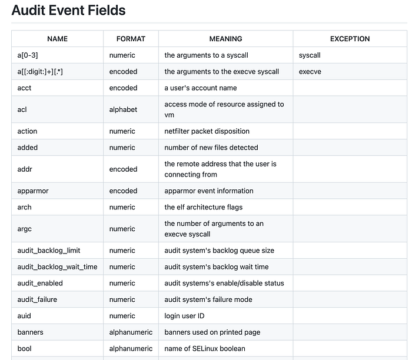

and the redhat OS Audit Record Types:

[B.2. Audit Record Types Red Hat Enterprise Linux 6 | Red Hat Customer Portal](https://access.redhat.com/documentation/en-us/red_hat_enterprise_linux/6/html/security_guide/sec-audit_record_types)

[Chapter 7. System Auditing Red Hat Enterprise Linux 7 | Red Hat Customer Portal](https://access.redhat.com/documentation/en-us/red_hat_enterprise_linux/7/html/security_guide/chap-system_auditing)

[Chapter 14. Auditing the system Red Hat Enterprise Linux 8 | Red Hat Customer Portal](https://access.redhat.com/documentation/en-us/red_hat_enterprise_linux/8/html/security_hardening/auditing-the-system_security-hardening)

[Chapter 12. Auditing the system Red Hat Enterprise Linux 9 | Red Hat Customer Portal](https://access.redhat.com/documentation/en-us/red_hat_enterprise_linux/9/html/security_hardening/auditing-the-system_security-hardening)

As Oracle Enterprise Linux has the same kernel as Redhat the documentation from above applies to OEL too.

If you already has an OEL instance, and Auditd is not present, you can use this steps to intall it:

[Audit Oracle Linux with Auditd](https://docs.oracle.com/en/learn/ol-auditd/index.html)

Now I will go to the Step by Step part. I have provisioned an OEL 8 instance in OCI , enabled custom logs, and I have also created an Agent configuration to read the auditd logs.

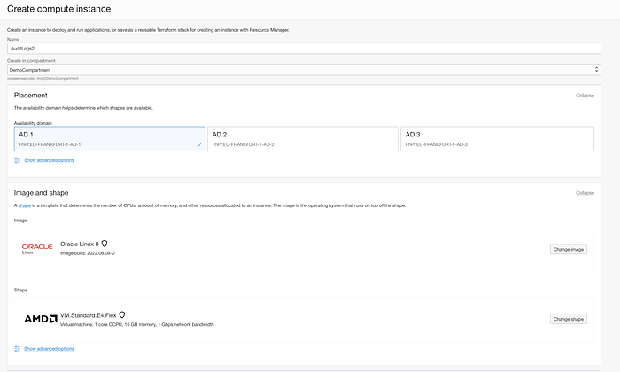

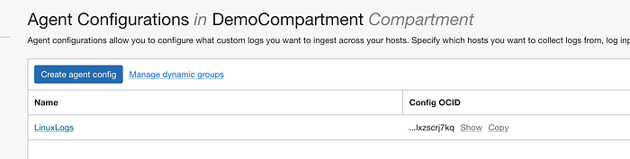

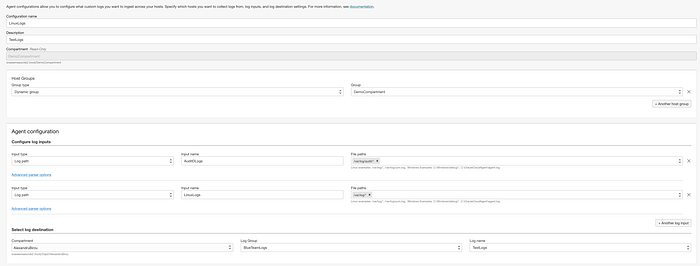

Select Advanced Parced Options:

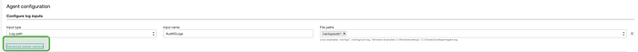

Change from NONE to Auditd and Save:

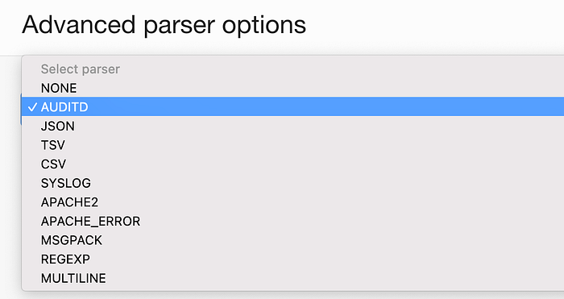

Now, If OCI Custom Logs are properly configured and the Dynamic Groups are able to access the instances of interest, you should be able to see the collected logs from the instance.

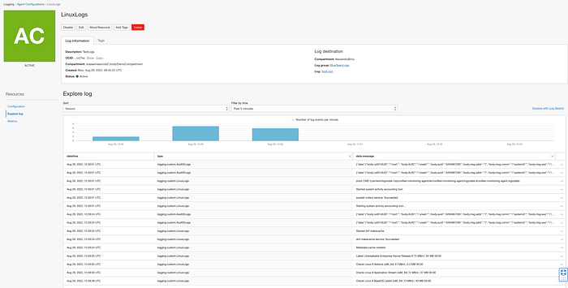

If you expand a Custom log, you will be able to see that OCI Parser is able to creating multiple variables in Logging. From here, you can start creating different searches that you can use when needed or by the OCI Cloud Guard Insight Log Rules.

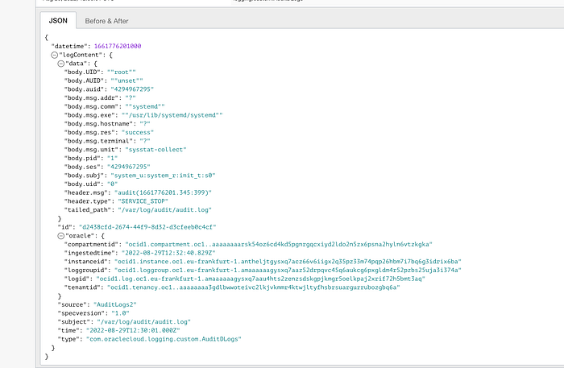

Now, with the auditd basic configuration, you will see all the pre-configured logs from the OS as defined by the Redhat documentation.

If you can’t see the logs from the OS in OCI logging, that means that the Auditd service is not installed/started. You can check this by running:

```text
sudo systemctl status auditd
```

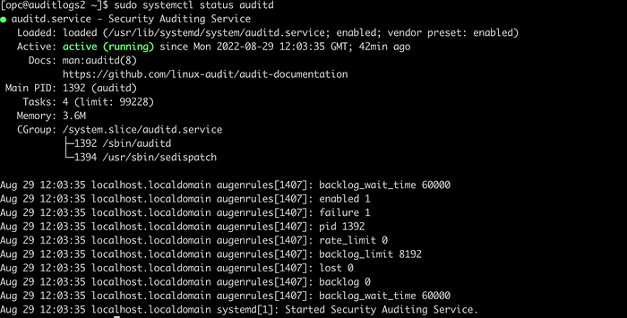

Of the service runs, check the OCI Logging Service permissions.

For collecting more informations from the OS with the auditd service, we can configure custom rules.

On a newly created instance running OEL 8 auditd is enabled by default, with no advanced rule enabled. To check the audit rule, run :

```text
sudo cat /etc/audit/audit.rules
sudo cat /etc/audit/rules.d/audit.rules
```

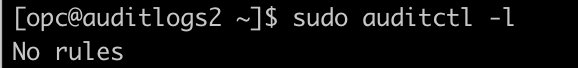

```text
sudo auditctl -l
```

To test a basic monitoring rule, you can run this command that will look for ssh config file access:

```text
sudo auditctl -w /etc/ssh/sshd_config -p rwxa -k sshd_config
```

After running the command, you will see that the rule is processed and used:

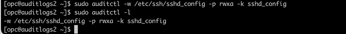

```text
Rules created by auditctl don’t add to the audit.rules file. Therefore, these changes are transient and don’t survive a system reboot.
```

```text
Make the rule permanent by adding it to a custom ruleset file in /etc/audit/rules.d/my.rules. The format of the added rule matches the syntax of the auditctl command without using auditctl. Rules should be written per line and combined to optimize performance.
```

Another test rules that we can add are:

```text
sudo auditctl -w /etc/passwd -p wra -k passwd
sudo auditctl -a exit,always -F arch=b64 -S clock_settime -k changetime
```

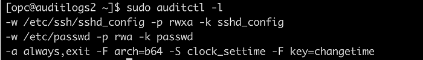

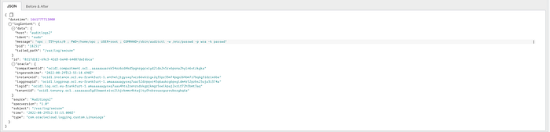

If you look at all the logs, you will see that are too many so it’s hard to do a manual lookout.

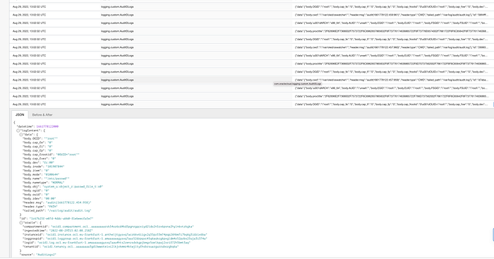

Because of that, I use an exclude-records.rule. Please check the rules and remove what you need to keep in the monitoring. As the exclusion wasn’t working properly, it was removed from the next steps.

[https://github.com/izysec/linux-audit/issues/1](https://github.com/izysec/linux-audit/issues/1)

[linux-audit/exclude-records.rules at main · izysec/linux-audit · GitHub](https://github.com/izysec/linux-audit/blob/main/exclude-records.rules)

```text
-
```

For Threat Hunting, using MITRE ATT&CK Framework, you can use some pre-defined detection rules from here or you can build them if you want to have more granularity:

auditd-attack/auditd-attack at master · bfuzzy1/auditd-attack

A Linux Auditd rule set mapped to MITRE's Attack Framework Please ensure you test these rules prior to pushing them…

github.com

Copy the rules from the above repository, and check if they are enabled properly.

[auditd-attack.rules](https://github.com/bfuzzy/auditd-attack/blob/master/auditd-attack.rules)

After you create the file and add the rules, you can see that the rules are not enabled.

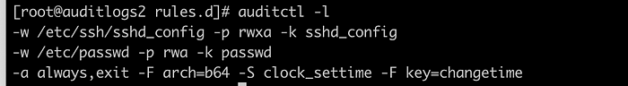

To do this, you can run, and ignore the errors for demo purposes:

```text
augenrules — load
```

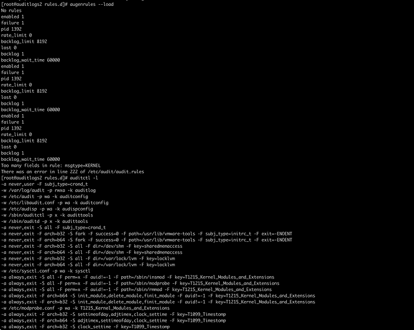

Now you can see that the rules from the rule file we have created are loaded and we can check if we have the Key Variable parsed ok:

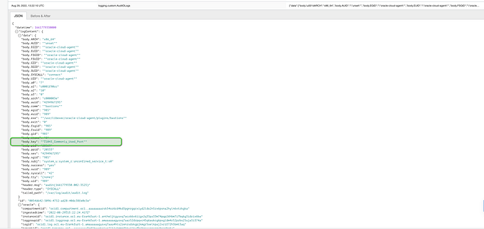

As you can see, we have the the data.body.key field populated, so in my next blog I will be able to use it in my searches.

Congratulations! You are able to collect Auditd logs in OCI and parse them in a correct way.
