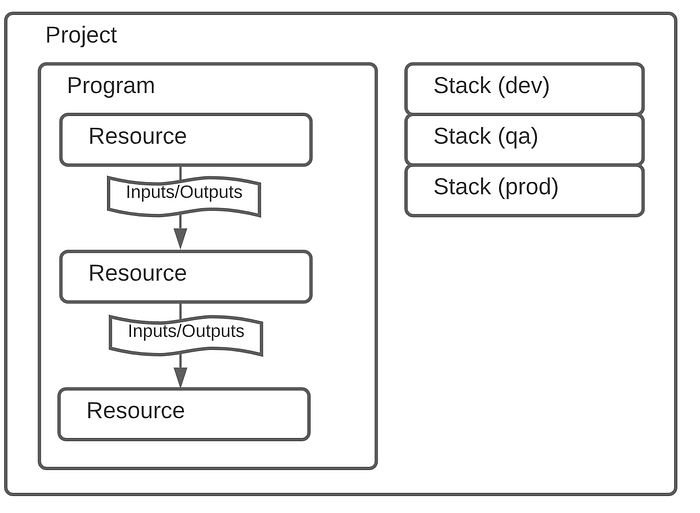
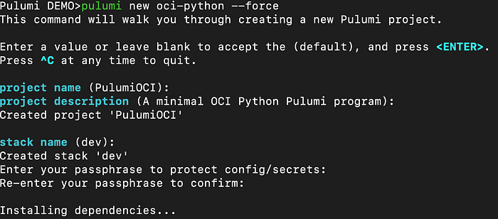
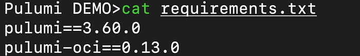
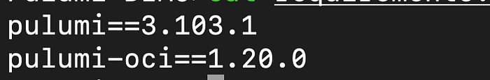
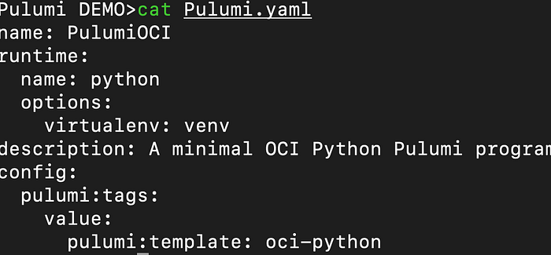
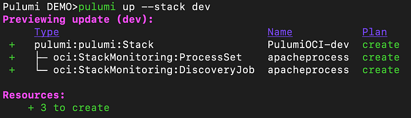

# Using Pulumi to create OCI resource

Pulumi is an opensource Infrastructure as a code . I have used mostly Terraform for automation in OCI . But recent license change of Terraform made me to look at Pulumi .

The difference between Pulumi and Terraform is already well written [here](https://www.pulumi.com/docs/concepts/vs/terraform/).

Pulumi supports different programming language like TypeScript, JavaScript, Python, Go, .NET, Java, and markup languages like YAML.You don’t have to learn new format like HCL in Terraform if you are already a programmer.

You can install pulumi in Mac OS using homebrew and the latest version as of this writing is 3.103.1.

brew install pulumi/tap/pulumi

I have chosen Python as my preferred language to write the code .

In Pulumi Project is the top level and we will write our code inside the project .Stacks are used to differentiate environments like dev/QA /prod etc..



Lets use [pulumi cli](https://www.pulumi.com/docs/cli/) to create the project.

```text
mkdir PulumiOCI && cd PulumiOCI
pulumi login — local (double hyphen before local)
pulumi new oci-python — force(double hyphen before force)
```



You might get an error like this below if you are using python 3.12

ERROR: Could not build wheels for grpcio, which is required to install pyproject.toml-based projects.

If you list out all the files in the directory you will have
Pulumi.yaml
venv
Pulumi.<stackname>.yaml
requirements.txt
__main__.py



Update this file to use the latest version.



Run the command venv/bin/python -m pip install -r requirements.txt to fix the grpcio version and to use latest pulumi-oci version in the virtual env.

Pulumi.yaml will have info about the project and the runtime.



Update the __main__.py with the resource code.

I have written a [blog](https://karthicin.medium.com/process-monitoring-using-stack-monitoring-99908cec31a8) about enabling process monitoring in Stack Monitoring. I will use that as a reference and create few StackMonitoring resource in OCI using Pulumi.

Before we start we need to set some [config](https://www.pulumi.com/registry/packages/oci/installation-configuration/) for OCI API authentication.

```text
export PULUMI_CONFIG_PASSPHRASE=<passphrase>
pulumi config set oci:tenancyOcid "ocid1.tenancy.oc1..<unique_ID>" --secret
pulumi config set oci:userOcid "ocid1.user.oc1..<unique_ID>" --secret
pulumi config set oci:fingerprint "<key_fingerprint>" --secret
pulumi config set oci:region "us-ashburn-1"
pulumi config set oci:privateKeyPath <filepath> --secret
```

We will set few more configuration value which is needed for the resource creation.

We will create two resources named ProcessSet and DiscoveryJob in StackMonitoring

```text
pulumi config set compartment_id <compartment_ocid>
pulumi config set host_id <stackmonitoring hostresource_ocid> --secret
pulumi config set processset_display_name "apacheprocess"
```

```text
import pulumi
import pulumi_oci as oci

config = pulumi.Config()

#To create process set
process_set = oci.stackmonitoring.ProcessSet(resource_name=config.get("processset_display_name"),
    compartment_id=config.get("compartment_id"),
    display_name=config.get("processset_display_name"),
    specification=oci.stackmonitoring.ProcessSetSpecificationArgs(
        items=[oci.stackmonitoring.ProcessSetSpecificationItemArgs(
            #label=var["process_set_specification_items_label"],
            process_command="httpd",
            #process_line_regex_pattern=".*",
            process_user="apache"
        )],
    ))

#To fetch agent id monitoring the host
monitored_host_resource = oci.stackmonitoring.get_monitored_resource(monitored_resource_id=config.get("host_id"))
mgmt_agent_id = monitored_host_resource.management_agent_id

#Create discovery job for custom resource
discovery_job = oci.stackmonitoring.DiscoveryJob(resource_name=config.get("processset_display_name"),
    compartment_id=config.get("compartment_id"),
    discovery_details=oci.stackmonitoring.DiscoveryJobDiscoveryDetailsArgs(
        agent_id=mgmt_agent_id,
        properties=oci.stackmonitoring.DiscoveryJobDiscoveryDetailsPropertiesArgs(
            properties_map={
                "host_ocid": config.get("host_id"),
                "process_set_id" : process_set.id
            },
        ),
        resource_name=process_set.display_name,
        resource_type="CUSTOM_RESOURCE",
        license="ENTERPRISE_EDITION"
    ),
    discovery_client="APPMGMT",
    discovery_type="ADD")
```



Pulumi also has an experimental [AI feature](https://www.pulumi.com/ai) to help you with writing the code and explanation.

Recently a VScode extension has been released as well which will help in writing the code faster with autocomplete and other features.
