# Why and how to run Wazuh on OCI

Wazuh is an open-source security detection, visibility, and compliance platform designed to help organizations monitor and analyze security-related events in real time. It offers a range of capabilities that can help organizations detect and respond to potential security threats, including:

1. Threat detection: Wazuh can detect potential security threats by analyzing log data, system events, network traffic, and other sources of information.

2. Incident response: Wazuh provides automated response capabilities to help organizations respond to security incidents quickly and effectively.

3. Compliance monitoring: Wazuh can help organizations comply with various security regulations and standards by providing reports and alerts related to compliance-related events.

4. Log analysis: Wazuh can collect, aggregate, and analyze log data from various sources, including servers, applications, and network devices.

5. File integrity monitoring: Wazuh can monitor files and directories for changes, including modifications, deletions, and creations.

6. Threat intelligence: Wazuh integrates various threat intelligence sources to help organizations stay up-to-date with the latest security threats.

Oracle Cloud Infrastructure (OCI) is a cloud computing platform that offers a range of services to help organizations deploy and manage their applications and infrastructure in the cloud. Wazuh can be deployed on OCI to take advantage of several benefits, including:

1. Scalability: OCI offers a highly scalable infrastructure that can support the growth of Wazuh deployments as the organization’s security needs evolve.

2. Security: OCI provides a secure platform with features such as network security, identity and access management, and encryption to help ensure the security of Wazuh and the organization’s data.

3. Performance: OCI provides high-performance computing resources, including CPUs, GPUs, and high-speed networking, to help ensure the performance of Wazuh and other applications.

4. Integration: OCI integrates with a range of other Oracle services, such as Oracle Database, SaaS products, and PaaS Products to help organizations build end-to-end security solutions.

5. Cost-effectiveness: OCI offers a flexible pricing model that can help organizations manage their security-related costs more effectively.

Overall, running Wazuh on OCI can provide organizations with a robust and scalable security platform that can help them detect and respond to security threats quickly and effectively while leveraging the benefits of a cloud computing environment.

OCI Observability Platform can be used also to send data to Wazuh, or it can also load data from Wazuh, based on your company policies.

With this short description in mind, I will move forward and install Wazuh using a 2 OCPU Instance as it’s a test instance with a maximum of 10 deployed agents.

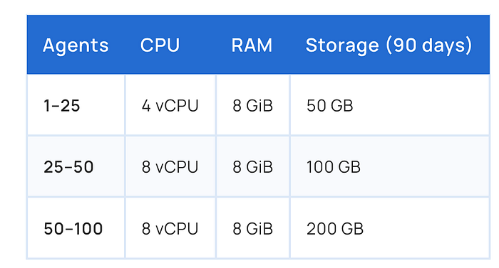

The [quick start](https://documentation.wazuh.com/current/quickstart.html) installation is very simple. I have choose OEL8 as the OS.

Menu →Compute →Create Instance and give it a name, select the AD, Image and Shape:

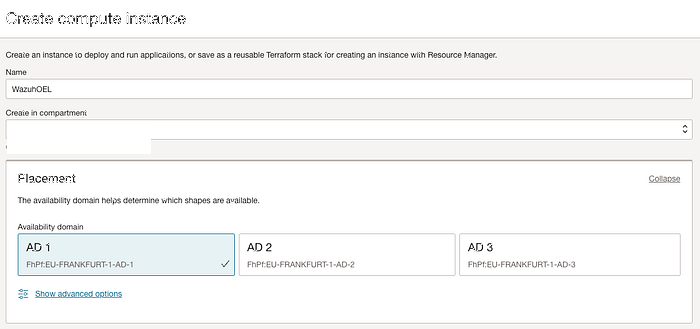

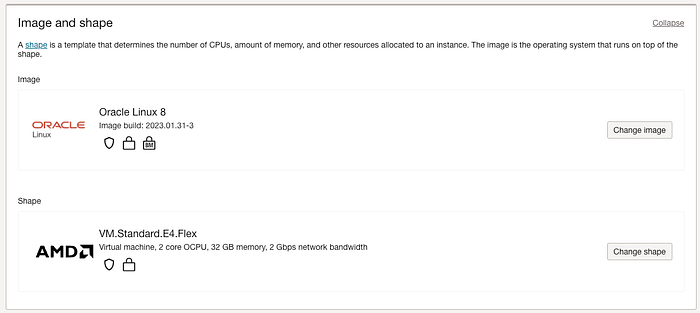

Select the VCN and Subnet:

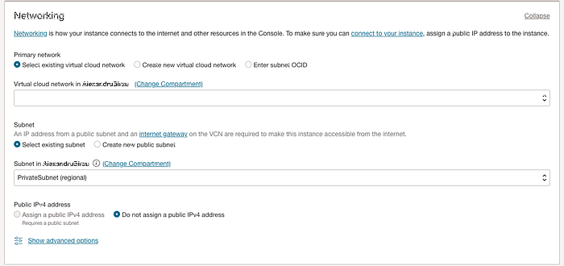

Add the ssh key, and increase the boot volume to 100 Gb. This is just a demo on how to install Wazuh. You should install it on a Block volume, as the performance is much better then on boot:

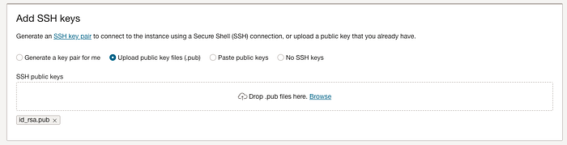

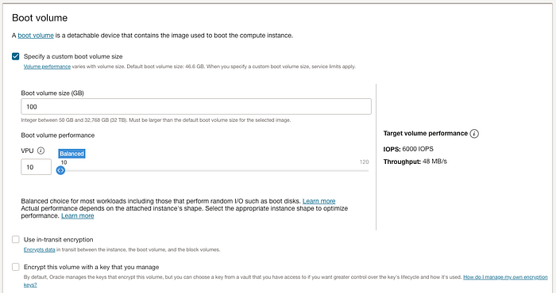

After boot, run :

```text
sudo /usr/libexec/oci-growfs
```

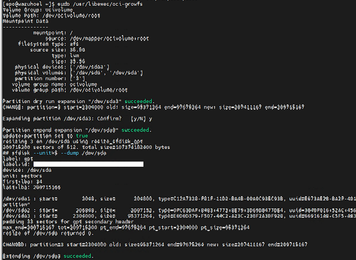

Next run this command to get [the installer](https://documentation.wazuh.com/current/deployment-options/elastic-stack/all-in-one-deployment/index.html) and execute:

```text
curl -sO https://packages.wazuh.com/4.7/wazuh-install.sh && sudo bash ./wazuh-install.sh -a
```

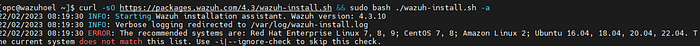

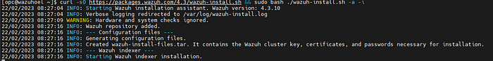

I have updated the command to latest version.

During the installation I get this error, and I needed to find a solution for it.

22/02/2023 08:29:45 ERROR: Filebeat installation failed.

I have checked if I am able to install Filebeat manually, and it looked like that my Instance uses OSMS, and Wazuh repo wasn’t accesible. I have added the Wazuh Repo to the OCI instance, and I have run the installer again:

```text
sudo rpm — import https://packages.wazuh.com/key/GPG-KEY-WAZUH
 sudo  cat > /etc/yum.repos.d/wazuh.repo << EOF
>[wazuh]
> gpgcheck=1
> gpgkey=https://packages.wazuh.com/key/GPG-KEY-WAZUH
> enabled=1
> name=EL-\$releasever — Wazuh
> baseurl=https://packages.wazuh.com/4.x/yum/
> protect=1
> EOF
```

I have disabled the OS Management agent on the instance:


And I have started the install again. After the provisioning is finished, you can try to connect to the Wazuh Page.

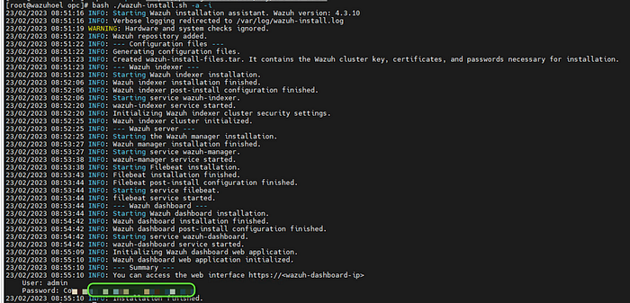

This will not work, as port 443 is not opened from the instance, even if I have it opened in the NSG.

On the Wazuh server run these commands, and reload the page:

```text
# firewall-cmd --zone=public --permanent --add-service=https
# firewall-cmd --reload
```

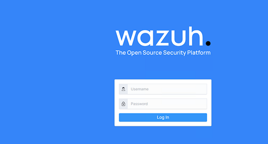

Congratulations! You have your Wazuh Server up and running(All-in-one server).
