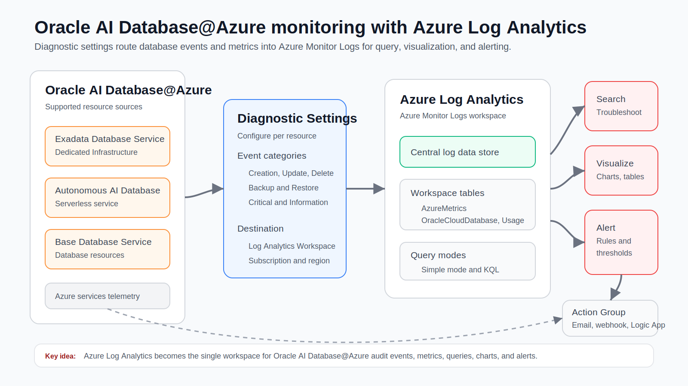
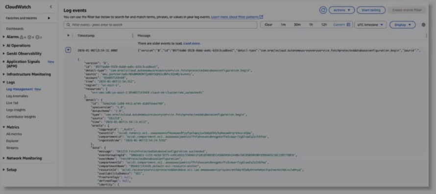
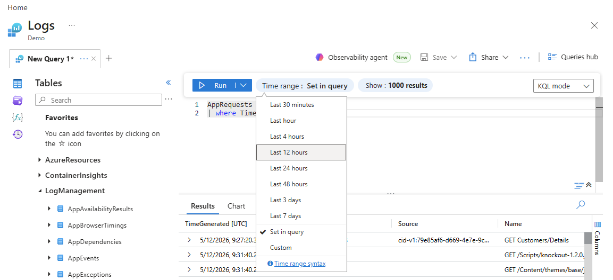
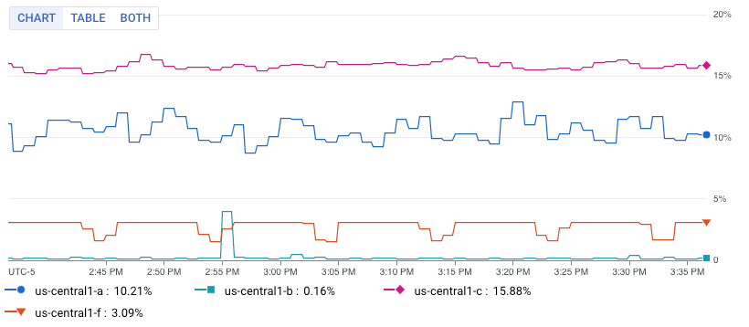
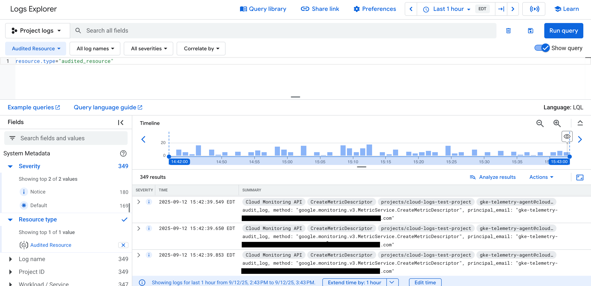

# Oracle Database@ With Native Cloud Tools


## Scope

This guide explains how to enable and use native cloud-provider monitoring for
Oracle Database@ services across AWS, Azure, and Google Cloud.

Use this provider-native layer for:

- health, availability, and resource utilization
- provider console dashboards
- first-line metrics, logs, and alerts
- correlation with application, network, and infrastructure telemetry in the
  same cloud provider

Do not use this layer as the only Oracle database diagnostic tool. Provider
monitoring is useful for the first signal, but it does not replace Oracle-native
diagnostics such as Database Management, Ops Insights, Log Analytics, AWR, ASH,
wait events, blocking-session analysis, or SQL tuning.

## Monitoring Model

Baseline monitoring across AWS, Azure, and GCP follows the same pattern:

```text
Oracle Database@ resources
  -> OCI-published database and infrastructure telemetry
  -> provider-native monitoring and logging service
  -> metrics, logs, dashboards, alerts, and notifications
  -> operations or incident workflow
```

### AWS

```text
Oracle Database@AWS resources
  -> OCI-published database and infrastructure telemetry
  -> Amazon EventBridge
  -> Amazon CloudWatch metrics, logs, dashboards, and alarms
  -> SNS, incident tool, or operations workflow
```

CloudWatch is the AWS operational shell. It is useful for spotting CPU, storage,
IO, connection, availability, and log anomalies from the same console used for
AWS application and infrastructure monitoring.

### Azure

```text
Oracle Database@Azure resources
  -> Azure resource telemetry and diagnostic categories
  -> Azure Monitor metrics and diagnostic settings
  -> Log Analytics workspace, workbooks, alerts, and action groups
  -> operations or incident workflow
```

Azure Monitor is the Azure operational shell. Use Metrics Explorer for numeric
signals, Log Analytics workspaces for queryable logs, workbooks or dashboards
for visualization, and action groups for notifications.



*Figure 1. Oracle Database@Azure diagnostic settings route telemetry into an
Azure Log Analytics workspace for query, visualization, alerting, and action
groups.*

### GCP

```text
Oracle Database@Google Cloud resources
  -> Google Cloud project telemetry and logs
  -> Cloud Monitoring and Cloud Logging
  -> dashboards, Logs Explorer, alerting policies, and notification channels
  -> operations or incident workflow
```

Google Cloud Observability is the GCP operational shell. Use Cloud Monitoring
for metrics and dashboards, Cloud Logging for log search and routing, and
alerting policies with notification channels for responder workflows.

## Prerequisites

1. Confirm Oracle Database@ onboarding is complete for the target provider.
   - The marketplace, private offer, or service subscription is accepted.
   - The cloud account, Azure subscription, or Google Cloud project is linked
     to the OCI tenancy as required by the service.
   - The database resource is provisioned and visible in both the provider
     console and the paired OCI region.
   - Required networking, peering, private access, and DNS paths are healthy.
2. Confirm the operator has provider permissions.
   - **AWS**: EventBridge event buses and rules, CloudWatch metrics, log
     groups, dashboards, alarms, and SNS or incident targets.
   - **Azure**: Azure Monitor metrics, diagnostic settings, Log Analytics
     workspaces, workbooks, alert rules, action groups, and the target resource
     group or subscription.
   - **GCP**: Cloud Monitoring metrics, dashboards, alerting policies,
     notification channels, Cloud Logging Logs Explorer, log views, and sinks.
3. Confirm the intended provider region and paired OCI region.
4. Confirm tagging or labeling standards for application, environment, owner,
   criticality, database name, and escalation contact.
5. Confirm alert routing before enabling paging.

## 1. Confirm Telemetry Arrives In AWS, Azure, And GCP

### AWS

1. Open the AWS Console in the target AWS account and Region.
2. Open **Amazon EventBridge**.
3. Check the event bus or integration path used by Oracle Database@AWS.
4. Confirm recent events exist for the target database or infrastructure
   resource.
5. Open **Amazon CloudWatch**.
6. Check **Metrics** for the namespace and dimensions associated with the
   Oracle Database@AWS resource.
7. Check **Log groups** for database or infrastructure log streams delivered
   for the service.


*Figure 2. Amazon CloudWatch metrics for Oracle Database@AWS. Source: Oracle
Observability blog.*



*Figure 3. Amazon CloudWatch logs for Oracle Database@AWS. Source: Oracle
Observability blog.*

If no AWS telemetry appears:

- Confirm you are in the correct AWS account and Region.
- Confirm the Oracle Database@AWS resource is fully provisioned.
- Confirm the OCI-to-AWS account link is healthy.
- Confirm EventBridge receives events before troubleshooting CloudWatch
  dashboards or alarms.
- Confirm the CloudWatch namespace, dimensions, log group, and time range.

### Azure

1. Open the Azure portal in the target tenant and subscription.
2. Open the resource group that contains the Oracle Database@Azure resource.
3. Open the target Oracle Database@Azure resource.
4. Open **Monitoring** > **Metrics**.
5. Select the relevant metric namespace and confirm recent metric data appears.
6. Open **Monitoring** > **Diagnostic settings**.
7. Confirm diagnostic categories are enabled and routed to the intended
   destination, usually a **Log Analytics workspace**.
8. Open the Log Analytics workspace.
9. Use **Logs** to query recent records for the database resource.
10. Confirm the resource, category, severity, and timestamp fields are useful
    enough for incident triage.



*Figure 4. Azure Log Analytics query results view for confirming that Azure
Monitor Logs has records in the selected workspace. Source: Microsoft Learn.*

If no Azure telemetry appears:

- Confirm you are in the correct tenant, subscription, resource group, and
  region.
- Confirm the Oracle Database@Azure resource is fully provisioned.
- Confirm the selected metric namespace is correct.
- Confirm diagnostic settings are enabled for the resource.
- Confirm the Log Analytics workspace exists and is receiving data.
- Confirm the operator has read access to both the source resource and the
  workspace.
- Widen the query time range and check ingestion latency.

### GCP

1. Open the Google Cloud console in the target project.
2. Confirm the Oracle Database@Google Cloud resource or associated service
   resource is visible in the intended project and region.
3. Open **Monitoring** > **Metrics explorer**.
4. Select the metric type or monitored resource associated with the database
   integration.
5. Confirm recent metric data appears for the target database resource.



*Figure 5. Google Cloud Metrics Explorer chart view for validating metric time
series in Cloud Monitoring. Source: Google Cloud documentation.*

6. Open **Logging** > **Logs Explorer**.
7. Filter by the target project, resource type, database identifier, log name,
   severity, or labels.
8. Confirm recent log entries appear.
9. Save useful Logs Explorer queries for recurring checks.



*Figure 6. Google Cloud Logs Explorer view for validating query results and log
records in Cloud Logging. Source: Google Cloud documentation.*

If no GCP telemetry appears:

- Confirm you are in the correct Google Cloud organization, folder, project,
  and region.
- Confirm the Oracle Database@Google Cloud resource is fully provisioned.
- Confirm the required Google Cloud APIs and observability services are enabled
  for the project.
- Confirm the operator has Cloud Monitoring and Cloud Logging read permissions.
- Confirm the selected resource type, metric type, log name, labels, and time
  range.
- Check whether logs are excluded or routed to another log bucket or sink.

## 2. Build The Baseline Dashboard

Create a small dashboard first. Add more widgets only after the first page is
useful during an incident.

Recommended widgets for every provider:

- database availability or service health
- CPU utilization
- storage usage and free space
- read and write IO throughput
- read and write IO latency
- network throughput between application tiers and the database path
- connection or session count, if exposed by the provider integration
- error and warning count from provider-native logs
- current alarm state

Provider notes:

- **AWS**: Use CloudWatch dashboards and Metrics Insights where useful. Place
  CloudWatch alarm state beside the metric charts responders use first.
- **Azure**: Use Azure Monitor workbooks or dashboards. Pair Metrics Explorer
  charts with Log Analytics query tiles for error and warning counts.
- **GCP**: Use Cloud Monitoring dashboards. Add charts from Metrics Explorer and
  log-based metrics from Cloud Logging when raw logs need an alertable signal.

Add a text widget or dashboard note with database owner, application, escalation
path, provider region, paired OCI region, and link to the Oracle-native
diagnostics runbook.

## 3. Configure First Alarms

Start with a small alarm set that pages only for conditions that require action.
Use warning-only notifications for early trend signals.

Suggested initial alarms:

| Signal | Purpose | First threshold approach |
| --- | --- | --- |
| Availability or health | Detect service interruption | Resource unavailable or health signal degraded |
| CPU utilization | Detect compute pressure | Sustained high CPU for multiple periods |
| Storage usage | Prevent space exhaustion | Warning near expansion threshold, critical near hard limit |
| IO latency | Detect storage or workload stress | Sustained latency above normal baseline |
| Connection/session count | Detect connection storms or pool issues | Higher than normal peak for multiple periods |
| Missing telemetry | Detect monitoring gaps | Expected metric or log stream stops arriving |
| Error log count | Detect operational failures | Error count above normal baseline |

Alarm design notes:

- Use multiple evaluation periods to avoid alerting on one-off spikes.
- Decide how missing data should be treated before enabling paging.
- Add the alarm state to the dashboard.
- Route warning and critical notifications to different destinations when the
  provider supports it.
- Use composite or correlated alerts where helpful, for example CPU pressure
  plus IO latency rather than CPU alone.

### AWS

1. Open **CloudWatch** > **Alarms**.
2. Create alarms for the selected Oracle Database@AWS metrics.
3. Set evaluation periods and missing-data handling.
4. Route notifications through SNS or the team's incident integration.
5. Add alarm widgets to the CloudWatch dashboard.

### Azure

1. Open the Oracle Database@Azure resource or **Azure Monitor** > **Alerts**.
2. Create metric alerts for CPU, storage, IO, availability, and other exposed
   provider metrics.
3. Create log search alerts from the Log Analytics workspace for error patterns
   or missing expected records.
4. Use action groups for email, webhook, ITSM, automation, or incident
   integration.
5. Add alert state and key charts to an Azure dashboard or workbook.

### GCP

1. Open **Monitoring** > **Alerting**.
2. Create alerting policies for CPU, storage, IO, availability, and other
   exposed metric types.
3. Create log-based metrics in Cloud Logging when a log pattern needs an
   alertable metric.
4. Attach notification channels such as email, webhook, Pub/Sub, or the team's
   incident integration.
5. Add alert state and key charts to a Cloud Monitoring dashboard.

## 4. Review Logs

### AWS

Use **CloudWatch Logs** and Logs Insights for AWS-side operational
investigation. Filter by database resource identifier, application tag,
severity, and time range. Compare log spikes with metric spikes on the
CloudWatch dashboard.

### Azure

Use **Log Analytics** in the configured workspace. Start with the target
resource, diagnostic category, severity, and time range. Save KQL queries for
common checks such as error count by database, warnings by category, and missing
expected telemetry.

### GCP

Use **Logs Explorer** in Cloud Logging. Start with the target project, resource
type, log name, labels, severity, and time range. Save recurring queries and
create log-based metrics when a log condition must drive dashboards or alerts.

Useful starting questions for every provider:

- Did errors start before or after the CPU or IO spike?
- Is the issue isolated to one database resource, one application path, or one
  time window?
- Did telemetry stop, or did the database resource itself become unhealthy?
- Are application-tier, network, or infrastructure signals changing at the same
  time?

## 5. Configure Advanced Monitoring Tools

Basic provider monitoring and alerting are not enough to fully manage Oracle
Database@ services. If the Oracle Database@ deployment is linked to an OCI
tenancy, enable the Oracle-native observability services that expose database
internals and long-term fleet intelligence.

Advanced OCI services:

- **Database Management** for Performance Hub, AWR, SQL tuning, database
  metrics, alerts, and managed database views where supported.
- **Ops Insights** for capacity planning, SQL insights, fleet analysis, Exadata
  insights, and long-term usage trends.
- **Log Analytics** for log ingestion, search, clustering, dashboards, and
  operational pattern detection.

Prerequisites before enabling advanced services:

- Confirm the database is visible in the paired OCI region.
- Confirm IAM policy or Policy Advisor prerequisites for Database Management,
  Ops Insights, Log Analytics, Monitoring, Vault, and private endpoints.
- Request service limit increases where required for:
  - Database Management
  - Ops Insights
  - Log Analytics ingestion and storage
- Confirm network reachability from required private endpoints or management
  agents to the database listener or service endpoint.
- Store database monitoring credentials in OCI Vault.
- Confirm whether the target is Exadata Database Service, Autonomous Database,
  or another supported Database@ deployment type.

Use the local OCI-native documentation for the detailed steps:

[OCI Native Observability tool for AutonomousDB](../autonomous-observability-asset)

[OCI Native Observability tool for ExaCS, BaseDatase](../exacs-and-dbcs-observability-assets)


## 6. Validation Checklist

- [ ] Oracle Database@ onboarding is complete in the target provider.
- [ ] Provider-native metrics are visible for the database resource.
- [ ] Provider-native logs are visible where log delivery is expected.
- [ ] AWS, Azure, and GCP figures render from the local `files/` folder in
      Markdown preview.
- [ ] Dashboard includes health, CPU, storage, IO, network, errors, and alarm
      state.
- [ ] Alarms use realistic evaluation periods and missing-data behavior.
- [ ] Alarm actions route to the correct responder path.
- [ ] Dashboard metadata includes owner, application, escalation path, provider
      region, and paired OCI region.
- [ ] The runbook clearly separates provider-native monitoring from
      Oracle-native advanced diagnostics.
- [ ] OCI advanced monitoring prerequisites are reviewed for production
      databases.

## References

- Oracle Observability blog, "Enhanced Observability: Advanced Monitoring
  Strategies for Oracle Database@AWS (Part 1)":
  https://blogs.oracle.com/observability/enhanced-observability-advanced-monitoring-strategies-for-oracle-databaseaws-part-1
- Amazon CloudWatch metrics:
  https://docs.aws.amazon.com/AmazonCloudWatch/latest/monitoring/working_with_metrics.html
- Amazon CloudWatch alarms:
  https://docs.aws.amazon.com/AmazonCloudWatch/latest/monitoring/CloudWatch_Alarms.html
- Amazon CloudWatch dashboards:
  https://docs.aws.amazon.com/AmazonCloudWatch/latest/monitoring/create_dashboard.html
- Amazon EventBridge overview:
  https://docs.aws.amazon.com/eventbridge/latest/userguide/eb-what-is.html
- Azure Monitor overview:
  https://learn.microsoft.com/en-us/azure/azure-monitor/fundamentals/overview
- Azure Monitor diagnostic settings:
  https://learn.microsoft.com/en-us/azure/azure-monitor/platform/diagnostic-settings
- Azure Log Analytics tutorial:
  https://learn.microsoft.com/en-us/azure/azure-monitor/logs/log-analytics-tutorial
- Azure Monitor alerts:
  https://learn.microsoft.com/en-us/azure/azure-monitor/alerts/alerts-overview
- Google Cloud Monitoring:
  https://cloud.google.com/monitoring/docs
- Google Cloud Metrics Explorer:
  https://cloud.google.com/monitoring/charts/metrics-explorer
- Google Cloud Logging:
  https://cloud.google.com/logging/docs
- Google Cloud Logs Explorer interface:
  https://cloud.google.com/logging/docs/view/logs-explorer-interface
- Google Cloud Monitoring alerting:
  https://cloud.google.com/monitoring/alerts
