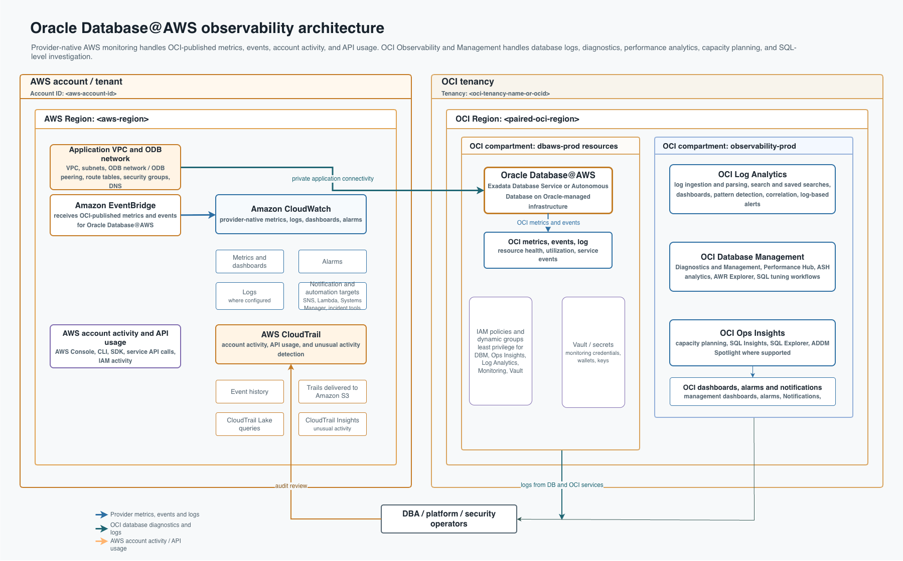
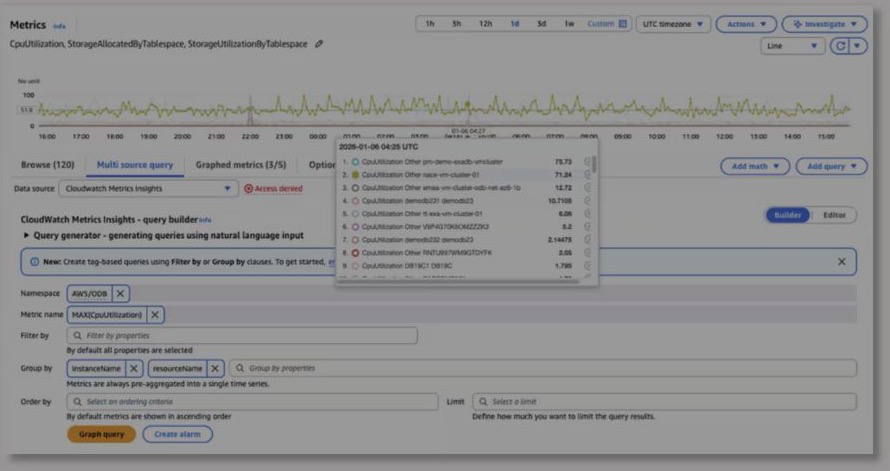

# Oracle Database@ With Native Cloud Tools

## Scope

This guide explains how to enable and use native cloud-provider monitoring for
Oracle Database@ services across AWS

Use this provider-native layer for:

- health, availability, and resource utilization
- provider console dashboards
- first-line metrics, logs, and alerts
- correlation with application, network, and infrastructure telemetry in the
  same cloud provider

Do not use this layer as the only Oracle database diagnostic tool. Provider
monitoring is useful for the first signal, but it does not replace Oracle-native
diagnostics such as Database Management, Ops Insights, Log Analytics, AWR, ASH,
wait events, blocking-session analysis, or SQL tuning.

## Monitoring Model

Oracle Database@AWS observability works best as a tiered model:

1. Establish the AWS operational baseline with Amazon CloudWatch.
2. Add AWS CloudTrail for control-plane audit, compliance, and change investigations.
3. Add OCI Log Analytics for database, infrastructure, audit, and application log analysis.
4. Enable OCI Database Management for real-time Oracle diagnostics with Performance Hub, ASH, AWR, and Diagnostics & Management.
5. Add OCI Ops Insights for historical SQL analysis and capacity planning.

CloudWatch answers the first operational question: is something wrong at the service or resource layer? CloudTrail answers a different question: who changed what, from where, and when? Log Analytics helps explain what changed in logs around the same time. Database Management gives DBAs the live and historical Oracle performance context. Ops Insights helps determine whether this is a recurring trend, a SQL degradation pattern, or a capacity issue.

## Reference architecture

## Prerequisites

1. Confirm Oracle Database@ onboarding is complete for the target provider.
   - The marketplace, private offer, or service subscription is accepted.
   - The AWS buyer account is linked
     to the OCI tenancy as required by the service.
   - The database resource is provisioned and visible in both the provider
     console and the paired OCI region.
   - Required networking, peering, private access, and DNS paths are healthy.
2. Confirm the operator has provider permissionson EventBridge event buses and rules, CloudWatch metrics, CloudTrail, log
     groups, dashboards, alarms.
3. Confirm the intended provider region and paired OCI region.
4. Confirm tagging or labeling standards for application, environment, owner,
   criticality, database name, and escalation contact.
5. Confirm alert routing before enabling paging.

## 1. Confirm Telemetry Arrives In AWS

1. Open the AWS Console in the target AWS account and Region.
2. Open **Amazon EventBridge**.
3. Check the event bus or integration path used by Oracle Database@AWS.
4. Confirm recent events exist for the target database or infrastructure
   resource.
5. Open **Amazon CloudWatch**.
6. Check **Metrics** for the namespace and dimensions associated with the
   Oracle Database@AWS resource.
7. Check **Log groups** for database or infrastructure log streams delivered
   for the service.

*Figure 2. Amazon CloudWatch metrics for Oracle Database@AWS. Source: Oracle
Observability blog.*

*Figure 3. Amazon CloudWatch logs for Oracle Database@AWS. Source: Oracle
Observability blog.*

If no AWS telemetry appears:

- Confirm you are in the correct AWS account and Region.
- Confirm the Oracle Database@AWS resource is fully provisioned.
- Confirm the OCI-to-AWS account link is healthy.
- Confirm EventBridge receives events before troubleshooting CloudWatch
  dashboards or alarms.
- Confirm the CloudWatch namespace, dimensions, log group, and time range.

## 2. Build The Baseline Dashboard

Create a small dashboard first. Add more widgets only after the first page is
useful during an incident.Use CloudWatch dashboards and Metrics Insights where useful. Place
  CloudWatch alarm state beside the metric charts responders use first.

Recommended widgets for every provider:

- database availability or service health
- CPU utilization
- storage usage and free space
- read and write IO throughput
- read and write IO latency
- network throughput between application tiers and the database path
- connection or session count, if exposed by the provider integration
- error and warning count from provider-native logs
- current alarm state

Add a text widget or dashboard note with database owner, application, escalation
path, provider region, paired OCI region, and link to the Oracle-native
diagnostics runbook.

## 3. Configure First Alarms

Start with a small alarm set that pages only for conditions that require action.
Use warning-only notifications for early trend signals.

Suggested initial alarms:

| Signal | Purpose | First threshold approach |
| --- | --- | --- |
| Availability or health | Detect service interruption | Resource unavailable or health signal degraded |
| CPU utilization | Detect compute pressure | Sustained high CPU for multiple periods |
| Storage usage | Prevent space exhaustion | Warning near expansion threshold, critical near hard limit |
| IO latency | Detect storage or workload stress | Sustained latency above normal baseline |
| Connection/session count | Detect connection storms or pool issues | Higher than normal peak for multiple periods |
| Missing telemetry | Detect monitoring gaps | Expected metric or log stream stops arriving |
| Error log count | Detect operational failures | Error count above normal baseline |

Alarm design notes:

- Use multiple evaluation periods to avoid alerting on one-off spikes.
- Decide how missing data should be treated before enabling paging.
- Add the alarm state to the dashboard.
- Route warning and critical notifications to different destinations when the
  provider supports it.
- Use composite or correlated alerts where helpful, for example CPU pressure
  plus IO latency rather than CPU alone.

1. Open **CloudWatch** > **Alarms**.
2. Create alarms for the selected Oracle Database@AWS metrics.
3. Set evaluation periods and missing-data handling.
4. Route notifications through SNS or the team's incident integration.
5. Add alarm widgets to the CloudWatch dashboard.

## AWS CloudTrail for control-plane auditing

CloudTrail is the AWS governance, compliance, operational audit, and risk audit layer. For Oracle Database@AWS, it records AWS account activity and API usage so operations and security teams can investigate who created, changed, listed, retrieved, or deleted cloud resources around a database event.

Use CloudTrail for:

- Tracking creation and deletion of Exadata infrastructure, VM clusters, ODB networks, and peering connections.
- Reviewing configuration lookup events for clusters, database nodes, database servers, and ODB networks.
- Investigating list and get operations across Autonomous VM clusters, VM clusters, database nodes, database servers, and related resources.
- Searching Event history for recent activity, especially during incidents or post-change reviews.
- Delivering trails to Amazon S3 for retention, security review, and downstream analytics.
- Querying CloudTrail Lake when teams need aggregated audit analysis.
- Using CloudTrail Insights to detect unusual operational activity.

Events worth adding to runbooks include:

| Event family | Example event names | Why it matters |
| --- | --- | --- |
| Create | `CreateCloudExadataInfrastructure`, `CreateCloudAutonomousVmCluster`, `CreateOdbNetwork`, `CreateOdbPeeringConnection` | Confirms provisioning and network-change activity |
| Delete | `DeleteCloudExadataInfrastructure`, `DeleteCloudVmCluster`, `DeleteOdbNetwork`, `DeleteOdbPeeringConnection` | Helps explain sudden availability or connectivity changes |
| Get and list | `GetCloudVmCluster`, `GetDbNode`, `ListDbServers`, `ListOdbNetworks` | Shows investigation, discovery, and inventory activity |
| Update and policy | `UpdateOdbNetwork`, `PutResourcePolicy`, `DeleteResourcePolicy` | Tracks configuration and access changes |

During an incident, search CloudTrail Event history by event name and time range. For example, if connectivity fails after a network change, look for `UpdateOdbNetwork`, `CreateOdbPeeringConnection`, `DeleteOdbPeeringConnection`, or `DeleteOdbNetwork` events. The event record can identify the initiating principal, source IP address, event ID, timestamp, request parameters, and response details.

## 5. Configure Advanced Monitoring Tools

Basic provider monitoring and alerting are not enough to fully manage Oracle
Database@ services. If the Oracle Database@ deployment is linked to an active OCI
subscription, enable the Oracle-native observability services that expose database
internals and long-term fleet intelligence.

Advanced OCI services:

- **Database Management** for Performance Hub, AWR, SQL tuning, database
  metrics, alerts, and managed database views where supported.
- **Ops Insights** for capacity planning, SQL insights, fleet analysis, Exadata
  insights, and long-term usage trends.
- **Log Analytics** for log ingestion, search, clustering, dashboards, and
  operational pattern detection.

Prerequisites before enabling advanced services:

- Confirm the database is visible in the paired OCI region.
- Confirm IAM policy or Policy Advisor prerequisites for Database Management,
  Ops Insights, Log Analytics, Monitoring, Vault, and private endpoints.
- Request service limit increases where required for:
  - Database Management
  - Ops Insights
  - Log Analytics ingestion and storage
- Confirm network reachability from required private endpoints or management
  agents to the database listener or service endpoint.
- Store database monitoring credentials in OCI Vault.
- Confirm whether the target is Exadata Database Service, Autonomous Database,
  or another supported Database@ deployment type.

Use the local OCI-native documentation for the detailed steps:

[OCI Native Observability tool for AutonomousDB](../autonomous-observability-asset)

[OCI Native Observability tool for ExaCS, BaseDatase](../exacs-and-dbcs-observability-assets)

## References

- Oracle Observability blog, "Enhanced Observability: Advanced Monitoring
  Strategies for Oracle Database@AWS (Part 1)":
  https://blogs.oracle.com/observability/enhanced-observability-advanced-monitoring-strategies-for-oracle-databaseaws-part-1
- Amazon CloudWatch metrics:
  https://docs.aws.amazon.com/AmazonCloudWatch/latest/monitoring/working_with_metrics.html
- Amazon CloudWatch alarms:
  https://docs.aws.amazon.com/AmazonCloudWatch/latest/monitoring/CloudWatch_Alarms.html
- Amazon CloudWatch dashboards:
  https://docs.aws.amazon.com/AmazonCloudWatch/latest/monitoring/create_dashboard.html
- Amazon EventBridge overview:
  https://docs.aws.amazon.com/eventbridge/latest/userguide/eb-what-is.html