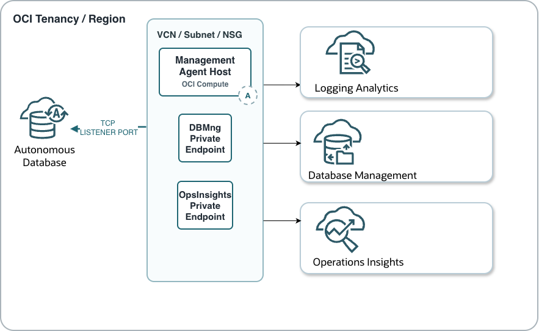

# OCI Observability for Autonomous 


Enable OCI observability for an Autonomous Shared Database so cloud and database
teams can monitor single databases, manage fleets, investigate SQL performance,
forecast capacity, collect selected log data, and create alerting around
resource or access anomalies.

After this setup, operators can use:

- native Autonomous Database metrics and alarms
- Database Actions Database Dashboard and Performance Hub
- OCI Database Management Diagnostics & Management
- OCI Ops Insights
- OCI Logging Analytics for table or view based log collection
- OCI Management Dashboard for custom fleet views

## Architecture

Autonomous Shared Database is a managed database service. Operators do not
collect host log files from the database servers. Observability is enabled
through OCI service integrations and database connections:

1. OCI Monitoring receives Autonomous Database metrics.
2. OCI Alarms watches selected metrics such as CPU, storage, sessions, and
   failed logons.
3. Database Management connects to Autonomous Database using a service name,
   database credentials, Vault secrets, and either secure public access or a
   Database Management private endpoint.
4. Ops Insights uses Cloud Infrastructure telemetry and optional full feature
   database connections for fleet analytics, SQL Explorer, and ADDM Spotlight.
5. Logging Analytics uses a Management Agent on a host that can reach the
   Autonomous Database over JDBC. The agent runs configured SQL queries against
   database tables or views and uploads the results into a Log Analytics log
   group.

For production fleets, private endpoints are recommended because several
advanced Database Management and Ops Insights capabilities are limited or
unavailable when Autonomous Databases are only exposed through public endpoints.

### Architecture Diagram




## Prerequisites

Collect these values before starting:

- tenancy OCID
- region
- Autonomous Database OCID
- Autonomous Database compartment
- Autonomous Database workload type, such as ATP, ADW, AJD, or APEX
- Autonomous Database network access mode
- service name, such as `<db_name>_low`, `<db_name>_medium`, or
  `<db_name>_high`
- database user for monitoring and diagnostics
- OCI Vault, key, and secret compartment
- VCN and subnet for a Database Management private endpoint, if required
- Management Agent host with JDBC connectivity to the database, if using
  Logging Analytics
- Logging Analytics log group

Confirm the region in the OCI Console before enabling each service. Database
Management does not provide cross-region monitoring for Oracle Databases.

## IAM Policy Customization Considerations

The policies listed below represent a reference configuration required to enable OCI Database Management, Operations Insights, Log Analytics, Dashboards, and Alerts for Exadata Cloud@Customer environments.

Many of these permissions are granted at the **tenancy level** to simplify deployment and ensure all observability services can function correctly. However, in production environments, organizations typically implement compartment-based resource segregation and role-based access controls to restrict visibility and administrative privileges according to operational responsibilities.

As a result, the sample policies should be reviewed and customized based on:

* Compartment structure and resource ownership.
* Environment separation (Development, Test, UAT, Production).
* Application or business-unit boundaries.
* Security, compliance, and segregation-of-duties requirements.
* Database administration and observability team responsibilities.

In particular, permissions assigned to the **obs_admin** group may need to be scoped to specific compartments rather than the entire tenancy to ensure administrators can only access and manage the databases, observability resources, dashboards, agents, logs, and alerts that fall within their authorized scope.

Similarly, dynamic groups such as **obs_agent** and **Credential_Dynamic_Group** should be reviewed to ensure they are granted only the minimum permissions required for certificate management, vault access, agent lifecycle operations, and log ingestion.

The policies provided in this document should therefore be considered a baseline implementation and may require tenancy-specific adjustments before deployment in production environments.


## OCI Policies and Group

1.  *Define Observability Admin admin user: obs_admin*
2.  *Define Dynamic Group for mng agent: obs_agent (required by Logging analytics)*


Database Management policy template:

```text
allow group obs_admin to manage dbmgmt-family in tenancy 
allow group obs_admin to read dbmgmt-work-requests in tenancy 
allow group obs_admin to manage autonomous-database-family in tenancy 
allow group obs_admin to manage secret-family in tenancy 
allow group obs_admin to use subnets in tenancy 
allow group obs_admin to manage vnics in tenancy 
allow group obs_admin to use network-security-groups in tenancy 
```

Vault resource principal policy for Database Management secrets:

```text
allow any-user to read secret-family in tenancy
  where ALL {request.principal.type = dbmgmtmanageddatabase}
```

Ops Insights policy template:

```text
allow group obs_admin to manage opsi-family in tenancy 
allow group obs_admin to use autonomous-database-family in tenancy 
allow group obs_admin to manage virtual-network-family in tenancy 
allow group obs_admin to read secret-family in compartment <secret_compartment_name>
allow group obs_admin to use opsi-family in tenancy 
allow group obs_admin to read management-dashboard-family in tenancy 
```

For Ops Insights full feature support, add resource principal policies so Ops
Insights can read the database password secret and generate an Autonomous
Database wallet when needed:

```text
allow any-user to read secret-family in tenancy
  where ALL {request.principal.type = 'opsidatabaseinsight'}
allow any-user to read autonomous-database-family in tenancy 
  where ALL {request.principal.type = 'opsidatabaseinsight', request.operation = 'GenerateAutonomousDatabaseWallet'}
```

Logging Analytics policy template:

```text
allow group obs_admin to manage loganalytics-features-family in tenancy
allow group obs_admin to manage loganalytics-resources-family in tenancy 
allow group obs_admin to manage management-dashboard-family in tenancy 
allow group obs_admin to read loganalytics-resources-family in tenancy 
allow group obs_admin to read management-dashboard-family in tenancy 
allow group obs_admin to read compartments in tenancy
```

Management Agent dynamic group and policy template:

```text
ALL {resource.type='managementagent'}
```

```text
allow dynamic-group <management_agent_dynamic_group> to use metrics in tenancy 
allow dynamic-group <management_agent_dynamic_group> to {LOG_ANALYTICS_LOG_GROUP_UPLOAD_LOGS} in tenancy 
```

Restrict tenancy-wide examples to compartments whenever your tenancy design
allows it.

## 2. Baseline Native Metrics And Alarms

1. Open **Oracle Database** > **Autonomous Database**.
2. Select the target database.
3. Review the built-in **Metrics** charts.
4. Confirm the expected workload baseline for:
   - CPU utilization
   - storage utilization
   - sessions
   - running and queued statements
   - failed connections or failed logons
5. Create OCI alarms for common thresholds:
   - critical CPU utilization, for example mean above `85`
   - warning CPU utilization, for example mean above `75`
   - critical storage utilization, for example mean above `85`
   - warning storage utilization, for example mean above `75`
   - failed logons above the security threshold
   - sessions above the expected concurrency threshold
6. Send alarms to the correct notification topic, such as email, Slack, PagerDuty
   through HTTPS, OCI Functions, or another approved endpoint.

Database users without OCI Console access can still use Database Actions for
Database Dashboard and Performance Hub, if they have the direct Database Actions
URL and valid database credentials.

## 3. Enable Database Management Diagnostics & Management

Use Database Management when you need fleet views, Performance Hub, AWR
Explorer, AWR and ADDM reports, SQL Monitoring, SQL tuning, storage
administration, user administration, parameter views, and database jobs from OCI.

### 3.1 Prepare Database Credentials

1. Decide whether to use an existing administrative account or a dedicated
   monitoring user.
2. Different monitoring db user
      basic monitoring use `ADBSNMP` 
      advanced diagnostics use `ADMIN` 
4. Store the password in OCI Vault as a secret.
5. If mTLS is required, download the Autonomous Database wallet, extract
   `cwallet.sso`, and store it in OCI Vault as a secret.


#### Unlock the Database Username

The database username is a user inside the Autonomous Database. It is separate
from OCI IAM users and groups. OCI IAM controls who can enable Database
Management, Ops Insights, Log Analytics, Vault, and network resources; the
database username controls what the service can do after it connects to the
database.

The easiest way is to use adbsnmp user:

```sql
sqlplus ADMIN@'(description= (retry_count=20)(retry_delay=3)(address=(protocol=tcps)(port=1522)(host=bbbbbb.eu-frankfurt-1.oraclecloud.com))(connect_data=(service_name=umqbbbbbbb_testops_tpurgent.adb.oraclecloud.com))(security=(ssl_server_dn_match=no)))'
ALTER USER adbsnmp ACCOUNT UNLOCK;
ALTER USER adbsnmp IDENTIFIED BY adbsnmp_password; 
grant SELECT ANY DICTIONARY to adbsnmp;
grant SELECT_CATALOG_ROLE to adbsnmp;
grant read on awr_pdb_snapshot to adbsnmp;
grant execute on dbms_workload_repository to adbsnmp;
exit;
```
After that

1. Test the connection with the same service name, wallet, and network path
   that the OCI service or Management Agent will use.
2. Store the password in OCI Vault for Database Management or Ops Insights.
3. Register the password as a Management Agent credential for Log Analytics.
4. Do not REST-enable the user unless the same account must sign in to Database
   Actions. Service integrations only need database connectivity and the
   required database privileges.

### 3.2 Choose The Connection Mode

Use the database network configuration to pick the connection mode:

- **Secure access from everywhere**: no Database Management private endpoint is
  required, but mTLS is required.
- **Secure access from allowed IPs and VCNs only**: create or reuse a Database
  Management private endpoint and add the VCN or endpoint IP range to the
  Autonomous Database access control list.
- **Private endpoint access only**: create or reuse a Database Management
  private endpoint in a VCN and subnet that can communicate with the database.

For private access, allow TCP `1521` or `1522` as appropriate for the selected
service name and protocol.

### 3.3 Create A Database Management Private Endpoint

Skip this section only when your Autonomous Database uses secure access from
everywhere and the enablement wizard does not require a private endpoint.

1. Open **Observability & Management** > **Database Management** >
   **Administration**.
2. Select **Private Endpoints**.
3. Create a private endpoint for **Autonomous AI Databases Serverless**.
4. Select the compartment, VCN, subnet, and optional network security group.
5. Record the private endpoint IP address.
6. Add ingress and egress rules between the private endpoint subnet or NSG and
   the Autonomous Database network path.
7. If the database uses access control lists, ensure the private endpoint IP or
   subnet CIDR is allowed.

### 3.4 Enable Diagnostics & Management

1. Open **Observability & Management** > **Database Management** >
   **Administration**.
2. Select the target compartment.
3. Filter deployment type to **Autonomous AI**.
4. Select **Enable Diagnostics & Management**.
5. Enter:
   - database type: **Autonomous AI Database**
   - workload type
   - deployment type: **Autonomous AI Serverless**
   - Autonomous Database
   - service name
   - database wallet secret, if mTLS is used
   - database user name
   - user password secret
   - connection mode
6. Add the prompted resource principal policies if the Console detects missing
   Vault access policies.
7. Submit the request and monitor the work request.
8. Validate that the database appears on the **Managed databases** page.

## 4. Enable Ops Insights

Ops Insights is used for capacity planning, forecasting, SQL analysis, fleet
analytics, and trend reporting.

1. Open **Observability & Management** > **Ops Insights** >
   **Administration**.
2. Select **Database Fleet**.
3. Choose **Add Databases**.
4. Under telemetry, select **Cloud Infrastructure**.
5. Select **Oracle Autonomous AI Databases**.
6. Select the compartment and one or more Autonomous Databases.
7. Choose the feature set:
   - **Basic** for capacity planning only, when full feature prerequisites are
     not ready.
   - **Full feature set** for SQL Explorer and ADDM Spotlight.
8. For full features, configure the connection:
   - IAM credential or local credential for Autonomous Database Serverless.
   - database user and Vault password secret for local credential.
   - connection string or service name as prompted.
   - Opsinsights Management private endpoint if the database is ACL-restricted or
     uses private endpoint access.
9. Select **Add Databases**.
10. Wait for the fleet page to show the database in `Active` state.

Ops Insights data can take up to 24 hours to appear after enablement.


## 5. Enable Logging Analytics For Autonomous Database Data

For Autonomous Shared Database, Logging Analytics collects database records by
connecting to the database and running SQL against approved tables or views. It
does not collect database server host files, because the database hosts are
managed by Oracle.


### 5.1 Decide What To Collect

Start with a narrow, approved source. Good first candidates:

- Autonomous Database alert-log records exposed through a DBA-owned view
- application log tables written by applications running on Autonomous Database
- approved audit or security views
- load, integration, batch, or job history tables

Avoid broad application tables, sensitive payload columns, mutable procedures,
or queries that can full-scan busy production tables. For each source, document:

- owner team and purpose
- source table or view
- data sensitivity and retention
- timestamp column
- unique increasing sequence column
- expected row volume

### 5.2 Prepare A Read-Only Database User (if you don't want to use adbsnmp)

Use a least-privilege account for collection. This example assumes a DBA-owned
view named `DBA_OWNER.ADB_ALERT_LOG_V` exposes only the alert-log fields that
operators need.

```sql
CREATE USER logan_reader IDENTIFIED BY "<strong_password>";
GRANT CREATE SESSION TO logan_reader;
GRANT SELECT ON dba_owner.adb_alert_log_v TO logan_reader;
```

If you need to create the source view, keep it small and operationally focused:

```sql
CREATE OR REPLACE VIEW dba_owner.adb_alert_log_v AS
SELECT
  alert_id,
  originating_timestamp,
  message_level,
  component_id,
  message_text
FROM dba_owner.approved_alert_log_source;

GRANT SELECT ON dba_owner.adb_alert_log_v TO logan_reader;
```

Recommended fields:

- `alert_id`: unique increasing sequence value, indexed when possible
- `originating_timestamp`: event time
- `message_level`: alert severity or level
- `component_id`: database component, service, module, or source
- `message_text`: concise event message


### 5.3 Prepare The Management Agent And Wallet

Use an OCI Compute instance in the target OCI network that has JDBC connectivity
to the Autonomous Database.

1. Install or select an OCI Management Agent.
2. Enable the Log Analytics plugin during installation or deploy it afterward:
3. Confirm the Management Agent is `Active`.
4. Confirm the Log Analytics service plugin is `Running`.
5. Open the Autonomous Database **DB Connection** page.
6. Download the wallet zip file.
7. Unzip it into a protected directory on the Management Agent host.
8. Grant the Management Agent OS user read access to wallet files only.
9. Record the service name from `tnsnames.ora`, such as `<db_name>_low`.

Use a low or medium service for collection unless your DBA standard requires a
different service.

### 5.4 Create The Autonomous Database Entity

1. Open **Observability & Management** > **Log Analytics** >
   **Administration**.
2. Select **Entities**.
3. Create an entity.
4. Select the entity type:
   - **Autonomous Transaction Processing**
   - **Autonomous Data Warehouse**
5. Select the Management Agent compartment and the agent that has JDBC access.
6. Optionally enter the Autonomous Database OCID as the cloud resource ID.
7. Set the `service_name` property using the value from `tnsnames.ora`.
8. Save the exact entity name. It is required for credential registration.

### 5.5 Register Credentials And Wallet Details

Create a JSON credential file on the Management Agent host. The credential name
must follow this pattern:

```text
LCAgentDBCreds.<Database_Entity_Name>
```

Example:

```json
{
  "source": "lacollector.la_database_sql",
  "name": "LCAgentDBCreds.<Database_Entity_Name>",
  "type": "DBTCPSCreds",
  "usage": "LOGANALYTICS",
  "disabled": "false",
  "properties": [
    {"name": "DBUserName", "value": "logan_reader"},
    {"name": "DBPassword", "value": "<database_password>"},
    {"name": "ssl_trustStoreType", "value": "JKS"},
    {"name": "ssl_trustStoreLocation", "value": "/opt/adb-wallet/truststore.jks"},
    {"name": "ssl_trustStorePassword", "value": "<wallet_password>"},
    {"name": "ssl_keyStoreType", "value": "JKS"},
    {"name": "ssl_keyStoreLocation", "value": "/opt/adb-wallet/keystore.jks"},
    {"name": "ssl_keyStorePassword", "value": "<wallet_password>"},
    {"name": "ssl_server_cert_dn", "value": "yes"}
  ]
}
```

Register the credentials:

```sh
cat /secure/path/adb-logan-creds.json | sh /opt/oracle/mgmt_agent/agent_inst/bin/credential_mgmt.sh -o upsertCredentials -s logan
```

For Management Agents installed through Oracle Cloud Agent, the script path is
usually under:

```text
/var/lib/oracle-cloud-agent/plugins/oci-managementagent/polaris/agent_inst/bin
```

After registration, remove the plaintext JSON file or move it into an approved
secrets process.

### 5.6 Create And Associate The Database Source

1. Open **Log Analytics** > **Administration** > **Sources**.
2. Select **Create Source**.
3. Set **Source Type** to **Database**.
4. Set **Entity Type** to the Autonomous Database entity type selected earlier.
5. Add a SQL query against the approved table or view.

Example alert-log query:

```sql
SELECT
  alert_id,
  originating_timestamp,
  message_level,
  component_id,
  message_text
FROM dba_owner.adb_alert_log_v
```

6. Test the query outside Log Analytics using the same database user.
7. Map SQL columns to Log Analytics fields.
8. Select the sequence column, such as `ALERT_ID`.
9. Map the timestamp column, such as `ORIGINATING_TIMESTAMP`, to `Time`.
10. Enable the query and save the source.
11. Open the source details page.
12. Select **Unassociated Entities**.
13. Add the Autonomous Database entity association.
14. Select the target log group compartment and log group.
15. Submit and review **Agent Collection Warnings**.

SQL rules:

- Use read-only SQL only.
- Use a database user with only the required privileges.
- Include a sequence or timestamp column that identifies new records.
- Index the sequence or timestamp column when possible.
- Do not add `ORDER BY` on the sequence or timestamp field.
- Do not add `WHERE` filters on the sequence or timestamp field; Log Analytics
  applies its own incremental filter.

If a timestamp field is mapped to `Time`, first historical collection uses that
field as the reference for previous records. If no timestamp is mapped, the
first collection can ingest a much larger historical set, so test with care.

### 5.8 Validate In Log Explorer

1. Open **Observability & Management** > **Log Analytics** > **Log Explorer**.
2. Select the correct compartment, log group, and time range.
3. Filter by source or entity name.
4. Confirm the histogram shows records.
5. Open sample records and verify:
   - timestamp is correct
   - severity or level is parsed as expected
   - source and entity names are correct
   - message content is useful
   - sensitive values are not present
6. Generate or identify a known alert-log record, if allowed.
7. Wait for the next collection interval and confirm the record appears.

## 6. Build Dashboards

Recommended dashboards:

- single database resource dashboard: CPU, storage, sessions, failed logons,
  queued statements, and active alarms
- fleet dashboard: top databases by CPU, storage growth, sessions, failed
  logons, and Ops Insights forecast status
- SQL performance dashboard: SQL IDs, response time trends, plan changes, and
  workload hotspots
- log investigation dashboard: selected Logging Analytics sources, failures,
  audit events, and ingestion warnings

Keep dashboard scope aligned to compartments, environments, and data sensitivity.

## Troubleshooting

Database is not visible in Database Management:

- confirm the selected region and compartment
- confirm IAM policies for `dbmgmt-family` and `autonomous-database-family`
- confirm the database deployment type is Autonomous AI Serverless

Private endpoint is not available:

- confirm the endpoint type is for Autonomous AI Databases Serverless
- confirm the endpoint is in a VCN that can reach the database
- confirm security rules and access control lists include the endpoint IP or
  subnet CIDR

Vault secret is not selectable:

- confirm the user can manage or read the secret
- confirm the Database Management resource principal policy exists
- confirm wallet secrets use the `DBM_Wallet_Type: "DATABASE"` free-form tag

Ops Insights shows no data:

- wait up to 24 hours after enablement
- confirm the database state is `Active`
- confirm full feature connection prerequisites are complete
- use private endpoint access for richer SQL and fleet features

Logging Analytics source collects no records:

- confirm the Management Agent can reach the Autonomous Database over JDBC
- confirm the Management Agent is `Active`
- confirm the Log Analytics plugin is `Running`
- confirm the Management Agent dynamic group can upload to the log group
- confirm wallet paths and permissions on the agent host
- confirm credentials were registered with the exact entity name
- confirm the database user has read access to queried tables or views
- test the SQL query outside Logging Analytics
- check **Agent Collection Warnings**

Logging Analytics credential or wallet errors:

- confirm the credential name exactly matches `LCAgentDBCreds.<entity_name>`
- confirm wallet paths are absolute and include file names
- confirm the Management Agent OS user can read the wallet files
- confirm the wallet password matches `keystore.jks` and `truststore.jks`
- confirm the database password has not expired or rotated

Logging Analytics query errors:

- run the query manually as the Log Analytics database user
- confirm the user has `SELECT` on the table or view
- remove `ORDER BY` on sequence or timestamp columns
- avoid `WHERE` filters on the incremental sequence or timestamp column
- verify the selected sequence column is unique and increasing
