# OCI Observability Services on Exadata Cloud@Customer

Implementing an observability strategy involves collecting data from your IT environment, such as metrics, logs, events, and traces. Effective observability means leveraging this data wisely to proactively predict issues like outages, excessive resource usage, or poor application performance before they occur.

This document will provide a step-by-step guide on how to enable the OCI Observability services: Database Management, Ops Insights and Log Analytics.

**This document does not apply to Autonomous Clusters.** 

## Architecture

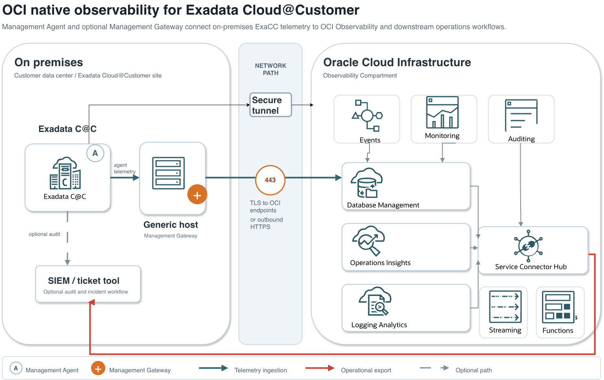

## Prerequisite

1.  The OCI Management Gateway is optional, but it is necessary if you prefer not to establish a direct connection between the ExaCC server and the OCI endpoint. You can also use an existing server, provided it meets the [required specifications](https://docs.oracle.com/en-us/iaas/management-agents/doc/perform-prerequisites-deploying-management-gateway.html#GUID-9A23648C-001C-4F57-A9D0-840DF069939A).
2.  **Network Connectivity**

- From the target server to the Cloud Management Gateway, open TCP port 4480 (this port can be changed, but I’ll use the default in this tutorial).
- From the Cloud Management Gateway to OCI, open TCP port 443 to the OCI endpoint.

    https://loganalytics.<OCI_REGION>.oci.oraclecloud.com
    https://operationsinsights.<OCI_REGION>.oci.oraclecloud.com
    https://auth.<OCI_REGION>.oci.oraclecloud.com
    https://telemetry-ingestion.<OCI_REGION>.oci.oraclecloud.com
    https://certificates.<OCI_REGION>.oci.oraclecloud.com
    https://certificatesmanagement.<OCI_REGION>.oci.oraclecloud.com
    https://management-agent.<OCI_REGION>.oci.oraclecloud.com

## IAM Policy Customization Considerations

The policies listed below represent a reference configuration required to enable OCI Database Management, Operations Insights, Log Analytics, Dashboards, and Alerts for Exadata Cloud@Customer environments.

Many of these permissions are granted at the **tenancy level** to simplify deployment and ensure all observability services can function correctly. However, in production environments, organizations typically implement compartment-based resource segregation and role-based access controls to restrict visibility and administrative privileges according to operational responsibilities.

As a result, the sample policies should be reviewed and customized based on:

* Compartment structure and resource ownership.
* Environment separation (Development, Test, UAT, Production).
* Application or business-unit boundaries.
* Security, compliance, and segregation-of-duties requirements.
* Database administration and observability team responsibilities.

In particular, permissions assigned to the **obs_admin** group may need to be scoped to specific compartments rather than the entire tenancy to ensure administrators can only access and manage the databases, observability resources, dashboards, agents, logs, and alerts that fall within their authorized scope.

Similarly, dynamic groups such as **obs_agent** and **Credential_Dynamic_Group** should be reviewed to ensure they are granted only the minimum permissions required for certificate management, vault access, agent lifecycle operations, and log ingestion.

The policies provided in this document should therefore be considered a baseline implementation and may require tenancy-specific adjustments before deployment in production environments.

## OCI Policies and Group

1.  *Define Observability Admin admin user: obs_admin*
2.  *Define Dynamic Group for mng agent: obs_agent (required by Logging analytics)*

    ALL {resource.type='managementagent'}

3. Create Credential_Dynamic_Group with below rule:

    ALL  {resource.type='certificateauthority'}

3. *Policies*

For Agents

    Allow DYNAMIC-GROUP Credential_Dynamic_Group to USE certificate-authority-delegates in compartment <>
    Allow DYNAMIC-GROUP Credential_Dynamic_Group to USE vaults in tenancy
    Allow DYNAMIC-GROUP Credential_Dynamic_Group to USE keys in tenancy
    Allow DYNAMIC-GROUP obs_agent to READ certificate-authority-bundle in tenancy
    Allow DYNAMIC-GROUP obs_agent to READ leaf-certificate-bundle in tenancy
    Allow DYNAMIC-GROUP obs_agent to MANAGE certificate-authorities in tenancy where  any{request.permission='CERTIFICATE_AUTHORITY_CREATE', request.permission='CERTIFICATE_AUTHORITY_INSPECT', request.permission='CERTIFICATE_AUTHORITY_READ'} 
    Allow DYNAMIC-GROUP obs_agent to MANAGE leaf-certificates in tenancy where  any{request.permission='CERTIFICATE_CREATE', request.permission='CERTIFICATE_INSPECT', request.permission ='CERTIFICATE_UPDATE', request.permission='CERTIFICATE_READ'}
    Allow DYNAMIC-GROUP obs_agent to MANAGE vaults in tenancy where any{request.permission='VAULT_CREATE', request.permission='VAULT_INSPECT', request.permission='VAULT_READ', request.permission='VAULT_CREATE_KEY', request.permission='VAULT_IMPORT_KEY', request.permission='VAULT_CREATE_SECRET'} 
    Allow DYNAMIC-GROUP obs_agent to MANAGE keys in tenancy where any{request.permission='KEY_CREATE', request.permission='KEY_INSPECT', request.permission='KEY_READ'} 
    Allow DYNAMIC-GROUP obs_agent to USE certificate-authority-delegates in tenancy
    Allow DYNAMIC-GROUP obs_agent to USE key-delegate in tenancy 
    Allow DYNAMIC-GROUP obs_agent TO MANAGE leaf-certificates in tenancy <> where all{request.permission='CERTIFICATE_DELETE', target.leaf-certificate.name=request.principal.id}

For OCI Database Management

    Allow group obs_admin to manage dbmgmt-private-endpoints in tenancy
    Allow group obs_admin to read dbmgmt-work-requests in tenancy
    Allow group obs_admin to manage dbmgmt-family in tenancy
    Allow group obs_admin to use database-family in tenancy
    Allow group obs_admin to manage vnics in tenancy
    Allow group obs_admin to use subnets in tenancy
    Allow group obs_admin to use network-security-groups in tenancy
    Allow group obs_admin to use security-lists in tenancy
    Allow group obs_admin to manage virtual-network-family in tenancy
    Allow group obs_admin to manage secret-family in tenancy

For Operations Insights

    allow service operations-insights to use ons-topics in tenancy
    allow service operations-insights to read autonomous-database-family in tenancy where ALL{request.operation='GenerateAutonomousDatabaseWallet'}
    allow service operations-insights to read secret-family in tenancy
    allow group obs_admin to manage opsi-family in tenancy
    allow group obs_admin to manage management-dashboard-family in tenancy
    allow group obs_admin to use autonomous-database-family in tenancy
    allow group obs_admin to manage virtual-network-family in tenancy
    allow group obs_admin to read secret-family in tenancy
    allow group obs_admin to use database-family in tenancy
    allow group obs_admin to manage virtual-network-family in tenancy
    allow group obs_admin to manage management-agents in tenancy
    allow group obs_admin to inspect ons-topic in tenancy
    allow group obs_admin to manage management-agent-install-keys in tenancy
    allow group obs_admin to manage instance-family in tenancy
    allow group obs_admin to read instance-agent-plugins in tenancy

For Logging Analytics

    allow service loganalytics to use metrics in tenancy
    allow service loganalytics to READ loganalytics-features-family in tenancy
    allow group obs_admin to MANAGE loganalytics-features-family in tenancy
    allow group obs_admin to read compartments in tenancy
    allow group obs_admin to manage loganalytics-ingesttime-rule in tenancy
    allow group obs_admin to MANAGE management-agents in tenancy
    allow group obs_admin to MANAGE management-agent-install-keys in tenancy
    allow group obs_admin to READ METRICS in tenancy
    allow group obs_admin to READ USERS in tenancy
    allow dynamic-group obs_agent to use METRICS in tenancy
    allow dynamic-group obs_agent to {LOG_ANALYTICS_LOG_GROUP_UPLOAD_LOGS} in tenancy

If the dynamic group is under a Domain (ex. MyDomain) use

    allow dynamic-group MyDomain/obs_agent to use METRICS in tenancy
    allow dynamic-group MyDomain/obs_agent to {LOG_ANALYTICS_LOG_GROUP_UPLOAD_LOGS} in tenancy

For Dashboard/Alerts

    allow group obs_admin to manage management-dashboard in tenancy
    allow group obs_admin to manage management-saved-search in tenancy
    allow group obs_admin to read metrics in tenancy
    allow group obs_admin to read alarms in tenancy

## Management Gateway Installation

Create the Registration Key. Go to → Observability and Management →Management Agents → Download and Keys

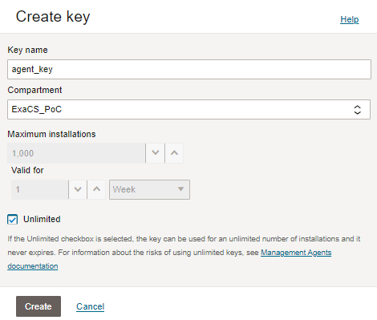

Copy The registration key

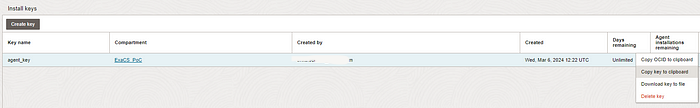

Download the agent from OCI Console Observability and Managment to each single box

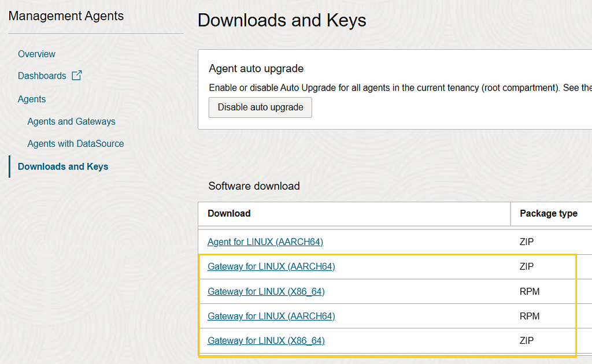

On the box install the gateway

    sudo su -
    cd /tmp/OM/
    cat<<EOF>/tmp/OM/input.rsp
    managementAgentInstallKey = <key you created above>
    CredentialWalletPassword = <password>
    EOF
    chmod -R ugo+rw /tmp/OM/input.rsp
    unzip oracle.mgmt_gateway.<version>.Linux-x86_64.zip
    ./installer.sh 
    sudo /opt/oracle/mgmt_agent/agent_inst/bin/setupGateway.sh opts=/tmp/OM/input.rsp

## Management Agent Installation

On each VMCluster Node:

Download the agent from OCI Console Observability and Managment to each single box

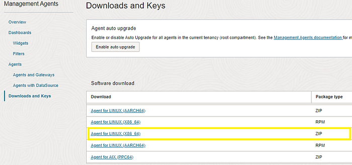

On the box install the agent ([**Doc ID 3015115.1**](https://support.oracle.com/epmos/faces/DocumentDisplay?_afrLoop=455266221038386&id=3015115.1&_afrWindowMode=0&_adf.ctrl-state=78xw71hh9_4)**)**

    sudo mkdir -p /devext/oracle/mgmt_agent
    cat<<EOF>/devext/oracle/mgmt_agent/input.rsp
    managementAgentInstallKey = <key you created above>
    CredentialWalletPassword = <password>
    GatewayServerHost = <
    GatewayServerPort = 4480
    EOF
    cd /devext/oracle/mgmt_agent
    sudo ln -s /devext/oracle/mgmt_agent /opt/oracle/mgmt_agent

    unzip oracle.mgmt_agent.<version>.Linux-x86_64.zip

    sudo /bin/bash
    export OPT_ORACLE_SYMLINK=true
    ./installer.sh ./input.rsp

    usermod -a -G asmadmin mgmt_agent
    usermod -a -G oinstall mgmt_agent

Now you can see the agent check-in Observability and Management →Management Agent. Click on the three dots and enable OpsInsight and Database management and Logging Analytics Plugin

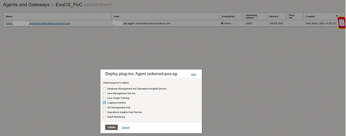

## Create the Monitor user

Create a user on each CDB

Download grantPrivileges.sql (MOS [DocID **2857604.1**](https://support.oracle.com/epmos/faces/SearchDocDisplay?_adf.ctrl-state=1dhr4uuluw_4&_afrLoop=105039164570647#BODYTEXT)) and run on the Container Database

    sqlplus sys/<password>@(DESCRIPTION=(ADDRESS_LIST=(ADDRESS=(PROTOCOL=TCP)(HOST=<host>.<domain>)(PORT=1521)))(CONNECT_DATA=(SERVICE=<CDB Servicename>))) as sysdba @grantPrivileges.sql C##OCI_MON_USER <password> N Y N> grantPrivileges.log
    sqlplus sys/<password>@(DESCRIPTION=(ADDRESS_LIST=(ADDRESS=(PROTOCOL=TCP)(HOST=<host>.<domain>)(PORT=1521)))(CONNECT_DATA=(SERVICE=<CDB Servicename>))) as sysdba @grantPrivileges.sql C##OCI_MON_USER <password> Y Y N> grantPrivileges.log

For each PDB/CDB

    ALTER SESSION SET CONTAINER=pdb1;
    GRANT CREATE PROCEDURE to C##OCI_MON_USER;
    GRANT SELECT ANY DICTIONARY, SELECT_CATALOG_ROLE to C##OCI_MON_USER;
    GRANT ALTER SYSTEM to C##OCI_MON_USER;
    GRANT ADVISOR to C##OCI_MON_USER;
    GRANT EXECUTE ON DBMS_WORKLOAD_REPOSITORY to C##OCI_MON_USER;

6\. Create a secret key for C##OCI_MON_USER password (No for Autonomous)

Go to Identity&Security → Key Management →Secret Management

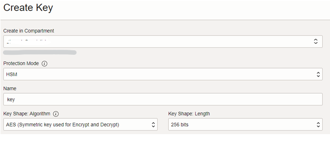

Go to Identity&Security → Key Management & Secret Management → Create a key → Create a secret for C##OCI_MON_USER password

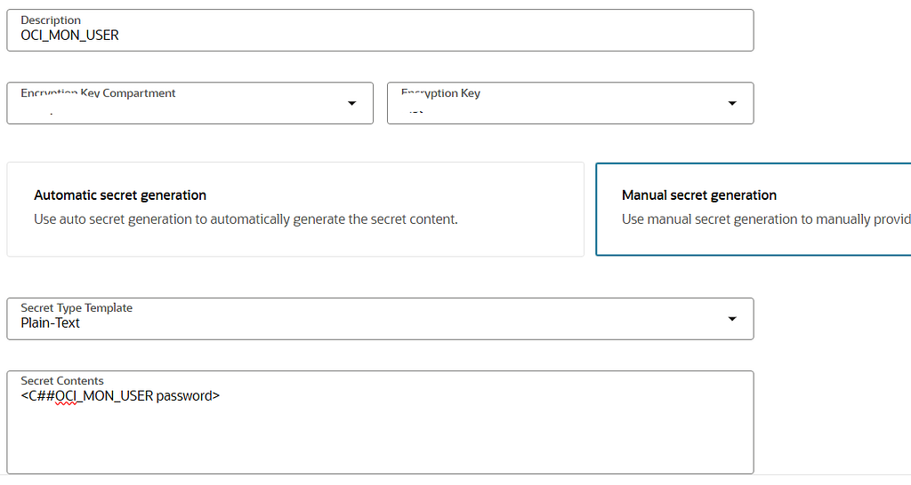

## Enable Database Management

Go to Observability →Database Management →Administration → Managed databases

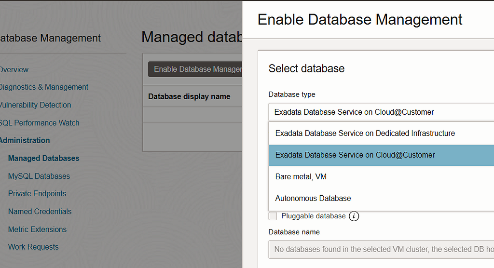

Select the user secret key you have just created

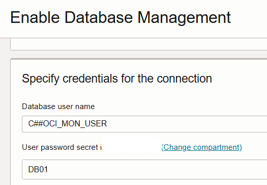

First you need to register CDB after that you repeat the steps for each PDB.

## Enable OpsInsight

Go to Observability →OpsInsight→Administration → Exadata Fleet. Select Cloud Infrastructure, ExaDB-C@C

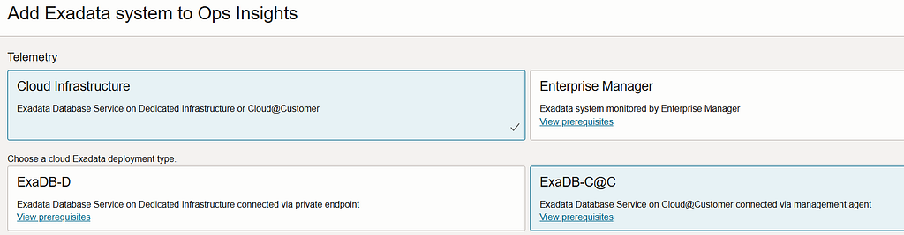

Specify the same credentiols you use for Database management. OpsInsight will be enabled on all PDB of the specified CDB.

## Enable Log Analytics

Create the log group mngt-log-group (Observability →Logging analytics →Administration → LogGroup)

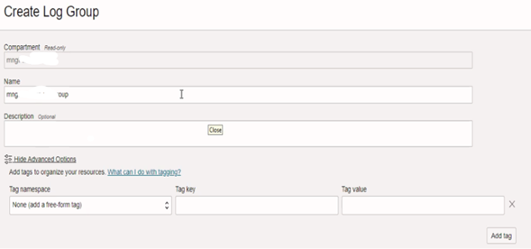

Check if these property are there. If they are not, add them

Database Istance

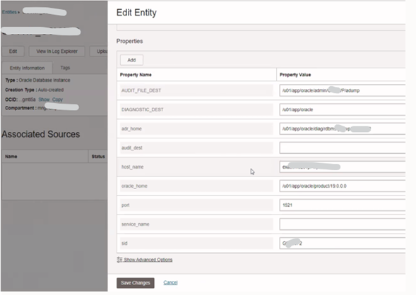

Cluster Node

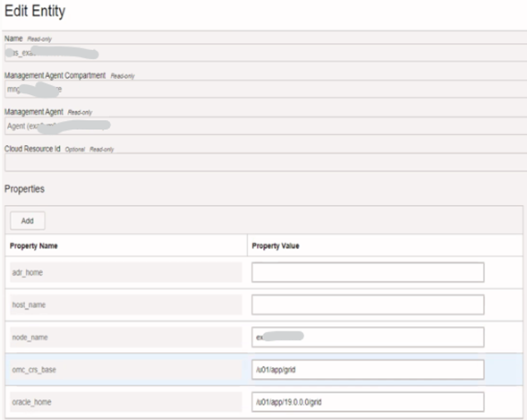

Listener

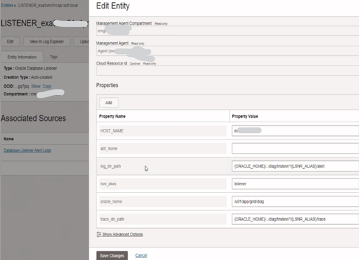

Select the entity and chose the files you want to import

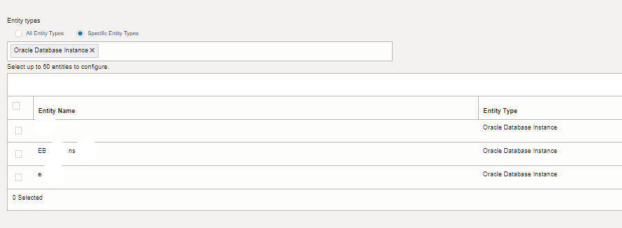

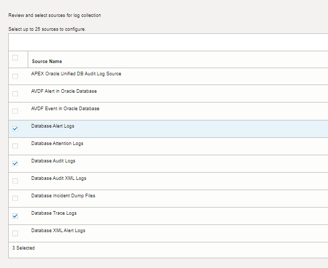

16\. Check the Collection Warning.

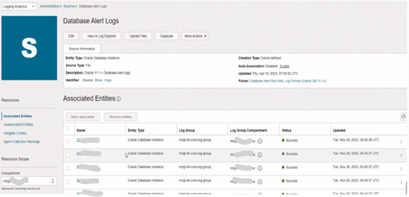

As it is the first time you ingest log you can get large “Directory errors”. If it happens modify the agent properties on the Exa Server

    [root@exa ~]# tail -1 /opt/oracle/mgmt_agent/agent_inst/config/emd.properties
    loganalytics.enable_large_dir=true
    [root@exa ~]# systemctl stop mgmt_agent
    [root@exa ~]# systemctl start mgmt_agent
    [root@exa ~]#
