# OCI Observability for OCI native database deploments


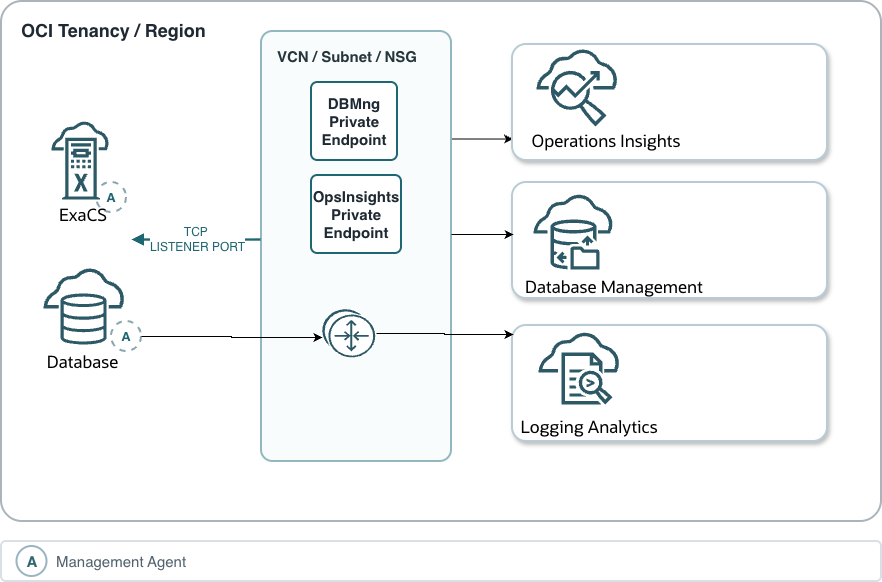

In this article describes how to implement Observability capabilities on OCI Oracle database and ExaCS. The services allow you to create alert based on metrics automatically produced by database itself or specific message from the alert logs. It is also possible prevents issues like high resource utilization creating early warning alert to knows days in advance which systems is running out of resource.

This document will guide you through the activation of the different services (Database Management, Ops Insights and Log Analytics) and suggest actions like Alert creation.


## Requirements

1. Define Observability Admin admin user: obs_admin
2. Define Dynamic Group for mng agent: obs_agent (required by Log analytics)

```text
ALL {resource.type='managementagent'}
```

3. Policies


#### IAM Policy Considerations

The sample IAM policies provided for OCI Database Management, Operations Insights, Log Analytics, Dashboards, and Alerts are intended as a reference implementation and grant permissions at the **tenancy level** to simplify deployment and onboarding.

In production environments, these policies should be reviewed and customized to align with the organization's **tenancy structure, compartment hierarchy, and segregation-of-duties requirements**. Most enterprises organize resources across multiple compartments, environments (e.g., Development, Test, Production), business units, or teams, and not all OCI users or administrators should have visibility into or management privileges for all observability resources across the tenancy.

As a result, permissions granted to groups such as **obs_admin** and dynamic groups such as **obs_agent** should be scoped to the appropriate compartments whenever possible, following the principle of least privilege. This ensures that administrators and operators can manage and monitor only the databases, agents, dashboards, logs, and observability resources that fall within their area of responsibility.

The final IAM design should therefore be adapted to:

* The organization's compartment and resource segregation model.
* Environment separation requirements (Development, Test, Production, etc.).
* Team and application ownership boundaries.
* Security and compliance requirements governing access to operational and monitoring data.

The policies included in this addon should be considered a baseline starting point and may require compartment-level scoping, group separation, or additional access restrictions before deployment in a production environment.


### For OCI Database Management


```text
Allow service dpd to read secret-family in tenancy
Allow group obs_admin to manage dbmgmt-private-endpoints in tenancy
Allow group obs_admin to read dbmgmt-work-requests in tenancy
Allow group obs_admin to manage dbmgmt-family in tenancy
Allow group obs_admin to use database-family in tenancy
Allow group obs_admin to manage vnics in tenancy
Allow group obs_admin to use subnets in tenancy
Allow group obs_admin to use network-security-groups in tenancy
Allow group obs_admin to use security-lists in tenancy
Allow group obs_admin to manage virtual-network-family in tenancy
Allow group obs_admin to manage secret-family in tenancy
```

### For Operations Insights

```text
allow service operations-insights to use ons-topics in tenancy
allow service operations-insights to read autonomous-database-family in tenancy where ALL{request.operation='GenerateAutonomousDatabaseWallet'}
allow service operations-insights to read secret-family in tenancy
allow group obs_admin to manage opsi-family in tenancy
allow group obs_admin to manage management-dashboard-family in tenancy
allow group obs_admin to use autonomous-database-family in tenancy
allow group obs_admin to manage virtual-network-family in tenancy
allow group obs_admin to read secret-family in tenancy
allow group obs_admin to use database-family in tenancy
allow group obs_admin to manage virtual-network-family in tenancy
allow group obs_admin to manage management-agents in tenancy
allow group obs_admin to inspect ons-topic in tenancy
allow group obs_admin to manage management-agent-install-keys in tenancy
allow group obs_admin to manage instance-family in tenancy
allow group obs_admin to read instance-agent-plugins in tenancy
```

### For Logging Analytics

```text
allow service loganalytics to use metrics in tenancy
allow service loganalytics to READ loganalytics-features-family in tenancy
allow group obs_admin to MANAGE loganalytics-features-family in tenancy
allow group obs_admin to read compartments in tenancy
allow group obs_admin to manage loganalytics-ingesttime-rule in tenancy
allow group obs_admin to MANAGE management-agents in tenancy
allow group obs_admin to MANAGE management-agent-install-keys in tenancy
allow group obs_admin to READ METRICS in tenancy
allow group obs_admin to READ USERS in tenancy
allow dynamic-group obs_agent to use METRICS in tenancy
allow dynamic-group obs_agent to {LOG_ANALYTICS_LOG_GROUP_UPLOAD_LOGS} in tenancy
```

If the dynamic group is under a Domain (ex. Default) use

```text
allow dynamic-group Default/obs_agent to use METRICS in tenancy
allow dynamic-group Default/obs_agent to {LOG_ANALYTICS_LOG_GROUP_UPLOAD_LOGS} in tenancy
```

### For Dashboard/Alerts

```text
allow group obs_admin to manage management-dashboard in tenancy
allow group obs_admin to manage management-saved-search in tenancy
allow group obs_admin to read metrics in tenancy
allow group obs_admin to read alarms in tenancy
```

4. For Logging Analytics. Be sure the DBCS and ExaCS are in a VCN with a Service Gateway delivered. Service Gateway is needed to get logs from the boxes to Logging Analytics.

5. Create a user on each CDB (no needed for Autonomous)

Download grantPrivileges.sql (MOS DocID 2857604.1) and run on the Container Database

```text
sqlplus sys/<password>@(DESCRIPTION=(ADDRESS_LIST=(ADDRESS=(PROTOCOL=TCP)(HOST=<host>.<domain>)(PORT=1521)))(CONNECT_DATA=(SERVICE=<CDB Servicename>))) as sysdba @grantPrivileges.sql C##OCI_MON_USER <password> N Y N> grantPrivileges.log
sqlplus sys/<password>@(DESCRIPTION=(ADDRESS_LIST=(ADDRESS=(PROTOCOL=TCP)(HOST=<host>.<domain>)(PORT=1521)))(CONNECT_DATA=(SERVICE=<CDB Servicename>))) as sysdba @grantPrivileges.sql C##OCI_MON_USER <password> Y Y N> grantPrivileges.log
```

For each PDB/CDB

```sql
ALTER SESSION SET CONTAINER=pdb1;
GRANT CREATE PROCEDURE to C##OCI_MON_USER;
GRANT SELECT ANY DICTIONARY, SELECT_CATALOG_ROLE to C##OCI_MON_USER;
GRANT ALTER SYSTEM to C##OCI_MON_USER;
GRANT ADVISOR to C##OCI_MON_USER;
GRANT EXECUTE ON DBMS_WORKLOAD_REPOSITORY to C##OCI_MON_USER;
```

6. Create a secret key for C##OCI_MON_USER password (No for Autonomous)

Go to Identity&Security → Key Management →Secret Management

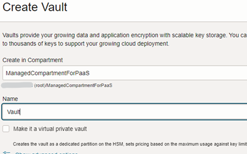


Go to Identity&Security → Key Management & Secret Management → Create a key → Create a secret for C##OCI_MON_USER password

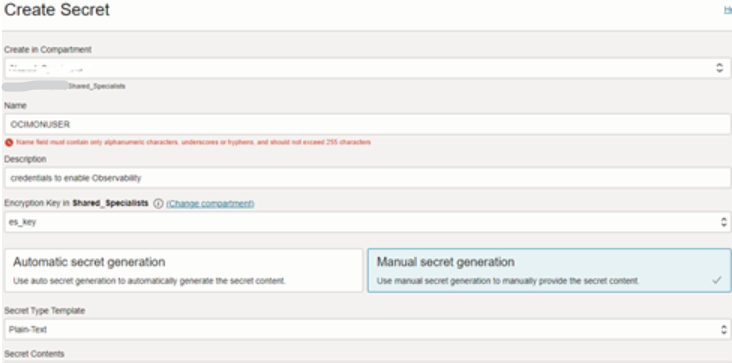

7. Create Private End Point for Database Management

Go to Observability&Management → Database Management → Administration →Private End Point →Create End Point

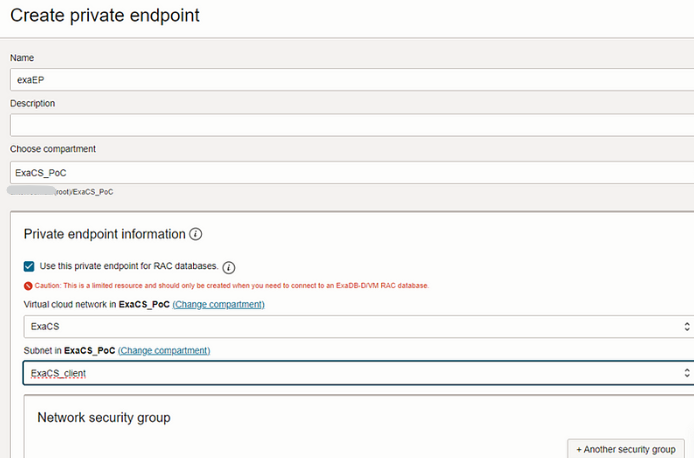

If you are creating for RAC database or ExaCS select the “use private endpoint”

Go to Observability&Management →Operations Insights →Administration →Private End Point → Create End Point

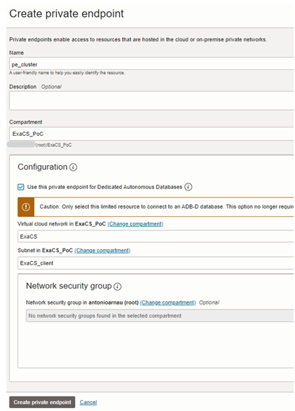

If you are creating for RAC database or ExaCS select the “use private endpoint”

There are several ways to configure the connectivity between the target DB and Private Endpoint. Here you can find the official doc. In this tutorial, I modify the Target Security list so the Private Endpoint network can reach the Target network on 1521 on both way.

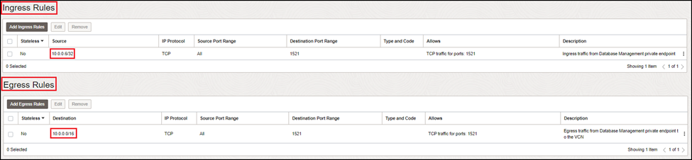

## Enable Database Management for DBCS/ExaCS

( For each Database you want to enable) Go to Oracle Database →Oracle Exadata Database Service on Dedicated Infrastructure →Exadata VM Clusters →Exadata VM Cluster Details →Database Home Details →Database Details

or in case you are enabling on DBCS

( For each Database you want to enable) Go to Oracle Database → Oracle Base Database →DB Systems →DB System Details →Database Details

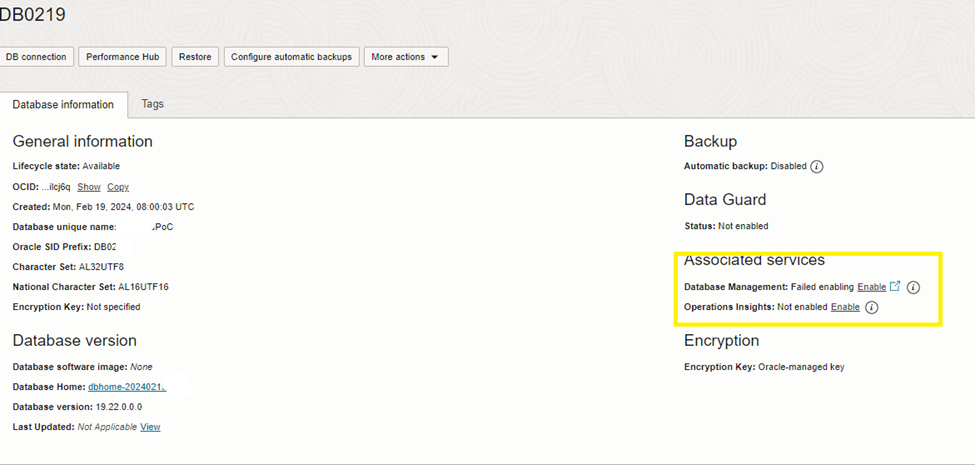

Select Database Management Enable

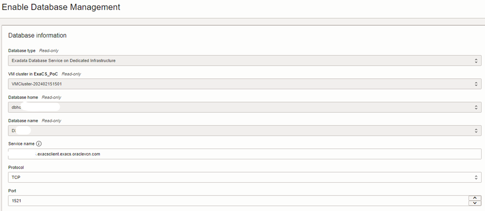

Select ADD Policy

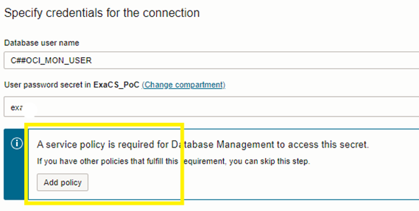

Once the Policy has been added, insert the username and the Secret for the user you created in the requirement session

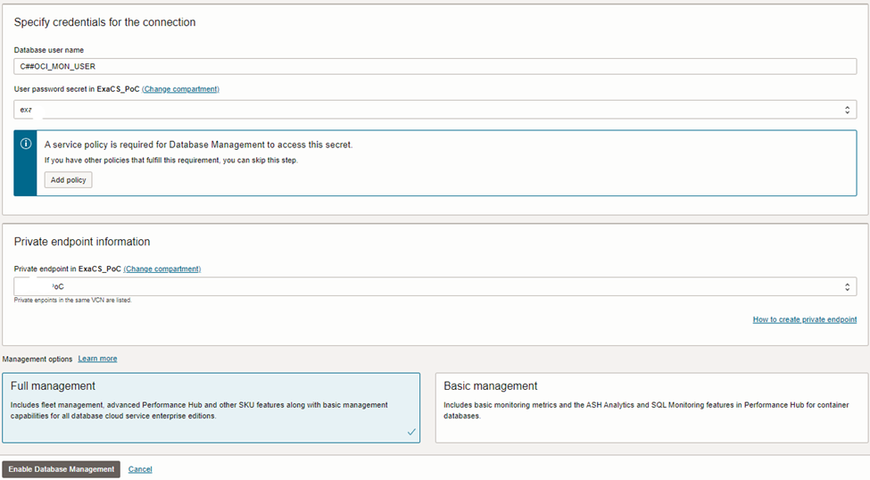

Select Full Management (here you can see the difference between the Basic/ and Full)

Become a Medium member

(For each Pluggable Database) Go to Oracle Database →Oracle Exadata Database Service on Dedicated Infrastructure →Exadata VM Clusters →Exadata VM Cluster Details →Database Home Details →Database Details →Pluggable Database

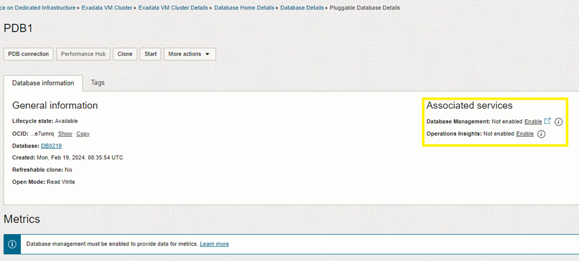

To identify the PDB service name use lsnrctl status

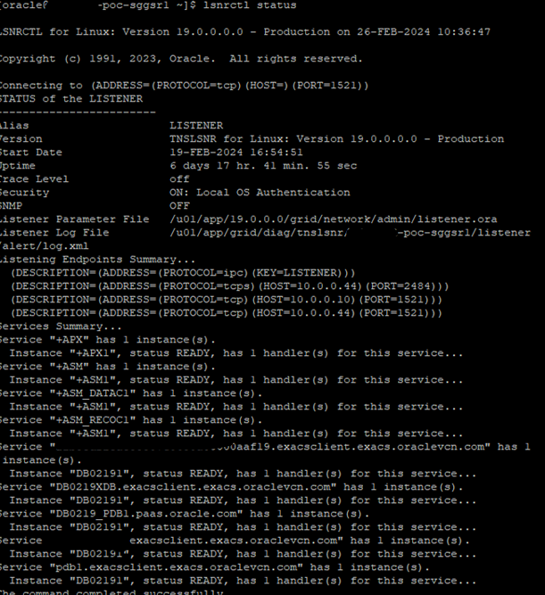

## Enable Operations Insights for ExaCS/DBCS

Operations Insight can be enabled on all ExaCS, CDB, PDB in one single step. Go to Observability&Management →Operations Insights →Administration →Add database

for ExaCS select Exadata Database, for DBCS select Bare metal, virtual machine

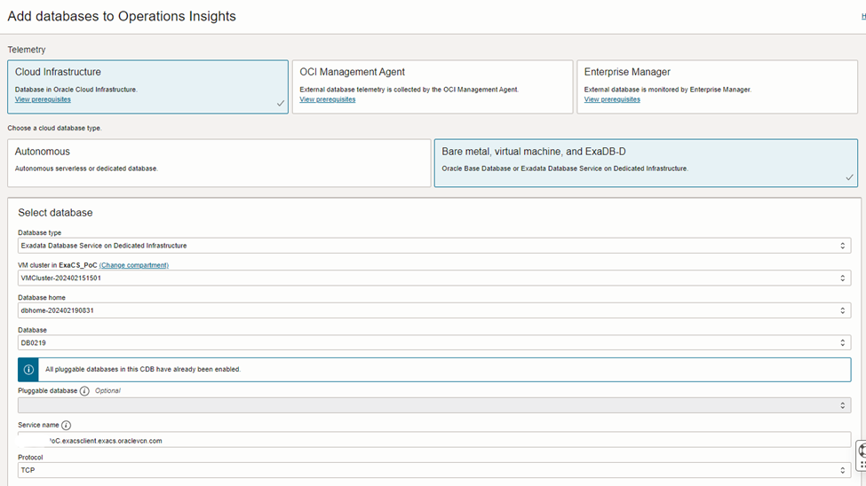

Insert the credentials created in the prereq section

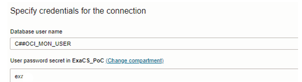

## Enable Logging Analytics for ExaCS/DBCS

ExaCS and DBCS logs contain several informations about the systems that can’t be ignored if you want a full Observability. To get ExaCS and DBCS logs analyzed is necessary to push them into OCI Logging Analytics. There are several ways, in this blog I will show you how to do it by installing the Management Agents.

Create the Registration Key. Go to → Observability and Management →Management Agents → Download and Keys


Copy The registration key

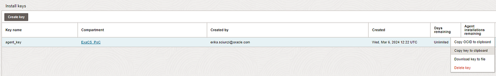

Download the agent from OCI Console Observability and Managment to each single box

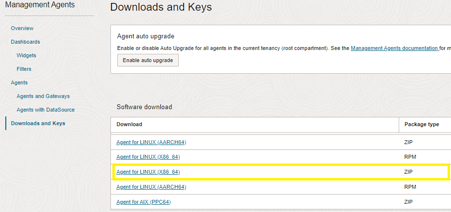

On the box install the agent

```sh
sudo su -
cd /tmp/OM/
cat<<EOF>/tmp/OM/input.rsp
managementAgentInstallKey = <key you created above>
CredentialWalletPassword = <password>
EOF
chmod -R ugo+rw /tmp/OM/input.rsp
unzip oracle.mgmt_agent.<version>.Linux-x86_64.zip
./installer.sh /tmp/OM/input.rsp

### add the mgmt_agent to oinstall
usermod -a -G oinstall,asmadmin mgmt_agent

sudo systemctl stop mgmt_agent
sudo systemctl start mgmt_agent
```

Now you can see the agent check-in Observability and Management →Management Agent. Click on the three dots and enable Logging Analytics Plugin

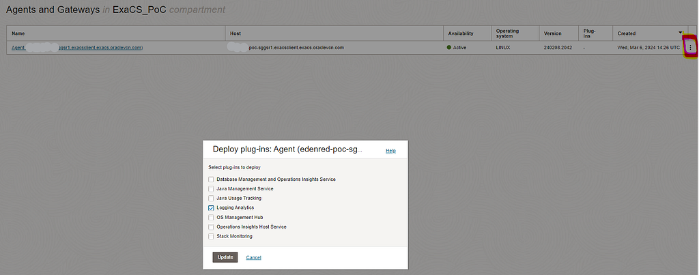

Create a Logging Analytics log Group. Go to Observability and Management → Logging Analytics → Administration and Select Log Group

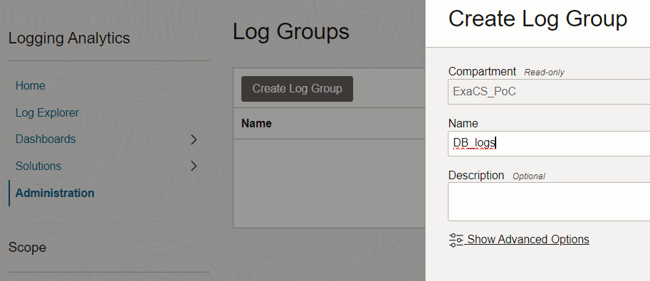

Create Database Entity. Go to Observability and Management → Logging Analytics → Administration and Select Create Entity

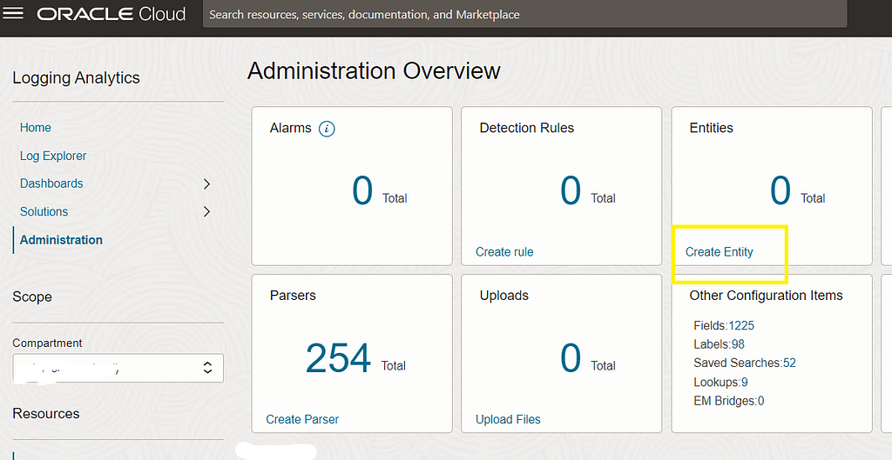

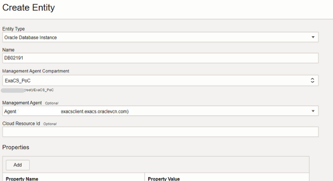

To get alerts, traces logs populate the Properties adr_home

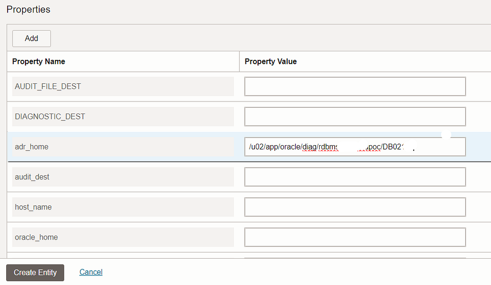

Go to Observability and Management → Logging Analytics → Administration and Select Add Data

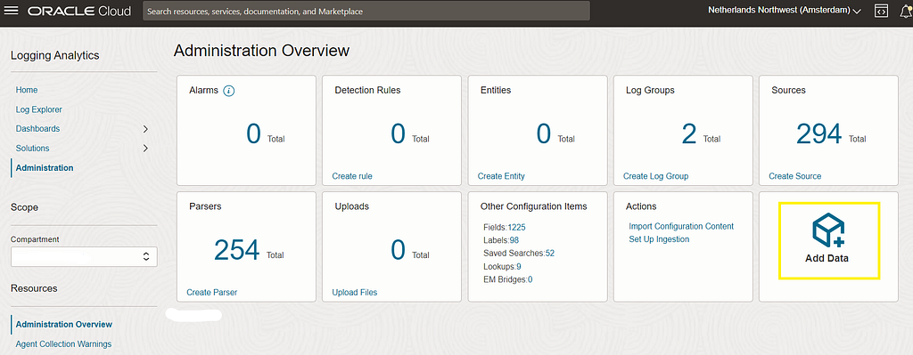

Select Custom Selection

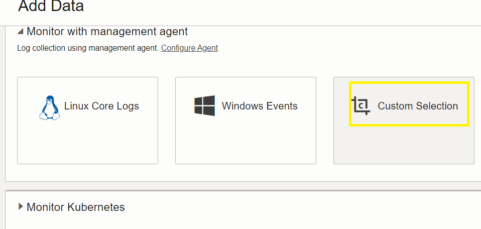

Select the entity you have just created

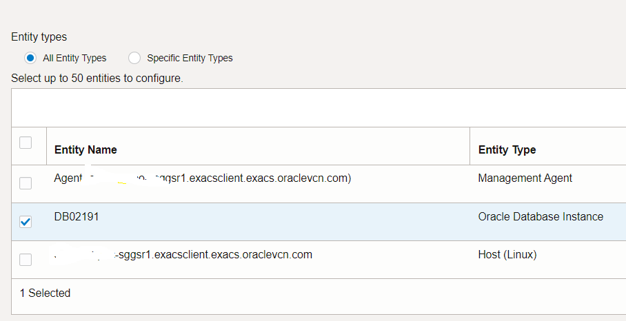

Select Database and Trace logs

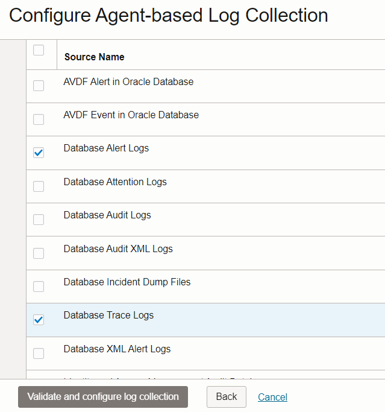

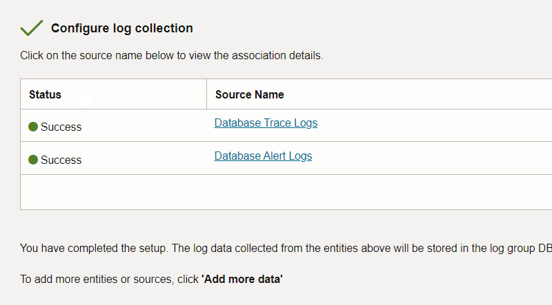

Wait 5 minutes and then go on the Log Explorer. You will see the logs are there and you can start analyzing them.

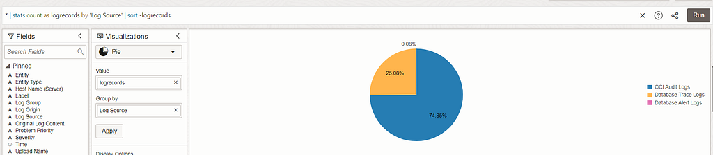

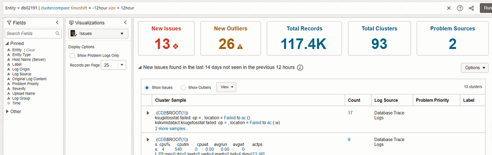

For more logs and dashboard, you can use the Knowledge Content GitHub.
