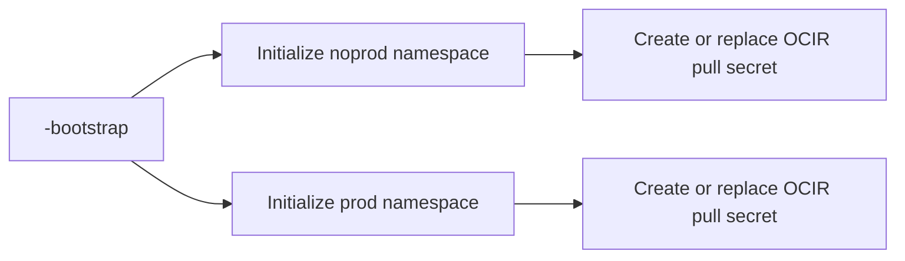

# Application Bootstrap

`<application>-bootstrap` is the manual, idempotent deployment pipeline used to prepare an application's namespaces and private-image pull secret.

The noprod and prod shell stages both use the pipeline root as their predecessor, so a normal pipeline run executes them in parallel. OCI single-stage deployment can run either stage independently when only one cluster should be initialized or repaired.

## Parameters

Each application bootstrap pipeline has only three parameters:

- `registry_username`: OCIR pull username, for example `<tenancy-namespace>/oracleidentitycloudservice/user@example.com`.
- `pull_password_secret_ocid`: OCI Vault secret OCID containing the OCIR pull password or auth token.
- `secret_name`: Kubernetes docker-registry secret name, default `ocirsecret`.

Cluster OCIDs and namespaces are not user parameters. Terraform fixes them through stage tags and the configured noprod/prod OKE inputs, preventing a stage from initializing a namespace on the wrong cluster.

## How It Works

Each stage:

1. Resolves its application, cluster, and namespace from OCI DevOps stage tags.
2. Selects the configured noprod or prod cluster OCID.
3. Creates kubeconfig using the OKE private endpoint.
4. Creates the namespace idempotently.
5. Reads the OCIR credential from OCI Vault.
6. Replaces only the configured docker-registry secret.

The shell runner uses the worker subnet and optional worker NSG belonging to its target cluster. The component chart ServiceAccount references the pull secret explicitly; bootstrap does not modify the namespace default ServiceAccount.

## Lifecycle Boundary

Bootstrap does not package or deploy Helm charts. Application baseline changes belong exclusively to `<application>-package` and `<application>-deploy`, while component workloads use their own delivery pipelines.

Run bootstrap after the stack creates a new application, when rotating the OCIR credential, or when repairing a missing namespace or pull secret. Repeated runs are safe.

## Troubleshooting

For `ImagePullBackOff`, verify that the relevant bootstrap stage succeeded, the Vault secret contains the actual OCIR token, the Kubernetes secret has type `kubernetes.io/dockerconfigjson`, and the component ServiceAccount references the configured secret name.
