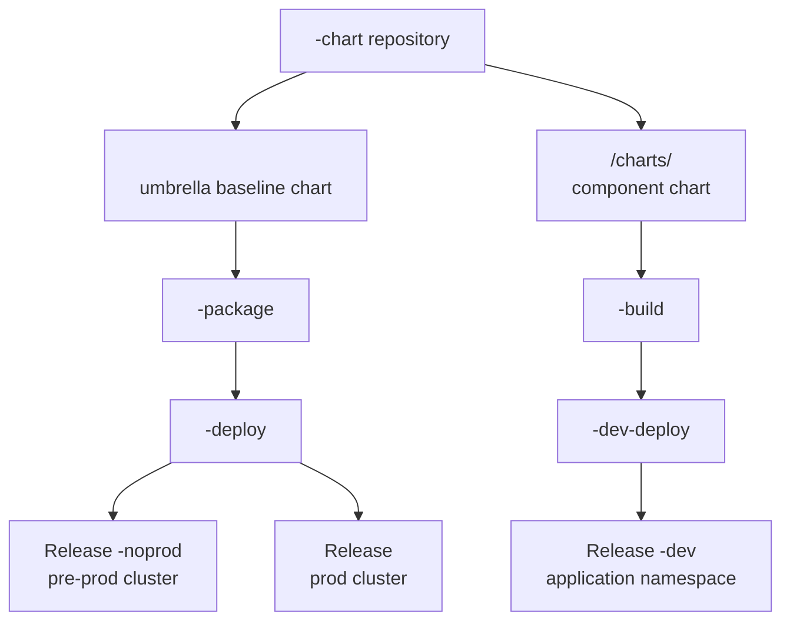
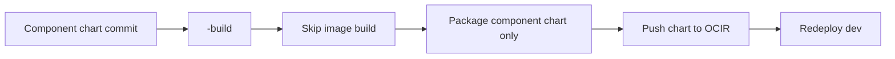

# Chart Lifecycle

The solution separates the application baseline chart from component charts.



## Application Baseline Chart

The umbrella chart is named after the application, for example `sample-app` or `shop`.

It owns namespace-wide resources that are common to all components in the application. It has no component dependencies and should not be used to deploy component workloads in this starter flow.

The chart repository keeps standalone component charts under `<application>/charts`, but the umbrella chart's `.helmignore` excludes that directory when the baseline is loaded or packaged. Adding a component therefore does not require changing the umbrella `Chart.yaml` or `values.yaml`.

When umbrella chart files change under `<application>/**`, excluding `<application>/charts/**`:

1. OCI DevOps triggers `<application>-package`.
2. The pipeline packages only the umbrella chart.
3. The pipeline triggers `<application>-deploy`.
4. The baseline deploy installs noprod release `<application>-noprod`.
5. After approval, it installs prod release `<application>`.

Noprod and prod baseline values are cluster-specific. They are not dev/staging/prod component values.

## Component Charts



Each component chart lives under the application chart repository:

```text
<application>/charts/<component>
```

The component chart is published as its own OCI Helm chart and deployed directly by component deployment pipelines.

When component chart files change:

1. OCI DevOps triggers `<component>-build`.
2. The pipeline packages only that component chart.
3. The dev component release is redeployed.

The application umbrella chart version and component chart versions are independent. A component chart change should not require editing the parent `Chart.yaml`.

## Why Split Them

The umbrella chart gives the application one place for shared namespace resources. Component deploys stay fast and focused because they do not reinstall every component in the application.

This also lets dev and staging releases for the same component coexist in the same namespace, while prod can use a separate cluster and a cleaner release name.
