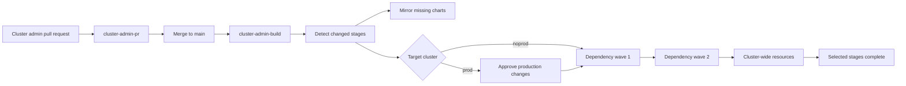

# Cluster Administration

The cluster-administration workflow is independent of application promotion. Configuration is organized by physical OKE cluster, with one OCI DevOps deployment pipeline for `noprod` and one for `prod`.

Enable the workflow with the Resource Manager `enable_cluster_admin` toggle. It defaults to disabled so developer-only stacks do not create operational repositories, artifacts, or pipelines. Disabling it later removes the OCI resources managed by this feature but does not uninstall deployed Helm releases or delete live Kubernetes objects.



## Repository Layout

```text
catalog/
  tools.yaml
clusters/
  noprod/
    baseline/
    tools/
      cert-manager/
        tool.yaml
        values.yaml
        resources/
      traefik/
        tool.yaml
        values.yaml
        resources/
        verify.sh
  prod/
    baseline/
    tools/
```

`catalog/tools.yaml` is generated from the Resource Manager tool definitions and pins public chart repositories and versions. Change chart coordinates through the stack input rather than editing this generated file. The mirror pipeline copies missing versions into:

```text
<devops-project>/charts/cluster-tools/<chart>
```

The target path uses the upstream chart name because Helm derives the OCI repository name from chart metadata. The logical tool name remains the pipeline, stage, namespace-default, and tagging identity.

The mirror pipeline removes only non-ASCII chart annotations before pushing because OCIR normalizes that OCI manifest metadata. Chart templates, values, dependencies, and runtime behavior are unchanged.

Chart sources may be traditional `https://` Helm repositories or `oci://` repository base paths. HTTPS sources use `helm repo add`; OCI sources are pulled directly from `<repository>/<chart>`. Public OCI sources require no extra credentials. Private sources require credentials already available to Helm; the standard pipeline authenticates only to the target OCIR registry.

## Tool Dependencies

Each `tool.yaml` declares its namespace and direct prerequisites:

```yaml
name: traefik
namespace: traefik
depends_on:
  - cert-manager
```

The same dependency must be present in the shared Resource Manager `cluster_administration.tools` input because both cluster paths use the same topology. Validation rejects unknown dependencies, self-dependencies, duplicates, and cycles.

Independent changed tools run in parallel. A selected tool waits for selected prerequisites, and changing a prerequisite also selects its downstream dependents.

## Deployment Pipelines

Both cluster pipelines use the same orchestration pattern:

- `cluster-admin-noprod` contains one root shell orchestrator.
- `cluster-admin-prod` contains one mandatory manual approval followed by the same shell orchestrator.

The build publishes each validated cluster deployment plan as an immutable Generic Artifact versioned by the exact Git commit. The orchestrator downloads that plan and commit, validates the complete repository structure, downloads immutable values artifacts, performs atomic Helm upgrades in dependency waves, applies supplemental resources, runs optional verification scripts, and applies selected baseline resources last.

Both orchestration stages reuse `cluster-admin-deploy-command-spec`. Explicit removal pipelines reuse `cluster-admin-decommission-command-spec`.

Each cluster pipeline exposes only three stable parameters: `config_commit`, `cluster_id`, and `cluster_name`. No per-tool parameters or OCI stages are required because each orchestrator derives its selected plan from `config_commit`.

Dependency ordering is enforced inside each orchestrator. Independent tools run in parallel topological waves, and each tool's Helm action precedes its supplemental resources.

Merge through the repository so `cluster-admin-build` computes and publishes the exact change set. A manual cluster run must provide a full `config_commit` whose immutable deployment-plan artifact exists.

Before any chart mirror, approval, or mutation, the build prints a deterministic execution plan. It lists the exact configuration commit, selected cluster, dependency waves, Helm/resource actions, namespaces, chart versions, commit-versioned values, and final baseline work. The `cluster-admin-prod` deployment carries a compact target summary for the approver.

## Change Selection

| Changed path | Selected action |
| --- | --- |
| `clusters/<cluster>/baseline/*.yaml` | Baseline stage |
| `clusters/<cluster>/tools/<tool>/values.yaml` | Tool Helm stage |
| `clusters/<cluster>/tools/<tool>/tool.yaml` | Tool Helm stage |
| `clusters/<cluster>/tools/<tool>/resources/*.yaml` | Supplemental resources stage |
| `clusters/<cluster>/tools/<tool>/verify.sh` | Supplemental resources stage |
| `catalog/tools.yaml` | Helm stages for configured tools |

When both parts of a tool change, Helm runs first and supplemental resources follow. Independent tools run in dependency waves. If cluster-wide resources are selected in the same change, the baseline runs only after all selected tool work completes. Prod pauses inside `cluster-admin-prod` before its orchestrator mutates the cluster; noprod begins immediately.

## Baseline Resources

Place ClusterRoles, ClusterRoleBindings, StorageClasses, custom resources, and other non-namespaced objects not owned by a tool chart under `clusters/<cluster>/baseline`.

Tool Helm stages install chart-bundled CRDs. The baseline stage then downloads the exact Git commit, performs a server-side dry run, rejects objects resolved to a namespace, and applies them with field manager `oci-devops-cluster-admin`. This ordering allows baseline custom resources to use APIs introduced by the tool charts.

## Tool Deployment

Both orchestrators use `helm upgrade --install --atomic`, create the namespace when needed, consume the immutable values artifact, apply `resources/*.yaml` afterward, and run `verify.sh` when present.

Supplemental resources must resolve to the configured namespace. Plain Kubernetes `Secret` objects and cross-namespace resources are rejected. Use External Secrets Operator resources when a tool needs secret material.

## Resource Tags

Cluster-administration resources use a common freeform-tag contract:

| Tag | Meaning |
| --- | --- |
| `owner=cluster-administrators` | Operational ownership |
| `purpose=cluster-administration` | Stable resource discovery key used by the dispatcher |
| `scope=operations` | Separates operations resources from developer delivery resources |
| `cluster=<noprod|prod>` | Physical target cluster, when applicable |
| `tool=<tool-name>` | Kubernetes tool, when applicable |
| `role=<role>` | Resource function such as `helm`, `resources`, `baseline`, or `chart-mirror` |

The tags are applied to Terraform-created repositories, artifact repositories, deployment pipelines, stages, artifacts, triggers, and executable build stages. Runtime-created mirror runs and cluster pipeline deployments are tagged too. New OCIR chart repositories receive the same ownership tags when the mirror pipeline creates them.

The top-level cluster-admin build pipeline containers are the one exception: the current OCI Terraform provider cannot safely update tags on parameterless build pipelines. Their executable build stages carry the complete operations tag set instead.

## Lifecycle Contract

- Values are immutable Generic Artifacts versioned by the full configuration commit that selected the Helm action.
- Both orchestrators log the exact commit, chart version, values artifact version, and Helm release history; rollback uses `helm rollback` rather than OCI native Helm-stage rollback.
- Removing a manifest from Git does not delete the live object.
- Out-of-band drift is not continuously reconciled.
- Deletion remains an explicit administrator operation.
- `cluster-admin-<cluster>-decommission` deletes repository-declared supplemental resources and uninstalls the selected Helm release. Prod requires approval and the namespace is retained.
- Terraform creates both cluster orchestrators, then preserves later OCI customization through lifecycle ignores.
