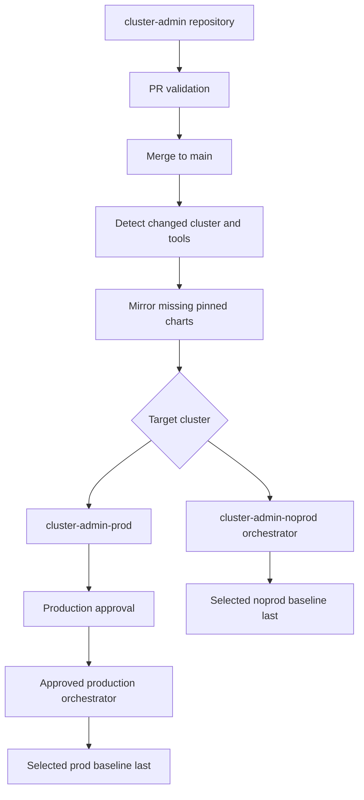

# Cluster Operations Guide

This section is for OKE cluster administrators. It covers shared cluster tools, cluster-scoped Kubernetes objects, and supplemental namespaced resources. It is separate from the component SDLC: there are no dev, staging, or release-candidate promotions in the cluster administration path.

Enable this workflow with `enable_cluster_admin`. When disabled, the stack creates only the developer delivery resources.



## Administrator-Owned Repository

The `cluster-admin` repository is the source of truth for operations configuration:

```text
catalog/tools.yaml
clusters/noprod/baseline/
clusters/noprod/tools/<tool>/
clusters/prod/baseline/
clusters/prod/tools/<tool>/
```

- `catalog/tools.yaml` is generated from the Resource Manager input and pins each public Helm repository, chart, and version.
- `values.yaml` contains cluster-specific chart configuration.
- `resources/*.yaml` contains supplemental resources for the tool namespace.
- `baseline/*.yaml` contains cluster-scoped resources not owned by a tool chart.
- `tool.yaml` declares the namespace and dependencies on other tools.

## Delivery Model

1. Define the shared tool topology and pinned public chart sources in the Resource Manager `cluster_administration` input.
2. Maintain per-cluster values and supplemental resources in the repository.
3. Open a pull request. `cluster-admin-pr` validates structure, YAML, namespaces, catalog references, and dependencies without changing a cluster.
4. Merge to `main`. `cluster-admin-build` identifies changed targets and mirrors missing chart versions into OCIR.
5. Both clusters start a full pipeline deployment whose orchestrator consumes the immutable selected-target plan and runs independent tools in dependency waves.
6. Noprod starts immediately; prod pauses at its approval stage before invoking the same orchestrator.
7. Both paths deploy Helm charts before supplemental resources and apply selected cluster-wide baseline resources last.

Values artifacts and cluster deployment plans are immutable and use the full configuration commit SHA as their version. Each orchestrator logs exact chart and values versions; Helm keeps release history for explicit rollback.

## Operational Boundaries

- The workflow applies desired changes but does not continuously reconcile drift.
- Removing a manifest from Git does not prune the live object.
- Supplemental resources cannot target a namespace other than the configured tool namespace.
- Secret material must not be committed; use resources such as External Secrets that refer to an external secret store.
- If noprod and prod point to the same physical cluster during testing, use distinct tool namespaces or avoid deploying both configurations concurrently when the charts would conflict.

## Continue Reading

- [Cluster Operations Runbooks](cluster-operations-runbooks.md) gives step-by-step procedures for adding, configuring, promoting, and removing tools.
- [Cluster Administration Reference](cluster-administration.md) documents the repository contract, DAG behavior, selective stage execution, tags, and lifecycle rules.
- [Responsibilities](responsibilities.md) clarifies the boundary between cluster administrators, developers, and stack owners.
- [Troubleshooting And Recovery](troubleshooting-recovery.md) covers partial DAG failures, approval behavior, rollback, and drift.
- [Security Guidance](security.md) describes secret handling, IAM, pinned charts, and cluster-level review boundaries.
- [Resource Manager Inputs](resource-manager-inputs.md) explains the feature flag and tool topology JSON.
- [Stack Operations](operations.md) covers stack packaging, applies, validation, functional tests, and cleanup.
- [Architecture](architecture.md) shows the operations path alongside application delivery.
