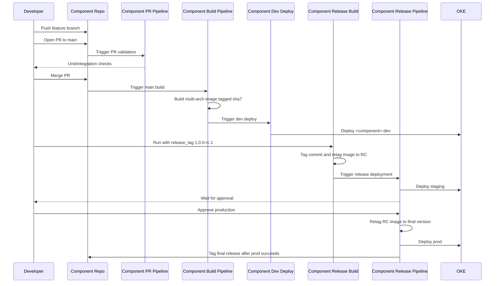
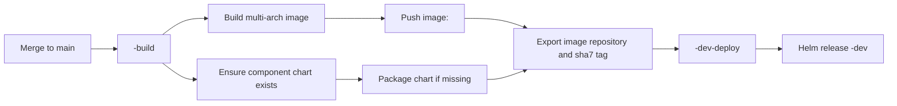
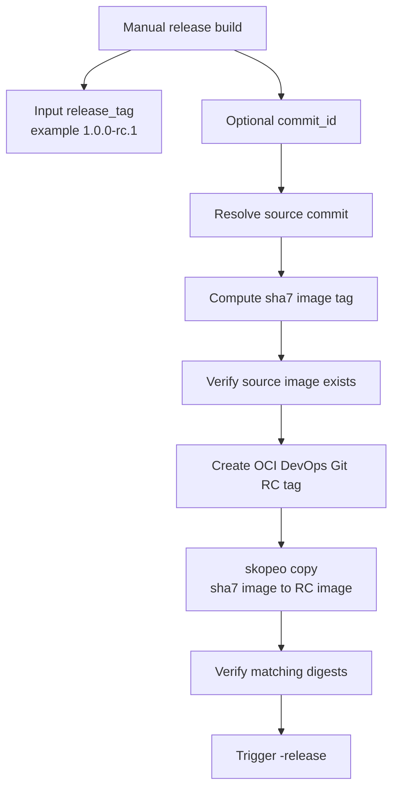
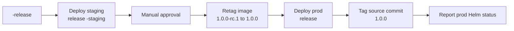

# Developer Workflow

This is the intended SDLC for a component.

## Pull Request

1. Create a branch in the component repository.
2. Open a pull request targeting `main`.
3. OCI DevOps triggers `<component>-pr`.
4. The PR pipeline runs `.oci-devops/pull-request-pipeline.yaml` from the component repository.

The seeded PR pipeline is a placeholder that prints `Unit tests succeeded`. Developers should replace it with real unit and integration tests for the component.

This is intentionally empty in the template because a useful test strategy depends on the component language, framework, runtime, and integration boundaries. For example, a Java service may run Maven or Gradle tests, a Node.js service may run npm scripts, and a worker component may need contract or queue integration tests.

## Main Build And Dev Deployment

After the pull request is merged to `main`:

1. OCI DevOps triggers `<component>-build`.
2. The build pipeline builds a multi-architecture image.
3. The image is pushed with only the 7-character commit SHA tag.
4. The pipeline ensures the component chart version exists in OCIR, packaging it when needed.
5. The pipeline triggers `<component>-dev-deploy`.
6. Dev deploy installs or upgrades Helm release `<component>-dev`.

Normal main builds do not create version tags such as `1.0.0`. Version tags are created only by release flows.

The shared build pipeline expects the component repository to describe how the runtime artifact is built through its `Dockerfile`. Use a multi-stage Dockerfile when the component needs compilation, dependency installation, asset bundling, or test/build tooling that should not be present in the final runtime image. This keeps the OCI DevOps build pipeline generic while letting each component own its language-specific build details.

## Component Chart Change

When files under `<application>/charts/<component>/**` change:

1. OCI DevOps triggers `<component>-build`.
2. The pipeline skips the image build.
3. The component chart is packaged and pushed.
4. Dev is redeployed using the latest source SHA image tag.

This lets chart-only changes be tested in dev without rebuilding the application image.

## Release Candidate

Run `<component>-release-build` manually with:

- `release_tag`: strict SemVer RC, for example `1.0.0-rc.1`.
- `commit_id`: optional full commit SHA. If omitted, the current `main` commit is used.

The release build:

1. Resolves the source commit.
2. Computes the source image tag from the first 7 characters of the commit SHA.
3. Verifies that image exists.
4. Creates the OCI DevOps Git tag for the RC.
5. Retags the SHA image to the RC tag using skopeo in a Docker container.
6. Verifies source and target image digests match.
7. Triggers `<component>-release`.

## Staging, Approval, And Production

`<component>-release` performs the production promotion path:

1. Deploy the RC image to staging as release `<component>-staging`.
2. Review the successful staging deployment and approve or reject production.
3. Retag the approved RC image as the final release image, for example `1.0.0-rc.1` to `1.0.0`.
4. Deploy the final image to prod as release `<component>`.
5. Tag the source commit with the final Git tag, for example `1.0.0`.
6. Report production Helm status, resources, revision history, notes, and the namespace-scoped release listing.

The final tag happens after production deployment succeeds. If the final tag already exists on the same commit, the tag stage treats it as an idempotent success. If it points to a different commit, it fails. The final Helm status stage is informational and runs only after deployment and tagging are complete.

Component build and deployment pipelines use one generic parameter contract:

- `component_chart_version`
- `image_repository`
- `image_tag`

The release pipeline interprets `image_tag` as the release candidate tag. Approval follows the successful staging deployment. The promotion shell stage exports `release_image_tag` for subsequent shell logic and diagnostics, but OCI does not substitute command-spec exports into a later Helm values artifact. Production therefore retains the RC `image_tag`; after promotion succeeds, the component chart strips the terminal `-rc.N` when `environment: prod`. Repository identity is a Terraform-derived default on the component release pipeline. The image-promotion and final Git-tag command specs are shared by every component.

## Versioning Rules

- Main image tag: exactly 7 Git SHA characters, such as `a1b2c3d`.
- Release candidate tag: strict SemVer RC, such as `1.0.0-rc.1`.
- Final release tag: strict SemVer, such as `1.0.0`.

The final image tag and final Git tag are derived from the release candidate by removing `-rc.N`.
