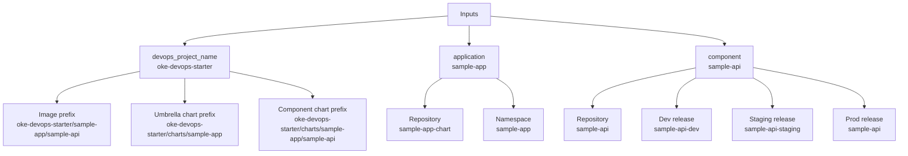

# Naming Conventions

The stack keeps the Resource Manager UI small by deriving names from the DevOps project, application, and component.



## Applications And Components

- Application names must be unique.
- Component names must be globally unique across all applications.
- Names may use lowercase letters, numbers, dots, underscores, and hyphens.

Default sample:

- Application: `sample-app`
- Components: `sample-api`, `sample-worker`

## Repositories

- Shared pipeline repository: `pipelines`
- Application chart repository: `<application>-chart`
- Component source repository: `<component>`

Examples:

- `shop-chart`
- `invoice`
- `orders-chart`
- `checkout`

## Chart Paths

- Application umbrella chart path: `<application>`
- Component chart path: `<application>/charts/<component>`

Examples:

- `shop`
- `shop/charts/invoice`
- `orders/charts/checkout`

## OCIR Prefixes

OCIR content is grouped by DevOps project and application.

Images:

```text
<devops-project>/<application>/<component>
```

Umbrella charts:

```text
<devops-project>/charts/<application>
```

Component charts:

```text
<devops-project>/charts/<application>/<component>
```

Full examples:

```text
fra.ocir.io/<tenancy-namespace>/oke-devops-starter/shop/invoice:1.0.0
oci://fra.ocir.io/<tenancy-namespace>/oke-devops-starter/charts/shop
oci://fra.ocir.io/<tenancy-namespace>/oke-devops-starter/charts/shop/invoice
```

Generated build specs expose these prefixes as environment variables, such as `application_chart_repo_prefix`, `component_chart_repo_prefix`, and `component_image_repo_prefix`, so teams can customize the convention later inside the pipeline template.

## Pipelines

Application pipelines:

- `<application>-package`
- `<application>-bootstrap`
- `<application>-deploy`

Component pipelines:

- `<component>-pr`
- `<component>-build`
- `<component>-dev-deploy`
- `<component>-release-build`
- `<component>-release`

Cluster administration:

- Repository: `cluster-admin`
- Configuration build: `cluster-admin-build`
- Pull request validation: `cluster-admin-pr`
- Shared chart mirror: `cluster-admin-mirror-charts`
- Cluster deployment pipeline: `cluster-admin-<cluster>`
- Cluster tool removal pipeline: `cluster-admin-<cluster>-decommission`
- Cluster orchestrator stage: `Deploy <Cluster> Cluster Changes`
- Tool namespace: `<tool>` by default
- Mirrored tool chart: `<devops-project>/charts/cluster-tools/<upstream-chart>`
- Values artifact path: `cluster-admin/<cluster>/tools/<tool>/values.yaml`
- Values artifact version: full cluster-admin Git commit SHA
- Deployment plan artifact path: `cluster-admin/deployment-plan.json`
- Deployment plan artifact version: full cluster-admin Git commit SHA
- Tool dependency metadata: `depends_on: [<prerequisite-tool>]`
- Shared deployment command spec: `cluster-admin-deploy-command-spec`

## Helm Releases

Application baseline:

- Noprod: `<application>-noprod`
- Prod: `<application>`

Component releases:

- Dev: `<component>-dev`
- Staging: `<component>-staging`
- Prod: `<component>`

This avoids names like `<component>-dev-dev` and keeps prod clean.

## Kubernetes Namespaces

Default namespace:

```text
<application>
```

`dev` and `staging` component releases share the application namespace in the pre-prod cluster. Prod uses `prod_namespace` if supplied, otherwise the application namespace.

## Value Artifacts

Application baseline values:

- `<application>-values-noprod`
- `<application>-values-prod`

Component values:

- `<component>-values-dev`
- `<component>-values-staging`
- `<component>-values-prod`

Value artifacts contain environment or cluster-specific values. Image tags are passed through deployment parameters from build pipelines.

Shared component command specs:

- `component-promote-release-image-command-spec`
- `component-tag-release-commit-command-spec`

All component pipelines use the generic deployment parameters `component_chart_version`, `image_repository`, and `image_tag`. The promotion stage derives and exports `release_image_tag`, while the production chart derives that same final tag from the RC `image_tag` because OCI Helm artifact substitution cannot consume the command-stage export.

## Tags And Labels

OCI DevOps artifacts and pipelines use freeform tags where useful:

- Application-owned resources: `application = <application>`
- Component-owned resources: `application = <application>`, `component = <component>`
- Shared bootstrap resources use purpose and role tags without claiming ownership by one application.
- Shared component delivery command specs use `purpose = component-delivery` and a role tag instead of claiming ownership by one component.

Kubernetes component resources include an `env` label for dev and staging. Prod uses `env: prod` but does not add `prod` to the resource name.
