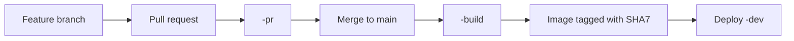

# Quickstart

This stack is a starting point for customers adopting OCI DevOps with OKE. It creates the repositories, pipelines, artifacts, environments, naming conventions, and IAM wiring that otherwise require substantial OCI-specific configuration.

Application tests, quality gates, deployment checks, chart values, and operational policies are deliberately templates. Configure the initial shape through Resource Manager, apply the stack, and then let the owning teams evolve the generated repositories and pipelines.

## What You Need

Before opening the Resource Manager form, prepare:

- An OCI compartment for the DevOps project.
- At least one OKE cluster. A separate production cluster is recommended but not required for an evaluation.
- A worker subnet for each cluster that OCI DevOps shell runners can use.
- An optional worker NSG for each cluster.
- An OCI auth token used once to seed the hosted Git repositories.
- A Vault secret containing the OCIR pull credential used by application bootstrap.
- IAM permissions for OCI DevOps, OKE, OCIR, Vault, Logging, and Artifact Registry.

The OKE API can be public or private. Deployment shell runners always use the private endpoint from the selected worker network.

## 1. Configure The Stack

Select **Deploy to Oracle Cloud** in the main README. Resource Manager opens with the Terraform configuration already selected. Work through the form from top to bottom.

### OCI DevOps

Select the DevOps compartment and set the project name. The project name becomes part of every generated image and chart path.

Provide the Git seeding credentials, logging configuration, and notification topic. Enable IAM creation only when the stack should create its dynamic group and policy.

### Applications

Define applications and their components as formatted JSON. The default shape is:

```json
[
  {
    "name": "sample-app",
    "components": [
      { "name": "sample-api" },
      { "name": "sample-worker" }
    ]
  }
]
```

Use application names for namespaces and umbrella charts. Component names must be globally unique because they become top-level repository, pipeline, chart, and image identities.

Optional component fields customize chart versions and build specification paths. Leave them out for the standard conventions.

### OKE Environments

For both pre-production and production, select:

- OKE compartment and cluster.
- Network compartment.
- Worker subnet.
- Optional worker NSG.

If only the pre-production cluster exists, select that same cluster in both the **OKE Pre-Prod Environment** and **OKE Prod Environment** sections. Use its corresponding network compartment, worker subnet, and optional NSG in both sections. This enables the complete pipeline structure without requiring a second cluster.

When both environments point to one physical cluster, application releases remain distinguishable through their release names, but cluster tools use the same namespaces and Helm release names. Treat this as an evaluation configuration: a prod tool deployment upgrades the same live tool release rather than creating an isolated copy. Use separate clusters for a real production boundary.

### Cluster Administration

Leave `enable_cluster_admin` disabled when the stack is only for application developers.

To create the operations workflow, enable it and define the shared tool catalog:

```json
{
  "tools": [
    {
      "name": "keda",
      "repository": "https://kedacore.github.io/charts",
      "chart": "keda",
      "version": "2.20.1",
      "namespace": "keda",
      "depends_on": []
    }
  ]
}
```

The catalog pins chart coordinates and dependency topology. Values remain separate for `noprod` and `prod` in the generated `cluster-admin` repository.

## 2. Apply And Check Outputs

Run an Apply job and wait for `SUCCEEDED`. In Application Information, verify that Resource Manager reports:

- The OCI DevOps project.
- The shared `pipelines` repository.
- One chart repository per application.
- One source repository per component.
- Build, PR, release, bootstrap, and deployment pipelines.
- Noprod and prod OKE environments.
- Cluster-admin resources when the feature is enabled.

OCI DevOps runner provisioning can take several minutes. A pipeline remaining in `ACCEPTED` or `IN_PROGRESS` while a build or shell runner starts is not, by itself, a failure.

## 3. Initialize An Application

Run `<application>-bootstrap` before deploying application charts or components.

Provide:

- `registry_username`: the OCIR pull username.
- `pull_password_secret_ocid`: the Vault secret containing the pull credential.
- `secret_name`: normally `ocirsecret`.

The pipeline has independent noprod and prod stages. Run the whole pipeline to initialize both clusters, or run one stage when only one target is ready.

Verify the result:

```bash
kubectl get namespace <application>
kubectl -n <application> get secret ocirsecret
```

The secret type must be `kubernetes.io/dockerconfigjson`.

## 4. Deploy The Application Baseline

The umbrella chart owns shared namespace resources, not component workloads.

1. Run `<application>-package` to publish the initial umbrella chart.
2. Let it start `<application>-deploy`.
3. Verify release `<application>-noprod`.
4. Review and approve production.
5. Verify release `<application>` in the prod cluster.

All component subcharts are disabled in the baseline release.

## 5. Start Component Development

Open the generated component repository and replace the sample implementation.

Before the first real merge:

1. Implement the component `Dockerfile`; prefer a multi-stage build that produces both `linux/amd64` and `linux/arm64` images.
2. Replace the placeholder `.oci-devops/pull-request-pipeline.yaml` with language-appropriate unit, integration, security, and quality checks.
3. Customize the component Helm chart when the workload needs additional values or Kubernetes resources.
4. Customize the shared build specification only when the standard component build does not fit.

Then follow the normal path:



The main build creates only the immutable 7-character Git SHA image tag. It does not create a release version tag.

## 6. Promote A Component

Run `<component>-release-build` with a strict release candidate such as:

```text
1.0.0-rc.1
```

The flow:

1. Resolves `main`, or the optional full `commit_id`.
2. Verifies the corresponding SHA7 image exists.
3. Creates the RC Git tag and retags the image without copying layers locally.
4. Deploys release `<component>-staging` in noprod.
5. Waits for production approval.
6. Retags the RC image as `1.0.0`.
7. Deploys release `<component>` in prod.
8. Creates final Git tag `1.0.0`.
9. Reports the production Helm status.

Review the staging result before approving production. Release tags are immutable; use a new RC or version rather than moving an existing tag.

## 7. Start Cluster Operations

When cluster administration is enabled, clone `cluster-admin` and configure cluster-specific files:

```text
clusters/
  noprod/
    baseline/
    tools/<tool>/values.yaml
  prod/
    baseline/
    tools/<tool>/values.yaml
```

Use a pull request for every change. After merge:

- `cluster-admin-build` detects only affected cluster paths.
- Missing pinned charts are mirrored into OCIR.
- Values and deployment plans are published with the full Git commit as their immutable version.
- Noprod changes start immediately.
- Prod changes wait at `cluster-admin-prod` for approval before any mutation.
- Independent tools run in parallel; `depends_on` creates ordered waves.
- Cluster-wide baseline objects run after tools so they may use chart-installed CRDs.

Changing only `clusters/prod/...` does not redeploy noprod. Changing `catalog/tools.yaml` can select configured tools on both clusters because chart coordinates are shared.

## Success Checklist

A first installation is healthy when:

- Application bootstrap created namespaces and pull secrets on the selected clusters.
- The application baseline has separate noprod and prod Helm releases.
- A component PR pipeline succeeds.
- A main merge produces a SHA7 multi-architecture image and deploys dev.
- A release candidate reaches staging, approval, final image tagging, prod, and final Git tagging.
- Optional cluster tools are installed in their own namespaces with the expected cluster-specific values.
- Later Resource Manager applies do not overwrite repository or pipeline customizations in release mode.

For failures, continue with [Troubleshooting And Recovery](troubleshooting-recovery.md). For all stack fields, see [Resource Manager Inputs](resource-manager-inputs.md).
