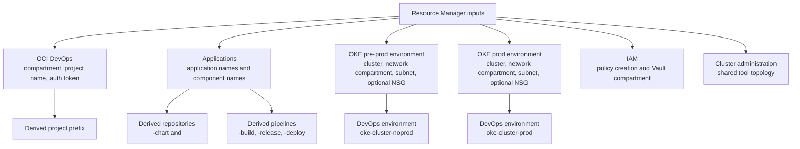

# Resource Manager Inputs

The Resource Manager schema is organized around the decisions a developer platform team must make up front. Most names and paths are derived.

Application configuration supports the [developer workflow](developers.md). The optional cluster-administration configuration supports the independent [cluster operations workflow](cluster-operations.md). OKE, OCI DevOps, and IAM inputs are shared platform concerns.



## OCI DevOps

Configure:

- DevOps compartment.
- DevOps project name, default `oke-devops-starter`.
- DevOps project description.
- Auth token used to seed OCI DevOps Code Repositories.
- Notification topic behavior: create a new topic or use an existing topic OCID.
- Logging behavior: create a DevOps service log, then configure log group name, service log name, and retention.
- Namespace-init pull secret name, default `ocirsecret`.

The project name also becomes part of image and chart prefixes. For example, project `oke-devops-starter`, application `shop`, and component `invoice` produces image prefix `oke-devops-starter/shop/invoice`.

## Applications

`applications` is entered as a formatted JSON array in a multiline editor. Keep the normal input small: an application name and one or more component names. Terraform validates and decodes the JSON before passing the strongly typed application list to the DevOps module.

```json
[
  {
    "name": "shop",
    "components": [
      { "name": "invoice" }
    ]
  },
  {
    "name": "orders",
    "components": [
      {
        "name": "checkout",
        "build_spec_path": "java/java-build-pipeline.yaml"
      },
      {
        "name": "fulfillment",
        "build_spec_path": "java/java-build-pipeline.yaml"
      }
    ]
  }
]
```

Optional fields exist for advanced use:

- `chart_repository_name`
- `chart_path`
- `chart_version`
- `namespace`
- `prod_namespace`
- `kubernetes_group`
- component `chart_version`
- component `build_spec_path`

`build_spec_path` is relative to the `pipelines` repository. If omitted, Resource Manager generates and owns `<component>-build-pipeline.yaml`. If explicitly configured, Resource Manager creates the file and any parent folders from the default component template only when the path is missing. The first commit is a starter for the DevOps engineer; subsequent applies never refresh or overwrite it. Multiple components can share a specification such as `java/java-build-pipeline.yaml`. A shared starter identifies every referencing component and should be generalized before all of those component builds are enabled.

Defaults are derived from the application and component names. Application names must be unique. Component names must be globally unique across all applications.

Names are validated after their derived suffixes are considered: application names are limited to 46 characters, component names to 45, and namespaces must be unique DNS labels within each cluster. Repository names cannot collide with another application/component or the reserved `pipelines` and `cluster-admin` repositories. The `estimated_devops_resources` output helps platform owners compare the generated topology with OCI service limits; larger-than-recommended topologies produce non-blocking Terraform check warnings.

Adding an application or component later creates its OCI resources and adds only missing entity-specific repository paths. Existing repository files are treated as developer-owned and are not overwritten by later applies. Explicit custom build-spec paths are add-only and excluded from development refresh.

## Cluster Administration

Cluster administration is optional and disabled by default. Set `enable_cluster_admin=true` to create the operations repository, immutable values repository, build pipelines, one orchestrator per cluster, triggers, artifacts, and branch protection. The production orchestrator has a mandatory approval predecessor. The topology editor and help text appear only after the feature is enabled.

`cluster_admin_artifact_repository_name` optionally sets the OCI Generic Artifact repository display name used for immutable tool values and cluster deployment plans. Leave it empty to derive `<project-name>-cluster-admin-values`, preserving the existing convention.

`cluster_administration` is a multiline JSON object defining one tool topology for both physical clusters. A missing namespace defaults to the tool name. Noprod starts immediately, while prod always requires one approval before any deployment stage starts.

```json
{
  "tools": [
    {
      "name": "keda",
      "repository": "https://kedacore.github.io/charts",
      "chart": "keda",
      "version": "2.20.1",
      "namespace": "keda",
      "depends_on": []
    },
    {
      "name": "kube-prometheus",
      "repository": "https://prometheus-community.github.io/helm-charts",
      "chart": "kube-prometheus-stack",
      "version": "87.10.1",
      "namespace": "monitoring",
      "depends_on": []
    }
  ]
}
```

The shared list configures both cluster orchestrators and seeds `cluster-admin/catalog/tools.yaml` from the configured repositories, chart names, and versions. Values, supplemental resources, and baseline manifests remain cluster-specific under `clusters/<cluster>`.

`repository` accepts either a traditional HTTPS Helm repository or an OCI repository base path. For OCI sources, the mirror constructs `<repository>/<chart>`:

```json
{
  "name": "external-dns",
  "repository": "oci://registry-1.docker.io/bitnamicharts",
  "chart": "external-dns",
  "version": "9.0.3",
  "namespace": "external-dns",
  "depends_on": []
}
```

Public OCI repositories work anonymously. A private source works only when Helm already has credentials for that registry; the stack automatically logs in only to its target OCIR registry.

For compatibility, existing stack inputs using `noprod.tools` and `prod.tools` are accepted; `noprod.tools` becomes the shared canonical topology.

Disabling the feature removes Terraform-managed cluster-administration resources. It does not uninstall Helm releases or prune Kubernetes objects previously deployed to either cluster.

## OKE Pre-Prod Environment

Configure:

- OKE pre-prod compartment.
- OKE cluster.
- Network compartment.
- Worker subnet.
- Optional worker NSG.

The stack uses private OKE endpoints for DevOps shell stages. The worker subnet is therefore mandatory.

## OKE Prod Environment

Configure the same shape as pre-prod, but with prod-specific values:

- OKE prod compartment.
- OKE prod cluster.
- Prod network compartment.
- Prod worker subnet.
- Optional prod worker NSG.

For early testing, prod can point to the same OKE cluster, subnet, and NSG as pre-prod.

## IAM

The IAM section controls whether the stack creates the DevOps dynamic group and policies. The Vault compartment input is used by application bootstrap because the OCIR pull password is read from an OCI Vault secret at deployment time.

When IAM creation is enabled, you can also configure the generated dynamic group name and policy name.
