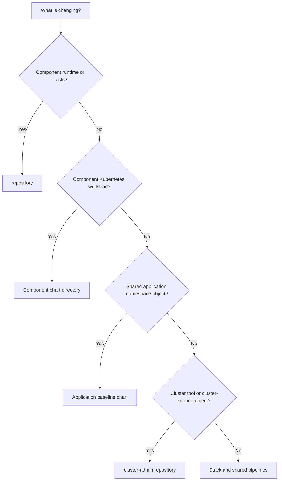

# Responsibilities

The solution serves three collaborating roles. A person may hold more than one role, but the ownership boundaries remain useful when reviewing changes and diagnosing failures.

| Capability | Application developer | Cluster administrator | Stack/platform owner |
| --- | --- | --- | --- |
| Component source and `Dockerfile` | Owns | Not involved | Defines starter conventions |
| Component PR tests | Owns | Not involved | Seeds placeholder specification |
| Component Helm chart | Owns | Not involved | Defines starter chart conventions |
| Application baseline chart | Contributes requirements | Reviews cluster impact | Owns initial structure and pipeline |
| Component release approval | Participates | May approve by policy | Configures approval model |
| Application namespace and pull secret | Consumes | May operate | Configures and runs initial setup |
| Cluster tool catalog and values | Not involved | Owns | Bootstraps workflow |
| Tool dependencies and namespaces | Not involved | Owns | Validates configuration model |
| Cluster-wide Kubernetes resources | Not involved | Owns | Bootstraps workflow |
| OCI DevOps shared templates | Contributes requirements | Contributes requirements | Owns and versions |
| Resource Manager stack and inputs | Provides application topology | Provides cluster topology | Owns packaging and apply |
| IAM, Vault access, and network selection | Not involved | Provides requirements | Owns or coordinates |
| Functional-test cleanup | Cleans test application releases | Cleans test tools and resources | Verifies stack resources |

## Application Developers

Developers own the behavior and deployability of their components. This includes source code, language-specific tests, the multi-stage `Dockerfile`, and component chart changes. Their normal path begins with a pull request and ends with a promoted component release.

Developers should not put cluster tools or cluster-scoped objects into component repositories. When a component needs a shared cluster capability, request it from the cluster administrators.

## Cluster Administrators

Cluster administrators own the `cluster-admin` repository, pinned tool charts, per-cluster values, supplemental resources, dependencies, and baseline cluster-scoped objects. Their path is organized by physical cluster rather than application environment.

Cluster administrators do not modify component image tags or run application release promotion. Tool changes and application releases remain independent even when they target the same OKE cluster.

## Stack And Platform Owners

Stack owners configure and apply Resource Manager, maintain shared Terraform and pipeline templates, coordinate IAM and networking, and decide when template changes should be adopted by existing repositories. They also own one-time application setup through `<application>-bootstrap` unless that responsibility is explicitly delegated.

Because release-mode resources become user-owned templates, the stack owner must not assume that reapplying a newer ZIP upgrades customized OCI DevOps resources or repository content.

## Shared Change Rule

Use the smallest repository and workflow that owns the change:

- Component behavior or packaging: component source repository.
- Component Kubernetes workload: component chart directory.
- Shared application namespace object: application baseline chart.
- Kubernetes tool or cluster object: `cluster-admin` repository.
- Delivery convention affecting every team: shared `pipelines` repository and stack template.
