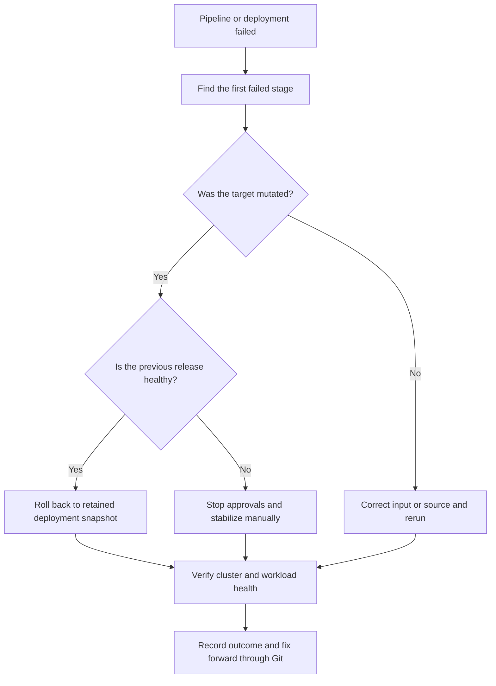

# Troubleshooting And Recovery

Start with the first failed pipeline or deployment stage. Later resources often fail only because an expected image, chart, values artifact, namespace, or CRD was not produced earlier.

## Application Delivery

| Symptom | Likely cause | Recovery |
| --- | --- | --- |
| PR pipeline does not start | PR does not target `main`, trigger was customized, or build spec is missing | Inspect the repository trigger and `.oci-devops/pull-request-pipeline.yaml`, then update the PR branch |
| Main build cannot find metadata | `.oci-devops/application.env` is missing or invalid | Restore `component_name` and rerun the build |
| Multi-architecture build fails | Dockerfile cannot build for one target architecture | Test each build target and remove architecture-specific build assumptions |
| Release build reports missing SHA image | Selected commit never completed a main build | Build the commit from `main` or select a commit with an existing `<sha7>` image |
| RC or final tag already exists | Version was already used | Verify existing tag ownership; use a new RC number or version rather than moving it |
| Pod shows `ImagePullBackOff` | Namespace secret is missing, invalid, or not referenced by the ServiceAccount | Rerun the relevant stage of `<application>-bootstrap` with correct Vault credentials and inspect the component ServiceAccount |
| Production is waiting | Manual approval has not been accepted | Review the successful staging deployment and approve or reject production |
| Production fails after image promotion | Final image exists but Helm deployment failed | Fix the deployment issue and retry safely; do not repoint the immutable version tag |
| Production status stage fails | Helm could not report the completed release | Inspect the production release and workload; deployment and final tagging have already completed, so roll back or fix forward as appropriate |

If staging succeeds but production is rejected, no production mutation occurs. The RC image and Git tag remain valid for investigation or a later decision.

## Cluster Administration

| Symptom | Likely cause | Recovery |
| --- | --- | --- |
| PR validation rejects topology | Unknown dependency, cycle, duplicate, or mismatched namespace | Correct Resource Manager topology and repository `tool.yaml` definitions |
| Chart mirror fails | Catalog source/version is invalid or upstream is unavailable | Verify the pinned public repository and chart version, then rerun |
| Values artifact is missing | Configuration build failed before publication | Fix the validation/publication failure and rerun from the same or a new commit |
| Only part of a dependency wave succeeds | One independently invoked stage failed | Fix the failed target and rerun the configuration build; successful idempotent stages may run again |
| Supplemental resource is rejected | Plain Secret or cross-namespace target | Use an external secret reference and the configured tool namespace |
| Baseline custom resource fails | Required CRD was not installed or tool stage failed | Verify the owning tool chart and dependency order, then rerun the baseline change |
| Prod has no mutation deployment | Approval is pending or rejected | Inspect the approval stage inside `cluster-admin-prod`; its orchestrator starts only after success |

## Rollback And Drift

- OCI DevOps deployment snapshots retain the exact chart and values used by that deployment. A rollback does not fetch the latest mutable values definition.
- Image and chart versions should remain immutable so a historical snapshot resolves to the same content.
- Removing YAML from Git does not delete the live Kubernetes object.
- The cluster-admin workflow does not continuously reconcile out-of-band changes.
- Record manual corrections and bring the repository back into agreement through a reviewed pull request.

## Partial Failure Procedure

1. Stop additional approvals or manual retries until the failed stage is understood.
2. Record the build run, deployment, Git commit, target cluster, chart version, values version, and image tag.
3. Inspect the target namespace and Helm release without changing unrelated resources.
4. Decide whether to retry, roll back, or fix forward.
5. Reuse a commit only when all immutable artifacts already associated with it are correct.
6. Use a new RC or final version whenever released content must change.
7. Verify workload health and clean test-only resources after recovery.
