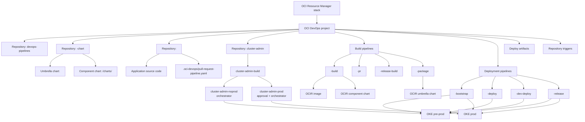
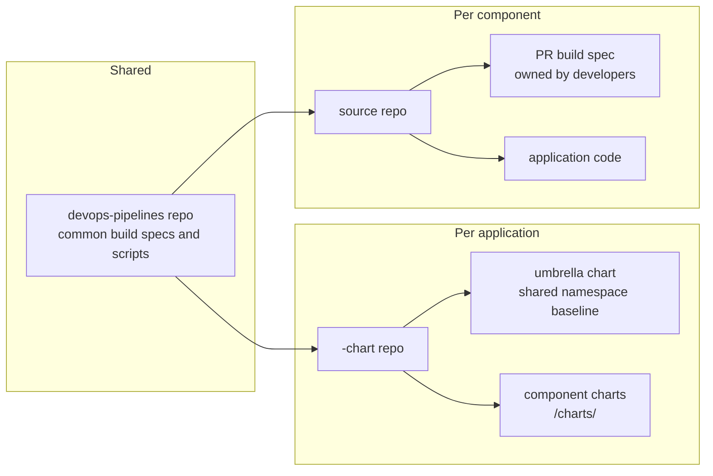

# Architecture

The stack can create its OCI DevOps project or attach the generated topology to an existing project. In reuse mode, the existing project remains externally owned: the stack reads its name and compartment, preserves project-level configuration and logging, and manages only the repositories, pipelines, artifacts, environments, and triggers that it adds.

The stack can own the operational path from code to OKE or provide build-only CI for an external delivery system. It intentionally does not require a GitOps controller.

Choose the path that matches your role:

- [Application developers](developers.md) own component source, tests, images, component charts, and release promotion.
- [Cluster operations administrators](cluster-operations.md) own cluster tools, per-cluster values, supplemental resources, and cluster-wide objects.
- [Stack maintainers](operations.md) package, apply, validate, and upgrade the Resource Manager template.

The [responsibility matrix](responsibilities.md) records the handoffs between these roles.

## Main Resources

For the whole stack:

- One OCI DevOps project.
- One configurable shared repository, `devops-pipelines` by default, containing common build specs and scripts.
- One notification topic, unless an existing topic is supplied.
- Optional IAM policies and dynamic group for DevOps access.
- One pre-prod OKE deploy environment named from the selected cluster.
- One prod OKE deploy environment named from the selected prod cluster.
- One `cluster-admin` repository, one immutable Generic Artifact repository for tool values, and shared PR/build/chart-mirror pipelines.
- One orchestration pipeline per cluster; prod adds a mandatory approval before its orchestrator.
- One explicit tool decommission pipeline per OKE target, with mandatory approval in prod.

For each application:

- One idempotent `<application>-bootstrap` pipeline with parallel noprod/prod namespace initialization stages.
- One application chart repository, by default `<application>-chart`.
- One umbrella chart under `<application>`.
- One application baseline package pipeline: `<application>-package`.
- One application baseline deployment pipeline: `<application>-deploy`.
- Noprod and prod values artifacts for the application baseline chart.

For each component:

- One source repository: `<component>`.
- One component chart under `<application>/charts/<component>`.
- One build pipeline: `<component>-build`.
- One pull request pipeline: `<component>-pr`.
- One release build pipeline: `<component>-release-build`.
- One dev deployment pipeline: `<component>-dev-deploy`.
- One release deployment pipeline: `<component>-release`.
- Dev, staging, and prod values artifacts for the component chart.

The project also has two shared component command specs for release image promotion and final commit tagging. Component pipelines provide generic image and repository parameters, so these command specs do not multiply with the number of components.

## Repository Roles

`devops-pipelines` contains reusable build logic. In full delivery mode it also contains chart and release helpers. The repository name is configurable so this stack can coexist with repositories created by other automation.

`<application>-chart` contains the umbrella chart and nested component charts. The umbrella chart is for shared namespace resources. Component charts are deployed independently.

`<component>` contains the application source code. Its `.oci-devops/pull-request-pipeline.yaml` is intentionally component-owned because tests depend on the component's language and framework.

## Template Ownership

Terraform creates and wires the DevOps resources, but the generated pipelines are starter templates. Application/component DevOps resources use Terraform lifecycle ignore rules so a team can modify names, descriptions, build specs, parameters, tags, and stage internals after bootstrap without every apply forcing them back.

Repository content follows a create-only ownership model:

| Seed unit | Behavior after creation |
| --- | --- |
| Shared pipeline scripts and generic files | Seeded only when the configured pipeline repository is empty |
| Application/component pipeline specs | Missing entity-specific files are added; existing files are preserved |
| Component source repository | Seeded only when the repository is empty |
| Application baseline chart | Seeded only when the chart repository is empty |
| Component chart | A missing component directory is added; an existing directory is preserved |

Template changes in a newer stack archive are not pushed into repositories that developers already own. Teams can adopt those changes explicitly through their normal Git review process.

IAM, networking inputs, OCIR conventions, and core stack structure remain Terraform-managed.

Cluster administration uses the same template ownership model. The repository is seeded only while empty, and generated pipelines, stages, artifacts, triggers, and branch protection preserve later administrator customization.

## Capability Modes

`application_delivery_mode=oci_devops` creates application charts, artifacts, deployment environments, bootstrap, release, and deployment pipelines in addition to source builds and PR validation.

`application_delivery_mode=build_only` creates component source repositories, PR validation, image build pipelines, and the shared build-assets repository. Application chart and deployment resources are absent. Enabling cluster administration is independent; when enabled, its OKE environments and operational resources are still created.

This stack does not publish a handoff contract to a GitOps stack and neither stack modifies the other's Terraform state or repositories. Configure each from the same architecture decisions. A shared OCI DevOps project is possible here through project reuse; equivalent project reuse in the GitOps stack is planned separately.
