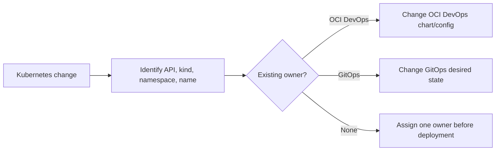

# Delivery Ownership Models

This stack and a separate GitOps stack can be adopted independently. Choose one owner for each delivery responsibility and one reconciler for each Kubernetes object.

## Supported Models

| Model | Stack settings | OCI DevOps starter owns | GitOps owns |
| --- | --- | --- | --- |
| OCI DevOps end to end | `application_delivery_mode=oci_devops`, `enable_cluster_admin=true` | Component CI, application releases, cluster tools, and cluster configuration | Nothing required |
| OCI DevOps applications with GitOps operations | `application_delivery_mode=oci_devops`, `enable_cluster_admin=false` | Component CI and application releases | Cluster tools, cluster-scoped resources, and administrator-owned namespace resources |
| Build-only CI with GitOps delivery | `application_delivery_mode=build_only`, `enable_cluster_admin=false` | Component repositories, PR validation, and SHA7 images | Application release configuration, cluster tools, and cluster configuration |

`build_only` may also be combined with `enable_cluster_admin=true` when OCI DevOps should build applications and administer clusters while GitOps owns only application delivery.

## Object Ownership

Namespaces are shared boundaries, not exclusive ownership units. A cluster administrator can use GitOps to place a `ResourceQuota`, `LimitRange`, network policy, or approved configuration object in an application namespace while OCI DevOps deploys application workloads there.

The hard rule is simpler: never let two systems manage the same Kubernetes object identity. Identity means the same API version, kind, namespace, and name. Record the owner in repository documentation and labels where practical.

## Independent Configuration

The stacks do not need to communicate. They do not exchange Terraform state, generate an integration JSON contract, or write to each other's repositories. Configure both from the agreed application, image, namespace, and cluster conventions.

OCI DevOps publishes immutable images as `<registry>/<project>/<application>/<component>:<sha7>`. A GitOps repository can reference those coordinates using its own release process. OCI DevOps does not update that repository automatically.

## OCI DevOps Project Placement

Separate OCI DevOps projects give the clearest ownership and IAM boundaries. This stack can also reuse an existing project and lets you name its shared repository `devops-pipelines` to avoid collisions.

Using one shared project for both stacks is a planned option once the GitOps stack supports equivalent existing-project reuse. Its shared repository should use a distinct name such as `gitops-pipelines`.

## Switching Modes

Choose the mode before the first production apply and treat it as an ownership decision. Changing an existing stack from `oci_devops` to `build_only` removes Terraform-managed application chart, release, deployment, artifact, and environment resources. It does not uninstall already deployed Helm releases or delete Kubernetes objects.
