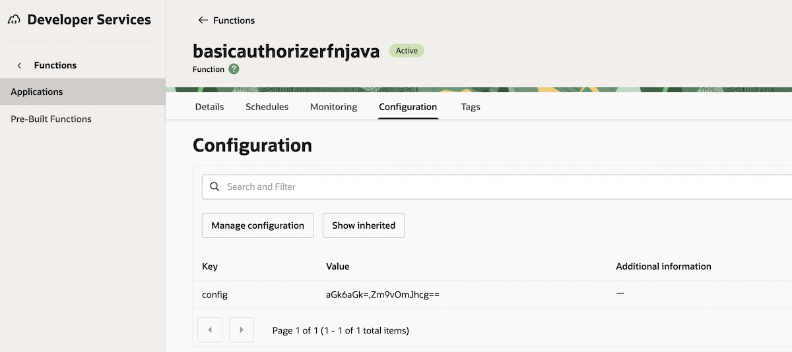
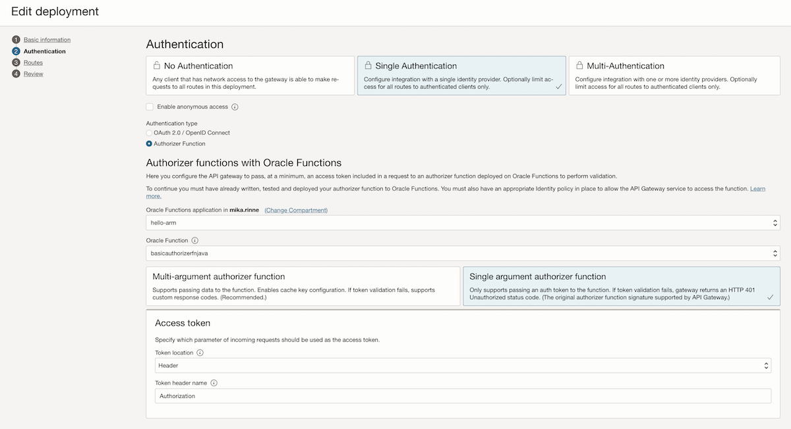
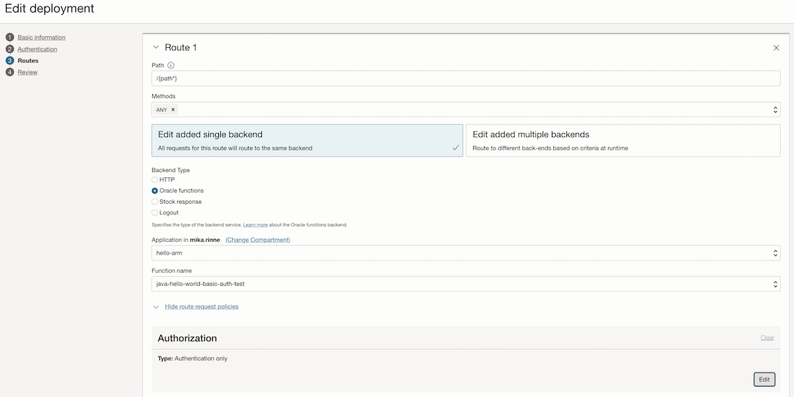

# API Gateway basic-auth Authorizer Function example

Author <a href="https://github.com/mikarinneoracle">mikarinneoracle</a>

Reviewed: 19.02.2026
 
# When to use this asset?
 
Anyone who wants to implement an API Gateway authorizer Function for HTTP basic-auth

# How to use this asset?

Build and deploy both functions <code>fn-authorizer-auth-basic</code> and <code>fn-authorizer-auth-basic-test</code> under <code>/files</code> to a Function Application in OCI.

Create a config for the <code>basicauthorizerfnjava</code> Function:

Config above contains two comma-separated base64 encoded key-value pairs for basic-auth authentication:
<pre>
aGk6aGk=,Zm9vOmJhcg==
</pre>

<b>aGk6aGk=</b> is <b>hi:hi</b> => username is <b>hi</b>, password <b>hi</b>

<b>Zm9vOmJhcg==</b> is <b>foo:bar</b> => username is <b>foo</b>, password <b>bar</b>

(You can modify the config by adding new pairs as you like and remove the existing ones)

After deploying the functions add an API Gateway instance and configure the Functions:

Settings for the <b><i>Single argument authorizer function</i></b>:

Token location: <b>Header</b>
 
Token header name: <b>Authentication</b>
 

Configure the route for the backend function:
    

    
Configure Route Request Policies Header transformations:

Settings for the <b><i>Header transformations</i></b>:

Behavior: <b>Overwrite</b>
 
Header name: <b>username</b>
 
Values: <b>${request.auth[username]}</b>

    
Test by accessing the API Gateway url from the browse and after the functions have been loaded you should see a basic-auth authentication request popping up. Enter <code>foo</code> and <code>bar</code> and after accepting the backend function should return:

<pre>
Username: foo
</pre>

# Useful Links

- [OCI Functions](https://docs.oracle.com/en-us/iaas/Content/Functions/Concepts/functionsoverview.htm)
    - Learn how the Functions service lets you create, run, and scale business logic without managing any infrastructure
- [Oracle](https://www.oracle.com/)
    - Oracle Website

# License

Copyright (c) 2026 Oracle and/or its affiliates.

Licensed under the Universal Permissive License (UPL), Version 1.0.

See [LICENSE](https://github.com/oracle-devrel/technology-engineering/blob/main/LICENSE) for more details.
