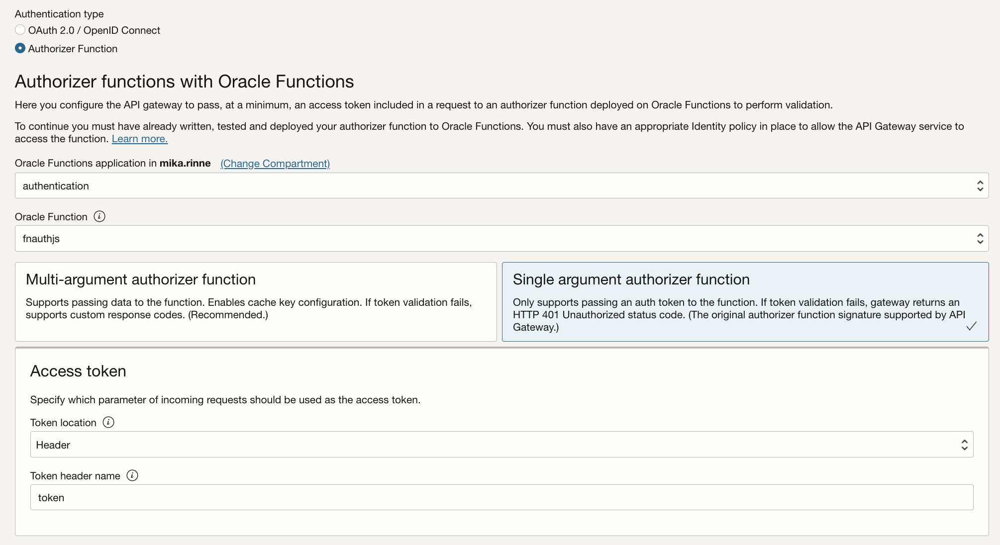
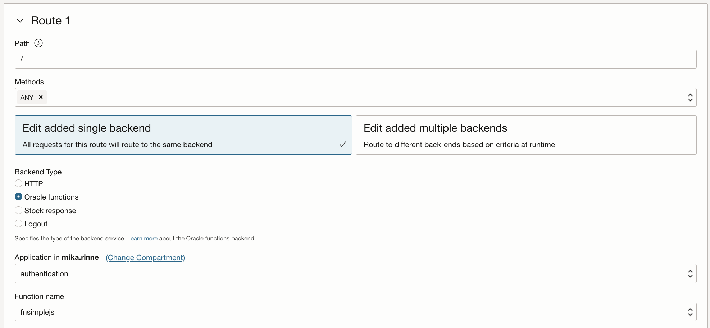
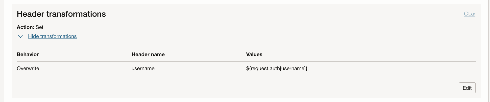

# API Gateway authorizer Function context var example

Author <a href="https://github.com/mikarinneoracle">mikarinneoracle</a>

Reviewed: 07.09.2026
 
# When to use this asset?
 
Anyone who wants to test an API Gateway authorizer Function context var in NodeJS

# How to use this asset?

## Build and deploy the functions

### Authorizer function fnauthjs
<pre>
const fdk=require('@fnproject/fdk');

fdk.handle(function(input){
  let json = "";

  if(input.token) {
      json = {
        "active": true,
        "principal": "myprincipal",
        "scope": ["fnsimplejs"],
        "clientId": "clientIdFromHeader",
        "expiresAt": "2025-12-31T00:00:00+00:00",
        "context": {
            "username": input.token
        }
      }
  } else {
      json = {
        "active": false,
        "expiresAt": "2025-12-31T00:00:00+00:00",
        "wwwAuthenticate": "Bearer realm=\"www.com\""
      }
  }
  return json;
})
</pre>

The authorizer function will pass on the <code>username</code> in <code>auth context</code> as a custom variable. The value for it is set from REST call input as <code>token</code> on the <a href="files/fnauthjs/func.js#L52">line 52</a>.
 
Here's the call using API Gateway:
<pre>
curl -H "token: test-token" https://drp....56kvgu.apigateway.eu-amsterdam-1.oci.customer-oci.com/
</pre>
Hence the auth context var <code>username</code> gets the value <code>test-token</code>

### Backend / secondary function fnsimplejs
<pre>
const fdk=require('@fnproject/fdk');

fdk.handle(function(input, ctx){
  return ctx.headers['Fn-Http-H-Username'];
})    
</pre>

The secondary / backend function will get the authorizer passed variable <code>username</code>
as a transformed header variable <code>Fn-Http-H-Username</code> and will print it out as the
function REST call result on the <a href="files/fnsimplejs/func.js#L42">line 42</a>.
 
Here's the call using API Gateway:
<pre>
curl -H "token: test-token"  https://drp....56kvgu.apigateway.eu-amsterdam-1.oci.customer-oci.com/
["test-token"]
</pre>

## Create the API Gateway based on the functions and configure as follows

To achieve this as described above create and configure API Gateway deployment as follows:

### Authorizer function fnauthjs

    
Use these settings for the <b><i>Single argument authorizer function</i></b>:

Token location: <b>Header</b>
 
Token header name: <b>token</b>
 
### Backend / secondary function fnsimplejs

    
### <i>auth context</i> variable <i>username</i> transformation in <i>Route Request Policies</i>

Use these settings for the <b><i>Header transformations</i></b>:

Behavior: <b>Overwrite</b>
 
Header name: <b>username</b>
 
Values: <b>${request.auth[username]}</b>

## Authorization error 401 Unauthorized

If no <code>token</code> is given in the API Gateway REST call the secondary/backend function will not be called and API Gateway will return <b>401 Unauthorized</b> error instead e.g. 
<pre>
curl https://drp....56kvgu.apigateway.eu-amsterdam-1.oci.customer-oci.com/
{"code":401,"message":"Unauthorized"}
</pre>

# Useful Links

- [OCI Functions](https://docs.oracle.com/en-us/iaas/Content/Functions/Concepts/functionsoverview.htm)
    - Learn how the Functions service lets you create, run, and scale business logic without managing any infrastructure
- [Oracle](https://www.oracle.com/)
    - Oracle Website

# License

Copyright (c) 2026 Oracle and/or its affiliates.

Licensed under the Universal Permissive License (UPL), Version 1.0.

See [LICENSE](https://github.com/oracle-devrel/technology-engineering/blob/main/LICENSE) for more details.
