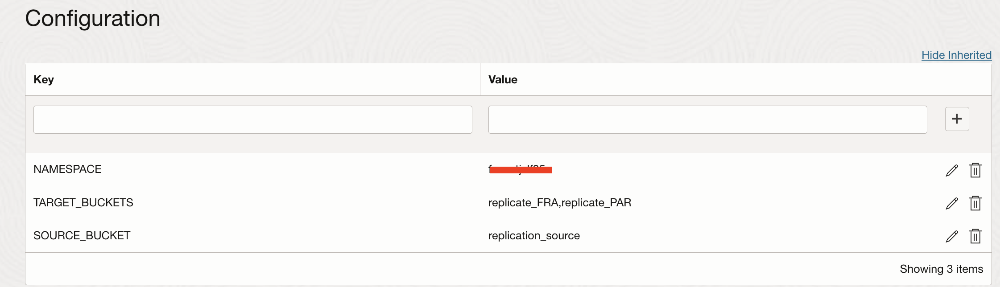
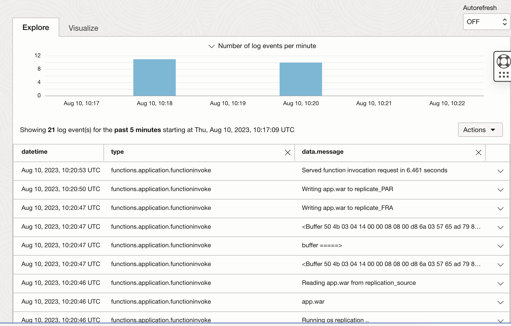

# Example function to copy a file from an Object Storage bucket to multiple other buckets when uploaded

Author <a href="https://github.com/mikarinneoracle">mikarinneoracle</a>

Reviewed: 31.10.2024
 
# When to use this asset?
 
Anyone who wants to implement content distribution in Object Storage buckets across multiple regions. This function is triggered by the upload CloudEvent of the source bucket and then copies the received file to multiple (1-n) other buckets that are replicated to other regions using the Object Storage buckets automatic replication feature. This way we can implement content distribution in  Object Storage buckets across multiple regions.

# How to use this asset?

## Function configuration

<ul>
<li><code>TENANCY</code> is the tenancy os namespace name e.g. what you get when running <code>oci os ns get</code></li>
<li><code>SOURCE_BUCKET</code> is the bucket where the file is uploaded and triggers this function using a CloudEvent</li>
<li><code>TARGET_BUCKETS</code> are the comma delimited buckets to where the file is copied from the source bucket are replicatyed to other regions using the Object Storage replication feature</li>
</ul>

<h3>Function example log when triggered by the Object Storage file upload (create/update) CloudEvent</h3>

# Useful Links
 
- [OCI Functions](https://docs.oracle.com/en-us/iaas/Content/Functions/Concepts/functionsoverview.htm)
    - Learn how the Functions service lets you create, run, and scale business logic without managing any infrastructure
- [OCI SDK for JavaScript](https://docs.oracle.com/en-us/iaas/Content/API/SDKDocs/typescriptsdk.htm)
    - The Oracle Cloud Infrastructure SDK for TypeScript and JavaScript enables you to write code to manage Oracle Cloud Infrastructure resources
- [Oracle](https://www.oracle.com/)
    - Oracle Website

# License

Copyright (c) 2026 Oracle and/or its affiliates.

Licensed under the Universal Permissive License (UPL), Version 1.0.

See [LICENSE](https://github.com/oracle-devrel/technology-engineering/blob/main/LICENSE) for more details.
    
