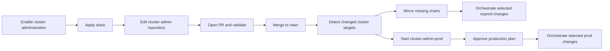

# OKE DevOps Starter

[](https://cloud.oracle.com/resourcemanager/stacks/create?zipUrl=https://github.com/oracle-devrel/technology-engineering/releases/download/oci-devops-rm-1.1.0/stack.zip)

This OCI Resource Manager stack bootstraps OCI DevOps workflows for both application developers and OKE cluster administrators.

It creates the starter structure for one or more applications. In full delivery mode, each application has an umbrella chart for shared namespace resources, and each component has its own source repository, build pipeline, pull request pipeline, release flow, image repository, component chart, and deployment pipelines. In build-only mode, it stops after publishing immutable component images for an external delivery system such as GitOps.

The stack is intentionally a starting point, not a universal CI/CD policy. Customers select the initial applications, components, clusters, tools, naming, logging, notifications, and optional IAM through Resource Manager inputs. Developers and administrators then own application-specific tests, quality gates, chart values, deployment checks, and operational policies in the generated repositories and pipelines.

For the shortest path from Resource Manager configuration to a working deployment, start with the **[Quickstart](docs/quickstart.md)**.

Maintaining or extending the stack with Codex? **[Download the OKE DevOps Starter Maintainer skill](downloads/oci-devops-starter-maintainer.zip)** and follow the short [installation guide](docs/ai-maintainer-skill.md). It gives an AI agent the project architecture, invariants, validation workflow, and packaging rules.

The default sample creates:

- DevOps project: `oke-devops-starter`
- Application: `sample-app`
- Components: `sample-api`, `sample-worker`
- Shared pipeline repository: `devops-pipelines` (configurable)
- Application chart repository: `sample-app-chart`
- Component source repositories: `sample-api`, `sample-worker`
- Optional cluster administration repository when enabled: `cluster-admin`

## Documentation

- [Quickstart](docs/quickstart.md): configure the Resource Manager form, apply the stack, deploy the first application, promote a release, and enable cluster operations.

### Application Developers

- [Developer Guide](docs/developers.md): where developers start and which repositories and pipelines they own.
- [Developer Runbooks](docs/developer-runbooks.md): add a component, customize tests, change code or charts, promote a release, and roll back.
- [Developer Workflow](docs/developer-workflow.md): the full SDLC from pull request to development, staging, approval, production, and final Git tagging.
- [Chart Lifecycle](docs/chart-lifecycle.md): the split between application baseline charts and independently deployed component charts.
- [Application Bootstrap](docs/application-bootstrap.md): parallel noprod/prod namespace and OCIR pull-secret initialization.

### Cluster Operations

- [Cluster Operations Guide](docs/cluster-operations.md): where OKE administrators start and how cluster configuration reaches noprod and prod.
- [Cluster Operations Runbooks](docs/cluster-operations-runbooks.md): add, configure, promote, and remove tools and Kubernetes resources.
- [Cluster Administration Reference](docs/cluster-administration.md): tool dependencies, chart mirroring, selective deployments, values artifacts, and supplemental resources.
- [Stack Operations](docs/operations.md): stack packaging, Resource Manager applies, validation, functional testing, and cleanup.

### Shared Reference

- [AI Maintainer Skill](docs/ai-maintainer-skill.md): download and install the Codex skill for safely maintaining this repository.
- [Changelog](CHANGELOG.md): release history and customer-visible capabilities.
- [Architecture](docs/architecture.md): what the stack creates and how the developer and operations paths fit together.
- [Delivery Ownership Models](docs/delivery-ownership-models.md): combine OCI DevOps application delivery, optional cluster administration, and an independent GitOps stack.
- [Responsibilities](docs/responsibilities.md): ownership boundaries for developers, cluster administrators, and stack/platform owners.
- [Resource Manager Inputs](docs/resource-manager-inputs.md): stack variables, application definitions, and optional cluster-administration configuration.
- [Naming Conventions](docs/naming-conventions.md): repository, pipeline, chart, image, namespace, artifact, and release naming rules.
- [Troubleshooting And Recovery](docs/troubleshooting-recovery.md): failure diagnosis, rollback behavior, partial failures, and drift.
- [Template Ownership And Upgrades](docs/template-ownership.md): release/development modes, repository seeding, and adopting newer templates.
- [Security Guidance](docs/security.md): credentials, IAM, networking, supply chain, and Kubernetes boundaries.
- [Glossary](docs/glossary.md): concise definitions of the solution's core terms.

## Developer Quick Start


1. Select **Deploy to Oracle Cloud** at the top of this README.
2. Choose `oci_devops` application delivery, then configure both OKE targets, the application list, and IAM options. Enable cluster administration only when this stack should also create the operations workflow.
3. Apply the stack.
4. Run `<application>-bootstrap` with the OCIR username and Vault secret OCID.
5. Its independent noprod and prod stages initialize both namespaces and pull secrets in parallel. Run either stage alone when only one cluster should be initialized.
6. Publish the application baseline through `<application>-package`; it triggers `<application>-deploy` for noprod and approved prod delivery.
7. Develop through pull requests in each component repository.
8. Merge to `main` to build a 7-character SHA image and deploy the component to dev.
9. Run `<component>-release-build` with a release candidate tag, such as `1.0.0-rc.1`, to promote through staging, approval, production, and final Git tagging.

## Cluster Operations Quick Start

Cluster administration is an optional path. Enable `enable_cluster_admin` only when this stack should also manage cluster tools and cluster-wide Kubernetes resources.



1. Enable cluster administration and define the shared tool dependency graph in Resource Manager.
2. Apply the stack to create the `cluster-admin` repository and OCI DevOps pipelines.
3. Configure each public chart repository, chart name, and pinned version in the Resource Manager tool definition; the stack maintains `catalog/tools.yaml`.
4. Add cluster-specific values and supplemental resources under `clusters/noprod` and `clusters/prod`.
5. Open a pull request and merge it after `cluster-admin-pr` succeeds.
6. Let `cluster-admin-build` select only the affected tool or baseline stages.
7. Review and approve the production deployment before any prod mutation begins.

Before execution, `cluster-admin-build` prints the selected clusters, dependency waves, actions, namespaces, chart versions, values versions, and final baseline work. Use `cluster-admin-<cluster>-decommission` for explicit tool removal; Git deletion alone never prunes live resources.

## Application Configuration Example

```json
[
  {
    "name": "shop",
    "components": [
      { "name": "invoice" }
    ]
  },
  {
    "name": "orders",
    "components": [
      { "name": "checkout" },
      { "name": "fulfillment" }
    ]
  }
]
```

Application names must be unique. Component names must be globally unique across all applications because each component gets a top-level OCI DevOps source repository and its own generated pipelines.

## Delivery Ownership

The stack supports three deliberate starting points:

| Model | `application_delivery_mode` | `enable_cluster_admin` | Application releases | Cluster configuration |
| --- | --- | --- | --- | --- |
| OCI DevOps end to end | `oci_devops` | `true` | This stack | This stack |
| OCI DevOps applications, GitOps operations | `oci_devops` | `false` | This stack | External GitOps stack |
| Build only, GitOps delivery | `build_only` | `false` | External GitOps stack | External GitOps stack |

The stacks are configured independently and do not exchange Terraform state, generated contracts, or repository mutations. Their Kubernetes ownership boundary is the individual object, not the namespace: a GitOps cluster administrator may own a ResourceQuota or policy object inside an application namespace while OCI DevOps owns that application's workload objects. Never let both systems reconcile the same Kubernetes object identity.

See [Delivery Ownership Models](docs/delivery-ownership-models.md) before combining this solution with a GitOps stack.

## Design Principles

- Keep developer inputs small and derive names from conventions.
- Build immutable images from `main` using only the 7-character Git SHA tag.
- Use pull requests for component validation before merging to `main`.
- Separate component delivery from application baseline delivery.
- Treat generated OCI DevOps resources as starter templates that teams can customize after creation.
- Seed repository files once and preserve developer-owned content on later stack applies.
- Keep production optional for early testing by allowing the prod OKE environment to point to the same cluster as pre-prod.
- Keep cluster administration configuration separate from application environments and deploy only changed cluster targets.
