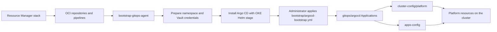

# Argo CD GitOps on OKE with OCI DevOps

## Purpose

This stack bootstraps Argo CD and a GitOps workflow for one OKE cluster. Each
stack deployment creates one `cluster-config` repository and one `apps-config`
repository for that cluster. There are no fleet types, cluster selectors, or
multi-cluster abstractions by default. With `enable_multicluster = true`, the
hub uses Argo CD's native cluster registration and ApplicationSets to deliver
descriptors from the optional `fleet-config` repository directly to spokes.

## What the stack creates

- One OCI DevOps project.
- Three OCI Code Repositories:
  - `pipelines`: artifact mirroring build specifications and scripts.
  - `cluster-config`: Argo CD bootstrap and cluster platform configuration.
  - `apps-config`: namespaced application configuration.
- An optional fourth `fleet-config` repository when multi-cluster support is
  enabled.
- A build pipeline that mirrors the Argo CD Helm chart and its images to OCIR.
- A deployment pipeline that prepares credentials and installs Argo CD.
- An OCI DevOps OKE environment.
- Logging, notifications, and optional IAM resources.

## Reconciliation flow



Argo CD is the only continuous reconciler in this path. Single-cluster
Applications target `https://kubernetes.default.svc`; optional fleet
Applications target registered spoke private API endpoints.

## Repository structure

### `cluster-config`

```text
cluster-config/
  bootstrap/
    oci-devops-git-credentials.yml        # sanitized recovery reference
    ocir-credentials.yml                  # generated by Terraform
    create-ocirsecret.txt
    argocd-bootstrap.yml                  # generated by Terraform
  docs/
    README.md                             # bootstrap access index
    iam.md                                # identities and policies
    runtime-secrets.md                    # Vault setup and rotation
  gitops/
    argocd/
      platform.yml                        # initial generated adapter
      apps.yml                            # initial generated adapter
      fleet.yml                           # optional; documented even when absent
  platform/
    applications/
      argocd/
        helm-repository.application.yaml  # initial seed, then admin-owned
        values/
          00-bootstrap.yml
          90-user.yml
      <application>/
        *.application.yaml
        values/
        resources/
      <environment-aware-application>/
        application.yaml
        infrastructure/
        environments/
    cluster-resources/
      kustomization.yml
```

- `bootstrap/` contains the generated bootstrap root and sanitized credential
  recovery manifests. The administrator applies the bootstrap root after the
  pipeline creates credentials and installs Argo CD.
- `gitops/argocd/` is initially seeded by the stack. After that first seed,
  every adapter file is administrator-owned and later Resource Manager applies
  preserve it.
- `platform/applications/` contains administrator-owned applications. Four
  delivery ApplicationSets discover Kustomize-only, repository-Helm, and
  Git-Helm descriptors. `platform-applications` discovers logical parents;
  infrastructure children use wave `-10`, while component ApplicationSets use
  wave `0` and generate independent component/environment Applications.
- `platform/cluster-resources/` contains cluster-scoped resources.
- `platform/applications/argocd/` configures the self-managed Argo CD release.
  Terraform seeds its OCIR chart descriptor and initial private-registry
  values; cluster administrators own subsequent Git changes and the ordered
  `helm.valueFiles` list. Running the separate mirror-only
  `mirror-gitops-agent` pipeline publishes either an explicit chart version or
  `LATEST`; the wildcard descriptor then selects that new private chart.
- Optional `fleet.yml` reads explicit bindings from
  `fleet-config/clusters/<cluster>/applications/<binding>/`. Those bindings
  reference applications in a shared or cluster-dedicated umbrella
  `profiles/<profile>/`. Each cluster's `cluster.yaml` separately selects one
  cluster-resource Kustomization, matching the singleton local platform root.

### `apps-config`

```text
apps-config/
  applications/
    reference-app/
      kustomize/
        components/
          frontend/
            base/
            environments/{dev,staging,production}/
          api/
            base/
            environments/{dev,staging,production}/
    reference-helm-app/
      helm/
        Chart.yaml
        values.yaml
        charts/{frontend,api}/
        values/{dev,staging,production}/{frontend,api}.yml
  examples/
```

`applications/` is a reusable, developer-owned catalog. Component bases hold
common resources; the standard `dev`, `staging`, and `production` overlays own
image tags and environment patches. It contains no cluster activation root.
Local activation lives with namespace infrastructure under
`cluster-config/platform/applications/<application>/`; managed-cluster
activation uses the same converged folder below
`fleet-config/clusters/<cluster>/applications/`. Several environments may
coexist in the application's one same-named namespace.

## Bootstrap

1. Create separate read-only, non-human Git and OCIR identities. Store each
   identity in OCI Vault as JSON with `username` and `password` keys. Follow
   `cluster-config/docs/README.md` for the complete IAM and Vault procedure.
2. Run the Resource Manager stack with `gitops_agent = "argocd"`, the target
   OKE cluster, and a bootstrap runner subnet.
3. Run `bootstrap-gitops-agent` with the Git Secret OCID in
   `git_read_credentials_secret_ocid` and the OCIR Secret OCID in
   `registry_pull_secret_ocid`. It mirrors the chart and images, then
   automatically triggers `install-gitops-agent` with both parameters. Leave
   `chart_version=LATEST` or select an exact version.
4. Wait for both pipeline runs to succeed. The deployment creates the
   namespace and credentials and installs Argo CD; it deliberately stops
   before starting Git reconciliation.
5. Clone `cluster-config`, configure `kubectl` for the OKE private endpoint,
   and apply the generated bootstrap Application:

   ```bash
   cd cluster-config
   kubectl apply -f bootstrap/argocd-bootstrap.yml
   kubectl get pods -n argocd
   ```

6. Verify reconciliation:

   ```bash
   kubectl get applications -n argocd
   kubectl get pods -A
   ```

Expected Applications include `argocd-bootstrap`, `argocd`,
`platform-cluster-resources`, parent `reference-app`, its infrastructure child,
and component Applications generated by `reference-app-components`. The adapter creates the four standardized platform
ApplicationSets plus `platform-applications`.

The generated `cluster-config/README.md` contains the complete beginner
bootstrap, UI access, daily workflow, rollback, and troubleshooting guide.

## Add platform configuration

For a namespaced platform resource, create
`platform/applications/<name>/resources/` and the matching application
descriptor. Argo CD creates the destination namespace through
`CreateNamespace=true`; do not add `namespace.yml`.

For a cluster-scoped resource, use `platform/cluster-resources/` instead.

The generated `cluster-config/README.md` contains complete, copyable examples
for cluster-scoped Kustomize, namespaced Kustomize, repository Helm, Git-hosted
Helm, Helm plus additional Kustomize resources, operator readiness with sync
waves, and independently managed components sharing a namespace.

## Add an application

1. Ask the cluster administrator to create one application folder containing
   same-named namespace infrastructure and component activation.
2. Add reusable component bases under
   `applications/<application>/kustomize/components/`, or an umbrella chart
   under `applications/<application>/helm/`.
3. Add `environments/{dev,staging,production}` beneath every component.
4. List the required component/environment pairs in the administrator-owned
   component ApplicationSet.
5. Keep that ApplicationSet beside infrastructure under the application
   folder. Wave `-10` makes infrastructure Healthy before the wave `0`
   ApplicationSet creates independently reconciled components.

The included `reference-app` demonstrates two independently updated components
with dev and staging active together; production is valid but inactive.

`reference-helm-app` demonstrates the same boundary with a Git-hosted umbrella
chart. Vendored frontend and API subcharts are disabled by default. Each
generated Application loads global `helm/values.yaml` first and then one
`helm/values/<environment>/<component>.yml`, enabling exactly one component.
The local cluster activates dev and staging; the native fleet example activates
dev on its managed cluster.

Developers should begin with the
[developer documentation index](repos/argocd/apps-config/docs/README.md). It
explains component defaults, application-global values, environment/component
release values, rendering, administrator handoff, release verification, and
rollback with copyable examples.

The complete Argo CD operator map, including the files created or modified by
every supported use case, is in [argocd-use-cases.md](argocd-use-cases.md).
The generated `cluster-config/skills/manage-oke-with-argocd/` directory packages
the same operating model as an installable, self-contained skill for local AI
agents. It includes portable shell validators and templates and requires no
proprietary connector.

## Secrets

Keep Git and OCIR credentials outside committed manifests. For workload
secrets, prefer External Secrets Operator backed by OCI Vault. The
`apps-config/examples/` directory contains sanitized examples and
`oci-secret.sh` can generate an `ExternalSecret` template.

## Validation

```bash
kustomize build platform
kubectl kustomize applications/reference-app/kustomize/components/frontend/environments/dev
helm dependency list ./applications/reference-helm-app/helm
kubectl get applications -n argocd
```

Run the first command in `cluster-config` and the second in `apps-config`.
