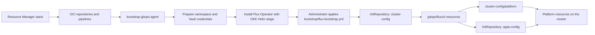

# Flux CD GitOps on OKE with OCI DevOps

## Purpose

This stack bootstraps Flux Operator and a GitOps workflow for one OKE cluster.
Each stack deployment creates one `cluster-config` repository and one
`apps-config` repository for that cluster. There are no fleet types, cluster
selectors, or multi-cluster abstractions by default. With
`enable_multicluster = true`, the stack creates a shared `fleet-config`
repository and activates its selected cluster. Administrators install Flux on
each additional member through a manually created private OCI DevOps
environment and dedicated deployment pipeline. Every cluster reconciles its
own activation root; there is no Flux hub.

Operating documentation:

- [Cluster administrator guide](repos/fluxcd/cluster-config/README.md)
- [Application developer guide](repos/fluxcd/apps-config/docs/README.md)
- [Complete use-case and file-impact matrix](flux-use-cases.md)
- [Optional decentralized fleet guide](repos/fleet-config/fluxcd/README.md)

## What the stack creates

- One OCI DevOps project.
- Three OCI Code Repositories:
  - `pipelines`: artifact mirroring build specifications and scripts.
  - `cluster-config`: Flux bootstrap and cluster platform configuration.
  - `apps-config`: namespaced application configuration.
- An optional fourth `fleet-config` repository when multi-cluster support is
  enabled.
- A build pipeline that mirrors the Flux Operator Helm chart and Flux images to
  OCIR.
- A deployment pipeline that prepares credentials and installs Flux Operator.
- An OCI DevOps OKE environment.
- A reusable prepare artifact, chart artifact, and values artifact that an
  administrator can select when manually constructing an additional member's
  installation pipeline.
- Logging, notifications, and optional IAM resources.

## Reconciliation flow



Flux CD is the only continuous reconciler in this path.

## Repository structure

### `cluster-config`

```text
cluster-config/
  bootstrap/
    git-token-auth.yml
    create-ocirsecret.txt
    flux-bootstrap.yml                    # generated by Terraform
  docs/
    README.md                             # bootstrap access index
    iam.md                                # identities and policies
    runtime-secrets.md                    # Vault setup and rotation
    external-secrets.md                   # workload secrets from OCI Vault
    use-cases.md                          # delivery-pattern catalog
    operations.md                         # day-two operation and diagnosis
    agent-guide.md                        # AI administration contract
    install-agent-skill.md                # portable skill installation
  gitops/
    fluxcd/
      flux-operator.yml                   # initial generated adapter
      platform.yml
      apps.yml                            # initial generated adapter
      fleet.yml                           # optional; documented even when absent
  platform/
    applications/
      kustomization.yml
      flux-operator/
        kustomization.yml
        resourceset.yml
        values/
          00-bootstrap.yml
          90-user.yml
      <application>/
        resourceset.yml
        resources/
      <environment-aware-application>/
        infrastructure/
        components/
    cluster-resources/
      kustomization.yml
```

- `bootstrap/` contains the generated bootstrap root and sanitized credential
  recovery manifests. The administrator applies the bootstrap root after the
  pipeline creates credentials and installs Flux Operator.
- `gitops/fluxcd/` is initially seeded by the stack. After that first seed,
  every adapter file is administrator-owned and later Resource Manager applies
  preserve it.
- `platform/applications/` contains administrator-owned applications composed
  with Flux Operator ResourceSets.
- `platform/cluster-resources/` contains cluster-scoped resources.
- `platform/applications/flux-operator/` configures the self-managed Flux
  Operator release. Terraform seeds its ResourceSet and initial
  private-registry values; cluster administrators own subsequent Git changes
  and the ordered `inputs.valuesFrom` list. Running the separate mirror-only
  `mirror-gitops-agent` pipeline publishes either an explicit chart version or
  `LATEST`; the self-managed ResourceSet then selects that private chart.

### `apps-config`

```text
apps-config/
  applications/
    reference-app/
      kustomize/components/
        frontend/{base,environments/{dev,staging,production}}/
        api/{base,environments/{dev,staging,production}}/
    reference-helm-app/
      helm/
        Chart.yaml
        values.yaml
        charts/{frontend,api}/
        values/{dev,staging,production}/{frontend,api}.yml
  examples/
```

`applications/` is a reusable, developer-owned catalog. Component bases hold
common resources; the standard `dev`, `staging`, and `production` overlays own
image tags and environment patches. It contains no cluster activation root.
Local infrastructure and component-selection ResourceSets live together in
`cluster-config/platform/applications/<application>/`; equivalent local Flux
profiles live in `fleet-config`. Several environments may
coexist in the application's one same-named namespace.

## Bootstrap

1. Create separate read-only, non-human Git and OCIR identities. Store each
   identity in OCI Vault as JSON with `username` and `password` keys. Follow
   `cluster-config/docs/README.md` for the complete IAM and Vault procedure.
2. Run the Resource Manager stack with `gitops_agent = "fluxcd"`, the target
   OKE cluster, and a bootstrap runner subnet.
3. Run `bootstrap-gitops-agent` with the Git Secret OCID in
   `git_read_credentials_secret_ocid` and the OCIR Secret OCID in
   `registry_pull_secret_ocid`. It mirrors the operator chart and
   images, then automatically triggers `install-gitops-agent` with both
   parameters. Leave `chart_version=LATEST` or select an exact version.
4. Wait for both pipeline runs to succeed. The deployment creates the
   namespace and credentials and installs Flux Operator; it deliberately stops
   before starting Git reconciliation.
5. Clone `cluster-config`, configure `kubectl` for the OKE private endpoint,
   and apply the generated bootstrap resources:

   ```bash
   cd cluster-config
   kubectl apply -f bootstrap/flux-bootstrap.yml
   kubectl get pods -n flux-system
   ```

6. Verify reconciliation:

   ```bash
   kubectl get fluxinstance,resourceset -n flux-system
   kubectl get gitrepositories,kustomizations,helmreleases -n flux-system
   kubectl get pods -A
   ```

Expected resources include `GitRepository/apps-config`, Kustomizations
`flux-platform` and `platform`, and the generated environment-aware application
component Kustomizations such as `reference-app-frontend-dev` and
`reference-app-api-staging`.

The generated `cluster-config/README.md` contains the complete beginner
bootstrap, daily workflow, rollback, and troubleshooting guide.

## Add a decentralized member

Resource Manager does not accept a list of Flux clusters and does not create
additional environments or pipeline stages. Enable multi-cluster support to
create `fleet-config` and activate the selected primary cluster. For every
additional member, the administrator:

1. creates a private OCI DevOps OKE environment using networking appropriate
   to that cluster;
2. creates a dedicated deployment pipeline using the stack's reusable prepare,
   Flux chart, and values artifacts;
3. supplies the additional cluster OCID through `target_cluster_id` and uses
   an exact chart version already mirrored to OCIR;
4. copies `fleet-config/bootstrap/member-template.yml`, creates
   `clusters/<cluster>/`, and performs the one-time GitOps handoff.

The generated fleet repository documents the complete Console and Git
procedure in `docs/add-member.md`. These manually created OCI DevOps resources
remain outside Resource Manager ownership.

## Add platform configuration

For a namespaced platform resource, create
`platform/applications/<name>/resources/` and a ResourceSet. The ResourceSet
creates the destination namespace and Flux reconciliation objects; do not add
`namespace.yml`.

For a cluster-scoped resource, use `platform/cluster-resources/` instead.

The generated `cluster-config/README.md` contains complete, copyable examples
for cluster-scoped Kustomize, namespaced Kustomize, repository Helm, Git-hosted
Helm, Helm plus additional Kustomize resources, operator readiness gates,
ResourceSet dependencies, and independently managed components sharing a
namespace.

## Add an application

1. Ask the cluster administrator to create one application folder containing
   same-named namespace infrastructure and component activation.
2. Add Kustomize component bases under
   `applications/<application>/kustomize/components/`, or an umbrella chart
   under `applications/<application>/helm/`.
3. Add `dev`, `staging`, and `production` overlays or component values files.
4. List the required component/environment pairs in one administrator-owned
   ResourceSet.
5. Keep that ResourceSet beside infrastructure, or use an equivalent
   decentralized fleet profile with multiple component references. Flux
   `dependsOn` provides the infrastructure-first ordering.

The included `reference-app` and `reference-helm-app` demonstrate two
independently updated components with dev and staging active together;
production is valid but inactive.

## Secrets

Keep Git and OCIR credentials outside committed manifests. For application
secrets, install External Secrets Operator and use OKE Workload Identity to
read OCI Vault: Git stores only `SecretStore` and `ExternalSecret` references,
while the secret value remains in Vault. The generated
`cluster-config/docs/external-secrets.md` guide contains the IAM policy,
installation, onboarding, rotation, and verification procedure. The
`apps-config/examples/` directory contains a sanitized application reference.

## Validation

```bash
kustomize build platform
kubectl kustomize applications/reference-app/kustomize/components/frontend/environments/dev
helm lint applications/reference-helm-app/helm \
  -f applications/reference-helm-app/helm/values.yaml \
  -f applications/reference-helm-app/helm/values/dev/frontend.yml
kubectl get gitrepositories,kustomizations,helmreleases -n flux-system
```

Run the first command in `cluster-config` and the second in `apps-config`.
