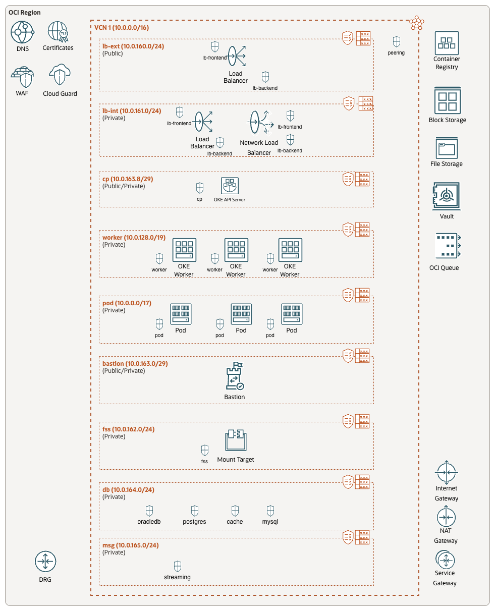
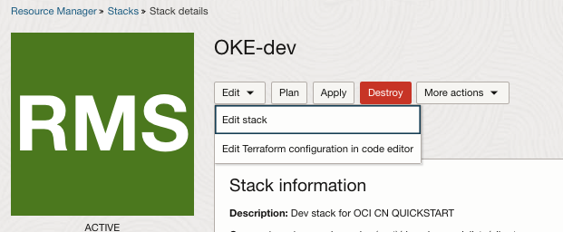
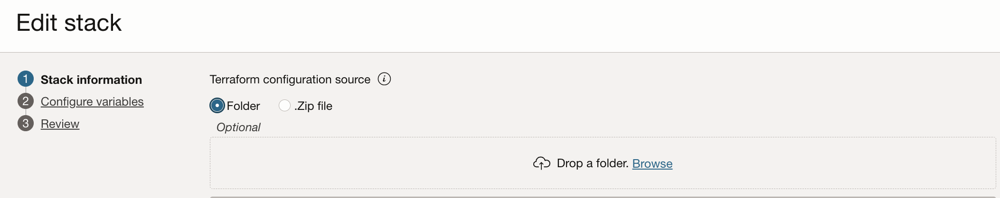
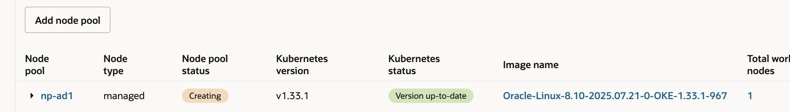
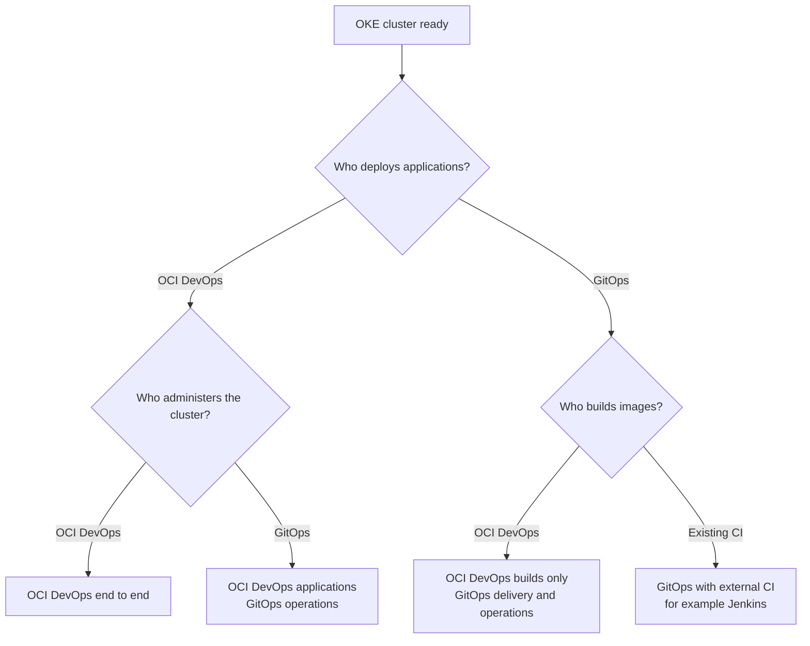

# OKE Resource Manager Quickstart

This project provides two OCI Resource Manager stacks for creating an Oracle
Kubernetes Engine cluster:

1. The **infrastructure stack** creates or configures the network resources.
2. The **OKE stack** creates the cluster and provides disabled-by-default worker
   node examples that can be enabled later.

Apply the infrastructure stack first. Its outputs provide the VCN, subnet, and
network security group OCIDs required by the OKE stack.

For GPU and RDMA clusters that need a complete specialized deployment, use the
[OCI HPC OKE Quickstart](https://github.com/oracle-quickstart/oci-hpc-oke).

## Architecture

## 1. Create the network infrastructure

The infrastructure stack supports two deployment modes:

| Mode | Behavior |
| --- | --- |
| **Create a VCN** (`create_vcn = true`) | Creates the VCN, subnets, routing, gateways, and the applicable OKE network security groups. |
| **Use an existing VCN** (`create_vcn = false`) | Uses the selected VCN and creates the applicable OKE network security groups. Optional supported network components can still be enabled. |

The OKE network security groups are always created. Database and messaging
network resources are created only when their corresponding options are enabled.

Before applying the stack:

- Review the default CNI configuration. Flannel and VCN-native pod networking
  are supported; select the option that matches your cluster networking
  requirements.
- Review the default topology. It uses private control-plane, worker, pod,
  internal load-balancer, and FSS subnets, plus public external load-balancer and
  bastion subnets.
- Review CIDRs and routing carefully when using an existing VCN. Terraform
  validates input formats but cannot identify every overlap or routing conflict.

See the [generated network-rules report](infra/network-rules-report.md)
for every OKE, database, and messaging rule created by this stack.

After the apply finishes, keep the stack outputs available for the next step.

## 2. Create the OKE cluster

Create the OKE stack using the VCN, subnet, and network security group OCIDs
returned by the infrastructure stack.

### IAM policies

The stack does not create IAM policies unless **Enable policies** is selected.
When enabled, it derives policies for the selected configuration, including:

- Cross-compartment VCN-native pod networking
- Customer-managed cluster encryption keys
- Cluster Autoscaler with workload identity
- Karpenter with workload identity

Use **Policy dry-run** to inspect the generated statements without creating IAM
policies or Karpenter identity resources. Read the local
[OKE policy guide](oke/POLICIES.md) for the exact behavior and for
additional policies that might be required by application features selected
after cluster creation.

## 3. Add worker nodes

The OKE stack creates the control plane first. All example node pools in `oke.tf`
are disabled by default so the project remains a reusable starter template.

### Edit the existing Resource Manager stack

Open the OKE stack and edit its Terraform configuration:

Set `create = true` only on the node pool you want to provision. You can also
clone this repository, edit `oke.tf`, and upload the modified OKE directory:

Save the configuration, create a plan, and apply it:

### Available examples

- **Oracle Linux managed node pool:** uses the latest compatible OKE-managed
  Oracle Linux 9 image.
- **Generic VNIC Attachment node pool:** demonstrates a secondary VNIC profile
  and an OKE Application Resource. Enable it only after satisfying the subnet,
  shape, and VCN-native CNI prerequisites documented in `oke.tf`.
- **System node pool:** provides a dedicated pool for CoreDNS and Karpenter.
- **Virtual node pool:** provides an OKE-managed virtual-node example.

The `cloud-init` directory also contains examples for storage configuration and
custom worker hostnames. The hostname example expands the boot volume with
`oci-growfs`.

To use Ubuntu workers, first create an Ubuntu custom image in your tenancy, then
set the worker image type and image OCID as described in `oke.tf`.

For Karpenter installation and configuration, see the
[Karpenter guide](oke-oci-karpenter-guide.md).

## What's Next? Managing an OKE Cluster

Once the cluster and worker nodes are ready, choose how application delivery and
cluster administration will be managed.

| Operating model | OKE DevOps Starter | OKE GitOps |
| --- | --- | --- |
| OCI DevOps end to end | `application_delivery_mode=oci_devops`, `enable_cluster_admin=true` | Not required |
| OCI DevOps applications with GitOps operations | `application_delivery_mode=oci_devops`, `enable_cluster_admin=false` | `gitops_scope=cluster_admin` |
| Build-only OCI DevOps with GitOps delivery | `application_delivery_mode=build_only`, `enable_cluster_admin=false` | `gitops_scope=applications_and_cluster` |
| GitOps only with external builds | Not required; use Jenkins or another CI system | `gitops_scope=applications_and_cluster` |

Use these solution assets to implement the selected model:

- [OKE DevOps Starter](../oci-devops-rm/README.md) creates application CI and,
  when selected, OCI DevOps application delivery and cluster-administration
  workflows.
- [OKE GitOps](../oke-gitops/README.md) bootstraps a Git-first operating model
  using either [Argo CD](../oke-gitops/argocd-solution.md) or
  [Flux](../oke-gitops/flux-solution.md).

GitOps-only mode still requires a CI system to build and publish application
images. Jenkins is one option; any build service can be used if it publishes an
image that the GitOps application configuration can reference.

When both stacks are used, they can share an OCI DevOps project but remain
independent. Kubernetes ownership is defined per object, not per namespace. A
GitOps cluster administrator can manage quotas or policies inside an
application namespace while OCI DevOps manages the workloads there, but the two
systems must never reconcile the same Kubernetes object identity.

### AI agent skills

The solutions include portable skills that help compatible AI agents operate
their generated repositories, pipelines, and cluster workflows:

- [OKE DevOps Starter skill](../oci-devops-rm/docs/ai-agent-skill.md)
- [Manage OKE with Argo CD](../oke-gitops/repos/argocd/cluster-config/skills/manage-oke-with-argocd/SKILL.md)
  ([installation guide](../oke-gitops/repos/argocd/cluster-config/docs/install-agent-skill.md))
- [Manage OKE with Flux](../oke-gitops/repos/fluxcd/cluster-config/skills/manage-oke-with-flux/SKILL.md)
  ([installation guide](../oke-gitops/repos/fluxcd/cluster-config/docs/install-agent-skill.md))

### Additional guides

- [OKE policies](../oke-policies/policies.md)
- [Karpenter guide](oke-oci-karpenter-guide.md)
- [OKE ingress controller guidance](https://docs.oracle.com/en-us/iaas/Content/ContEng/Tasks/contengmanagingresscontrollers.htm)
