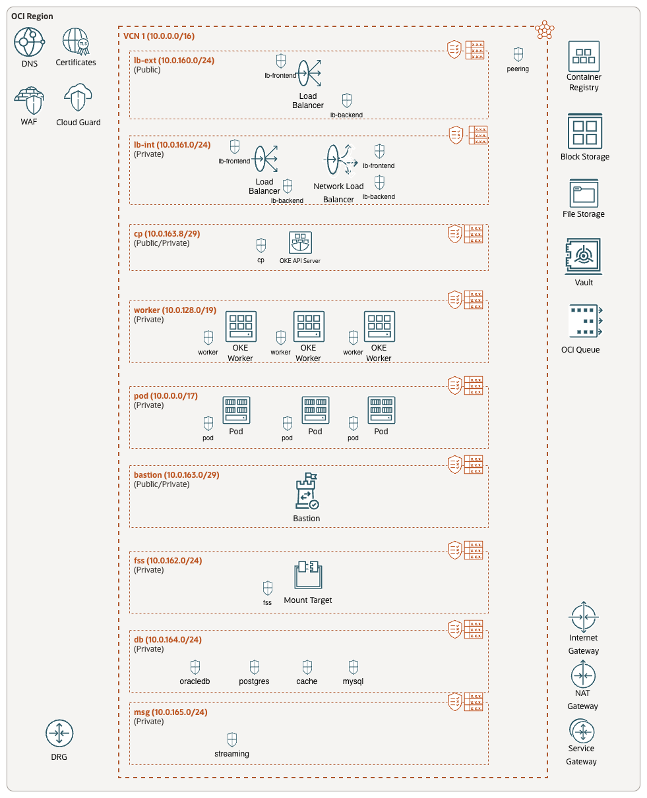
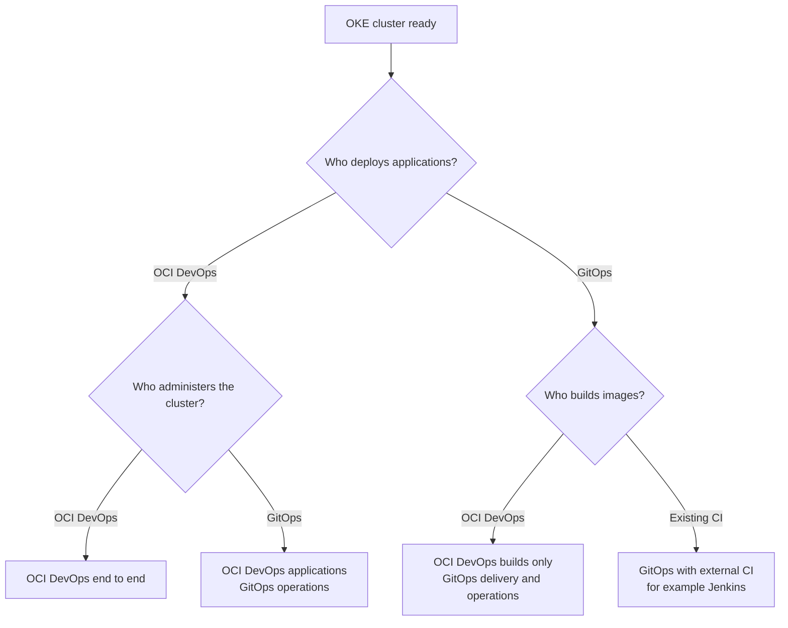

# OKE Resource Manager Quickstart

This project provides two OCI Resource Manager stacks for creating an Oracle
Kubernetes Engine cluster:

1. The **infrastructure stack** creates or configures the network resources.
2. The **OKE stack** creates the cluster, with worker pools configured in
   Terraform code using disabled-by-default examples.

Apply the infrastructure stack first. Its outputs provide the VCN, subnet, and
network security group OCIDs required by the OKE stack.

For GPU and RDMA clusters that need a complete specialized deployment, use the
[OCI HPC OKE Quickstart](https://github.com/oracle-quickstart/oci-hpc-oke).

Reviewed: 18.09.2026

## Architecture



## 1. Create the network infrastructure

The infrastructure stack supports two deployment modes:

| Mode | Behavior |
| --- | --- |
| **Create a VCN** (`create_vcn = true`) | Creates the VCN, subnets, routing, gateways, and the applicable OKE network security groups. |
| **Use an existing VCN** (`create_vcn = false`) | Uses the selected VCN and creates the applicable OKE network security groups. Optional supported network components can still be enabled. |

The OKE network security groups are always created. Database and messaging
network resources are created only when their corresponding options are enabled.

Select `opensearch` in `db_service_list` with `create_database_nsgs = true`
to create one OpenSearch NSG for TCP 9200 (API) and 5601 (Dashboards). Both endpoints use
the same database-access pattern, including access from Gateway API controller
pods. Attach the generated NSG to the OpenSearch service; this stack does not
provision an OpenSearch cluster. The optional dedicated client NSG behavior is
unchanged. Managed Data Prepper and OpenTelemetry ingestion are outside this
stack's scope.

Before applying the stack:

- Review the default CNI configuration. Flannel and VCN-native pod networking
  are supported; select the option that matches your cluster networking
  requirements.
- Review the default topology. It uses private control-plane, worker, pod,
  internal load-balancer, and FSS subnets, plus public external load-balancer and
  bastion subnets.
- Review CIDRs and routing carefully when using an existing VCN. Terraform
  validates input formats but cannot identify every overlap or routing conflict.

See the [generated network-rules report](files/infra/network-rules-report.md)
for every OKE, database, and messaging rule created by this stack.

[](https://cloud.oracle.com/resourcemanager/stacks/create?zipUrl=https://github.com/oracle-devrel/technology-engineering/releases/download/oke-rm-1.5.0/infra.zip)

### Control-plane CIDR lists

`cp_allowed_source_cidr` and `cp_egress_cidr` accept lists of IPv4 CIDRs.
Resource Manager displays both as list inputs with per-entry validation.

```hcl
cp_allowed_source_cidr = ["192.0.2.10/32", "198.51.100.0/24"]
cp_egress_cidr         = ["10.10.0.0/16", "10.20.0.0/16"]
```

Each distinct source gets a TCP 6443 ingress rule and its stateless return rule.
Each distinct egress destination gets an optional stateful TCP rule, subject to
the existing external-traffic and subnet/NAT settings. Empty lists create no
corresponding external rules; internal OKE rules are unchanged. Defaults remain
`["0.0.0.0/0"]`; restrict them to the required networks.

**Upgrading from 1.3.x:** convert scalar CIDR inputs to single-element lists before
applying, keeping the previous CIDR first. Terraform moves the existing API rules
to index zero; the optional egress rule already uses index zero. Append additional
ranges where possible, as reordering lists can update indexed rules. Review the
plan, including any tenancy-injected defined-tag drift, before applying.

Both stacks pin OCI provider 9.2.0. See the [release notes](files/CHANGELOG.md).

After the apply finishes, keep the stack outputs available for the next step.

## 2. Create the OKE cluster

Create the OKE stack using the VCN, subnet, and network security group OCIDs
returned by the infrastructure stack.

The **Default Load Balancer Subnet** is optional. Leave it unselected to create
the cluster without a default LB subnet. If selected, the stack detects whether
the subnet is public or private and configures it as the cluster default.
Load balancers are created later by Kubernetes `LoadBalancer` Services, not
during cluster creation. Without a default subnet, configure the subnet through
the appropriate Service annotations when creating a load balancer.

[](https://cloud.oracle.com/resourcemanager/stacks/create?zipUrl=https://github.com/oracle-devrel/technology-engineering/releases/download/oke-rm-1.5.0/oke.zip)

### Reuse From Your Tenancy

Install the networking and OKE configurations as Resource Manager private
templates, so teams can create new stacks from within their tenancy without
returning to this page.

[Install private templates in OCI Cloud Shell](https://cloud.oracle.com/?region=home&cs_repo_url=https%3A%2F%2Fgithub.com%2Falcampag%2Foke-rm-private-templates.git&cs_branch=main&cs_initscript_path=install-private-templates.sh&cs_readme_path=README.md&cs_open_ce=false)

The [private-template installer](https://github.com/alcampag/oke-rm-private-templates)
clones only its small dedicated repository. It asks for the region, template
compartment (default: tenancy root), release version, and template names.
The defaults are `oke-rm-networking` and `oke-rm-cluster`; the release version
is recorded in descriptions and tags. It downloads published release archives
and creates templates only, not infrastructure or policies. Existing templates
are never overwritten automatically.

If the button does not automatically run the script, open Cloud Shell in the
cloned repository and run `bash install-private-templates.sh`.

### IAM policies

The stack does not create IAM policies unless **Enable policies** is selected.
When enabled, it derives policies for the selected configuration, including:

- Cross-compartment VCN-native pod networking
- Customer-managed cluster encryption keys
- Cluster Autoscaler with workload identity
- Karpenter with workload identity

Use **Policy dry-run** to inspect the generated statements without creating IAM
policies or Karpenter identity resources. Read the local
[OKE policy guide](files/oke/POLICIES.md) for the exact behavior and for
additional policies that might be required by application features selected
after cluster creation.

## 3. Add worker nodes

Worker pools are configured in Terraform code, not in the Resource Manager
graphical form. Edit the default definitions in
[`node-pools.tf`](files/oke/node-pools.tf), or supply `worker_pools` in a
Terraform `.tfvars` file. The module configuration in
[`oke.tf`](files/oke/oke.tf) passes those definitions to the OKE module.

Four disabled examples are included: managed nodes (`np-ad1`), managed nodes
with GVA (`np-gva`), dedicated system nodes (`np-system`), and virtual nodes
(`oke-virtual`). Set `create = true` on the pools you need, configure their
shape and size, and review a plan before applying. Kubernetes version and
network settings inherit the cluster defaults unless overridden.

GVA is a managed-node networking feature. Check its subnet and shape
prerequisites before enabling it. The `taints` input is supported only for
virtual nodes; the system managed-node example configures its scheduling
behavior through the bundled cloud-init.

For Resource Manager, upload your customized Terraform configuration and run a
plan before apply. Existing `worker_pools` stack inputs are preserved and take
precedence over code defaults; update or remove an existing override deliberately
when switching back to code defaults. Disabling or removing a pool can destroy
it.

The `cloud-init` directory also contains examples for storage configuration and
custom worker hostnames. The hostname example expands the boot volume with
`oci-growfs`.

Cloud-init `content` can contain raw YAML, base64 content, or a bundled relative
file path. The system example uses `cloud-init/system.yml`, which preserves its
`CriticalAddonsOnly` taint. Custom cloud-init files must be included in the stack
archive, or their content can be supplied directly in Terraform. CoreDNS add-on
customization remains in `addons.tf`.

To use Ubuntu workers, first create an Ubuntu custom image in your tenancy, then
set the pool's `image_type` to `custom` and supply its `image_id`.

For Karpenter installation and configuration, see the
[Karpenter guide](files/oke-oci-karpenter-guide.md).

## What's Next? Managing an OKE Cluster

Once the cluster and worker nodes are ready, choose how application delivery and
cluster administration will be managed.


```mermaid
flowchart TD
  A["OKE cluster ready"] --> B{"Who deploys applications?"}
  B -->|OCI DevOps| C{"Who administers the cluster?"}
  C -->|OCI DevOps| D["OCI DevOps end to end"]
  C -->|GitOps| E["OCI DevOps applications<br/>GitOps operations"]
  B -->|GitOps| F{"Who builds images?"}
  F -->|OCI DevOps| G["OCI DevOps builds only<br/>GitOps delivery and operations"]
  F -->|Existing CI| H["GitOps with external CI<br/>for example Jenkins"]
```

| Operating model | OKE DevOps Starter | OKE GitOps |
| --- | --- | --- |
| OCI DevOps end to end | `application_delivery_mode=oci_devops`, `enable_cluster_admin=true` | Not required |
| OCI DevOps applications with GitOps operations | `application_delivery_mode=oci_devops`, `enable_cluster_admin=false` | `gitops_scope=cluster_admin` |
| Build-only OCI DevOps with GitOps delivery | `application_delivery_mode=build_only`, `enable_cluster_admin=false` | `gitops_scope=applications_and_cluster` |
| GitOps only with external builds | Not required; use Jenkins or another CI system | `gitops_scope=applications_and_cluster` |

Use these solution assets to implement the selected model:

- [OKE DevOps Starter](../../devops/oci-devops-rm/README.md) creates application CI and,
  when selected, OCI DevOps application delivery and cluster-administration
  workflows.
- [OKE GitOps](../oke-gitops/README.md) bootstraps a Git-first operating model
  using either [Argo CD](../oke-gitops/files/argocd-solution.md) or
  [Flux](../oke-gitops/files/flux-solution.md).

GitOps-only mode still requires a CI system to build and publish application
images. Jenkins is one option; any build service can be used if it publishes an
image that the GitOps application configuration can reference.

When both stacks are used, they can share an OCI DevOps project but remain
independent. Kubernetes ownership is defined per object, not per namespace. A
GitOps cluster administrator can manage quotas or policies inside an
application namespace while OCI DevOps manages the workloads there, but the two
systems must never reconcile the same Kubernetes object identity.

### AI agent skills

The solutions include portable skills that help compatible AI agents operate
their generated repositories, pipelines, and cluster workflows:

- [OKE DevOps Starter skill](../../devops/oci-devops-rm/files/docs/ai-agent-skill.md)
- [Manage OKE with Argo CD](../oke-gitops/files/repos/argocd/cluster-config/skills/manage-oke-with-argocd/SKILL.md)
  ([installation guide](../oke-gitops/files/repos/argocd/cluster-config/docs/install-agent-skill.md))
- [Manage OKE with Flux](../oke-gitops/files/repos/fluxcd/cluster-config/skills/manage-oke-with-flux/SKILL.md)
  ([installation guide](../oke-gitops/files/repos/fluxcd/cluster-config/docs/install-agent-skill.md))

### Additional guides

- [OKE policies](../oke-policies/README.md)
- [Karpenter guide](files/oke-oci-karpenter-guide.md)
- [OKE ingress controller guidance](https://docs.oracle.com/en-us/iaas/Content/ContEng/Tasks/contengmanagingresscontrollers.htm)


# License

Copyright (c) 2026 Oracle and/or its affiliates.

Licensed under the Universal Permissive License (UPL), Version 1.0.

See [LICENSE](https://github.com/oracle-devrel/technology-engineering/blob/main/LICENSE.txt) for more details.
