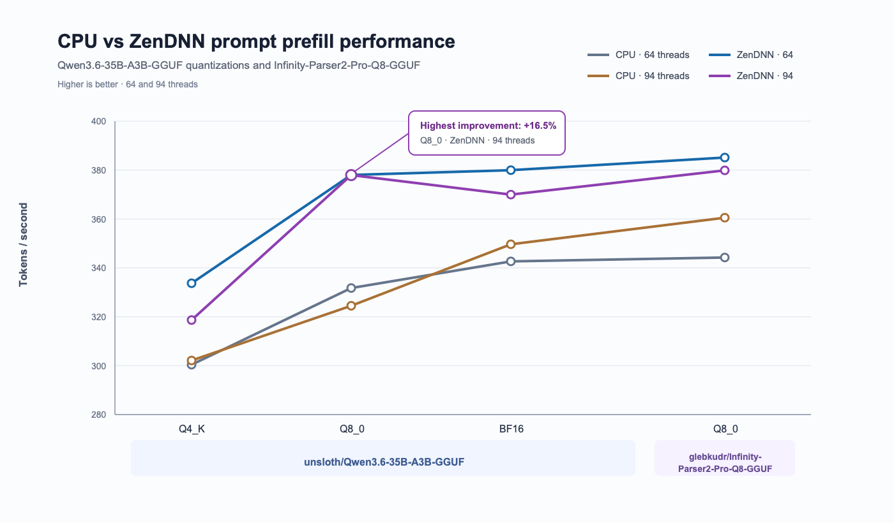
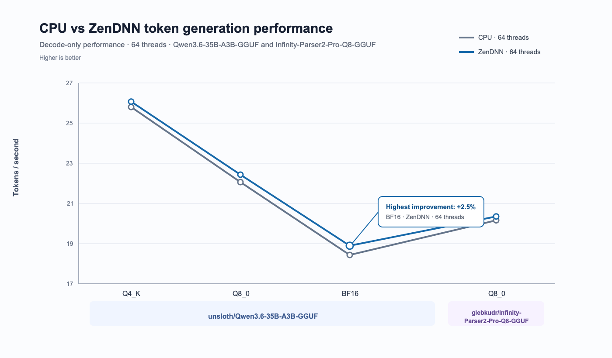
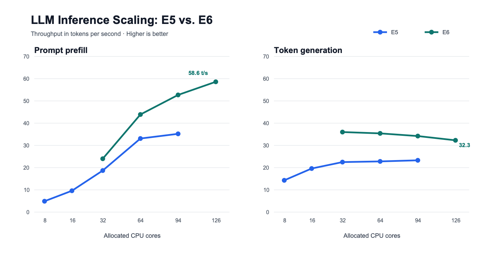

# Accelerating llama.cpp Document visual extraction on AMD CPUs with ZenDNN

Reviewed: 7/09/2026

# Introduction

As AI models move from experimentation into everyday products, efficient and scalable inference has become increasingly important. While GPUs remain essential for training and for highly parallel, latency-sensitive workloads, their scarcity and eleveted cost sometimes hinders their adoption. CPU-based inference is gaining relevance as a practical option for deploying many production AI applications. 
Modern CPUs offer broad availability, strong cost efficiency, large memory capacity, and straightforward integration with existing infrastructure. For workloads such as smaller language models, embeddings, classification, retrieval-augmented generation, and batch processing, CPUs can provide reliable performance without requiring specialized accelerators.
Advances in model quantization, optimized inference runtimes, and CPU instruction sets are further improving performance and reducing resource consumption. 
CPU inference is therefore not a replacement for GPUs in every scenario, but an increasingly valuable part of a balanced AI deployment strategy. In this article we will show how you can use llama.cpp with AMD ZenDNN libraries to accelerate inference on OCI AMD based shapes E5 and E6. 

# When to use this asset?


When you want to maximize the inference performance of model served by Llama.cpp on AMD shapes. The ZenDNN acceleration is currently supported on high precision models like BF16 and Q8_0. For more agressive quantization the ZenDNN backend reverts back to llama.cpp standard CPU implementation. ZenDNN accelerates matrix multiplications which is more relevant for the prompt prefill / prompt processing phases. So this optimization helps more workloads that are prefill heavy rather than generation heavy.  

# How to use this asset?

Follow instructions for building llama.cpp with ZenDNN support.

# Building llama.cpp with ZenDNN support

## Prerequisites

Select Ubuntu 24.04 as OS
```
sudo apt install build-essential cmake python3-dev libnuma-dev libssl-dev zlib1g-dev
```
## Building llama.cpp

Clone the repo
```
git clone https://github.com/ggml-org/llama.cpp.git
```
then you can build
```
cmake -B build -DGGML_ZENDNN=ON -DCMAKE_BUILD_TYPE=Release -DCMAKE_INSTALL_PREFIX=/home/ubuntu/llamacpp-install

cmake --build build -j$(nproc)

cmake --install build
```

To make use of the executables you need to  add some library path in .bashrc. It needs to link the ZenDNN libraries that were downloaded and built as dependencies in the llama.cpp tree. 

```
export LD_LIBRARY_PATH=/home/ubuntu/llamacpp-install/lib/:/home/ubuntu/llama.cpp/build/_deps/zendnn-prefix/build/install/zendnnl/lib
```

# Check that llama.cpp is properly compiled with ZenDNN

You can verify that executables have been built against the ZenDNN libraries
```
ldd /home/ubuntu/llamacpp-install/bin/llama-cli

linux-vdso.so.1 (0x000071020415b000)
    libllama-cli-impl.so => /home/ubuntu/llamacpp-install/lib/libllama-cli-impl.so (0x0000710203fd9000)
    libstdc++.so.6 => /lib/x86_64-linux-gnu/libstdc++.so.6 (0x0000710203c00000)
    libgcc_s.so.1 => /lib/x86_64-linux-gnu/libgcc_s.so.1 (0x0000710203fa5000)
    libc.so.6 => /lib/x86_64-linux-gnu/libc.so.6 (0x0000710203800000)
    libllama-common.so.0 => /home/ubuntu/llamacpp-install/lib/libllama-common.so.0 (0x0000710203200000)
    libmtmd.so.0 => /home/ubuntu/llamacpp-install/lib/libmtmd.so.0 (0x0000710203ac6000)
    libllama.so.0 => /home/ubuntu/llamacpp-install/lib/libllama.so.0 (0x0000710202e00000)
    libggml.so.0 => /home/ubuntu/llamacpp-install/lib/libggml.so.0 (0x0000710203f97000)
    libggml-base.so.0 => /home/ubuntu/llamacpp-install/lib/libggml-base.so.0 (0x0000710203ec9000)
    libm.so.6 => /lib/x86_64-linux-gnu/libm.so.6 (0x0000710203717000)
    /lib64/ld-linux-x86-64.so.2 (0x000071020415d000)
    libssl.so.3 => /lib/x86_64-linux-gnu/libssl.so.3 (0x0000710203a1c000)
    libcrypto.so.3 => /lib/x86_64-linux-gnu/libcrypto.so.3 (0x0000710202800000)
    libggml-cpu.so.0 => /home/ubuntu/llamacpp-install/lib/libggml-cpu.so.0 (0x0000710202646000)
    libggml-zendnn.so.0 => /home/ubuntu/llamacpp-install/lib/libggml-zendnn.so.0 (0x0000710203ebe000) # <--ZenDNN backend
    libgomp.so.1 => /lib/x86_64-linux-gnu/libgomp.so.1 (0x00007102036c1000)
    libzendnnl.so => /home/ubuntu/llama.cpp/build/_deps/zendnn-prefix/build/install/zendnnl/lib/libzendnnl.so  (0x00007101fe400000). #<-- ZennDnn Runtime
```

You can also verify it in the output logs, but it requires the enablement of the ZenDNN profiler and a very high logging level. 

```
export ZENDNNL_ENABLE_PROFILER=1

export ZENDNNL_API_LOG_LEVEL=4
export ZENDNNL_PROFILE_LOG_LEVEL=4
export ZENDNNL_COMMON_LOG_LEVEL=4
And you should see messages like this:
```

And you will see lines like this in the output:
```
[API    ][info   ][13.167344]:Executing matmul LOWOHA kernel without zendnnl-partitioner, algo: 1un
```

# Running information extraction with llama-cli

You need to have an image (test-table.jpg) with the information that you want to extract, it could be text, tables, key values lists or even graphs.
With the following command you can request extraction
```
 /home/ubuntu/llamacpp-install/bin/llama-cli -hf glebkudr/Infinity-Parser2-Pro-Q8-GGUF -t 64 -p "Extract this tabular data to HTML" --temperature 0 --top-p 1 -c 32768 -rea off --image-min-tokens 1024 --image ./test-table.jpg --log-colors off --single-turn --no-display-prompt --color off --simple-io > output.txt     
```
* -t: specifies the number of cores to use
* -hf: specifies the model to download from HuggingFace
* -p: Specifies the prompt to use to instract the extraction
* --temperature: we set temperature to 0 to make generation more deterministic
* -c: specify context size, the large momory availability on CPUs allow for larger contexts 
* -rea off: we disable reasoning to increase determinism and accuracy
* --image-min-tokens 1024: increases precision of visual extraction
* --image: specify image to extract 
# Performance tests

## Description

We tested the performance of 2 SOTA models for visual extraction of structured documents from images. 

glebkudr/Infinity-Parser2-Pro-Q8-GGUF is a local, 8-bit GGUF conversion of INFly’s Infinity-Parser2-Pro, a 35B-parameter multimodal model for document parsing and OCR. It accepts document images and is intended to extract structured content such as text, reading order, tables, equations, charts, and layout-aware Markdown/HTML-style representations.

unsloth/Qwen3.6-35B-A3B-GGUF:BF16 is the BF16 GGUF release of Qwen3.6-35B-A3B, packaged by Unsloth for local inference. It is a multimodal Mixture-of-Experts model with 35B total parameters but only about 3B active parameters per token, offering a better speed/quality balance than a dense 35B model.

we set the environmental variable ZENDNNL_MATMUL_ALGO=1 as recommended by Llama.CPP

- OCI shapes: VM.Standard.E5.Flex (94 OCPUs, 94 GB RAM), VM.Standard.E6.Flex (126 OCPUs, 126 GB RAM), BM.Standard.E5.192
- Ubuntu 24.04
- llama.cpp commit 9682e35
- ZenDNN v5.2.1
- gcc 13.3.0

## Comparison with standard CPU backend



You can see in this plot the comparison of the performance of llama.cpp with ZenDNN and standard CPU backends. This performance is measured using llama-bench which is a benchmarking tool included in llama.cpp. We provide numbers for different quantization formats ans thread count. These benchmarks focus on prefill performance: 
```
./llama-bench -hf unsloth/Qwen3.6-35B-A3B-GGUF -t 94 -p 1024 -n 0
``` 
ZenDNN consistently outperformas the standard CPU backend.  In general 64 thread count outperforms 94, and show performance saturation for this benchmark. 



On the generation side, we can see that the performance improvement with ZenDNN is marginal. Also the performance increases with more agressive quantization levels. 

- OCI shapes: VM.Standard.E5.Flex (94 OCPUs, 94 GB RAM)
- Models: unsloth/Qwen3.6-35B-A3B-GGUF:BF16, unsloth/Qwen3.6-35B-A3B-GGUF:Q8_0, unsloth/Qwen3.6-35B-A3B-GGUF:Q4_0, glebkudr/Infinity-Parser2-Pro-Q8-GGUF 


## Performance Scaling

For this section we don't use llama-bench, and instead we load and extract one image using llama-cli. llama-bench measures synthetic language-model prefill only, using fixed token batches and excluding tokenization, image handling, and multimodal projection. llama-cli with an image additionally decodes and resizes the image, runs the vision encoder and projector, then prefills image embeddings. Its end-to-end throughput therefore includes substantial work absent from llama-bench by design.



In this chart you can see how the prompt prefill and the decode phases scale with the number of cores. We can see that the prefill scales well even at high core counts, while the generation plateaus at 32 cores. In general E6 provides better performance. E6 VMs also scale up to 126 OCPUs ,and therefore provide more more performance than the largest E5 VM with 94 OCPUs.

- OCI shapes: VM.Standard.E5.Flex (94 OCPUs, 94 GB RAM), VM.Standard.E6.Flex (126 OCPUs, 126 GB RAM)
- Models: glebkudr/Infinity-Parser2-Pro-Q8-GGUF


# License

Copyright (c) 2026 Oracle and/or its affiliates.

Licensed under the Universal Permissive License (UPL), Version 1.0.

See [LICENSE](https://github.com/oracle-devrel/technology-engineering/blob/main/LICENSE) for more details.
