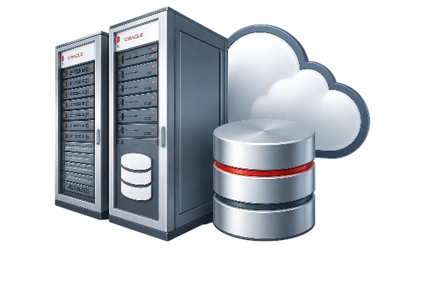

# Base Database Cloud@Customer Infrastructure

Oracle Data Infrastructure Cloud@Customer provides Base Database VM Clusters and Application VMs on Oracle-owned and managed infrastructure located in the customer’s data center.

Oracle Data Infrastructure Cloud@Customer hosts one or more VM Clusters that run Oracle AI Databases. The same Data Infrastructure also hosts Application VMs for customer-managed application workloads.

Reviewed: 07/08/26

# Table of Contents
- [Team Publications](#team-publications)
  - [Infrastructure options](#infrastructure-options)
  - [Supported Editions and Versions](#supported-editions-and-versions)
    - [The following Oracle Grid Infrastructure versions are supported:](#the-following-oracle-grid-infrastructure-versions-are-supported)
    - [The following Oracle AI Database editions are supported:](#the-following-oracle-ai-database-editions-are-supported)
    - [The following Oracle AI Database versions are supported:](#the-following-oracle-ai-database-versions-are-supported)
  - [Resource Allocation](#resource-allocation)
- [Useful Links](#useful-links)
- [License](#license)

# Team Publications

## Infrastructure options

Oracle Base Database Service on Cloud@Customer X11 is shipping with the follwoing infrastructure:

- 2x x86 Oracle X11 Database Servers (E6-2L)
- 2x AMD® EPYC 9J15 32-core 2.9 GHz (up to 4.4 GHz) processors (per server node)
- 60 usable cores (per server node)
- 660 GB usable memory (per server node)
- One external storage shelf with 6, 12, 18 or 24 7.68 TB 3.5 inch SSD to provide 11.6 - 47.2 TB of usable capacity
- 2x 10 Gbps copper or 10/25 Gbps fibre for Client network connections (per server node)
- optional 2x 10 Gbps copper or 10/25 Gbps fibre for Backup network connections (per server node)
- 2x 10 Gbps copper for CPS network connections (per server node)

> [!NOTE]
> Client and backup media type must match – Fiber/Fiber or Copper/Copper

## Supported Editions and Versions
The following Oracle Grid Infrastructure versions and Oracle AI Database editions and versions are supported.

### The following Oracle Grid Infrastructure versions are supported:

- Oracle Grid Infrastructure 26ai

### The following Oracle AI Database editions are supported:

- Standard Edition
- Enterprise Edition
- Enterprise Edition High Performance
- Enterprise Edition Extreme Performance

> [!NOTE]
> Oracle AI Database Enterprise Edition Extreme Performance is required for multi-node Oracle Real Application Clusters (Oracle RAC) systems.

### The following Oracle AI Database versions are supported:

- Oracle AI Database 26ai
- Oracle Database 19c

## Resource Allocation

The BaseDB-C@C X11 supports the creation of a maximum of 8 Virtual Machines (VMs) on one node and a total of maximum of 12 VM Clusters across the infrastructure.

The supported VM Clusters:

- Two node Database VM Cluster
- One node Database VM Cluster
- One node Application VM Cluster

> [!NOTE]
> The Database VM Clusters are using ECPU (Elastic Compute Units) metric for measuring consumption, while the Application Cluster is using OCPU (Oracle Compute Units)

- An OCPU is the equivalent of a physical core of a processor (CPU). A billing based on OCPUs binds the price to the make, model or clock speed of the underlying CPU. But CPU capacities increase with every new release, rendering a correct price to performance metric relation too complex.
- An ECPU is based on the number of cores that are elastically allocated per hour to the VM Cluster from a pool of Exadata database servers and storage servers. This metric is independent of the underlying physical hardware, making it the basis for billing in the Cloud for the long-term future.

# Useful Links

- [Main Oracle Product Page](https://www.oracle.com/database/base-database-service/#cloudcustomer)

- [Oracle Base Database Cloud@Customer X11 datasheet](https://www.oracle.com/a/ocom/docs/database/base-database-cloud-at-customer-x11.pdf)

- [Documentation Home](https://docs.oracle.com/en/cloud/cloud-at-customer/base-database/admin/index.html)

# License

Copyright (c) 2026 Oracle and/or its affiliates.

Licensed under the Universal Permissive License (UPL), Version 1.0.

See [LICENSE](https://github.com/oracle-devrel/technology-engineering/blob/main/LICENSE.txt) for more details.
