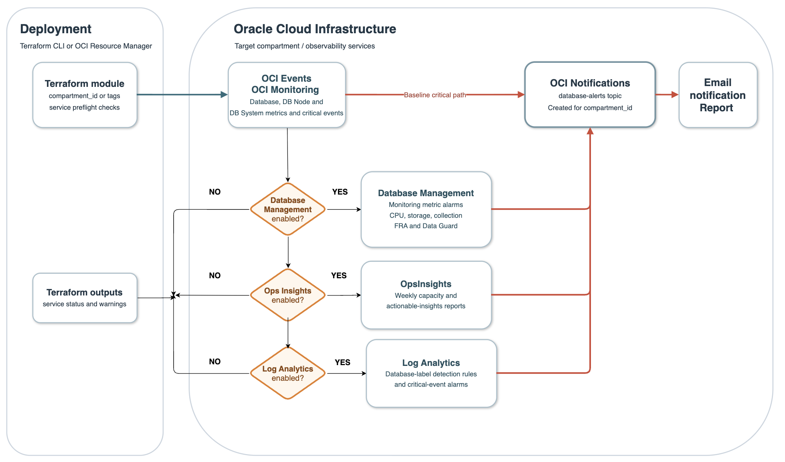

# Alerts setup for OCI Database environment

## 1. Scope

This Terraform configuration creates a production-focused notification channel
and baseline Database Service critical-event rule for the selected compartment,
even when Database Management, Operations Insights, and Log Analytics are not
enabled. It also creates OCI Monitoring alarms, conditional Operations Insights
reports, and conditional Log Analytics critical-event alarms when their source
service is available. It creates one Notifications topic per selected
compartment and subscribes `test@acme.com` using the `EMAIL` protocol. If an
active topic with the configured name already exists, Terraform reuses it.

The configuration creates only alerting resources. It never enables, onboards,
or changes Database Management, Operations Insights, or Log Analytics. Those
services can require database credentials, private endpoints, IAM policy,
network access, and licensing decisions that must be approved separately.


### Architecture

The diagram shows the always-on baseline path: Terraform creates an OCI Events
rule for Database Service critical events, routes them to the
`database-alerts` Notifications topic, and delivers the notification by email.
Database Management metric alarms, Operations Insights reports, and Log
Analytics detection rules join the same topic only after their respective
service check succeeds. A failed check is reported in Terraform outputs and
does not enable or configure the missing service.

The editable source is available in [Draw.io format](files/database-alerts-architecture.drawio).



[](https://cloud.oracle.com/resourcemanager/stacks/create?zipUrl=https%3A%2F%2Fgithub.com%2Foracle-devrel%2Ftechnology-engineering%2Farchive%2Frefs%2Fheads%2Fsciunzi_Db_alerts.zip)


## 2. Target

In the OCI Resource Manager **Configure variables** screen, provide at least one
target selector. `compartment_id` takes precedence over `tags`.

| Input | Required | Default | Description |
|---|---|---|---|
| `compartment_id` | One target selector is required | `null` | OCI compartment OCID to monitor. Selects Database Management managed databases in that compartment and enables baseline Database Service event and native-metric alarms for the compartment. When set, `tags` is ignored. |
| `tags` | One target selector is required when `compartment_id` is empty | `{}` | Free-form tag key/value pairs for selecting Database Management managed databases. Every supplied tag must match. |
| `email_endpoint` | No | `test@acme.com` | Email address subscribed to created or reused Notifications topics. OCI requires recipient confirmation before delivery starts. |
| `notification_topic_name` | No | `database-alerts` | Baseline topic name for critical Database Service events and default alarm delivery. An active matching topic is reused. |
| `operations_notification_topic_name` | No | `db-prod-operations` | Operational topic name for Backup Failure alarms and the daily SQL performance-degradation report. An active matching topic is reused. |
| `freeform_tags` | No | `{}` | Free-form tags applied to resources created by the module. |
| `enable_database_service_metric_alarms` | No | `true` | Creates native Database Service alarms for `oci_database`, `oci_database_cluster`, and `oci_autonomous_database`; Database Management is not required. |
| `enable_full_management_alarms` | No | `true` | Creates FRA utilization and Data Guard apply-lag alarms; these require Database Management Full Management metrics. |
| `enable_recommended_alarms` | No | `true` | Creates the additional Database Management alarms and Database Service operational-event rule. Service-dependent resources are skipped when their source service is inactive. |
| `enable_ops_insights_reports` | No | `true` | Creates the weekly Operations Insights capacity and inventory report when a selected Database Insight is enabled. |
| `enable_ops_insights_sql_degradation_report` | No | `true` | Creates the daily Operations Insights SQL performance-degradation report and sends it to `db-prod-operations` when Ops Insights is enabled. |
| `enable_log_analytics_alerts` | No | `true` | Creates Log Analytics label-detection rules and Monitoring alarms only for active entities with associated sources. |
| `cpu_critical_percent` | No | `90` | Critical CPU utilization threshold used by Database Management and native Database Service alarms. |
| `storage_critical_percent` | No | `90` | Critical storage or disk utilization threshold used by Database Management and native Database Service alarms. |
| `fra_critical_percent` | No | `90` | Critical Flash Recovery Area utilization threshold. |
| `dataguard_apply_lag_critical_seconds` | No | `900` | Approved RPO threshold, in seconds, for Data Guard apply and transport lag alarms. |
| `tablespace_warning_percent` | No | `80` | Warning threshold for Database Management tablespace utilization. |
| `session_warning_percent` | No | `75` | Warning threshold for Database Management session-limit utilization. |
| `process_warning_percent` | No | `75` | Warning threshold for Database Management process-limit utilization. |

`notification_topic_name` defaults to `database-alerts`. Set it to a different
name if the existing topic is not the intended notification channel.

The discovery query targets `DbmgmtManagedDatabase` resources, which is the
Database Management service check. A database that is not enabled for Database
Management is not selected and receives no metric alarms. When
`compartment_id` is set, the baseline Notifications topic, email subscription,
and Database Service critical-event rule are nevertheless created. If no
eligible database matches, Terraform emits the
`database_management_not_enabled_warning` output.

Example configuration:

```hcl
compartment_id = "ocid1.compartment.oc1..replace_me"

# Ignored because compartment_id is set.
tags = {
  environment = "production"
}
```

## 3. Description of the alerts created

Rows marked **Created conditionally** are created automatically only when the
service check reports that the relevant service is already enabled for the
selected database. Terraform reports an unavailable service in
`service_preflight_report` and the service-specific warning outputs. Each
warning lists the alerts that were not created; Terraform does not attempt to
enable the missing service.

| Alert or report | OCI service needed to detect it | Notification channel | Signal / condition | Severity | Deployment status |
|---|---|---|---|---|---|
| Database Management collection failure | Database Management and OCI Monitoring | `db-prod-critical` | `oracle_oci_database/MonitoringStatus` with `errorSeverity = ERROR` | Critical | Created now |
| Sustained CPU utilization | Database Management and OCI Monitoring | `db-prod-critical` | `oracle_oci_database/CpuUtilization` ≥ `cpu_critical_percent` | Critical | Created now |
| Database storage utilization | Database Management and OCI Monitoring | `db-prod-critical` | `oracle_oci_database/StorageUtilization` ≥ `storage_critical_percent` | Critical | Created now |
| OCI Database CPU utilization | OCI Monitoring `oci_database` namespace | `db-prod-critical` | `oci_database/CpuUtilization` ≥ `cpu_critical_percent` | Critical | Created now when `enable_database_service_metric_alarms = true`; does not require Database Management |
| OCI Database storage utilization | OCI Monitoring `oci_database` namespace | `db-prod-critical` | `oci_database/StorageUtilization` ≥ `storage_critical_percent` | Critical | Created now when `enable_database_service_metric_alarms = true`; does not require Database Management |
| OCI Database Cluster CPU utilization | OCI Monitoring `oci_database_cluster` namespace | `db-prod-critical` | `oci_database_cluster/CpuUtilization` ≥ `cpu_critical_percent` | Critical | Created now when `enable_database_service_metric_alarms = true`; does not require Database Management |
| OCI Database Cluster disk utilization | OCI Monitoring `oci_database_cluster` namespace | `db-prod-critical` | `oci_database_cluster/DiskUtilization` ≥ `storage_critical_percent` | Critical | Created now when `enable_database_service_metric_alarms = true`; does not require Database Management |
| OCI Autonomous Database CPU utilization | OCI Monitoring `oci_autonomous_database` namespace | `db-prod-critical` | `oci_autonomous_database/CpuUtilization` ≥ `cpu_critical_percent` | Critical | Created now when `enable_database_service_metric_alarms = true`; does not require Database Management |
| OCI Autonomous Database storage utilization | OCI Monitoring `oci_autonomous_database` namespace | `db-prod-critical` | `oci_autonomous_database/StorageUtilization` ≥ `storage_critical_percent` | Critical | Created now when `enable_database_service_metric_alarms = true`; does not require Database Management |
| Flash Recovery Area utilization | Database Management Full Management and OCI Monitoring | `db-prod-critical` | `oracle_oci_database/FRAUtilization` ≥ `fra_critical_percent` | Critical | Created now when `enable_full_management_alarms = true` |
| Data Guard apply lag | Database Management Full Management, Data Guard, and OCI Monitoring | `db-prod-critical` | `oracle_oci_database.oracle_dataguard/ApplyLag` ≥ `dataguard_apply_lag_critical_seconds` | Critical | Created now when `enable_full_management_alarms = true` |
| Tablespace utilization | Database Management and OCI Monitoring | `db-prod-operations` / `db-prod-critical` | `oracle_oci_database/StorageUtilizationByTablespace` ≥ `tablespace_warning_percent` / `storage_critical_percent` | Warning / Critical | Created conditionally when Database Management is enabled and `enable_recommended_alarms = true` |
| Data Guard transport lag | Database Management Full Management, Data Guard, and OCI Monitoring | `db-prod-critical` | `oracle_oci_database.oracle_dataguard/TransportLag` ≥ `dataguard_apply_lag_critical_seconds` | Critical | Created conditionally when Database Management is enabled and `enable_recommended_alarms = true` |
| Backup failure | Database Service Events, OCI Events, and OCI Notifications | `db-prod-operations` | `com.oraclecloud.databaseservice.database.critical` with `data.additionalDetails.eventName = HEALTH.DB_CLUSTER.CDB.BACKUP_FAILURE` | Critical | Created now when `enable_recommended_alarms = true`; delivered to `db-prod-operations` without Database Management |
| Recovery-window breach | Database Management Full Management and OCI Monitoring | `db-prod-critical` | `oracle_oci_database/RecoveryWindow` reports a value | Critical | Created conditionally when Database Management is enabled and `enable_recommended_alarms = true` |
| Database Management job failure | Database Management and OCI Monitoring | `db-prod-operations` | `oracle_oci_database/dbmgmtJobExecutionsCount` with `status = Failed` | Warning | Created conditionally when Database Management is enabled and `enable_recommended_alarms = true` |
| Session or process exhaustion | Database Management Full Management and OCI Monitoring | `db-prod-operations` / `db-prod-critical` | `oracle_oci_database/SessionLimitUtilization` or `oracle_oci_database/ProcessLimitUtilization` ≥ warning / critical threshold | Warning / Critical | Created conditionally when Database Management is enabled and `enable_recommended_alarms = true` |
| Persistent blocking sessions | Database Management Full Management and OCI Monitoring | `db-prod-operations` | `oracle_oci_database/BlockingSessions` >0 for 15 minutes | Warning | Created conditionally when Database Management is enabled and `enable_recommended_alarms = true` |
| Invalid objects or unusable indexes | Database Management Full Management and OCI Monitoring | `db-prod-operations` | `oracle_oci_database/InvalidObjects` or `oracle_oci_database/UnusableIndexes` >0 | Warning | Created conditionally when Database Management is enabled and `enable_recommended_alarms = true` |
| Database, DB node, or DB system critical condition | Database Service Events, OCI Events, and OCI Notifications | `db-prod-critical` | Database Critical, DB Node Critical, or DB System Critical event | Critical | Created now, even without Database Management, Ops Insights, or Log Analytics |
| DB node error / warning | Database Service Events, OCI Events, and OCI Notifications | `db-prod-operations` | DB Node Error or DB Node Warning event | Warning | Created now when `enable_recommended_alarms = true` |
| Capacity and inventory digest | Operations Insights News Reports | `db-capacity-reports` | Weekly capacity-planning, actionable-insight, and top-database summary | Info | Created conditionally when a selected OpsInsights is `ENABLED` |
| Daily SQL performance degradation report | Operations Insights SQL Insights News Reports | `db-prod-operations` | SQL Insights performance-degradation content for `DATABASE` resources, sent daily | Warning | Created conditionally when a selected OpsInsights is `ENABLED` and `enable_ops_insights_sql_degradation_report = true`; delivered to the `db-prod-operations` topic |
| Database crash | Log Analytics, Database Alert Logs, and ingest-time detection rule | `db-prod-critical` | Label `Abnormal Termination` | Critical | Created conditionally when Log Analytics is onboarded and the target has an active entity with sources |
| Internal Oracle incident | Log Analytics, Database Alert/Trace Logs, and ingest-time detection rule | `db-prod-critical` | Label `Internal Error`; e.g. ORA-00600 or ORA-07445 | Critical | Created conditionally |
| Data corruption | Log Analytics, Database Alert Logs, and ingest-time detection rule | `db-prod-critical` | Label `Data Corruption` | Critical | Created conditionally |
| Storage or I/O error | Log Analytics, Database Alert/Trace Logs, and ingest-time detection rule | `db-prod-critical` | Label `Storage Error` or `I/O Error` | Critical | Created conditionally |
| Database startup or availability failure | Log Analytics, Database Alert Logs, and ingest-time detection rule | `db-prod-critical` | Label `Availability Error` | Critical | Created conditionally |
| Listener connection failure burst | Log Analytics and Database Listener Alert Logs | `db-prod-operations` | Label `Connection Error` | Warning | Created conditionally when Log Analytics is active and `enable_recommended_alarms = true` |
| Database timeout burst | Log Analytics and Database Alert Logs | `db-prod-operations` | Label `Timeout` | Warning | Created conditionally when Log Analytics is active and `enable_recommended_alarms = true` |
| Privileged login or audit-policy change | Log Analytics and Oracle Unified DB Audit Logs | `db-security` | Label `Privileged Login` or `Audit Policy Change` | Warning / Critical | Created conditionally when Log Analytics is active and `enable_recommended_alarms = true` |

### Notification channels

| Channel | Intended recipients and transport | Use |
|---|---|---|
| `database-alerts` | OCI Notifications `EMAIL` subscription to `test@acme.com` | The channel created or reused by this Terraform deployment. It receives Database Service events, all Database Management alarms, conditional Log Analytics events, and conditional Operations Insights reports. Critical alarms repeat hourly while firing. |
| `db-prod-critical` | DBA/on-call pager, incident-management webhook, and optionally email | Immediate action for outages, Data Guard RPO breach, data corruption, FRA exhaustion, and monitoring blindness. Acknowledge and investigate 24×7. |
| `db-prod-operations` | DBA operations queue, ticketing integration, and email/Teams | Action during operational support hours for capacity pressure, backup failures, failed jobs, blocking sessions, listener error bursts, SQL performance degradation, and configuration problems. This Terraform configuration creates or reuses this topic for the Backup Failure event rule and the daily SQL performance-degradation report, and subscribes `test@acme.com`. |
| `db-capacity-reports` | Capacity planner, service owner, and DBA distribution list | Scheduled weekly report rather than a pager. Covers Ops Insights forecasts, top consumers, utilization changes, and inventory changes. |
| `db-security` | Security Operations Center and DBA security owner | Security and audit events: privileged logons, failed-login bursts, grants/revokes, user changes, and audit-policy changes. |

The Terraform module currently creates or reuses the `database-alerts` topic
as its physical delivery destination. The **Notification channel** column
identifies the recommended operational routing class; create and map the
separate listed channels when the customer needs distinct recipients.
OCI sends a subscription confirmation email to `test@acme.com`; the channel is
not active until the recipient confirms it.


## 4. References

- [Database Management tagging and Search](https://docs.oracle.com/en-us/iaas/database-management/doc/tags-and-search-database-management.html) documents the `DbmgmtManagedDatabase` OCI Search resource type and query examples.
- [OCI Search overview](https://docs.oracle.com/en-us/iaas/Content/Search/Concepts/queryoverview.htm) documents resource-query scope and supported resource types.
- [OCI Resource Manager deploy button](https://docs.oracle.com/en-us/iaas/Content/ResourceManager/Tasks/deploybutton.htm) documents pre-loading a stack with a public ZIP URL.
- [Oracle Cloud Database Metrics](https://docs.oracle.com/en-us/iaas/database-management/doc/oracle-cloud-database-metrics.html) describes the Database service metrics available without Diagnostics & Management.
- [Autonomous Database metrics](https://docs.oracle.com/en/cloud/paas/autonomous-database/serverless/adbsb/autonomous-monitor-metrics-list.html) describes the `oci_autonomous_database` namespace.
- [Base Database Service event types](https://docs.oracle.com/en/cloud/paas/base-database/event-types/index.html) documents the Database Service critical event payload used for backup-failure routing.
