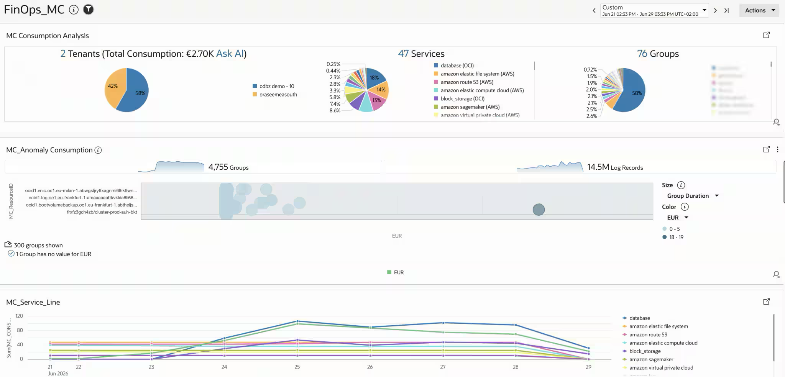
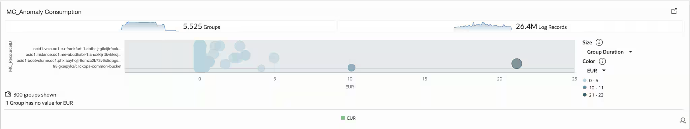
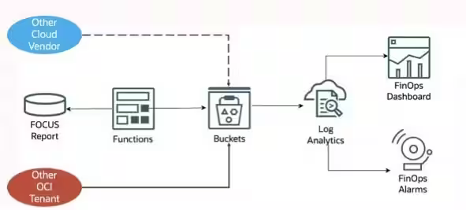
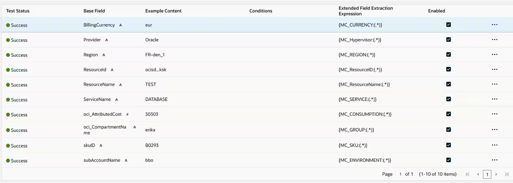

# Multicloud FinOps with Oracle Log Analytics

This project centralizes AWS and OCI FOCUS cost and usage data in Oracle Log Analytics, giving FinOps, engineering, and finance teams one shared view of cloud consumption.

Multicloud dashboard 

Multicloud cost management is difficult when providers expose different account hierarchies, service names, SKUs, regions, and tags. FOCUS provides a common cost and usage specification; Oracle Log Analytics turns that data into one searchable and visual FinOps layer.

Stakeholders can move from a cost increase to the responsible provider, service, region, resource, SKU, and ownership group. Executives gain a clear view of spend trends and budget risk; application owners can investigate their workloads; and finance teams can support showback, chargeback, allocation, and variance analysis.

The dashboard also supports cost-driver analysis, anomaly investigation, and environment- or group-based filtering. The same normalized fields can be used for saved searches, alerts, and longer-term cost retention.

Cost anomaly analysis

Natural-language exploration with Logan AI

##  Architecture

AWS Billing and OCI Cost Management Data Exports publish FOCUS data. Make AWS FOCUS CSV or CSV.GZ files available in the dedicated AWS bucket and OCI FOCUS files available in the dedicated OCI bucket created by this stack. The stack deliberately does not create an AWS function, scheduled job, cross-cloud credential, or data-transformation path; report delivery to OCI is owned by the existing export process.

AWS FOCUS reports land in the AWS bucket and are ingested with the `FOCUS_AWS` source. OCI FOCUS reports land in the OCI bucket and are ingested with the `FOCUS_OCI` source. Both live Object Storage collection rules write to the shared Log Analytics group and use the same normalized model beneath the `FinOps_MC` dashboard.

Reference architecture

Consumption widget 

## Normalization Fields

The parsers map each provider report to stable `MC_*` fields. This separates the dashboard from provider-specific report versions, optional fields, and extensions.

| Normalized field | Meaning |
| --- | --- |
| `MC_CONSUMPTION` | Cost or consumption amount used for analysis |
| `MC_CURRENCY` | Billing currency |
| `MC_Hypervisor` | Source cloud or platform, such as AWS or OCI |
| `MC_REGION` | Usage region |
| `MC_SERVICE` | Cloud service |
| `MC_ResourceID` / `MC_ResourceName` | Resource identifier and display name |
| `MC_SKU` | SKU or metering dimension |
| `MC_ENVIRONMENT` | Environment classification |
| `MC_GROUP` | Allocation or ownership group |
| `MC_USAGE` | Usage measure exposed by the AWS parser |

The OCI parser includes `MC_GROUP`; add an equivalent AWS allocation mapping when business-unit reporting is needed. Owner, application, cost centre, tags, and commitment-discount detail can be added without changing the shared dashboard contract.

Normalized field model in OCI_Focus Source

## Included Assets

| Asset | Purpose |
| --- | --- |
| [`files/FOCUS_AWS.xml`](files/FOCUS_AWS.xml) | Log Analytics `FOCUS_AWS` parser and source export |
| [`files/FOCUS_OCI.xml`](files/FOCUS_OCI.xml) | Log Analytics `FOCUS_OCI` parser and source export |
| [`files/FinOps_MC.json`](files/FinOps_MC.json) | Sanitized `FinOps_MC` dashboard template; six tiles and six saved searches |
| [`files/`](files/) | Resource Manager-ready OCI stack: bucket, Log Analytics imports, policies, streams, and live collection rules |
| [`files/finops-mc-oci-stack.zip`](files/finops-mc-oci-stack.zip) | Deployable OCI Resource Manager package |

## Deploy on Oracle Cloud

### Actions performed by the stack

- Creates separate private, event-enabled OCI Object Storage buckets for AWS and OCI FOCUS reports.
- Creates a dedicated FOCUS log group in Oracle Log Analytics. Set `onboard_log_analytics` to `true` only when the tenancy has not already been onboarded.
- Imports the packaged `FOCUS_AWS` and `FOCUS_OCI` parsers and sources plus the `FinOps_MC` dashboard and saved searches.
- Creates dedicated OCI Streaming resources, a dynamic group, and IAM policies required for live Object Storage collection.
- Enables two LIVE Object Collection Rules: the AWS bucket uses `FOCUS_AWS`, and the OCI bucket uses `FOCUS_OCI`.

It does not create AWS resources, cross-cloud credentials, Functions, Lambda jobs, or report-export automation. Uploading or transferring FOCUS reports to the OCI bucket remains outside this stack.

## References
- [Export AWS Focus Report on OCI Bucket](https://github.com/oracle-devrel/technology-engineering/tree/main/oci-and-db/foundation/observability-and-management/log-analytics/finops/aws-focus-to-oci-object-storage)
- [Export OCI Focus Report on OCI Bucket](https://github.com/mikarinneoracle/oci_usage_reports?tab=readme-ov-file#deployment-scenarios)
- [Monitoring FinOps Data Across Multicloud with Oracle Log Analytics](https://blogs.oracle.com/observability/monitor-finops-multicloud-oracle-log-analytics)
- [Observability for AWS FinOps Data with Oracle Log Analytics](https://blogs.oracle.com/observability/observability-aws-finops-data-oracle-log-analytics)
- [FOCUS specification](https://focus.finops.org/)
- [Collect Logs from Your OCI Object Storage Bucket](https://docs.oracle.com/en-us/iaas/log-analytics/doc/collect-logs-from-your-oci-object-storage-bucket.html)
- [Deploy to Oracle Cloud button documentation](https://docs.oracle.com/en-us/iaas/Content/ResourceManager/Tasks/deploybutton.htm)
