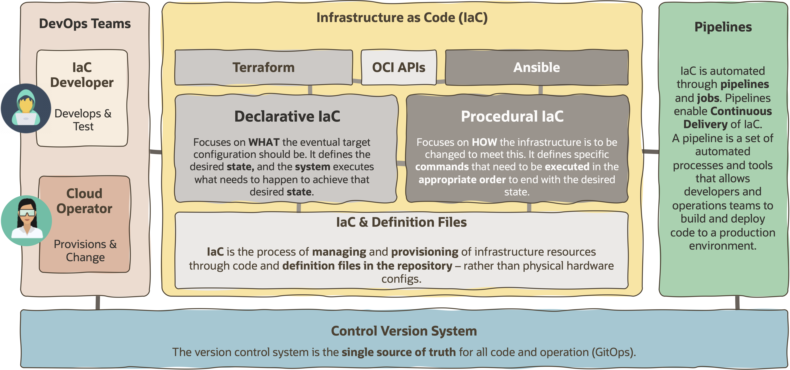
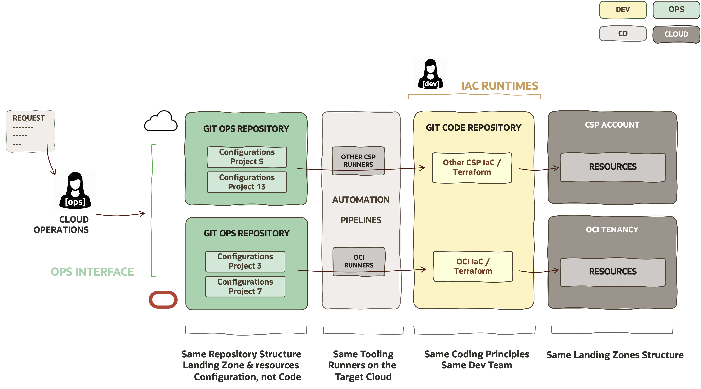
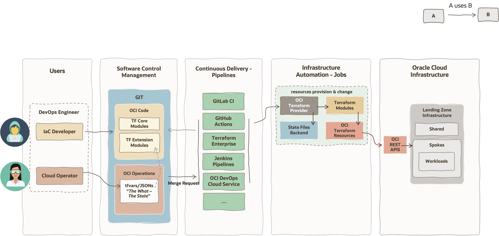
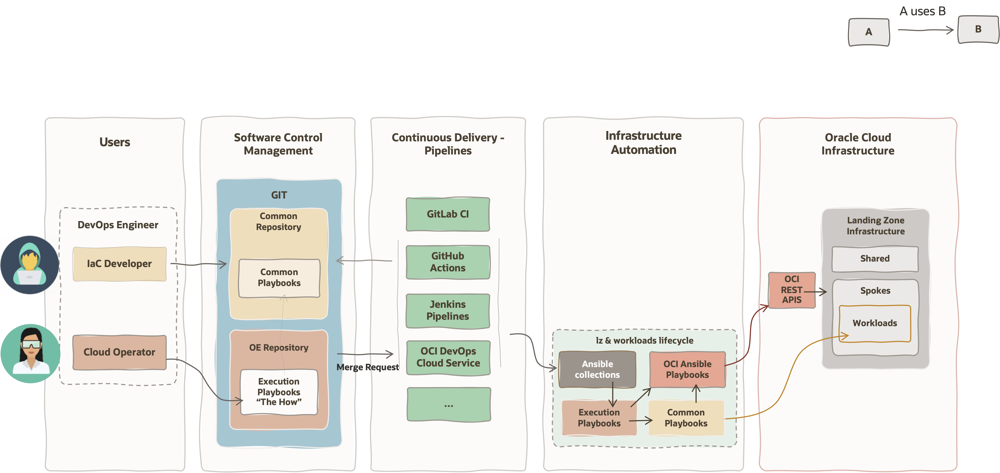

# GitOps

Reviewed: 2026-07-08

## What is this asset?

This asset explains GitOps as a multi-cloud operating model for managing infrastructure through version control, reviewed changes, and automated delivery.

## How to use this asset?

Read this guide to understand the GitOps operating model, its personas, and its declarative and procedural workflows.

## Table of Contents

- [What is this asset?](#what-is-this-asset)
- [How to use this asset?](#how-to-use-this-asset)
- [Why GitOps?](#why-gitops)
- [What is GitOps?](#what-is-gitops)
- [License](#license)

# Why GitOps?

**GitOps** is a modern **operational model** designed to manage and scale infrastructure across multi-cloud environments. It provides a **standardized, automated,** and **secure** way to operate cloud resources by using familiar software development practices such as **version control, collaboration,** and **security compliance**.

Multi-Cloud presents some operational challenges for organisations operating across multiple cloud providers often face:

* Different management interfaces and tools per provider.
* Increased operational complexity.
* Lack of consistency across environments and teams.

To address these challenges, a unified approach is required—one that **simplifies** operations while maintaining **control**, **security**, and **scalability**.

# What is GitOps?

To understand what is GitOps, first we need to remember what is Infrastructure-as-Code (IaC): 

*"Infrastructure as Code is the process of provisioning and managing computing infrastructure through code instead of manual processes."*

Then, GitOps is defined as:

*"GitOps is an operational practice that applies DevOps best practices, like* ***version control, collaboration, compliance***, and ***CI/CD to infrastructure automation."***

The GitOps technology context and personas relationship is represented in the following picture:

The **Control Version Systems (GIT)** is the **single source of truth** for code and all infrastructure components (including Landing Zone & Workload) configuration and code. Any change goes through the Control Version System, where you can audit and track all changes made over time.

**IaC** defines how we manage the infrastructure components for its provisioning and change over the full file cycle of the components. Code & configurations are stored on GIT but in different repositories, maximising the reusability of code and the isolation and control of resources configuration, both maintained by different Personas.

There are 2 IaC approaches:

* **Declarative IaC** (as Terraform), that defines the desired target state of the infrastructure component. Terraform is limited for some operations after provisioning or additional software maintenance. On its own is not enough.
  
* **Procedural IaC** (as Ansible, SDK scripts, etc.), that defines how the infrastructure components has to change with the different commands, executed in a specific order over the component to get needed configuration
  
Both approaches use OCI APIs to be able to manage the infrastructure components.

IaC is automated with the help of **pipelines**, enabling the testing and deployment of the infrastructure.

The different **Personas**, or teams involved, implying a **strong separation of duties** for **operational security**, typically are 2:

* **IaC Developers:** They're responsible for creating, testing and/or maintaining the Terraform Modules or Ansible common playbooks that are massively reused among the organisation. 
  
* **Cloud Operators:** They're responsible to manage the infrastructure's configuration. 
  
It is important to remark this separation of duties, so IaC Developers don't have access to production infrastructure configurations in the same way as the Cloud Operations don't have access to create/modify uncontrolled/unapproved code.

For seeing how OCI fits, thanks to GitOps, in a Multi-Cloud world, let's have a look to the following diagram representing a typical workflow for a 3rd party Cloud Service Provider (CSP) and OCI:

The above diagram depicts the following components:

* **GitOps repositories:** Holds Landing Zone & projects configurations. Each CSP has a Landing Zone that can be mirrored in OCI, bringing the same logical structure for components, similar security guardrails and identical network topology to hold the different platforms & workloads. The Git repositories stores configurations and not code.
  
* **Automation pipelines:** After any change in the Landing Zone or project configuration repository, an automation pipeline is fired and some runner brings the configurations, the Terraform modules, initialises the modules with dependent Terraform provider, to execute the provisioning or new resources or perform the modifications on existing resources. Common runners, in cloud, on-premises or in specific CSP can execute the automation jobs.
  
* **Git code repository(ies):** Code is kept separated from configurations and centralised for reusability. Each CSP has its own Terraform Modules, created from for the specific CSP Terraform provider resources. Same coding and software development principles are followed for all the code independently of the CSP by a same development team.
  
* **CSP Account/Tenancy:** This is the amount or tenancy where the customer's resources are deployed in the specific CSP cloud space.

Typical workflow:

1) A Cloud Operator receive a request from a Business User by automated or manual means, requesting the onboarding of a new project or modification in an existing one.
   
2) Cloud Operator creates a new repository from a template or locates the existing one.
   
3) Cloud Operator modifies the configuration file that manages the Landing Zone component or Workload in a project.
   
4) Cloud Operator commit the changes and creates a merge request, where the pipeline fires and goes through the different stages as gathering the configurations, code, initialisation, validation of input files, security checks, testing and runs the plan. Plan output is attached to the change request for review by an additional approver.
   
5) After the successful approval the merge request is closed, firing again the pipeline but this time with the apply, deploying or modifying the resources in the target cloud account/tenancy.
   
The workflow is the same, uses the same logical structure and tools independently of the CSP, simplifying the operations among as many CSP and/or on-premises infrastructure managed by IaC.

The 2 IaC approaches, Declarative and Procedural, shares a similar runtime approach, making it possible to run Day1 & Day2 Landing Zone and Workload lifecycle operations.

**Declarative IaC approach** is represented as:

In the above diagram can be seen that IaC Developers has access to the Git repositories where OCI Code is maintained. It holds the OCI Landing Zone Terraform Modules within some possible additional Terraform Extension Modules created by them for specific workloads or extending default modules. They use same automation tooling to build and test the modules before making them available for the whole organisation.

Cloud Operators access Git repositories, but to the specific Landing Zone or workloads repositories that stores the configuration of production and non-production infrastructure environments. They don't have access to the code but to the variables files (tfvars, JSONs or YAMLs) that they use to define the infrastructure from modules specifications. 

After committing the changes and creating a merge request, the automation is fired, performed by their preferred automation tool. OCI, as other CSPs based their management interfaces on open standards that uses REST APIs to interact with cloud resources. The different automation platforms allows to run Terraform, Ansible, SDK based scripts or others without imposing or locking in customers on specific native managed services. 

For the job execution, the runner will gather the configurations, the code, will initialise the dependent Terraform modules, gather the OCI provider, access the Terraform state file from its backend, to check the needed changes in the target infrastructure to present in the job output so it can be approved by a reviewer. After checking the plan output, the change is approved, the merge request is close and the plan job is executed, going through similar automation pipelines stages but this time performing the changes. The Terraform Provider is used to access the REST APIs and perform the changes in the target tenancy.

For the **Procedural IaC approach**, based in Ansible, a similar flow is followed:

In the procedural approach, the IaC Developers creates and maintains some common playbooks for repeatable operations (as patching, provisioning software, etc.), kept in specific Git repositories and tested using same automation tools.

Cloud Operators access to the project repository where they manage an execution playbook, which has composition of different common playbooks with the specific variables of the platform where to apply them. After a merge request, the automation pipeline is executed in their preferred automation tool where the runner gathers the common playbooks, the execution playbook and executes the ansible procedure by using specific Ansible collections (reusable modules, as the OCI Ansible Collection) or custom tasks. The collections uses OCI REST APIs, while custom tasks can be executed accessing directly the target workloads by SSH, SQLNET or others to perform changes on them.

# License

Copyright (c) 2026 Oracle and/or its affiliates.

Licensed under the Universal Permissive License (UPL), Version 1.0.

See [LICENSE](https://github.com/oracle-devrel/technology-engineering/blob/main/LICENSE) for more details.
