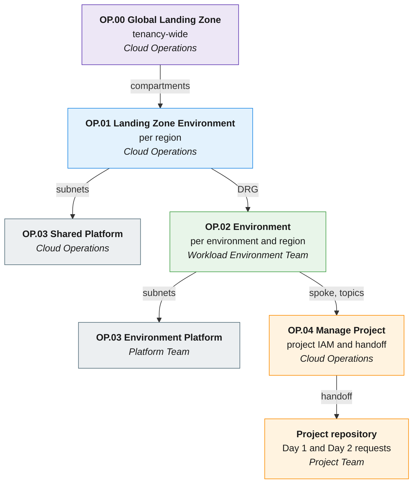
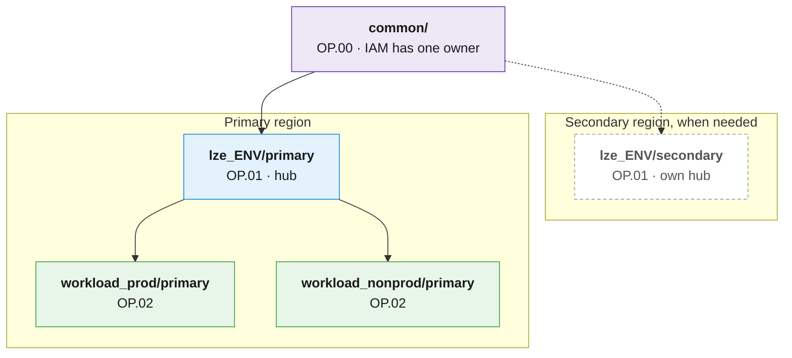

# Architecture Blueprint: Repository Design and Lifecycle Governance for OCI Landing Zones

Reviewed: 2026-09-25

## What is this asset?

A blueprint for splitting an OCI Landing Zone into small, independent Terraform stacks. It explains how to organize the Git repositories, where each resource belongs (tenancy-wide or regional), how stacks share information, how to separate state files, and which runtime to use (Oracle Resource Manager or CI/CD runners).

| | |
|---|---|
| **Scope** | Repository design, Terraform state strategy and runtime model for OCI Landing Zones deployed with the [OCI Landing Zones orchestrator](https://github.com/oci-landing-zones/terraform-oci-modules-orchestrator) |
| **Audience** | Cloud architects, platform engineers and DevOps teams who design, deploy and operate OCI Landing Zones |
| **Applies to** | Single-region and multi-region tenancies, with one or more Landing Zone environments (for example production and non-production) |

This blueprint covers the **foundation** side: how Cloud Operations structures the Landing Zone repositories, state files and pipelines. On the **project** side, it only defines the boundary that Cloud Operations hands off to each project. How Project Teams then request changes inside that boundary is up to the organization: the [Multi-Cloud Control Plane](../multi-cloud-control-plane/README.md) (MCCP) is one implementation, and any [GitOps](../gitops/README.md) flow that respects the handoff works.

## How to use this asset?

Read this page to understand the approach and decide whether it fits. The detailed guidance is in the `docs/` folder.

| If you... | Read |
|---|---|
| Need to decide whether to split your Landing Zone | This page, especially [Monolithic vs. multi-stack](#monolithic-vs-multi-stack) |
| Already run one large stack and want to split it | [Minimum split](#minimum-split-for-a-small-team), then [Adoption path](docs/adoption.md) |
| Are adding a second region or a DR region | [Component distribution](docs/component-distribution.md) and [Dependencies and state](docs/dependencies-and-state.md) |
| Are designing the repositories and pipelines | [Repository structure](docs/repository-structure.md), [Dependencies and state](docs/dependencies-and-state.md) and [Runtime](docs/runtime.md) |
| Want to see it applied end to end | [Worked example](docs/worked-example.md) |
| Want a final review of your design | [Anti-patterns and checklist](docs/checklist.md) |

## Key terms

| Term | Meaning in this blueprint |
|---|---|
| **Stack** | A set of configuration files plus its Terraform state. It can be an ORM stack or a Terraform CLI root with an Object Storage backend. |
| **Operation (OP.xx)** | A repeatable Landing Zone change with a fixed scope and owner, for example "onboard a workload environment". |
| **Landing Zone environment** | A group of shared resources (hub network, shared security) that serves several workload environments. A tenancy can have one or several, for example production and non-production. |
| **Workload environment** | One environment where workloads run, for example prod, pre-prod, dev or test. It has its own spokes, security and observability. |
| **Output file** | A JSON file (`*_output.json`) that the orchestrator generates after apply, with the keys and OCIDs other stacks need. |
| **Handoff** | The reviewed boundary that Cloud Operations publishes when it onboards a project, for example `project-foundation-handoff.json`. It lists the compartments, networks and settings the project may use. |
| **`rms-facade`** | The entry point of the orchestrator for ORM. It reads configurations from a private GitHub repository, a private OCI bucket or plain URLs, and reads and writes output files in GitHub or an OCI bucket. |

## Why split the Landing Zone?

Most organizations start with one Git repository, a few large configuration files and **one stack with one state file** for the whole Landing Zone. This is a good start: the Operating Entities repository offers a one-stack runtime for One-OE for exactly this reason. The same repository also recommends [one ORM stack per asset](https://github.com/oci-landing-zones/oci-landing-zone-operating-entities/blob/master/commons/content/orm_bp.md) once the Landing Zone grows, because three problems appear during Day-2 operations:

| Problem | What happens |
|---|---|
| **Blast radius and state lock** | One state file means one lock. If one pipeline gets stuck, nobody can change anything else until it is fixed. A failed change in non-production can block an urgent change in production. |
| **Multi-region and DR** | A second region is added for DR or to run closer to users. Network, security and monitoring are regional. If the state of the second region lives in the first region, losing the first region also means losing the ability to manage the second. |
| **Git governance and file size** | Git permissions apply to a whole repository. With one set of files, anyone who can change a project can also change IAM, the hub or security. Files such as a `network.json` with the hub and all spokes grow to thousands of lines. |

## Principles

| # | Principle |
|---|---|
| 1 | **Repeatable operations.** The Landing Zone is split into operations (OP.00 to OP.04) that run many times during its life. |
| 2 | **Repositories follow separation of duties.** Folder and repository boundaries follow team boundaries. |
| 3 | **No monoliths.** Each operation has its own configuration files, state file and pipeline job. |
| 4 | **Everything through Git.** Changes are applied only after approval by a reviewer who is not the author. |
| 5 | **Separated by region.** Regional resources live in regional folders with regional state files. |
| 6 | **Segregated state.** No locking between environments, regions or projects. |
| 7 | **Independent project teams.** Projects work in their own repositories and state, inside a boundary handed off by Cloud Operations. They never manage IAM and never hold cloud deployment credentials. |

> [!IMPORTANT]
> A Landing Zone is provisioned once and operated for many years. Judge the design by the cost of operating it, not by the cost of the first deployment.

## Operations and teams

| Operation | Scope | Owner |
|---|---|---|
| **OP.00 Manage Global Landing Zone** | Tenancy-wide: compartments, identity domain, groups, dynamic groups, IAM policies, tag namespaces, budgets, Cloud Guard enablement, IAM and Cloud Guard event rules | Cloud Operations |
| **OP.01 Manage Landing Zone Environment** | Per region: network hub, shared security, shared observability | Cloud Operations |
| **OP.02 Manage Environment** | Per environment and region: spokes, environment security and observability | Workload Environment Team |
| **OP.03 Manage Platform** | Platforms: the GitOps runner platform, or workload platforms such as ExaDB-D or OKE | Cloud Operations or Platform Team |
| **OP.04 Manage Project** | Project onboarding: project compartments, groups and policies, and the handoff | Cloud Operations |
| **Project requests** | Day 1 resources (NSGs, compute, databases) and Day 2 operations inside the handoff | Project Team, for example with the [MCCP request lifecycle](../multi-cloud-control-plane/docs/usage/request-lifecycle.md) |

In the diagram, colors show the layer (purple tenancy-wide, blue Landing Zone environment, green workload environment, grey platform, orange project) and the owner team is in italics. Each arrow is a reviewed change; its label is what the next operation needs from the previous one.



Every stack also reads the compartments output of the stack that owns its parent compartments.

> [!NOTE]
> **Reference implementation.** The [OCI Landing Zone reference implementation](https://github.com/multicloud-control-plane/oci-landing-zone) of the Multi-Cloud Control Plane implements OP00 to OP04 on the Operating Entities blueprint, with one GitHub workflow and one state key per phase, a private self-hosted runner with Instance Principal, and the project handoff. It targets a single region. This blueprint uses the same operations and adds the guidance for more regions, more environments and more teams. The main differences are called out where they apply. For a new tenancy, when the GitOps runner platform (OP03) is hosted in the same tenancy, deploy it before the first OP02: OP02 creates runner policies that refer to the OP03 dynamic group. The deployment order is therefore OP00, OP01, OP03, OP02, OP04.

The Operating Entities Multi-OE runtime uses the same idea with other names (OP.01 Shared Services to OP.04 Project Environment). Compartments, groups and the two ways to place IAM are described in [Component distribution](docs/component-distribution.md).

## Repository layout at a glance

```text
<org>-landing-zone/                  # Foundation configuration (Cloud Operations)
├── common/                          # OP.00  tenancy-wide, applied in the home region
├── lze_<ENV>/<REGION>/              # OP.01  one folder per Landing Zone environment and region
│   └── platform_<PTF>/              # OP.03  shared platform
├── workload_<ENV>/<REGION>/         # OP.02  one folder per workload environment and region
│   └── platform_<PTF>/              # OP.03  environment platform
└── projects/<PRJ>/handoff/          # OP.04  published project boundary

nonprod-<project>/  prod-<project>/  # Project repositories (Project Team)
```

Each leaf folder is one stack with one state file. Terraform code lives in separate repositories. The full layout, naming conventions and Git controls are in [Repository structure](docs/repository-structure.md).

## Minimum split for a small team

A small central team does not need dozens of stacks on day one. This split already removes the three problems above. Each box is one stack with its own state file; the dashed box is added when a second region is needed.



| Stack | Problem it removes |
|---|---|
| `common/` | IAM and tenancy-wide services have one owner, ready for a second region. |
| One `lze_<ENV>` stack per region | Each region is managed alone; the DR region does not depend on the primary. |
| `workload_prod` and `workload_nonprod` | A failure in non-production never locks production. |

Project, platform and extra environment stacks are added later with the same templates. The [worked example](docs/worked-example.md) shows this split with real configuration fragments. The order of changes and how to move existing resources without recreating them are in [Adoption path](docs/adoption.md).

## Monolithic vs. multi-stack

| Criteria | Monolithic | Multi-stack (this blueprint) |
|---|---|---|
| Number of stacks | One; easy to follow | Grows with environments, regions and projects |
| Initial effort | Low | Higher: design, templates, pipelines |
| Blast radius and state lock | Whole tenancy, including production | One operation, environment and region |
| Multi-region and DR | DR depends on the primary region | Each region is managed on its own |
| File size and reviews | Files of thousands of lines | Small files per domain and environment |
| Git governance | All or nothing | Per folder or per repository |
| Delegation to project teams | Only by giving access to everything | Own repositories inside a handoff, without IAM or credentials |
| Dependencies | Implicit, inside one state | Explicit output files and multi-step changes |
| Cross-cutting changes during the initial build | Same effort | Same effort |
| Fit with ORM | Good | Good with one stack per operation; runners recommended at scale |
| Cost of changing the design later | High: splitting in production | Paid once, at the start |

## Documentation

| Document | Content |
|---|---|
| [Repository structure](docs/repository-structure.md) | Repository map, full folder layout, conventions, folders vs. repositories, Git controls |
| [Component distribution](docs/component-distribution.md) | Tenancy-wide vs. regional resources, compartments and groups, IAM placement, service limits |
| [Dependencies and state](docs/dependencies-and-state.md) | Output files, project handoff, multi-step changes, state boundaries, naming and backends |
| [Runtime](docs/runtime.md) | ORM vs. CI/CD runners, Day-2 operations, runner boundaries |
| [Adoption path](docs/adoption.md) | Order of changes, moving resources between stacks, splitting a network configuration into hub and spoke stacks |
| [Worked example](docs/worked-example.md) | From one stack to the minimum split and a DR region, with configuration fragments |
| [Anti-patterns and checklist](docs/checklist.md) | Common mistakes and a design review checklist |

## Related assets

- [OCI Landing Zone Operating Entities](https://github.com/oci-landing-zones/oci-landing-zone-operating-entities) and its [ORM best practices](https://github.com/oci-landing-zones/oci-landing-zone-operating-entities/blob/master/commons/content/orm_bp.md)
- [OCI Landing Zones orchestrator](https://github.com/oci-landing-zones/terraform-oci-modules-orchestrator)
- [OCI Landing Zone reference implementation](https://github.com/multicloud-control-plane/oci-landing-zone) for OP00 to OP04 with GitHub Actions
- [GitOps](../gitops/README.md), [Multi-Cloud Control Plane](../multi-cloud-control-plane/README.md) and [Git Security](../operational-security/git-security/README.md)

# License

Copyright (c) 2026 Oracle and/or its affiliates.

Licensed under the Universal Permissive License (UPL), Version 1.0.

See [LICENSE](https://github.com/oracle-devrel/technology-engineering/blob/main/LICENSE) for more details.
