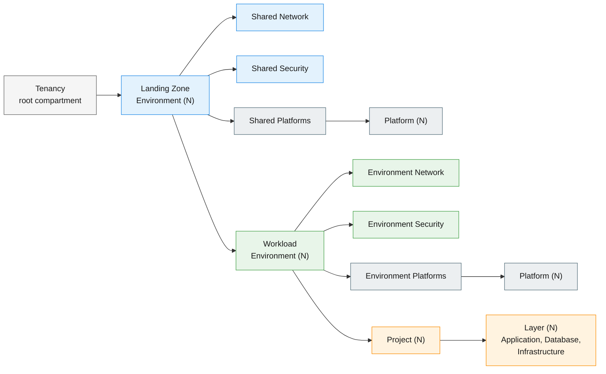
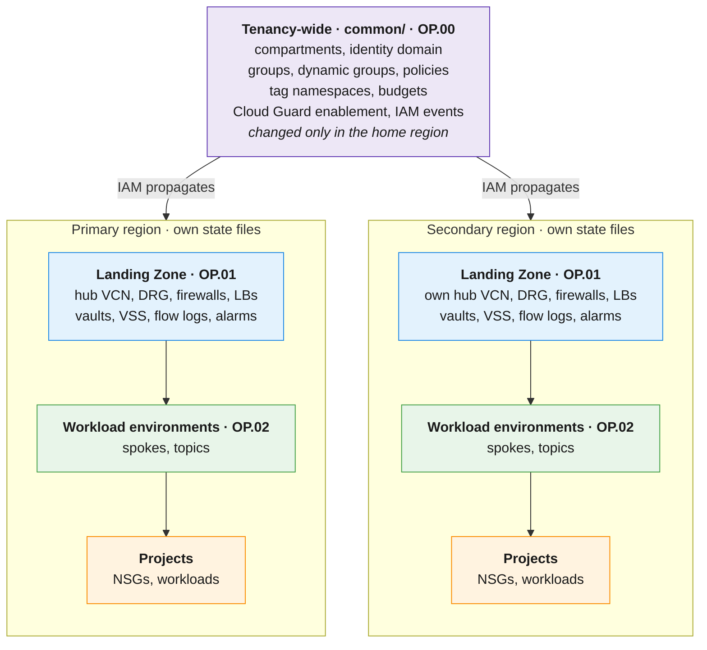

# Component Distribution

[Back to overview](../README.md)

This page explains where each Landing Zone component belongs: in the tenancy-wide stack or in a regional stack. It also covers the compartment structure, groups, IAM placement and service limits.

## Compartments and groups

The operations map to a fixed compartment structure. The same structure is repeated for each Landing Zone environment and for each workload environment.

Project layers follow the Operating Entities TBAC add-on, which creates Application, Database and Infrastructure compartments under each project root. A tenancy can host more than one Landing Zone environment, for example one for production (with prod and pre-prod workload environments) and one for non-production (with dev, test and UAT). Production and non-production are separated even when the same team runs both, because they usually need a different security posture.

All groups and policies are created by Cloud Operations. Each team's groups only grant access to the compartments of its operation:

| Team | Groups (examples) | Compartments managed |
|---|---|---|
| Cloud Operations | `<Org> Global Tenancy Groups`, `<Org> Landing Zone <Env> Admins`, `<Org> Network Admins`, `<Org> Security Admins`, `<Org> Platform Admins` | Root, Landing Zone Environment, Shared Network, Shared Security, Shared Platforms |
| Workload Environment Team | `<Env> Admins`, `<Env> Network Admins`, `<Env> Security Admins`, `<Env> Platform Admins` | Workload Environment, Environment Network, Environment Security, Environment Platforms |
| Platform Team | `<Env> Platform <X> Admins` | One platform compartment |
| Project Team | `<Env> <Project> Team`, `<Env> <Project> <Layer> Team` | One project compartment and its layers |

Not every organization needs every team. If the same people manage network, security and platforms, the groups can be combined. The folders and state files stay the same.

## Tenancy-wide vs. regional

> [!NOTE]
> The [reference implementation](https://github.com/multicloud-control-plane/oci-landing-zone) targets one region. It keeps the shared compartments, tag namespaces, Cloud Guard, security zones and home-region events in OP01, and only the identity domain, administrative groups and policies in OP00. That is correct for one region. When a second region is added, OP.01 must be repeated per region, so its tenancy-wide families move to OP.00 (or to another non-regional stack). The table below shows the multi-region target.

| Component | Scope | Location | Why |
|---|---|---|---|
| Compartment hierarchy (all levels) | Tenancy-wide | `common/iam.json` (OP.00) | Compartments, users, groups, policies, dynamic groups and federation resources can only be created and changed in the [home region](https://docs.oracle.com/iaas/Content/Identity/Tasks/managingregions.htm); IAM propagates them to all subscribed regions. One owner avoids duplicated definitions and gives one `compartments_output.json`. |
| Identity domain (non-default) | Tenancy-wide in practice | `common/iam.json` (OP.00) | The default identity domain is kept for break-glass users only. The secondary domain is created in the home region, can be federated with an external identity provider, and can be replicated to the DR region. No second domain is needed there. |
| Groups | Follow the identity domain | `common/iam.json` (OP.00) | Groups are replicated with the domain. With a federated identity provider, groups come from the provider and are not created by Terraform. |
| Dynamic groups | Tenancy-wide | `common/iam.json` (OP.00) | Same owner as the policies that use them. |
| IAM policies | Tenancy-wide | `common/iam.json` (OP.00) | Some policies must be attached at tenancy level and cannot be managed from a lower stack. See [IAM placement](#iam-placement). |
| Tag namespaces | Tenancy-wide | `common/governance.json` (OP.00) | Never repeated per region. |
| Budgets | Tenancy-wide | `common/governance.json` (OP.00) | Budgets are created in the root compartment and target compartments or cost-tracking tags, wherever the resources run. |
| Security zones | Per compartment | `security.json` of the stack that owns the compartment | Recipes that deny NSG deletion break a project-managed NSG lifecycle and project retirement. The reference implementation keeps only the root CIS Level 1 target for this reason. Test create, update and delete of project NSGs before adding stricter targets. |
| Cloud Guard | Tenancy-wide enablement, targets per compartment | Enablement in `common/security.json`; targets in `lze_<ENV>/<REGION>/security.json` | Cloud Guard is enabled once per tenancy, with a reporting region (usually the home region). Targets and recipes follow the Landing Zone environments. |
| IAM and Cloud Guard event rules | Home region | `common/observability.json` (OP.00) | These events are produced in the home region. The orchestrator has a dedicated `home_region_events_configuration` family for them. |
| Network hub: VCN, DRG, firewalls, load balancers | **Regional** | `lze_<ENV>/<REGION>/network.json` (OP.01) | The DR region needs its own hub, firewalls and load balancers so it can run alone if the primary region is lost. |
| Remote peering between hubs | **Regional pair** | `lze_<ENV>/<REGION>/network.json` on each side (OP.01) | Each hub owns its side of the connection. The Operating Entities `oci-x-rpc` add-on models it as network-only changes on top of the baseline. |
| Spokes | **Regional** | `workload_<ENV>/<REGION>/network.json` (OP.02) | Spokes attach to the hub DRG in the same region. |
| NSGs | **Regional** | Project repository, `oci/<ENV>/<REGION>/network/` | Project teams manage their own NSGs on the spoke VCN assigned in the handoff. They need no permissions on the hub. |
| Vulnerability Scanning recipes | **Regional** | `security.json` (OP.01, OP.02) | Deployed per region. |
| Vaults | **Regional** | `security.json` (OP.01, OP.02) | Keys must be available in the region that uses them. |
| VCN flow logs, events, alarms | **Regional** | `observability.json` (OP.01, OP.02) | Enabled on the regional resources they monitor. |
| Notification topics | **Regional** | `workload_<ENV>/<REGION>/observability.json` (OP.02) | Centralized per workload environment to stay within service limits. Projects reference them. |

## IAM placement

**IAM is always owned by Cloud Operations.** The open question is how many IAM stacks to use:

| | Pattern A: consolidated IAM | Pattern B: IAM per operation |
|---|---|---|
| Where IAM lives | `common/iam.json` (OP.00) holds compartments, groups and policies for every level, including projects | Each operation has its own IAM file: administrative groups in OP00, shared compartments in OP01, environment compartments in OP02, project compartments and groups in OP04. Used by the [reference implementation](https://github.com/multicloud-control-plane/oci-landing-zone) and the Operating Entities Multi-OE runtime. |
| Compartments output | One `compartments_output.json` for the tenancy | One per IAM stack. A stack that references compartments from two IAM stacks needs them merged into one file first (see the note below). |
| Onboarding a project (OP.04) | A reviewed change to `common/iam.json`, then the handoff | A project IAM stack, plus follow-up changes to policies in upper stacks |
| Tenancy-level policies | In the same stack as everything else | Must still be kept in an upper stack |
| Multi-region | One non-regional stack | Every IAM stack must be non-regional |
| Best fit | Small central team, multi-region, many dependencies | Large organizations where separate teams own IAM at each level |

> [!NOTE]
> The orchestrator takes one compartments dependency per stack, and `rms-facade` merges dependency files by their top-level key, keeping only the first file that contains `compartments`. Passing two `compartments_output.json` files to the same stack therefore silently drops one of them. With Pattern B, place IAM so that each stack finds all the compartments it references in one output, or merge the files in the pipeline before `plan`. With ORM there is no pipeline step to do that merge.

Both patterns give the same security result. Choose by the way the team works:

- **Pattern A** has fewer moving parts. It suits a small central team that edits configurations by hand, runs ORM stacks, or is adding regions: there is only one compartments output, so the limit above never applies, and one place for tenancy-level policies.
- **Pattern B** keeps each plan small and each IAM change next to the operation that needs it. It suits teams with automated pipelines that chain outputs between phases, as the reference implementation does.

Rules for both patterns:

1. **IAM files are never placed in region folders.** IAM can only be changed in the home region, and the [orchestrator](https://github.com/oci-landing-zones/terraform-oci-modules-orchestrator) always deploys IAM resources there, whatever region the stack targets. An IAM entry in a DR stack does not make IAM regional; it only makes the DR stack depend on the home region.
2. **Attach each policy as deep as possible in the compartment tree.** Create the policy in the compartment where it applies, with an explicit `in compartment` scope. Inheritance does the rest.
3. **Keep tenancy-level statements to a minimum** and keep them in OP.00.
4. **Do not create federated groups with Terraform.** If groups are created with Terraform, one owner avoids duplicates.

> [!WARNING]
> **Never let project teams manage their own compartments or IAM policies.** A team that can write policies for its own compartment can grant itself more access than intended. This is a privilege escalation path, even when changes are reviewed.

## Service limits

- **Notification topics** have service limits. Create them centrally in each workload environment and let projects reference them. Limit increases are possible but need a justification.
- **IAM policies** have limits on the number of policies and statements. Central ownership makes it possible to track them.
- Review service limits and compartment quotas whenever a new environment or project is onboarded.
