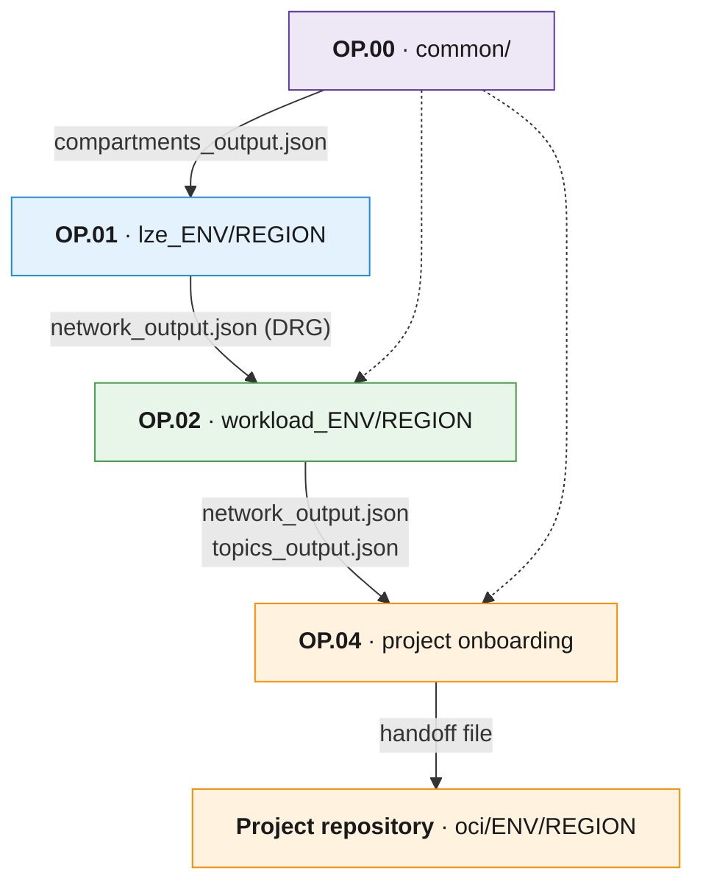
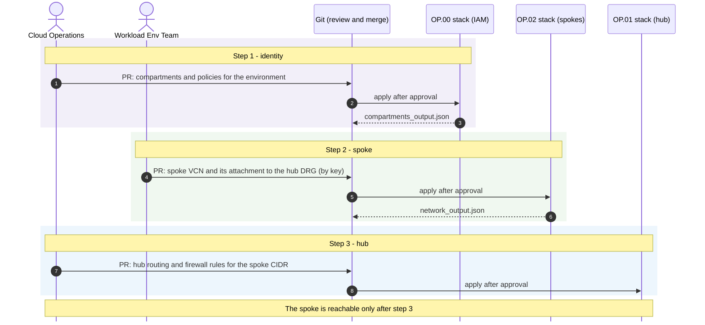
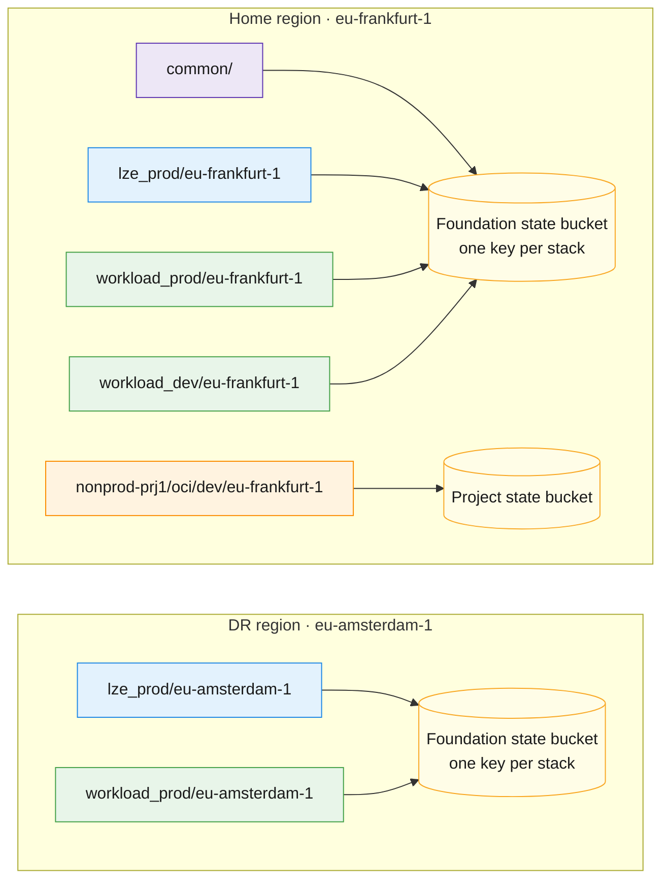

# Dependencies and State

[Back to overview](../README.md)

This page explains how stacks share information through output files, how a project receives its boundary, how to run changes that cross stacks, and how to separate and name state files.

## Output files

A stack never changes another stack's state. The [orchestrator](https://github.com/oci-landing-zones/terraform-oci-modules-orchestrator#external-dependencies) generates **output files** after each apply, and other stacks read them as **dependencies**. Configurations then refer to resources **by key**, not by OCID. For example, a compartment key in the `compartment_id` of `network_configuration` requires `compartments_dependency`; a subnet key in `instances_configuration` requires `network_dependency`.

The file names are fixed by the orchestrator. The ones used most in this blueprint:

| Configuration family | Output file | Dependency input |
|---|---|---|
| `compartments_configuration` | `compartments_output.json` | `compartments_dependency` |
| `identity_domains_configuration` | `identity_domains_output.json` | `identity_domains_dependency` |
| `tags_configuration` | `tags_output.json` | `tags_dependency` |
| `network_configuration` | `network_output.json` | `network_dependency` |
| `notifications_configuration` | `topics_output.json` | `topics_dependency` |
| `vaults_configuration` | `vaults_output.json`, `keys_output.json` | `vaults_dependency`, `kms_dependency` |

How the files reach the next stack depends on the runtime (see [Where outputs come from](#where-outputs-come-from)).

## Who reads what



Solid arrows show the main chain. Dotted arrows show that these stacks also read `compartments_output.json`.

| Consumer | Reads | Used for |
|---|---|---|
| OP.01 Landing Zone environment | `compartments_output.json` | Target compartments for hub, security and observability |
| OP.02 Workload environment | `compartments_output.json`, hub `network_output.json` of the **same region** | Target compartments; DRG to attach spokes to the hub |
| OP.03 Platform | `compartments_output.json`, `network_output.json` | Platform compartment and subnets |
| OP.04 Project onboarding | `compartments_output.json`, spoke `network_output.json`, `topics_output.json` | Build the handoff: compartments, spoke VCN and subnets, notification topics |
| Project repository | `project-foundation-handoff.json` | Every compartment, network and topic reference in a request |

- **With consolidated IAM, there is one `compartments_output.json` for the tenancy.** With IAM per operation, each stack reads the compartments output of the stacks that own its parent compartments (see [IAM placement](component-distribution.md#iam-placement)).
- **Project teams read the handoff, not the raw foundation outputs.** The handoff is a reviewed contract: it lists only what the project may use, and requests are validated against it (the [MCCP handoff step](../../multi-cloud-control-plane/docs/installation/installation-runbook.md#4-hand-off-the-first-project-repository) shows the handoff files and how they are published). Project Teams copy references from it; they do not invent or replace them.
- **Projects do not need hub outputs.** Traffic from a spoke to the internet or on-premises goes through the DRG attachment, which the foundation already manages.
- **Regional outputs are only read in the same region.** A stack in the DR region never reads outputs of primary-region regional stacks.

## Where outputs come from

| Option | How it works | Assessment |
|---|---|---|
| **Read from the upstream state** | The pipeline pulls the upstream state read-only, extracts the orchestrator output JSON and passes it as dependency files. Used by the [reference implementation](https://github.com/multicloud-control-plane/oci-landing-zone). | No copies to keep in sync. The runner needs read access to the upstream state. |
| **Saved to Git or a bucket** | With `rms-facade`, the *Save Output* option writes the files to the GitHub repository or bucket used for dependencies, under a prefix you choose. | The only option with ORM. Versioned and reviewable when saved to Git. |
| Third-party wrappers (for example Terragrunt) | An external tool resolves dependencies. | Adds another tool to learn and maintain. |
| OCIDs copied by hand | OCIDs are pasted into configuration files. | Not recommended: hard to read and easy to break. |

> [!NOTE]
> **ORM constraint.** `rms-facade` reads configurations from a private GitHub repository (including GitHub Enterprise), a private OCI bucket or plain reachable URLs, and reads and writes output files only in GitHub or an OCI bucket. Other Git platforms, such as OCI DevOps code repositories, are not supported sources. Teams that keep configuration in another Git platform and use ORM must publish the files to a bucket, or run Terraform CLI in their own pipelines (see [Runtime](runtime.md)).

The same 1 MB limit applies to dependency files that `rms-facade` reads from a bucket or GitHub, so a large `network_output.json` can fail as a dependency. A dependency file written by hand with only the keys a stack references stays small (see the limit under [Runtime](runtime.md#comparison)).

> [!IMPORTANT]
> In a multi-region design, configuration and outputs must be reachable from every region. A Git service hosted only in the primary region (for example OCI DevOps in the home region) becomes a single point of failure during a DR event.

## Changes that cross stacks

Some changes need several stacks, in order, with a review at each step. For a new tenancy the phases also run in order, because each one reads the outputs of the previous ones; after that, each change runs only in the phase that owns the resource. When the GitOps runner platform (OP03) is hosted in the same tenancy, it runs before the first OP02, because OP02 creates runner policies that refer to its dynamic group. The typical example is a new spoke: the workload environment creates the spoke and attaches it to the hub DRG (the networking module can inject an attachment into an existing DRG by key), and the hub then needs routing and firewall rules for the new spoke CIDR. The [Operating Entities](https://github.com/oci-landing-zones/oci-landing-zone-operating-entities) runtime models these steps as post-activities of each operation.



> [!WARNING]
> Do not fully automate the cascade between stacks. Upper-level configuration files are not updated automatically, and an automatic chain of applies across stacks brings back the blast radius that the split removes. Each step is a reviewed change.

## State boundaries

Each leaf folder (operation, environment and region) is one stack: one state file and one pipeline job. A change in one folder runs only the job for that folder.

A good stack boundary has one operation, one state file, one output location, and one complete set of top-level configuration families.

> [!WARNING]
> If two files in the same stack define the same top-level family (for example two files with `compartments_configuration`), only one definition is used and the other is silently ignored: with Terraform CLI `-var-file` the last file wins, and `rms-facade` keeps the first file that defines the family. Split by operation and state, never by spreading one configuration family across files of the same stack.

> [!IMPORTANT]
> With one state file, one stuck operation blocks all others. The most common failure is a problem in non-production that blocks an urgent change in production. Separating state by environment is the minimum split, even for small teams.

## State keys and backends

The state key of each stack is its folder path, for example `workload_prod/eu-frankfurt-1/terraform.tfstate`. The key then shows the operation, the environment and the region, and no naming table is needed. The [reference implementation](https://github.com/multicloud-control-plane/oci-landing-zone) uses the same idea with phase folders (for example `op02_manage_environment/dev/terraform.tfstate`); in a multi-region design the region must be part of the key.

The example shows one tenancy with a home region and a DR region. Each box is one stack; each cylinder is a state bucket in the same region.



The backend can be an ORM stack (state managed by ORM) or an Object Storage bucket (Terraform CLI). Backend rules:

- **Every stack has its own state file.** Separate state files remove locking between operations, environments, regions and projects. Stacks can share a bucket with one key each.
- **Keep the state of a region in that region.** The DR region must be able to run `plan` and `apply` with the primary region down. With ORM, create each stack in the region it manages: a stack and its state live in one region.
- **Keep foundation and project state in different buckets.** Project runners reach only the project state bucket, never the foundation state. The reference implementation works this way.
- **Use separate buckets for production and non-production when different runners or teams deploy them,** so that each identity can only reach its own state.
- **Enable versioning and backups** on every state bucket.

## How many stacks?

```text
stacks per region = 1 Landing Zone environment stack (per Landing Zone environment)
                  + shared platforms
                  + workload environments
                  + environment platforms
                  + projects x environments they run in
                  + OP.04 onboarding stacks, only for projects that need regional baseline resources
plus 1 common stack (OP.00) for the whole tenancy
```

Example: one region, one Landing Zone environment, two workload environments and ten projects in each gives about 1 + 2 + 20 = 23 regional stacks, plus the common stack. A DR region adds the regional stacks again, but not the common stack.

This is real work, but each stack is small, uses the same templates and fails alone. To start with fewer stacks, see the [minimum split](../README.md#minimum-split-for-a-small-team).
